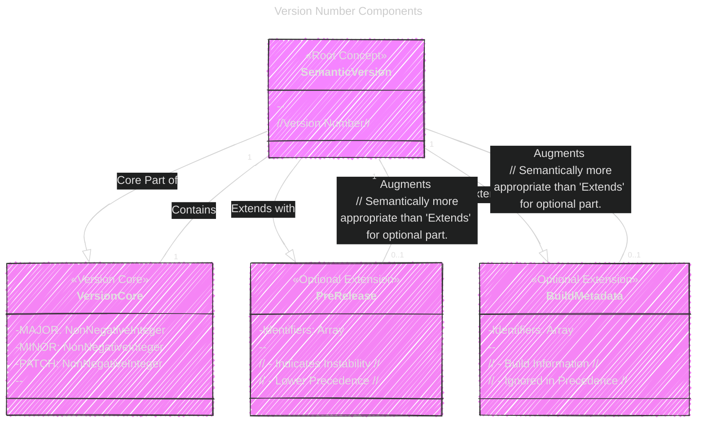
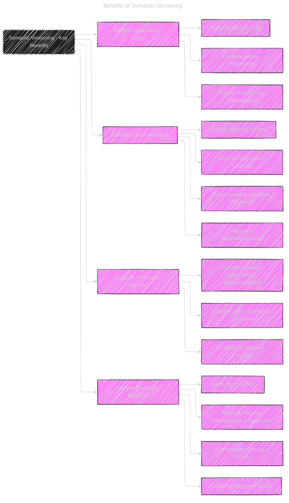

> This content is dual-licensed under your choice of the following licenses:
> 1.  **MIT License:** For the code implementations in Swift and Mermaid provided in this document.
> 2.  **Creative Commons Attribution 4.0 International License (CC BY 4.0):** For all other content, including the text, explanations, and the Mermaid diagrams and illustrations.

---


Below is a collection of enhanced versions of diagrams and illustrations aim to cover the core technical concepts of Semantic Versioning described in the original source document, using a combination of flowcharts, class diagrams, sequence diagrams, tables, textual examples, and a mind map-like structure to enhance understanding and visual clarity.


# 1. Semantic Versioning - Core Concept (Flowchart)


**Explanation:** This enhanced flowchart now clearly emphasizes the importance of the public API in Semantic Versioning right from the beginning. It streamlines the decision process while accurately reflecting the core logic. The added note at the start helps clarify where the versioning process typically begins. The use of color classes also visually differentiates the types of version increments.

---

# 2. Version Number Components (Class Diagram)





**Explanation:**  This revised class diagram offers a more semantically rich representation of a Semantic Version. It highlights the `VersionCore` more prominently and clarifies the role and characteristics of `PreRelease` and `BuildMetadata` as optional extensions. The stereotype notation `<<...>>` further distinguishes the nature of each component (Root Concept, Version Core, Optional Extensions).  The removal of methods keeps the focus on the data structure, which is more appropriate for a class diagram at this conceptual level.

---

# 3. Version Precedence (Sequence Diagram)


**Explanation:** This significantly improved sequence diagram now provides a clearer and more detailed step-by-step illustration of the version precedence comparison algorithm. By simplifying the participants and directly showcasing comparison stages, it becomes easier to follow the logic. The added details on pre-release identifier comparison rules and type checking make it more technically accurate and informative. The visual flow and annotations guide the reader effectively through the precedence logic.

---

# 4. Increment Rules Table (Table Illustration)


| Change Type                     | Version Component to Increment | Reset Minor & Patch | Example Scenario                                                                                                                               |
| :------------------------------ | :------------------------------ | :-------------------- | :--------------------------------------------------------------------------------------------------------------------------------------------- |
| **Incompatible API Changes**      | **MAJOR**                      | Yes (to 0)            | Renaming a core function or changing the return type of a public method breaking existing client code.                                           |
| **New Backward Compatible Functionality** | **MINOR**                      | Yes (to 0)            | Adding a new feature to the API that doesn't break existing functionality, like a new optional parameter or a new class.                        |
| **Backward Compatible Bug Fixes**   | **PATCH**                      | No                    | Fixing a bug that caused incorrect calculations without altering the API signatures or adding new features.                               |
| **No API Change (Internal)**        | **None**                       | No                    | Refactoring internal code for performance improvements, updating dependencies, or improving comments without any impact on the public API. |

**Explanation:**  The table is already a very effective way to present this information. The addition of the "Example Scenario" column considerably enhances its practical value by illustrating each rule with a concrete example. The improved wording and visual emphasis make it even more user-friendly and easily digestible. This table is now concise, clear, and immediately applicable.

---

# 5. Pre-release and Build Metadata (Textual Illustration)

```markdown
Semantic Version Example:  1.2.3-alpha.1+build.123 or 1.2.3-rc.beta-007+exp.sha.48afkjs

Breakdown:
  - **Version Core: 1.2.3**  (MAJOR.MINOR.PATCH - Mandatory part)
      - MAJOR: 1
      - MINOR: 2
      - PATCH: 3

  - **Pre-release:  alpha.1 or rc.beta-007** (Optional, Indicated by '-' hyphen after PATCH)
      - Purpose:  Indicates that the release is unstable and might not meet compatibility promises of the associated normal version. Used for alpha, beta, release candidate stages, etc.
      - Identifier Rules:
          - Composed of dot-separated identifiers (e.g., alpha.1, beta.rc.test).
          - Identifiers MUST contain only ASCII alphanumerics and hyphens [0-9A-Za-z-].
          - Identifiers MUST NOT be empty.
          - Numeric identifiers MUST NOT have leading zeroes (e.g., '1', not '01').
      - Precedence: Pre-release versions ALWAYS have LOWER precedence than the corresponding normal version (e.g., 1.2.3-alpha < 1.2.3).

  - **Build Metadata: build.123 or exp.sha.48afkjs** (Optional, Indicated by '+' plus after PATCH or Pre-release)
      - Purpose:  Used to attach build-related information (timestamps, commit hashes, build numbers).  For internal tracking, debugging.
      - Identifier Rules:
          - Composed of dot-separated identifiers (e.g., build.123, exp.sha.48afkjs).
          - Identifiers MUST contain only ASCII alphanumerics and hyphens [0-9A-Za-z-].
          - Identifiers MUST NOT be empty.
          - Numeric identifiers MAY have leading zeroes (build metadata does not have numeric precedence rules).
      - Precedence: Build metadata is IGNORED when determining version precedence. Versions differing only in build metadata have the SAME precedence (e.g., 1.2.3+build.100 == 1.2.3+build.200).
```

**Explanation:** This enhanced textual illustration is now much more comprehensive. By providing additional examples, clarifying identifier rules, and explicitly stating the *purpose* of pre-release and build metadata, it offers a deeper and more practical understanding of these SemVer extensions. The structured formatting with bullet points makes the information easier to read and reference.

---

# 6. BNF Grammar Visual Structure (Enhanced Structured Breakdown with Mermaid - Approximation of Tree)


**Explanation:** This visual BNF grammar is a significant enhancement for understanding the structure of a SemVer string. By using a nested graph in Mermaid, we create a visual hierarchy that mirrors the grammar's rules. Color-coding for terminal and non-terminal symbols makes it easier to differentiate grammar rules from the actual allowed characters. This visual representation is much more intuitive than the structured list and especially plain BNF text for quickly grasping the grammar's overall structure and rules.  Although Mermaid's graph isn't a perfect tree representation, it effectively approximates the hierarchical nature of the BNF grammar.

---

# 7.  Benefits of Semantic Versioning (Mind Map - Approximated Mermaid Graph)





**Explanation:**  This enhanced mind map provides a more detailed and nuanced overview of the benefits of Semantic Versioning. Expanding each category with specific sub-points directly from the article content makes it more informative.  The improved labels and consistent styling contribute to a more polished and effective visual summary of SemVer's advantages. The color-coded styles further differentiate the main benefits from their sub-points in the mind map.


---
**Licenses:**

- **MIT License:**  [](LICENSE) - Full text in [LICENSE](LICENSE) file.
- **Creative Commons Attribution 4.0 International:** [](LICENSE-CC-BY) - Legal details in [LICENSE-CC-BY](LICENSE-CC-BY) and at [Creative Commons official site](http://creativecommons.org/licenses/by/4.0/).

---