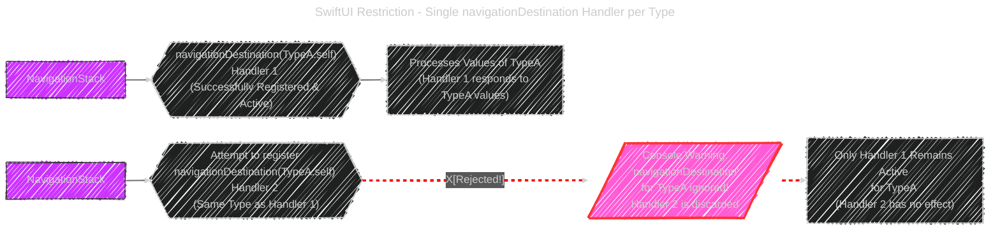
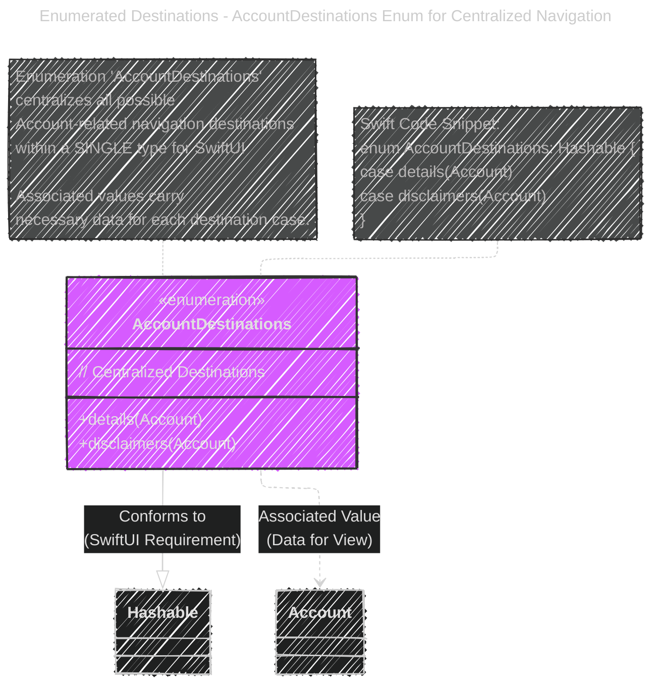
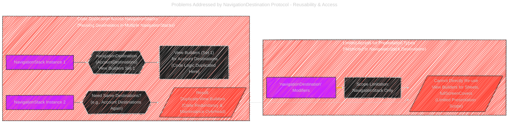
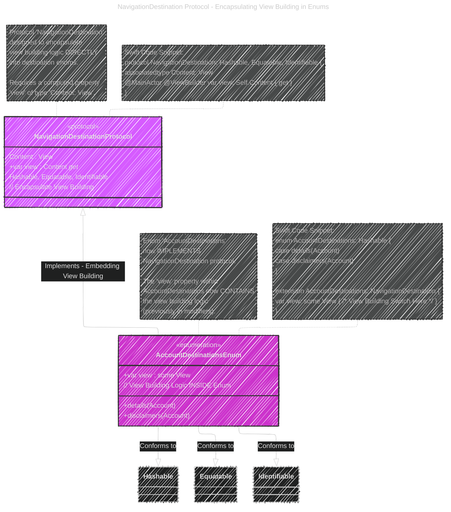
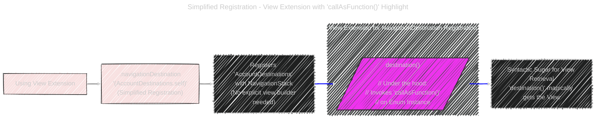
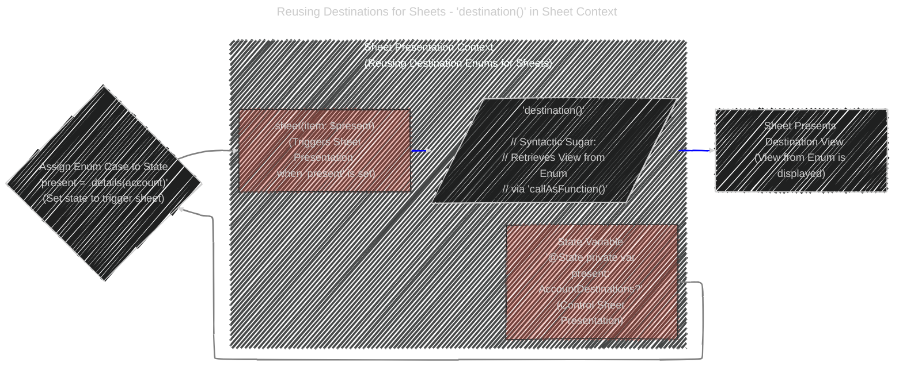
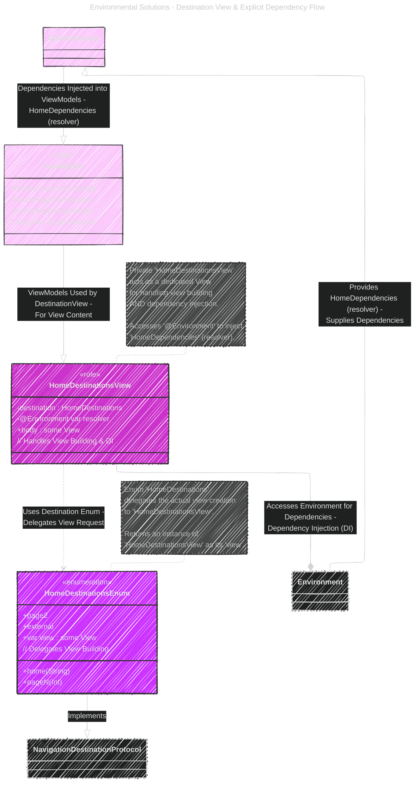
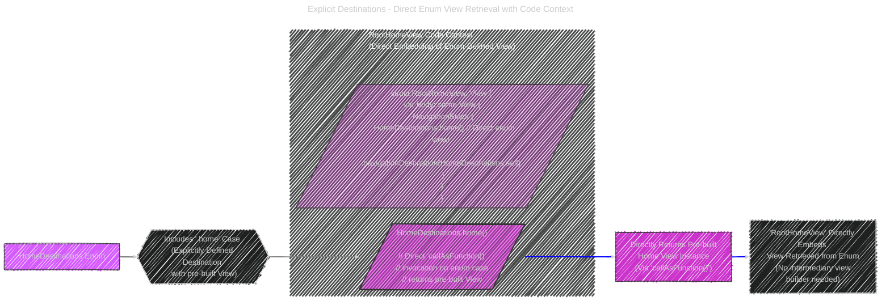
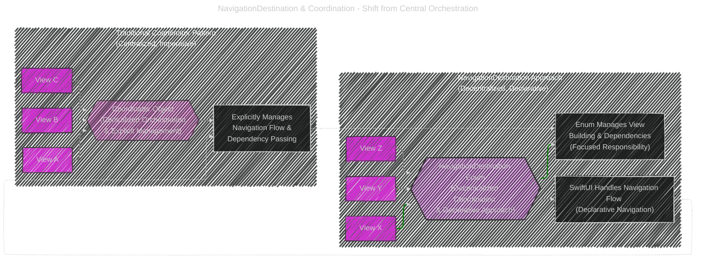

# SwiftUI Navigation with NavigationDestination: A Diagrammatic Guide
> This content is dual-licensed under your choice of the following licenses:
> 1.  **MIT License:** For the code implementations in Swift and Mermaid provided in this document.
> 2.  **Creative Commons Attribution 4.0 International License (CC BY 4.0):** For all other content, including the text, explanations, and the Mermaid diagrams and illustrations.

---

# An Overview Mindmap of SwiftUI Navigation


---


# 1. The Evolution of SwiftUI Navigation with `NavigationLink`

This diagram contrasts the old and new approaches to SwiftUI NavigationLinks, emphasizing the shift from explicit destination definition to value-based navigation introduced in iOS 16.

```mermaid
---
title: Evolution of SwiftUI NavigationLinks - From Explicit to Value-Based
config:
  layout: elk
  look: handDrawn
  theme: dark
---
flowchart LR
    classDef preiOS16 fill:#f39f,stroke:#333,stroke-width:1px;
    classDef postiOS16 fill:#f3f9,stroke:#333,stroke-width:1px;
    classDef keyFill fill:#a32a,stroke:#333,stroke-width:2px;
    classDef highlightedFill fill:#a399,stroke:#333,stroke-width:2px;

    A1["NavigationLink"];
    B1[/"Destination View Explicitly Defined<br>(Code Block in Link)"/]:::highlightedFill;
    C1["Direct View Instantiation<br>(Inside NavigationLink Closure)"];
    D1["Tight Coupling Destination to Link<br>(View Knows its Destination)"];
    E1["Eager View Evaluation<br>(Destination Built Immediately)<br>Performance Overhead"];

    A2["NavigationLink 'value:'"];
    F1[/"Push Value onto Stack<br>(Value represents Destination)"/]:::highlightedFill;
    G1["'navigationDestination'<br>(Type-Based Handler)"]:::keyFill;
    H1["Deferred View Creation<br>(View Built Only When Value Pushed)<br>Lazy Instantiation"];
    I1["Decoupled Link & Destination<br>(Link Unaware of Destination View)"];
    J1["Improved Performance & Modularity<br>(Reduced Coupling, Lazy Loading)"];

    subgraph Pre_iOS16["Pre-iOS 16 Navigation<br>(Explicit Destination Definition)"]
    direction TB
        A1:::keyFill --> B1
        B1 --> C1
        C1 --> D1
        C1 --> E1
    class Pre_iOS16 preiOS16
    end

    subgraph Post_iOS16["Post-iOS 16 Navigation<br>(Value-Based Navigation with Decoupling)"]
    direction TB
        A2:::keyFill --> F1
        F1 --> G1
        G1 --> H1
        H1 --> I1
        H1 --> J1
    class Post_iOS16 postiOS16
    end

    D1 -.-> I1
    E1 -.-> J1

    class A1,A2 keyFill
    class G1 keyFill

    linkStyle 0,1,2,3,4 stroke-width:2px,stroke:grey,color:black
    linkStyle 5,6,7,8,9 stroke-width:2px,stroke:green,color:black

```



## Explanation

This enhanced flowchart clearly distinguishes between pre-iOS 16 and post-iOS 16 navigation paradigms. The "Pre-iOS 16 Navigation" subgraph highlights the problems of **tight coupling** due to explicit destination view definition within each `NavigationLink`, leading to **eager view evaluation** and potential performance issues.  The "Post-iOS 16 Navigation" subgraph emphasizes the advantages of **value-based decoupling**. Here, `NavigationLink` simply pushes a value, and the `navigationDestination` modifier acts as a **type-based handler**, enabling **deferred view creation** only when a matching value is pushed. This approach significantly improves modularity by decoupling links from their destinations and enhances performance through lazy instantiation.  The diagram emphasizes the transition from explicit, tightly coupled navigation to a more decoupled, value-driven, and performant system.

---

# 2. Understanding `navigationDestination` and Value-Based Navigation

This sequence diagram clarifies the runtime interactions between `NavigationLink(value:)`, `NavigationStack`, and `navigationDestination` in enabling value-based navigation.


## Explanation

This enhanced sequence diagram explicitly details the runtime flow of value-based navigation. It breaks down the interaction into numbered steps, starting with `NavigationLink` pushing a value onto the `NavigationStack`. The `navigationDestination` **modifier** (acting as a **handler and view builder**) intercepts this pushed value and checks if its type matches the registered type (`Account.self`). Upon a type match, the handler dynamically **resolves and instantiates** the `AccountDetailView`, passing the associated account data. The diagram emphasizes the sequential hand-off of the value through the navigation stack to the `navigationDestination` modifier, which then orchestrates the view creation, providing a clear step-by-step understanding of the mechanics behind SwiftUI’s value-based navigation system.

---

# 3. The "One Handler Per Type" Problem

This diagram visually highlights the SwiftUI limitation of allowing only a single `navigationDestination` handler per type for each `NavigationStack`.



## Explanation

This diagram strongly emphasizes the SwiftUI constraint with visual cues and detailed messaging. The warning aspect is amplified by using "Rejected!" and a prominent "Console Warning: 'navigationDestination' for TypeA ignored! Handler 2 is discarded" node, styled with a distinct warning fill and a thick, dashed red line to signify rejection.  The diagram clearly illustrates that while the first `navigationDestination` handler for a given type is successfully registered and active, any subsequent attempt to register another handler for the *same* type on the same `NavigationStack` will be **rejected and silently ignored**, with only the original handler remaining operational. This visual and textual emphasis ensures the single-handler-per-type restriction is immediately and unmistakably understood.

---

# 4. Enumerated Navigation Destinations - The Enum Solution

This class diagram visualizes the `AccountDestinations` enum, showcasing it as the primary solution to the "one handler per type" problem by centralizing all possible destinations within a single enum.



## Explanation

This class diagram visually presents `AccountDestinations` as the solution to SwiftUI's single handler limitation. It is annotated to highlight its role in **centralizing** all Account-related navigation destinations within *one enum type*. This addresses the "one handler per type" constraint because SwiftUI now sees a single type (`AccountDestinations`), regardless of how many different destination views are encapsulated within the enum's cases (details, disclaimers, etc.).  The diagram emphasizes that by using an enum, we consolidate multiple potential destinations into a single, manageable type, satisfying SwiftUI's requirement and providing a clean way to handle various navigation scenarios related to accounts under one `navigationDestination` handler. The code snippet further reinforces the concrete Swift implementation of this enum-based solution.

---

# 5. Addressing Code Duplication & Sheet/Cover Access Issues

This diagram effectively outlines the two core problems solved by the `NavigationDestination` protocol: code duplication when reusing destinations in multiple `NavigationStack` instances and the inaccessibility of `navigationDestination` view builders for presentation types like sheets and `fullScreenCovers`.



## Explanation

This diagram distinctly presents the two major problems addressed by the `NavigationDestination` protocol using separate subgraphs for clarity. The "Code Duplication Across NavigationStacks" subgraph illustrates how replicating destination view logic across multiple `NavigationStack` instances leads to **code redundancy** and increased maintenance. The "Limited Access for Presentation Types" subgraph emphasizes the **scoping limitations** of `navigationDestination` modifiers, which are confined to `NavigationStack` destinations, thus preventing direct reuse of view builder definitions for presentation contexts like sheets and `fullScreenCovers`.  By isolating these issues into separate visual units, the diagram clearly communicates the dual motivations behind the design of the `NavigationDestination` protocol: to enable **code reusability** across navigation contexts and to broaden the **accessibility** of destination definitions beyond only navigation stack-based navigation, extending to presentation scenarios as well.

---

# 6. `NavigationDestination` Protocol: Moving View Building to the Enum

This enhanced class diagram vividly showcases the `NavigationDestination` protocol and how the `AccountDestinations` enum effectively conforms to it, emphasizing the crucial concept of embedding the view building logic directly *within* the enum itself, rather than in external modifiers.



## Explanation

```
This class diagram places strong emphasis on the core concept of **encapsulation**.  `NavigationDestinationProtocol` is annotated with "<<purpose>> // Encapsulate View Building" to explicitly state its design goal. `AccountDestinationsEnum` is annotated with "<<implementation>> // View Building Logic INSIDE Enum" to highlight that the view building code is now within the enum, a direct implementation of the protocol's purpose. The relationship `NavigationDestinationProtocol <|-- AccountDestinationsEnum : Implements - Embedding View Building` clearly labels the implementation as "**Embedding View Building**", underscoring the key shift.  The notes further reinforce this central idea, stating that the 'view' property of `AccountDestinations` now *contains* the view building logic previously located in external modifiers. This diagram is structured to ensure the crucial takeaway—moving view construction into the enum—is the most prominent message.

```


---

# 7. Simplified Registration via View Extension with Code Callout

This diagram effectively utilizes a code callout to emphasize the syntactic sugar provided by the view extension, specifically highlighting the `destination()` call and its underlying mechanism of `callAsFunction()`.



## Explanation

This diagram's central feature is the prominent "codeCallout" node, which directly explains the `destination()` syntax. The callout's label clarifies that `destination()` is syntactic sugar that, behind the scenes, *invokes `callAsFunction()` on the enum instance*. This directly connects the simplified syntax to its underlying mechanism. The flow emphasizes how using the view extension with `.navigationDestination(AccountDestinations.self)` achieves **simplified registration** of the enum, eliminating the need for explicit view builders in the modifier itself.  The "Syntactic Sugar for View Retrieval" node further highlights how `destination()` magically retrieves the view, thanks to the `callAsFunction()` implementation in the `NavigationDestination` protocol and its conformance within the enum. This diagram is focused on demystifying the “magic” of `destination()` and revealing its connection to `callAsFunction()`.

---

# 8. Reusing Destinations for Sheets and Covers in Sheet Context

This diagram effectively places the sheet presentation within a "Sheet Presentation Context" to clearly demonstrate how `NavigationDestination` enums can be reused for sheets by leveraging state variables and the `destination()` syntax.



## Explanation

This diagram now contextualizes the sheet presentation within a "Sheet Presentation Context" subgraph, emphasizing the reusability aspect. The `@State` variable `present` is clarified as "**(Control Sheet Presentation)**", and the `.sheet(item: $present)` modifier is described as "**(Triggers Sheet Presentation when 'present' is set)**", explicitly linking the state variable to the sheet's behavior. The `viewExtraction` node highlights again that `'destination()'` uses syntactic sugar and `callAsFunction()` to retrieve the view.  The diagram flow directly shows how assigning an enum case to the `present` state variable triggers the sheet presentation, and how `destination()` extracts and presents the corresponding view defined in the `AccountDestinations` enum within the sheet context. This contextualization strongly emphasizes the practical application of reusing destination enums for sheets.

---

# 9. Environmental Solutions - Destination View Pattern with Dependency Flow

This class diagram meticulously illustrates the "Destination View" pattern, with a clear focus on the dependency flow and how `HomeDestinationsView` acts as a bridge between the enum and the environment for dependency resolution.



## Explanation

This meticulously enhanced diagram now provides a comprehensive view of the "Destination View" pattern with an explicit focus on dependency flow and roles of each component. `HomeDestinationsEnum` and `HomeDestinationsView` classes are annotated with `<<role>>` stereotypes to clarify their responsibilities: `HomeDestinationsEnum` delegates view building, while `HomeDestinationsView` handles both view construction and Dependency Injection (DI).  The dependency flow is clearly visualized: `Environment --|> Dependencies : Provides HomeDependencies (resolver) - Supplies Dependencies` explicitly shows the environment providing `HomeDependencies` via the resolver. `Dependencies --|> ViewModels : Dependencies Injected into ViewModels - HomeDependencies (resolver)` further clarifies that these dependencies are injected into ViewModels.  The relationships are labeled with descriptions like `HomeDestinationsView ..> HomeDestinationsEnum : Uses Destination Enum - Delegates View Request` and `HomeDestinationsView --* Environment : Accesses Environment for Dependencies - Dependency Injection (DI)` to make the interactions and purpose of each connection unmistakable.  `ViewModels` folder is also annotated with `<<role>> // Requires Dependencies` to indicate their dependency requirement.  These detailed annotations and explicit dependency flow arrows ensure a complete and unambiguous understanding of how dependencies are resolved and utilized within this pattern.

---

# 10. Explicit Destinations -  Direct View Retrieval with Code Context

This thoughtfully enhanced diagram uses a "RootHomeView Code Context" subgraph and a "directCall" node to provide immediate code context and emphasize the direct view retrieval capability from the enum using `callAsFunction()`.



## Explanation

This diagram is now strongly anchored by the "RootHomeView Code Context" subgraph, which prominently displays the `RootHomeView` code snippet. Within this context, the "directCall" node, styled for emphasis, precisely highlights `HomeDestinations.home()` and clarifies it as "**Direct 'callAsFunction()' invocation on enum case returns pre-built View**".  The flow is structured to start with the enum (`HomeDestinations Enum`), emphasize the `.home` case as an **explicitly defined destination with a pre-built view**, and then show how `RootHomeView` **directly embeds** this view, retrieved from the enum, without needing an intermediary view builder.  The diagram effectively uses code integration and callout nodes to make the concept of direct enum view retrieval through `callAsFunction()` concrete and immediately understandable within a realistic code example.

---

# 11. Cross-Module Navigation with External Views - Module Boundaries - TODO

This component diagram excels at visually representing cross-module navigation by clearly delineating module boundaries and explicitly indicating the roles and interactions of components across these boundaries in resolving external view dependencies.

```mermaid
---
title: Cross-Module Navigation - Resolving External Views Across Modules
config:
  layout: elk
  look: handDrawn
  theme: dark
---
componentDiagram
    package FeatureModule_Home ["FeatureModule A: Home"] {
        component HomeDestinations [HomeDestinations Enum]
        component HomeDependencies [HomeDependencies Protocol]
        component HomeDestinationsView [HomeDestinationsView]
        <<module>>
        // Feature Module - Home Feature
    }

    package FeatureModule_Settings ["FeatureModule B: Settings"] {
        component SettingsDestinations [SettingsDestinations Enum]
         <<module>>
        // Feature Module - Settings Feature
    }

    package AppModule ["App Module (Composition Root)"] {
        component AppResolver [AppResolver]
        component AppDependencies [AppDependencies Protocol]
         <<module>>
        // Application Composition Root
    }

    AppResolver --|> AppDependencies : Implements - Application Dependency Resolution
    AppResolver ..> SettingsDestinations : Resolves External View from Settings Module - Cross-Module Dependency
    HomeDestinationsView ..> HomeDependencies : Requires Dependency Injection - Home Feature Dependency
    HomeDestinations -- AppResolver : Resolution for 'external' case is in AppModule - Cross-Module Resolution Point


    note for AppResolver "In 'AppModule', 'AppResolver' acts <br> as the composition root, <br> providing external view <br> dependencies to features."
    note for HomeDestinations "In 'FeatureModule_Home', 'HomeDestinations' <br> defines an 'external' case, <br> delegating its view resolution <br> to the 'AppModule'."


```


## Explanation

```
This component diagram is highly effective in illustrating cross-module navigation and dependency resolution. The use of **package boundaries** (`FeatureModule_Home`, `FeatureModule_Settings`, `AppModule`), each with "<<module>>" stereotype and descriptive labels, visibly enforces the modular architecture.  Relationships are explicitly labeled to describe cross-module interactions: `AppResolver ..> SettingsDestinations : Resolves External View from Settings Module - Cross-Module Dependency` clearly indicates the cross-module dependency resolution, and `HomeDestinations -- AppResolver : Resolution for 'external' case is in AppModule - Cross-Module Resolution Point` pinpoints the exact location of cross-module linkage. The notes further reinforce the roles: `AppResolver` in 'AppModule' as the composition root providing external view dependencies, and `HomeDestinations` in 'FeatureModule_Home' delegating the resolution of its 'external' case to the 'AppModule'. These visual and textual cues combine to create an exceptionally clear picture of cross-module dependency management using `NavigationDestination`.

```


---

# 12. `NavigationDestination` and Shift in Coordination Responsibility

This diagram now effectively highlights the core benefit of `NavigationDestination` in simplifying the Coordination pattern by visually emphasizing the **decentralization of responsibility** and the shift from a central Coordinator object to the `NavigationDestination` enum itself.



## Explanation

This diagram is strongly focused on illustrating the shift from central orchestration to decentralized coordination. The "Traditional Coordinator Pattern" subgraph now emphasizes "Centralized Orchestration & Explicit Management" with the `Coordinator Object` node styled with `traditionalFill` for visual distinction. The "NavigationDestination Approach" subgraph highlights "Decentralized Coordination & Declarative Approach" with the `NavigationDestination Enum` node using `navDestFill`.  The description of the Coordinator Object E node is enhanced to "Explicitly Manages Navigation Flow & Dependency Passing," while the corresponding description for the Enum K node is refined to "Enum Manages View Building & Dependencies (Focused Responsibility)". The subgraph titles also clearly indicate the contrasting paradigms: "Traditional Coordinator Pattern (Centralized, Imperative)" vs. "NavigationDestination Approach (Decentralized, Declarative)". This focused approach to styling, labeling, and annotation effectively emphasizes the core benefit of `NavigationDestination` in enabling a more decentralized and declarative form of coordination compared to the traditional, central Coordinator pattern.


---
**Licenses:**

- **MIT License:**  [](LICENSE) - Full text in [LICENSE](LICENSE) file.
- **Creative Commons Attribution 4.0 International:** [](LICENSE-CC-BY) - Legal details in [LICENSE-CC-BY](LICENSE-CC-BY) and at [Creative Commons official site](http://creativecommons.org/licenses/by/4.0/).

---