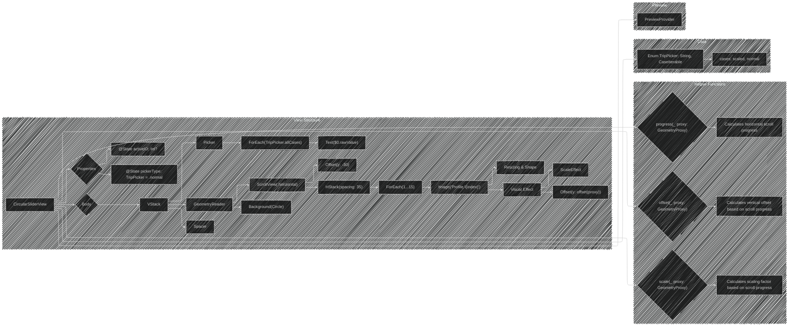
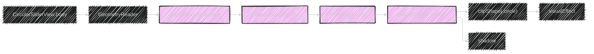
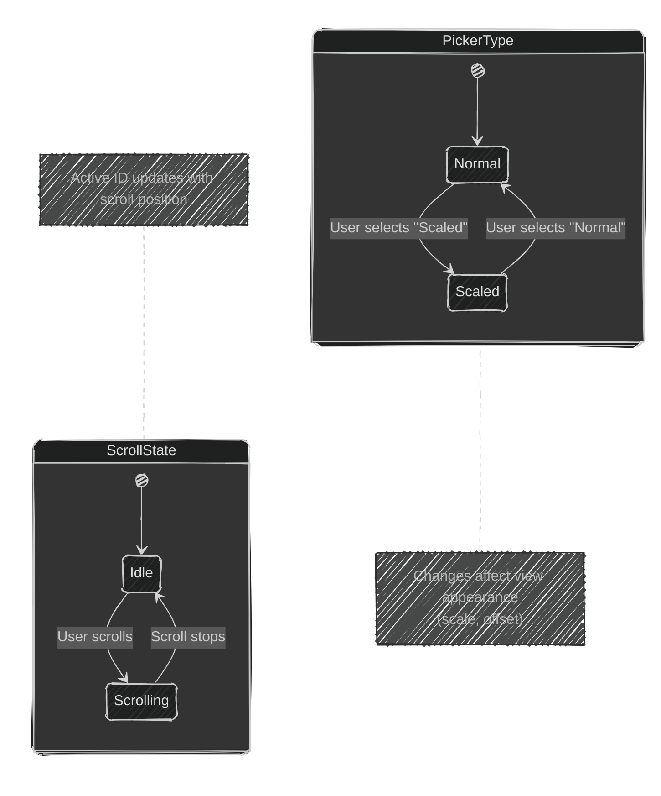

# SwiftUI - Circular Slider Effect

---

  <blockquote>
  As a visual learner student, I created these personal study notes from the cited source(s) to aid my understanding. 
  While my firm intention is to provide full credit, the blended format of notes and diagrams may sometimes obscure the original source, for which I apologize. 
  I am committed to making corrections and welcome any feedback. 
  This is a non-commercial project for my humble educational purposes only since the start. 
  My goal is to share my perspective and contribute to the great work already being done.
   
   
  I want to extend my genuine apologies to the creators of the original material. 
  Their work was the direct inspiration for this project, and I adapted it without first reaching out. 
  My intent comes from a place of deep respect, and I hope this is received in the spirit of homage. 
  🙏🏼🙏🏼🙏🏼🙏🏼
  </blockquote>

----

This doc will explain the Swift code implementation from this branch https://github.com/CongLeSolutionX/MyApp/tree/SwiftUI_Circular_Slider_Effect-SAVE-FOR-REFERENCE.
I will keep the code in GitHub branch as is as reference for content on this article.

----

## 1. Code Overview and Structure

**Explanation:**

*   **`CircularSliderView`**:  The main `View` struct, representing the circular slider.
*   **Properties**:  The `@State` properties `pickerType` and `activeID` manage the slider's state (mode and selected item, respectively).
*   **`body`**:  The core UI layout using `VStack`, `Picker`, `Spacer`, `GeometryReader`, `ScrollView`, `HStack`, `ForEach`, `Image`, View modifiers and the helper functions.
*   **Helper Functions**:  `offset(_:)`, `scale(_:)`, and `progress(_:)` calculate dynamic view properties based on the scroll position.
*   **`TripPicker` Enum**: Determines the slider's behavior/style through the `scaled` and `normal` options.
*   **`#Preview`**: A useful macro to show sample previews in the Xcode canvas.

## 2. UI Component Breakdown (VStack, Picker, GeometryReader)

**Explanation:**

*   **VStack**:  Vertically stacks the UI elements.
*   **Picker**: A control that allows the user to select from a set of mutually exclusive values, which drives slider behaviour.
*   **TripPicker**: `enum` provides types of slider.
*   **GeometryReader**: Provides the size and position of its content.

## 3. Scrollable Content (ScrollView, HStack, ForEach)

**Explanation:**

*   **ScrollView**:  Enables horizontal scrolling.
*   **HStack**: Arranges the images horizontally.
*   **ForEach**: Efficiently creates 15 image views from a single code block.
*   **Image**: Displays profile images.
*  **clipShape**: clips the image.
* **shadow**: shadows the image.
*  **visualEffect**: Dynamically alters the appearance of the image, in response to scrolling.

## 4. Visual Effect and Dynamic Properties (offset, scaleEffect)

**Explanation:**

*   **`visualEffect`**: Applies changes to the `Image` during scroll.
*   **`offset(y: offset(proxy))`**: The vertical offset of the image and the `offset` function is called to return the offset. The `offset` uses returns calculation based on the `progress(proxy)` function.
*   **`scaleEffect`**: The scale of the image, dynamically calculated via `scale(proxy)`. Uses calculates from from the `progress(proxy)` function.
*   **`offsetFunc`**: Calculates the y-offset to the image, creating a vertical motion effect during scroll.
*   **`scaleFunc`**: Determines the scaling of the image.
*   **`progress(proxy)`**: Calculates the normalized scroll position (0 to 1).

## 5. State Management and Interaction (pickerType, activeID)

**Explanation:**

*   **`@State pickerType`**: Controls the slider's mode (e.g., "Scaled", "Normal").  Changes triggers UI updates.
*   **`@State activeID`**: Tracks the currently focused/selected image, potentially used for further animations or interactions.
*   The state diagram describes how `pickerType` changes when the user selects an item, and how scroll events modify the slider's `activeID`.

## 6. Function Dependencies and Data Flow

**Explanation**:

*   The dependency graph shows the relationships between functions and components. `progress(proxy)`is the core function to calculate scroll progress.
*   `offset(proxy)` and `scale(proxy)` use the result of`progress(proxy)` to calculate the image's visual properties.

## 7. Advanced Concepts Applied

*   **`GeometryReader`**: Used to get the dimensions of the screen, which are used to make the circular slider more dynamic.
*   **`ScrollView(.horizontal)`**: Enabling the horizontal scroll for the item in the slider.
*   **`visualEffect`**:  Used to make the image in the slider dynamically altered as user scrolls.
*   **`@State`**: Managing the state of a view with properties.
*   **`ForEach`**:  Used to populate item in the slider.
*   **Enum `TripPicker`**:  Used to provide and organize types of slider.
    *   **Custom visual appearance for the slider**: The `offset(_:)` and `scale(_:)` functions and `VisualEffect` are the key that provide the custom visual appearance for the circular slider.
---

**Licenses:**

- **MIT License:**   - Full text in [LICENSE](LICENSE) file.
- **Creative Commons Attribution 4.0 International:**  - Legal details in [LICENSE-CC-BY](LICENSE-CC-BY) and at [Creative Commons official site](http://creativecommons.org/licenses/by/4.0/).

---