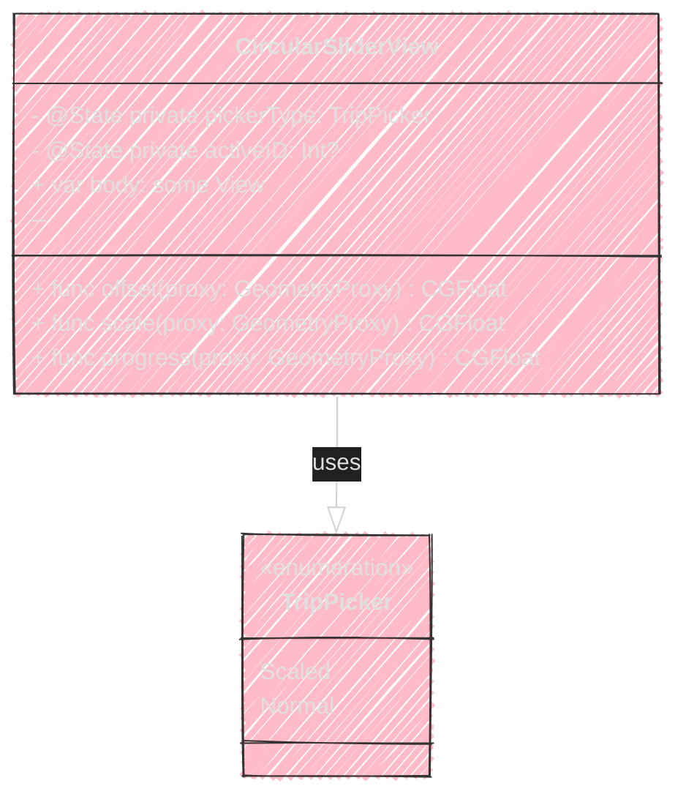
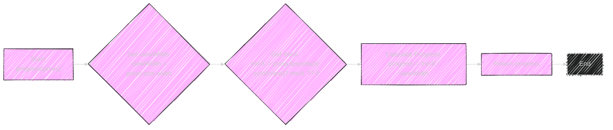
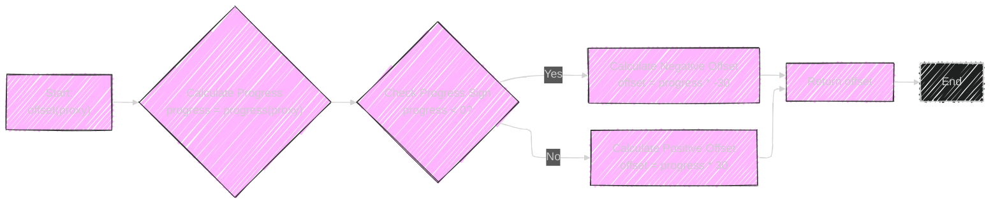

# SwiftUI - Circular Slider Effect

---

  <blockquote>
  As a visual learner student, I created these personal study notes from the cited source(s) to aid my understanding. 
  While my firm intention is to provide full credit, the blended format of notes and diagrams may sometimes obscure the original source, for which I apologize. 
  I am committed to making corrections and welcome any feedback. 
  This is a non-commercial project for my humble educational purposes only since the start. 
  My goal is to share my perspective and contribute to the great work already being done.
   
   
  I want to extend my genuine apologies to the creators of the original material. 
  Their work was the direct inspiration for this project, and I adapted it without first reaching out. 
  My intent comes from a place of deep respect, and I hope this is received in the spirit of homage. 
  🙏🏼🙏🏼🙏🏼🙏🏼
  </blockquote>

----

---
This doc will explain the Swift code implementation from this branch https://github.com/CongLeSolutionX/MyApp/tree/SwiftUI_Circular_Slider_Effect-SAVE-FOR-REFERENCE.
I will keep the code in GitHub branch as is as reference for content on this article.

----

## Code Review and Semantic Analysis

The Swift code defines a `CircularSliderView` using SwiftUI. This view presents a horizontal circular slider of profile images with two distinct modes, selectable via a segmented picker: "Scaled" and "Normal."

**Key Components and Logic:**

1.  **`CircularSliderView` Struct:** The main view, encapsulating all UI elements and logic.
2.  **`@State` Properties:**
    *   `pickerType: TripPicker = .normal`:  Manages the current mode of the slider (Normal or Scaled), initialized to "Normal". This state dictates the visual behavior of the slider.
    *   `activeID: Int?`: Tracks the currently active (or focused) image within the scroll view. This is driven by the `.scrollPosition(id: $activeID)` modifier, likely used for snapping and identifying the central item.
3.  **`Picker` for Mode Selection:** A segmented control at the top, allowing users to switch between `TripPicker.scaled` and `TripPicker.normal` modes.
4.  **`GeometryReader` for Dynamic Layout:**  Encloses the slider to provide access to the view's size (`size`) and proxy for calculations related to the circular effect.
5.  **`ScrollView(.horizontal)` for Circular Scrolling:**  Enables horizontal scrolling through the images, creating the circular slider effect.
6.  **`HStack` to Arrange Images:** Lays out the profile images horizontally within the `ScrollView`.
7.  **`ForEach(1...15, id: \.self)` for Image Generation:** Iterates to create 15 profile images, named "Profile 1" to "Profile 15."
    *   **`Image("Profile \(index)")`**:  Displays each profile image.
    *   **`.resizable().aspectRatio(contentMode: .fill).frame(width: 70, height: 70).clipShape(.circle)`**: Styles each image to be resizable, fill its frame while maintaining aspect ratio, have a fixed size of 70x70 points, and be clipped into a circle.
    *   **`.shadow(...)`**: Adds a subtle shadow to each image for visual depth.
    *   **`.visualEffect { view, proxy in ... }`**:  This is where the "circular slider" visual effect is implemented. It modifies each image based on its position within the `ScrollView` using the `offset(proxy)` and `scale(proxy)` functions. The behavior changes based on the `pickerType`.
        *   `.offset(y: offset(proxy))`:  Applies a vertical offset to each image, calculated by the `offset(proxy)` function, making images appear to move in a circular path as scrolled horizontally.
        *   `.scaleEffect(1 + (pickerType == .normal ? 0 : (scale(proxy) / 2)))` and  `.offset(y: scale(proxy) * 15)`: Conditionally applies scaling and additional offset based on the `pickerType`. In "Scaled" mode, images are scaled and offset differently compared to "Normal" mode.
    *   **`.scrollTransition(.interactive, axis: .horizontal) { view, phase in ... }`**: Defines interactive scroll transitions (currently commented out in the provided code, but suggests potential enhancements involving scaling or offsetting during scroll transitions).
8.  **Background `Circle` (Normal Mode):**  When `pickerType` is `.normal`, a yellow `Circle` with a shadow is rendered as a background highlight behind the active image, visually indicating the center or selected item.
9.  **`.safeAreaPadding(.horizontal, padding)`**:  Adds horizontal padding to the `ScrollView` within the `GeometryReader`, ensuring images are not too close to the edges.
10. **`.scrollIndicators(.hidden)`**: Hides the default scroll indicators of the `ScrollView`.
11. **`.scrollTargetBehavior(.viewAligned)`**: Enables snapping behavior, making the scrolling stop at discrete image positions.
12. **`.scrollPosition(id: $activeID)`**: Binds the scroll position to the `@State` variable `activeID`, updating `activeID` with the index of the most prominently displayed item (`scrollTargetBehavior` likely makes this the central image).
13. **Function `offset(_ proxy: GeometryProxy) -> CGFloat`**: Calculates the vertical offset for each image based on its horizontal position in the `ScrollView`. It uses `progress(proxy)` to determine the horizontal scroll progress and maps it to a vertical offset, creating the curve effect.
14. **Function `scale(_ proxy: GeometryProxy) -> CGFloat`**: Calculates a scale factor for each image, also based on `progress(proxy)`. This function likely scales images based on their proximity to the center, although in the provided code, it's used more for offsetting in the visual effect (and scaling is limited within the `.visualEffect` modifier conditional on `pickerType`). The function itself calculates a scale, even if the scaling is conditionally applied in the view.
15. **Function `progress(_ proxy: GeometryProxy) -> CGFloat`**: Calculates the horizontal scroll progress of an image relative to the center of the `ScrollView`. It determines how far left or right an image is scrolled, normalized to the width of the `GeometryReader`, returning a value around zero when centered.
16. **`TripPicker` Enum:** Defines the two modes for the slider: `.scaled` and `.normal`.
17. **`#Preview`**:  Provides a SwiftUI preview for development and testing.

-----

## Mermaid Diagrams for Visual Representation

----

Here are Mermaid diagrams to visualize the code's structure and logic:

## 1. Component Diagram: UI Structures

**Explanation of Component Diagram:**

*   This diagram illustrates the hierarchical structure of the `CircularSliderView`'s UI.
*   It starts with the main `CircularSliderView` which is built upon a `VStack` for vertical layout.
*   Inside the `VStack`, it shows the `Picker` for mode selection, a `Spacer` for vertical spacing, and importantly, a `GeometryReader` that encapsulates the interactive circular `ScrollView`.
*   The `ScrollView` contains an `HStack` to arrange images horizontally. Within the `HStack`, a `ForEach` loop generates `Image` views for each profile.
*   The styling and modifiers applied to the `Image` views are also listed to show how each image is visually configured (resizable, clipped to a circle, shadowed, applying visual effects, and scroll transitions).
*   The `ScrollView` has a conditional background `Circle` that appears in "Normal" mode, highlighting the active image.
*   Modifiers applied to `ScrollView` and `GeometryReader` like `.safeAreaPadding`, `.scrollIndicators(.hidden)`, `.scrollTargetBehavior(.viewAligned)`, and `.scrollPosition(id: $activeID)` are also included, demonstrating the configuration for smooth circular slider behavior, snapping, and active item tracking.

---

## 2. Class Diagram: `CircularSliderView` Structure

**Explanation of Class Diagram:**

*   This diagram focuses on the structure of the `CircularSliderView` struct and the `TripPicker` enum.
*   **`CircularSliderView` Class Box:**
    *   It lists the `@State` private properties: `pickerType` of type `TripPicker` and `activeID` of type `Int?`.
    *   It shows the `body` property, which is of type `some View` in SwiftUI, indicating it's the computed property that defines the view's UI.
    *   It lists the three functions: `offset(proxy:)`, `scale(proxy:)`, and `progress(proxy:)`, which are responsible for the visual effects of the circular slider.
*   **`TripPicker` Enum Box:**
    *   It's marked as an `<enumeration>>`, and lists the two cases: `Scaled` and `Normal`.
*   **Relationship:** An association arrow `CircularSliderView --|> TripPicker : uses` indicates that `CircularSliderView` uses or is aware of the `TripPicker` enum (specifically the `pickerType` property has type `TripPicker`).

---

## 3. Flowchart Diagram: `progress(proxy: GeometryProxy)` Function Logic

**Explanation of `progress(proxy:)` Flowchart:**

*   This flowchart details the steps inside the `progress(proxy:)` function, which is crucial for calculating the horizontal scrolling progress.
*   **Start:** Begins at the start of the `progress(proxy)` function.
*   **Get `viewWidth`:** Obtains the width of the view using `proxy.size.width`. This is used as the denominator to normalize the scroll position.
*   **Get `minX`:** Retrieves the minimum X coordinate of the visible bounds of the `ScrollView`. If `proxy.bounds(of: .scrollView)?.minX` is nil (which can happen if the `ScrollView` context isn't properly established), it defaults to 0 using the nil-coalescing operator `?? 0`. `minX` represents how much the content of the `ScrollView` is scrolled horizontally.
*   **Calculate Progress:** Computes the `progress` by dividing `minX` by `viewWidth`. This results in a normalized progress value. When scrolled to the left, `minX` is negative, so `progress` will be negative. When scrolled to the right (though in this setup, horizontal scrolling typically goes to the left from initial position), or at the initial position, `progress` tends towards zero or positive depending on scroll direction and start point interpretations.
*   **Return Progress:** The function returns the calculated `progress` value.
*   **End:** Marks the end of the function's execution.
---

## 4. Flowchart Diagram: `offset(proxy: GeometryProxy)` Function Logic

**Explanation of `offset(proxy:)` Flowchart:**

*   This flowchart breaks down the logic within the `offset(proxy:)` function, which determines the vertical offset applied to each image.
*   **Start:** Begins execution of the `offset(proxy)` function.
*   **Calculate Progress:** Calls the `progress(proxy)` function to obtain the horizontal scroll progress.
*   **Check Progress Sign:**  A decision step checks if the calculated `progress` is less than 0. The sign of `progress` from horizontal scroll direction determines whether to move the image up or down for the circular effect.
*   **Calculate Negative Offset (Yes branch):** If `progress < 0`, it calculates the vertical `offset` as `progress * -30`. The negative `progress` multiplied by -30 results in a positive offset, moving the image down (or up, depending on coordinate system convention in SwiftUI and scroll direction - typically down).
*   **Calculate Positive Offset (No branch):** If `progress` is not less than 0 (i.e., `progress >= 0`), it calculates the `offset` as `progress * 30`.  A positive `progress` or zero results in a positive or zero `offset`, moving the image in the opposite vertical direction (typically up, or no movement if zero progress).
*   **Return Offset:** Both branches converge, and the calculated `offset` is returned.
*   **End:** Marks the function's completion.

---

## 5. Flowchart Diagram: `scale(proxy: GeometryProxy)` Function Logic

**Explanation of `scale(proxy:)` Flowchart:**

*   This diagram visualizes the steps within the `scale(proxy:)` function, which is responsible for calculating the scale factor applied to each image (though its actual usage for scaling is conditional, it's still part of the function's logic).
*   **Start:** Begins at the start of the `scale(proxy)` function.
*   **Calculate Progress:** Calls `progress(proxy)` to get the horizontal scroll progress.
*   **Clip Progress:**  The `progress` is then clipped to be within the range of -1 to 1 using `min(max(progress, -1), 1)`. This ensures `progress` values are constrained, which is often done for normalization or to limit effect magnitudes. The result is stored as `clippedProgress`.
*   **Check Clipped Progress Sign:** A decision step checks if `clippedProgress` is less than 0.
*   **Calculate Scale (Progress < 0 branch):** If `clippedProgress < 0`, the scale is calculated as `1 + clippedProgress`. For negative progress values (scrolled left, from a central perspective), this will result in a scale less than 1 (down to 0 if `clippedProgress` were -1), potentially scaling down the image.
*   **Calculate Scale (Progress >= 0 branch):** If `clippedProgress` is not less than 0 (i.e., `clippedProgress >= 0`), the scale is calculated as `1 - clippedProgress`. For positive or zero progress, this also results in a scale less than or equal to 1, decreasing as progress increases.
*   **Return Scale:** Both branches converge and return the computed `scale` value.
*   **End:** Marks the end of the function's execution.

---

---
**Licenses:**

- **MIT License:**   - Full text in [LICENSE](LICENSE) file.
- **Creative Commons Attribution 4.0 International:**  - Legal details in [LICENSE-CC-BY](LICENSE-CC-BY) and at [Creative Commons official site](http://creativecommons.org/licenses/by/4.0/).

---