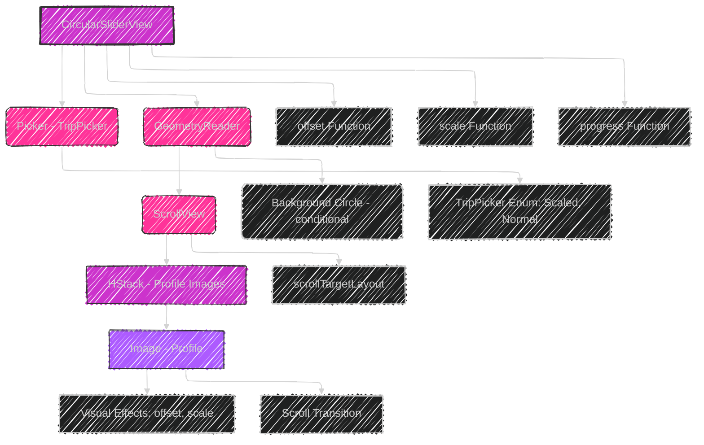
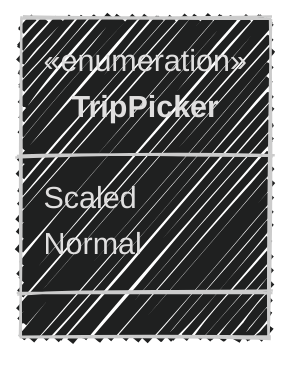
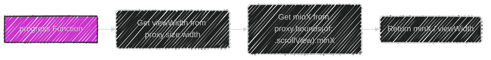
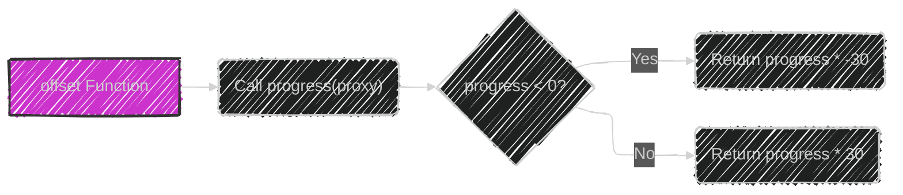
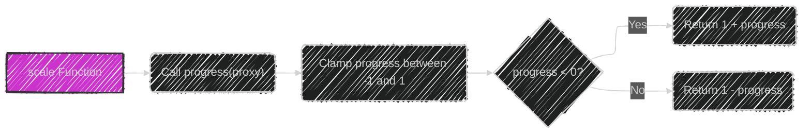
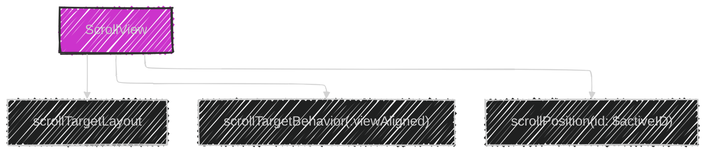
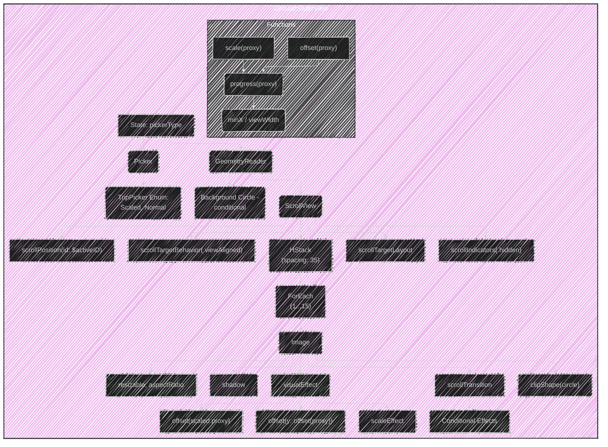

# SwiftUI - Circular Slider Effect
> This content is dual-licensed under your choice of the following licenses:
> 1.  **MIT License:** For the code implementations in Swift and Mermaid provided in this document.
> 2.  **Creative Commons Attribution 4.0 International License (CC BY 4.0):** For all other content, including the text, explanations, and the Mermaid diagrams and illustrations.

---
This doc will explain the Swift code implementation from this branch https://github.com/CongLeSolutionX/MyApp/tree/SwiftUI_Circular_Slider_Effect-SAVE-FOR-REFERENCE.
I will keep the code in GitHub branch as is as reference for content on this article.

---

## 1. Overview and High-Level Structure

First, let's provide a high-level overview of what the code does and its main components.  The `CircularSliderView` is a SwiftUI component that displays a horizontal, circular slider of profile images. The slider has two modes ("Normal" and "Scaled") that affect its visual presentation.

Here's a Mermaid flowchart to illustrate the basic structure:

**Textual Explanation:**

1.  **`CircularSliderView` (Struct):** The main view containing all the UI elements.
2.  **`@State private var pickerType`:** A state variable that controls the slider's appearance (Normal or Scaled).
3.  **`Picker`:** A segmented control (using `pickerStyle(.segmented)`) that allows the user to switch between "Normal" and "Scaled" modes.
4.  **`GeometryReader`:**  Provides the size and position of the view, crucial for calculations related to the circular slider.
5.  **`ScrollView`:** Enables horizontal scrolling of the profile images.
6.  **`HStack`:** Arranges the profile images horizontally within the `ScrollView`.
7.  **`ForEach`:** Dynamically creates an `Image` view for each profile picture (from "Profile 1" to "Profile 15").
8.  **`Image(...).resizable().aspectRatio(...)`:** Loads, resizes, and scales each profile image.
9.  **`.clipShape(.circle)`:** Makes the images circular.
10. **`.shadow(...)`:** Adds a drop shadow.
11. **`.visualEffect { ... }`:**  This is where the core animation logic resides, using the `offset` and `scale` functions.
12. **`.scrollTransition(...)`:** conditionally applies transition.
13. **`.scrollTargetLayout()`:** Specifies that the `HStack` should be used for scroll target alignment.
14. **`.background(content: { ... })`:** conditionally renders the yellow.
15. **`.safeAreaPadding(...)`:** Adds padding.
16. **`.scrollIndicators(.hidden)`:** Hides the scroll indicator.
17. **`.scrollTargetBehavior(.viewAligned)`:** Enables snapping behavior, so images center when scrolling stops.
18. **`.scrollPosition(id: $activeID)`:** Binds the scroll position to the `activeID` state variable, which controls which image is centered.
19. **`offset(_ proxy:)` Function:** Calculates the vertical offset of each image based on its position in the scroll view.
20. **`scale(_ proxy:)` Function:** Calculates the scale factor of each image based on its position.
21. **`progress(_ proxy:)` Function:** Calculates the normalized scroll progress.
22. **`TripPicker` Enum:** Defines the two slider modes: "Scaled" and "Normal".

## 2. The `TripPicker` Enum

This enum is straightforward but essential for controlling the slider's mode.

**Textual Explanation:**

*   The `TripPicker` enum has two cases: `scaled` and `normal`.
*   It conforms to `String` and `CaseIterable`, which are useful for the `Picker` view, and the `ForEach` in the view.

## 3. The `progress`, `offset`, and `scale` Functions

These functions are the heart of the animation and visual effects. Let's break down each one. They work in unison and depend on the geometry of the scrolling area.

### 3.1. `progress(_ proxy:)`

**Textual Explanation and Math:**

*   **Purpose:**  Calculates how far the scroll view has been scrolled, normalized to the width of the view.  This value represents the scrolling "progress."

*   **`viewWidth = proxy.size.width`:**  Gets the total width of the `GeometryReader`.

*   **`minX = (proxy.bounds(of: .scrollView)?.minX ?? 0)`:** This is the key.  `proxy.bounds(of: .scrollView)` gives us the bounds of the *scrolling content* within the `GeometryReader`'s coordinate space.  `minX` represents the x-coordinate of the left edge of the visible portion of the scrollable content.  As you scroll right, `minX` becomes increasingly *negative*.  The `?? 0` handles the case where `bounds(of:)` might return `nil`.

*   **`return minX / viewWidth`:**  Dividing `minX` (which is negative) by `viewWidth` (positive) gives us a normalized progress value.
    *   When the first image is fully visible, `minX` is close to 0, so the progress is near 0.
    *   As you scroll to the right, `minX` becomes more negative, and the progress becomes a negative number.

### 3.2. `offset(_ proxy:)`

**Textual Explanation and Math:**

*   **Purpose:**  Calculates the vertical (y) offset to apply to each image.  This creates the up-and-down movement as the images scroll.

*   **`progress = progress(proxy)`:**  Gets the normalized scroll progress.

*   **`progress < 0 ? progress * -30 : progress * 30`:** This is a ternary operator that determines the offset.
    *   If `progress` is negative (scrolling to the right), the offset is `progress * -30`.  This moves the images *up* (negative y direction).  The further you scroll, the more negative `progress` becomes, and therefore the larger the upward offset.
    *   If `progress` is positive (scrolling to the left, which is less common in this setup), the offset is `progress * 30`.  This would move the images *down*.
    *   The `30` is a constant that controls the *magnitude* of the vertical movement.  You can adjust this to make the movement more or less pronounced.

### 3.3. `scale(_ proxy:)`

**Textual Explanation and Math:**

*   **Purpose:**  Calculates the scale factor to apply to each image. When combined with the offset, this creates the effect of the images moving in a circular path.

*   **`progress = progress(proxy)`:**  Gets the normalized scroll progress.

*   **`progress = min(max(progress, -1), 1)`:** This is crucial.  It *clamps* the progress value between -1 and 1.  This prevents extreme scaling and ensures a smooth animation.  Without clamping, the scale could become very large or very small, distorting the images.

*   **`progress < 0 ? 1 + progress : 1 - progress`:**  Another ternary operator.
    *   If `progress` is negative (scrolling right), the scale is `1 + progress`.  Since `progress` is negative and clamped to -1, the scale will be between 0 and 1 (shrinking the image).
    *   If `progress` is positive (scrolling left), the scale is `1 - progress`.  Since `progress` is positive and clamped to 1, the scale will again be between 0 and 1.

*   **In Essence:** The further an image is from the center (either left or right), the smaller it becomes.  The image at the center (where `progress` is closest to 0) will have a scale closest to 1 (its original size).

## 4. Visual Effects and Scroll Transition

The `.visualEffect` and `.scrollTransition` modifiers are used to apply the calculated offset and scale, as well as manage the appearance of the centered image.

**Textual Explanation for `.visualEffect`:**

*   The `visualEffect` modifier is applied to each `Image` view. It takes a closure that receives two parameters:
    *   `view`: The original `Image` view.
    *   `proxy`: A `GeometryProxy` representing the image's geometry within the scroll view.

*   **`view.offset(y: offset(proxy))`:**  Applies the vertical offset calculated by the `offset` function. The `proxy` lets you know about the geometry of an individual profile to move.

*   **`scaleEffect(1 + (pickerType == .normal ? 0 : (scale(proxy) / 2)))`**: It scales views during scrolling, but it only applies scaling if the picker is set to `.scaled` if not it adds 0 to remain at the original size (scale factor of 1):

* **`offset(y: scale(proxy) * 15)`**:  It contributes to the "circular" motion by shifting images vertically based on their scaled size.

**Textual Explanation for `.scrollTransition`:**

*   `.scrollTransition(.interactive, axis: .horizontal)`: Configures a scroll transition that:
    *   Is **interactive:** The transition updates smoothly as the user scrolls.
    *   Applies along the **horizontal axis**.
    *   Receives a `view` (the `Image`) and a `phase` (a `ScrollTransitionPhase`).

## 5. Scroll Target Behavior and Layout

**Textual Explanation for `scrollTargetBehavior` and `scrollPosition`:**

*   `scrollTargetLayout()`:  Uses `HStack` view for scrolling.
*   `.scrollTargetBehavior(.viewAligned)`:  This is what makes the images "snap" to the center.  It tells the scroll view to align its scroll offset so that views are centered.
*   `.scrollPosition(id: $activeID)`: This is how you programmatically control which image is centered.  By updating the `activeID` state variable, you can tell the scroll view to scroll to a specific image.

## 6. Putting It All Together: The Circular Motion

The circular motion effect is a result of the interplay between the `offset`, `scale`, and the snapping behavior (`.scrollTargetBehavior(.viewAligned)`).

1.  **Scrolling:** As the user scrolls, the `progress` function calculates the scroll position.
2.  **Offset:** The `offset` function uses the progress to move the images up or down.
3.  **Scale:** The `scale` function shrinks images that are farther from the center.
4.  **Snapping:** The `scrollTargetBehavior` tries to keep a view centered. Because the images are scaled and offset, the "center" of the scroll view appears to be along a circular path rather than a straight line. The scaled-down images further emphasize the circular appearance.

## 7.  Complete, Cohesive Diagram

This final diagram integrates all the components and their relationships to provide a comprehensive visual representation of the code's functionality and data flow.

---

---
**Licenses:**

- **MIT License:**   - Full text in [LICENSE](LICENSE) file.
- **Creative Commons Attribution 4.0 International:**  - Legal details in [LICENSE-CC-BY](LICENSE-CC-BY) and at [Creative Commons official site](http://creativecommons.org/licenses/by/4.0/).

---