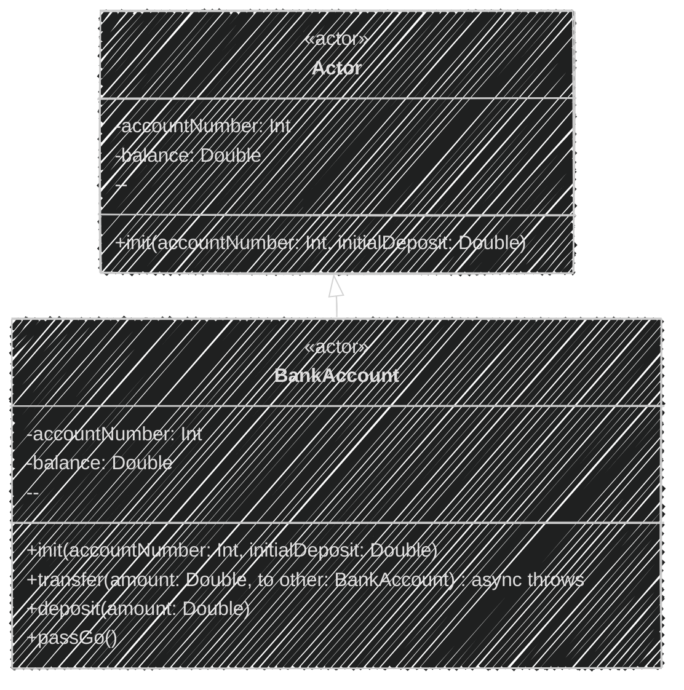
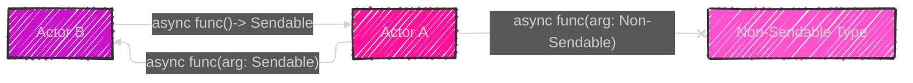
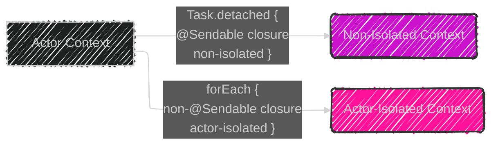
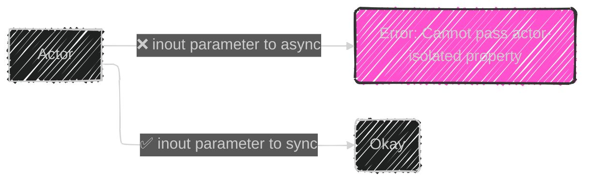
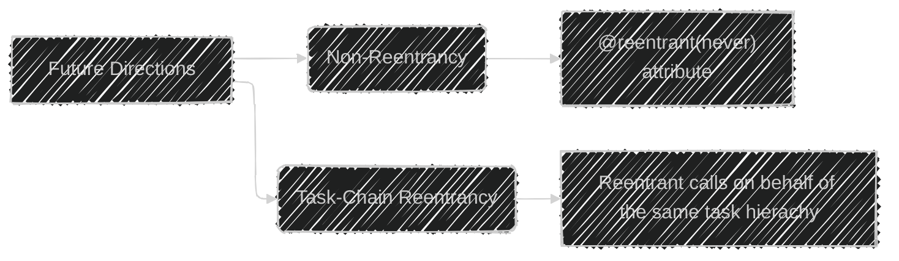

> This content is dual-licensed under your choice of the following licenses:
> 1.  **MIT License:** For the code implementations in Swift and Mermaid provided in this document.
> 2.  **Creative Commons Attribution 4.0 International License (CC BY 4.0):** For all other content, including the text, explanations, and the Mermaid diagrams and illustrations.

---


Below is a breakdown of the diagrams I will create, aligning with [the original proposal documentation's structure of Actors in Swift](https://github.com/swiftlang/swift-evolution/blob/main/proposals/0306-actors.md):

1.  **Actor Basics:** Illustrating the fundamental structure of an actor, its properties, and methods.
2.  **Actor Isolation:** Explaining how actors protect their state, including scenarios with cross-actor references and asynchronous calls.
3.  **`Sendable` Protocol and Cross-Actor Communication:** Visualizing the role of `Sendable` in ensuring type safety when crossing actor boundaries.
4.  **Closures and Actor Isolation:** Detailing how closures interact with actor isolation, including the distinction between `@Sendable` closures.
5.  **Actor Reentrancy**: explaining reentrancy, interleaving and the problems this approach solves.
6. **Protocol Conformances**: explaining how Actors conform to protocols.
7. **Partial applications:** How partial applications can be used with Actors.
8. **Key paths:** Restrictions with key paths. 
9. **`inout` parameters:** Restrictions with `inout` parameters
10. **Objective-C Interoperability:** Show how Actors interact with Objective-C.
11. **Future Directions**: Explaining non-reentrancy and task-chain reentrancy.

Let's start with the first diagram:

# 1. Actor Basics



**Explanation:**

*   This diagram introduces the `Actor` base concept and `BankAccount` as a concrete example.
*   It highlights the use of the `actor` keyword to define an actor.
*   It shows that our example `BankAccount` actor has properties (`accountNumber`, `balance`), an initializer (`init`), and methods (`transfer`, `deposit`, `passGo`).
*   The `<<actor>>` stereotype is used to depict the actor type. The dash (-) represent a private field/property and (+) represents a public field/method/function.
*  The note highlights that actors are reference types and protect their state, also this shows that actors are declared through the use of keyword `actor`.

# 2. Actor Isolation


**Explanation:**

*   This sequence diagram illustrates how actor isolation works. In this example, we start with a `Client`, who will be using a `BankAccount` actor and `otherAccount` actor which they want to transfer money to.
*   The `Client` requests a `transfer` to the `BankAccount`.
*   The `BankAccount` then checks if there are sufficient funds by accessing `balance`.
*   The `BankAccount` then transfers money by deducting the `amount` from it's balance. This operation is safe since it is on the actor's `self`.
*   In order to send money to the `OtherAccount`, `BankAccount` executes an asynchronous call via an `await`. When an `await` is executed by an actor, the actor saves the current task and is moved into the actor's mailbox, before exiting the current task. Then another task from the actor's mailbox may be picked up to execute. Once our suspended task is picked up from the actor's mailbox will it then resume execution. The caller `Client` may have been suspended during this entire process.
*   Finally, the `transfer` operation is completed, completing the Client's async request.
*   The notes highlights that `await` must be used for cross-actor calls and that an actor-isolated property (such as `balance`) can only be accessed directly on self.

# 3. `Sendable` Protocol and Cross-Actor Communication



**Explanation:**

*   This graph illustrates the role of the `Sendable` protocol in cross-actor communication.
*   Actors `A` and `B` can safely exchange messages (using asynchronous functions/methods) because they use types that conform to  `Sendable`
*   If an Attempt is made to use a type that is not `Sendable`, for example, a custom `Non-Sendable Type` C, then a compiler error will be produced. Types that conform to `Sendable` are value types or other types that provide thread safety internally.
*   The notes highlights that actors always conform to `Sendable`, and if a type cannot conform to `Sendable`, then it cannot be used in cross-actor calls/messages.

# 4. Closures and Actor Isolation




**Explanation:**

*   This graph illustrates how closures interact with actor isolation.
*   A closure that is passed in a `Task.detached { }` block is non-isolated because it is an `@Sendable` closure. It needs to use `await` to access any actor-isolated state of any actor.
*   A closure that is passed into `forEach` in our example is actor-isolated because `forEach` takes a non-`@Sendable` closure, and it is called from within the actor's context. This code can therefore also access other parts of the same actor. 
*   The notes highlights these differences and the context of how that influences closure isolation.

# 5. Actor Reentrancy


**Explanation:**
* The state diagram shows the lifecycle of an actor-isolated function within a reentrant actor.
*   The function initially starts in the `InitialState`, and it transitions to the `ActorIsolatedFunction` state. 
*   The `ActorIsolatedFunction` state starts the function execution and reaches a `FirstPartCompleted` point. At that point we execute until we reach a `SuspendPoint`.
*   When hitting a `SuspendPoint`, the reentrancy of an actor allows the actor to switch to another task in its mailbox, until it is ready to `Resume` the original suspended task. If there isn't any other task, we skip through to the `Resume` state.
*   Once the function resumes, it continues execution in the `SecondPartCompleted` section. After which it will complete and transition to the `InitialState`, completing the actor-isolated function's execution. 
*   The notes highlights the importance of reentrancy, in that it allows other work to be done on the actor while waiting on a suspended task.

# 6. Protocol conformances


**Explanation:**

*   This diagram illustrates how actors conform to protocols.
*   All actor types implicitly conform to the `Actor` protocol, which indicates that it is `Sendable`.
*   The `DataProcessible` protocol, which extends the `Actor` protocol can only be adopted by actors. This is because it has an actor-isolated requirement `data`. The diagram also shows the `MyProcessor` actor conforming to the `DataProcessible` protocol. This indicates that an actor may conform to multiple protocols, so long as it conforms to the `Actor` protocol and the associated constrains. 
*   The diagram also displays a `Server` protocol that has async requirements. `MyActor` is shown to be conforming to that protocol.
*   The notes highlight the rules around `Actor` protocol conformance and how actors satisfy protocols with asynchronous requirements.


# 7. Partial applications


**Explanation:**

* This diagram illustrates partial applications in the context of Actors.
*  In the provided code, there are two methods f(Int) -> Double and g() -> Double.
* Partial application is ok when using `array.map(self.f)` because the closure parameter for map is non-`Sendable`. If the input function parameter were set to `@Sendable`, then this would become a compile error since it would be required that the return value is also `Sendable`. In this case, `() -> Double` is not `Sendable`.
*  Partial application will result in an error  when using `Task.detached( operation: self.g)` or `runLater(self.g)` because both of these API's are requiring `@Sendable` types as the input.
* The notes highlights these differences and the constraints around using them.

# 8. Key paths


**Explanation:**
* The Diagram shows that if a keypath is created that references an actor-isolated property on the Actor, a compiler error will be thrown.
*  This diagram shows that attempting to create a keypath on an actor-isolated property will fail.
*  The notes explain why and the restriction around that. 

# 9. `inout` parameters



**Explanation:**

*   This graph illustrates the restrictions with `inout` parameters in actors.
*  If an `inout` parameter is passed to async function that is using an actor-isolated property, then a compiler error will be generated.
*  If an `inout` parameter is passed to synchronous function that is using an actor-isolated property, then the operation is ok.
* The notes explain the restrictions around passing an `inout` parameter to async vs sync functions.

# 10. Objective-C Interoperability

```mermaid
---
config:
  layout: elk
  look: handDrawn
  theme: dark
---
graph LR
    A[@objc Actor] -->|❌ @objc sync func | B(Error: part of actor's isolation domain);
    A-->|✅ @objc async func | C(Okay: Exposed as a completion handler method);
    A-->|✅ @objc nonisolated func | D(Okay: Not part of actor's isolation);
    
        style B fill:#f1bb,stroke:#333,stroke-width:2px
       
    classDef error fill:#f1bb,stroke:#333,stroke-width:2px
    class B error
    
    %% note top of A: @objc Actor 
    %% note top of B:  Synchronous members must not be marked as `@objc`.
    %% note top of C: Async members are okay since they can be exposed to Obj-C using the completion handler patterns.
    %% note top of D: nonisolated members are ok.
```
**Explanation:**

* This diagram shows the rules for using `@objc` members of an actor.
* Synchronous functions that are part of the actor's isolation domain cannot be exposed to Objective-C and a compiler error will be thrown for any attempt.
* Async members are okay, since they can be exposed as a method that accepts a completion handler. 
*  `nonisolated` members are okay, since they are not part of the actor's isolation domain.
* The notes show the specific rules and the reasoning.

# 11. Future Directions



**Explanation:**
* This diagram shows future directions for actors. 
* Non-reentrancy is shown to be available through the use of the `@reentrant(never)` attribute, that prevents other async calls from running on the Actor while it is suspended.
* Task-chain reentrancy would allow reentrant calls so long as they were from the same task hierachy. Since it is common to perform a series of calls between a small group of actors as part of a task. 
* The notes explain each of the approaches.

---
