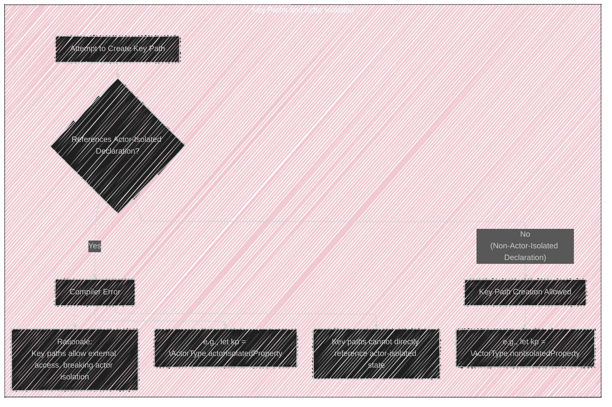
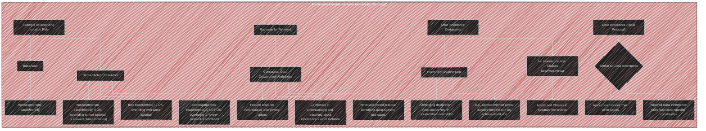
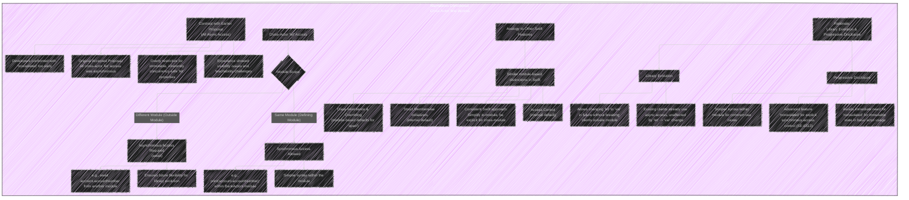
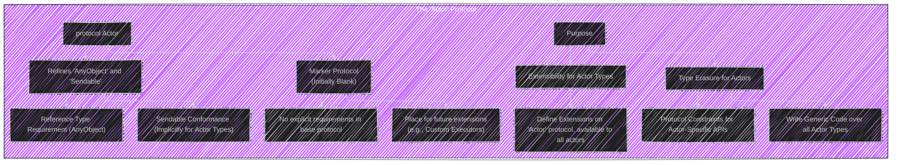
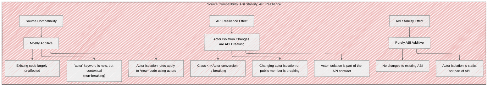
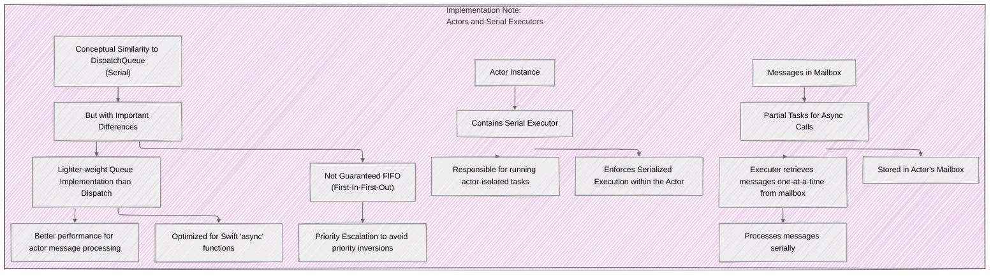

> This content is dual-licensed under your choice of the following licenses:
> 1.  **MIT License:** For the code implementations in Swift and Mermaid provided in this document.
> 2.  **Creative Commons Attribution 4.0 International License (CC BY 4.0):** For all other content, including the text, explanations, and the Mermaid diagrams and illustrations.

---


Below is a breakdown of the diagrams I will create, aligning with [the original proposal documentation's structure of Actors in Swift](https://github.com/swiftlang/swift-evolution/blob/main/proposals/0306-actors.md):


These diagrams cover the core technical concepts of the Actors proposal as requested.

I have used a mix of diagram types to effectively represent different aspects: composite diagrams for overviews and related concepts, sequence diagrams to illustrate execution flow and timing, and flowcharts to depict decision-making and conditional logic.


Here's the first set of diagrams covering the foundational concepts:


----


## Diagram 1: Core Concepts of Actors

### Diagram Type: Composite diagram with subgraphs

### Purpose:
To provide a high-level overview of the Actor Model and its key features in Swift.


### Explanation

*   **Actor Model Subgraph:**  Depicts an Actor as an entity composed of State, Behavior, Isolation, and using Message Passing for communication. It highlights the foundational principles of the actor model itself.
    *   **State (Encapsulated Data):** Actors manage their own private data.
    *   **Behavior (Methods/Operations):** Defines operations that can be performed on the actor's state.
    *   **Isolation (Data Race Protection):**  State is protected from concurrent access.
    *   **Message Passing (Asynchronous Communication):** Actors communicate asynchronously through messages.
*   **Key Features Subgraph:** Focuses on Swift-specific features and advantages introduced by actors.
    *   **Data Race Safety:** Achieved through static detection and compiler enforcement.
    *   **Shared Mutable State:** Allows for safe concurrent access to shared mutable state via actor isolation.
    *   **Familiar Abstraction:** Actors are integrated into Swift's type system, providing familiar programming paradigms.
    *   **Concurrency Integration:** Actors are a core part of Swift's broader concurrency model, working seamlessly with `async/await` and structured concurrency.

---

Next, I'll create diagrams to illustrate **Actor Isolation** and **Cross-Actor References**:

## Diagram 2: Actor Isolation and Cross-Actor References

### Diagram Type: Composite diagram with subgraphs

### Purpose:
To visually explain how Actor Isolation works and the rules governing Cross-Actor References.


### Explanation

*   **Actor Isolation Subgraph:** Details what constitutes "isolated state" within an actor and how direct access is restricted.
    *   **Isolated State:**  Includes stored and computed properties, instance methods, and subscripts of an actor instance.
    *   **Direct Access on 'self' (Allowed):** Accessing isolated state directly using `self` within the actor's own methods is permitted.
    *   **External Direct Access (Compiler Error):** Direct access to isolated state from outside the actor scope (i.e., from other actors or non-actor code) is disallowed by the compiler.
*   **Cross-Actor References Subgraph:** Describes the permitted ways to interact with actors from outside their isolation domain.
    *   **Immutable State (let):**
        *   **Same Module:** Synchronous access to `let` properties is allowed within the same module where the actor is defined.
        *   **Different Module:** Asynchronous access (using `await`) is required for `let` properties when accessed from outside the defining module.
    *   **Mutable State (var):** Asynchronous access (using `await`) is always required for mutable state (`var` properties). This uses message passing via the actor's mailbox, ensuring serialized execution within the actor.
    *   **Sendable Types:**  Cross-actor communication (arguments, return types of async calls, and immutable properties accessed cross-actor) *must* involve `Sendable` types to ensure data race safety.

---

Now, let's visualize the concept of **Actor Reentrancy**:


## Diagram 3: Actor Reentrancy - Interleaving Execution

### Diagram Type: Sequence Diagram

### Purpose
To illustrate the concept of reentrancy in actors, specifically how asynchronous actor-isolated functions can interleave at suspension points, potentially leading to unexpected state changes if invariants are broken across `await` calls.


### Explanation

1.  **Client Tasks Initiate Calls:** Two client tasks concurrently call `thinkOfGoodIdea()` and `thinkOfBadIdea()` on the `DecisionMaker` actor.
2.  **Execution Interleaving:** The sequence diagram visually demonstrates how the execution can interleave at `await` points.
    *   Task 1 (`thinkOfGoodIdea`): Sets `opinion` to `.goodIdea` (step `<1>`) and then suspends at `await friend.tell(...)` (step `<2>`).
    *   Task 2 (`thinkOfBadIdea`): Starts executing while Task 1 is suspended.  It sets `opinion` to `.badIdea` (step `<4>`) and suspends at `await friend.tell(...)` (step `<5>`).  This interleaving changes the `opinion` within the actor *before* Task 1 resumes.
3.  **Resumption and Incorrect Result:** When Task 1 resumes (step `<2>`), it proceeds to return `opinion` (step `<3>`). However, because of the interleaving, `opinion` might now be `.badIdea` (set by Task 2), leading to an incorrect result.
4.  **Note on Reentrancy:** A note at the bottom emphasizes the key characteristics of reentrant actors: interleaving at suspension points, maintaining thread safety (no concurrency), but not automatically protecting against higher-level race conditions if invariants are not carefully managed around `await` calls.

---

To contrast reentrancy, I will create a diagram explaining the potential issue with **Non-Reentrant Actors**:


## Diagram 4: Deadlock with Non-Reentrant Actors

### Diagram Type: Sequence Diagram

### Purpose:
To illustrate how non-reentrant actors can lead to deadlocks, especially in scenarios involving cyclic dependencies or callbacks between actors.


### Explanation

1.  **Client Task A Initiates `thinkOfBadIdea()`:** Client Task A calls `thinkOfBadIdea()` on `DecisionMaker Actor A` (which is assumed to be non-reentrant).
2.  **Actor A Calls `tell()` on Actor B:** Actor A sets its `opinion` to `.badIdea` and then calls `await friend.tell(...)` on `DecisionMaker Actor B`. This suspends Task A on Actor A, *but* because Actor A is non-reentrant, it cannot process any other messages during this suspension.
3.  **Actor B Calls Back to Actor A (`convinceOtherwise`)**: Within `tell()`, Actor B checks the opinion and decides to call `await friend.convinceOtherwise(opinion)` on Actor A.  **This is where the deadlock occurs.**
4.  **Deadlock Condition**: The call from Actor B back to Actor A (`convinceOtherwise`) cannot be processed by Actor A because Actor A is non-reentrant and is still blocked waiting for the `tell()` call on Actor B to return.  This creates a cyclic wait condition.
5.  **Client Task B (if exists) is also Blocked:** If another client task (Client Task B) were to attempt to interact with Actor A, it would also be blocked because Actor A is deadlocked and cannot process any new messages.
6.  **Note on Non-Reentrancy and Deadlock:** A note at the bottom summarizes the issue: Non-reentrant actors, while preventing interleaving, introduce the risk of deadlocks when actor interactions lead to cyclic dependencies.

---

Let's move to **Closures and Actor Isolation**:


## Diagram 5: Closures and Actor Isolation

### Diagram Type:s Flowchart

### Purpose:
To clarify how the `@Sendable` attribute affects the isolation context of closures created within actors, and how this impacts their execution and access to actor state.


### Explanation

1.  **Closure Creation Context:** The diagram starts when a closure is created within an actor-isolated context (e.g., inside an actor's method).
2.  **`@Sendable` Check:** The crucial decision point is whether the closure is marked as `@Sendable`.
3.  **`@Sendable` Closure Path:**
    *   **Non-Isolated Closure:** If the closure is `@Sendable`, it becomes non-isolated.
    *   **Concurrent Execution:**  Non-isolated closures can run concurrently with the actor's isolated code. (Example: closures passed to `Task.detached` are required to be `@Sendable` and hence non-isolated).
    *   **`await` Required for Actor Access:** To access actor-isolated state from a non-isolated closure, asynchronous access (`await`) is mandatory.
    *   **Example `Task.detached`:** Illustrates a common scenario where `@Sendable` closures are used, resulting in non-isolated execution.
4.  **Non-`@Sendable` Closure Path:**
    *   **Actor-Isolated Closure:** If the closure is *not* `@Sendable`, it remains actor-isolated to the `self` actor.
    *   **Serial Execution:** Actor-isolated closures run serially, within the actor's single-threaded execution context. (Example: closures passed to `forEach` are non-`@Sendable`).
    *   **Synchronous Actor Access Allowed:** Synchronous access to actor-isolated state (using `self`) is allowed within actor-isolated closures because they are guaranteed to run within the actor’s isolation.
    *   **Example `Array.forEach`:** Shows a case where non-`@Sendable` closures are used, and the closure body remains actor-isolated.

---

Finally, let's visualize the concept of **Protocol Conformance for Actors**:


## Diagram 6: Actor Protocol Conformances

### Diagram Type: Composite diagram with subgraphs.

### Purpose:
To outline the rules and constraints around actors conforming to protocols, differentiating between protocols with asynchronous and synchronous requirements, and highlighting the concept of "Actor Protocols."


### Explanation

*   **Protocol Conformance Decision Tree (Protocol Conformance Subgraph):**
    *   **Async Protocol Requirements:** If a protocol's requirements are `async`, actors *can* always conform. Actor methods can be sync or async to fulfill these requirements. The asynchronous nature of interactions with the protocol ensures actor isolation.
    *   **Sync Protocol Requirements:** If the requirements are synchronous, the next check is: *Is the protocol itself an "Actor Protocol"?*
        *   **Actor Protocol (Yes):** If it's an Actor Protocol (e.g., `protocol MyActorProtocol: Actor`), actors *can* conform. Actor methods fulfilling these requirements *must* be actor-isolated. Methods declared in Actor Protocols are implicitly actor-isolated.
        *   **Non-Actor Protocol (No):** If it's a regular (non-Actor) protocol with synchronous requirements, actors *cannot* directly conform under the base actor model proposal.  Conformance might be possible in the future with "isolation control mechanisms" (like `nonisolated` implementations) *if* the implementation can avoid accessing mutable actor state.
*   **Actor Protocol Details Subgraph:** Explains the special nature of Actor Protocols.
    *   **Actor-Isolated Requirements:** Actor Protocols define requirements (properties, methods, etc.) that are inherently actor-isolated to `self` for any conforming actor.
    *   **Actor-Isolated Witnesses:** When an actor conforms to an Actor Protocol, the methods or properties it provides as witnesses must also be actor-isolated.
    *   **Generic Operations on Actors:** Actor Protocols enable the creation of generic functions and extensions that can operate on any type conforming to that Actor Protocol, facilitating code reuse and abstraction across actors.


---


Let's continue by creating diagrams for the "Detailed Design" section. 

We'll start with **Partial Applications** within the context of actors.


## Diagram 7: Partial Application of Actor-Isolated Functions

### Diagram Type: Flowchart

### Purpose:
To illustrate the restrictions on creating partial applications of actor-isolated functions, particularly in relation to `@Sendable` contexts and parameter types.


### Explanation:

1.  **Actor Instance and Partial Function Application**: The diagram begins when attempting to create a partial application of an actor-isolated function using `self` (an actor instance).
2.  **`@Sendable` Parameter Check:** The key decision point revolves around whether the context where the partial application is used (or the parameter of the function receiving the partial application) requires a `@Sendable` closure.
3.  **Non-`@Sendable` Parameter Path**:
    *   **Direct Argument Allowed:** If the context does *not* require a `@Sendable` closure (or the relevant parameter is non-`Sendable`), then creating a partial application like `self.f` *directly as an argument* is permitted (e.g., in `array.map(self.f)`).
    *   **Example `array.map(self.f)`:**  Illustrates a valid use case because `map`'s closure is not inherently required to be `@Sendable` in this context.
4.  **`@Sendable` Parameter/Context Path**:
    *   **Partial Application Not Allowed (Error):** If the context *does* require a `@Sendable` closure (e.g., `Task.detached`, `runLater`, or a parameter explicitly typed as `@Sendable`), then creating a partial application like `self.g` directly results in a compiler error.
    *   **Examples `Task.detached(operation: self.g)` and `runLater(self.g)`:**  Show invalid scenarios.  `Task.detached` and `runLater` both expect a `@Sendable` closure.  `self.g` on its own, representing the actor-isolated function, cannot be directly converted to a `@Sendable` function type because it implicitly captures `self` which is not `@Sendable` in this context.
    *   **Solution: Closure Form Required:**  To correctly use actor-isolated functions in `@Sendable` contexts, you must wrap the call within a closure: `Task.detached { await self.g() }`. This creates a `@Sendable` closure that *asynchronously* invokes the actor-isolated function, respecting actor isolation rules.

---

Next, let's visualize the restriction on **Key Paths** and actor-isolated declarations.

## Diagram 8: Key Paths and Actor Isolation

### Diagram Type: Flowchart

### Purpose:
To explain why key paths cannot directly reference actor-isolated declarations and the rationale behind this restriction.




### Explanation

1.  **Attempt to Create Key Path:** The process begins with an attempt to create a key path.
2.  **Actor-Isolated Declaration Check:** The compiler checks if the key path attempts to reference an actor-isolated declaration (like an actor's stored property or subscript).
3.  **Actor-Isolated Reference (Compiler Error):** If the key path *does* reference an actor-isolated declaration, a compiler error is generated.
    *   **Example `let kp = \ActorType.actorIsolatedProperty`:** Shows an invalid key path creation.
    *   **Rationale: Breaks Actor Isolation:**  The core reason for this restriction is that key paths, once created, can be used from *anywhere* in the code, including outside the actor's isolation domain. Allowing key paths to actor-isolated state would therefore permit unrestricted, synchronous access to the protected state, directly violating actor isolation and potentially leading to data races.
4.  **Non-Actor-Isolated Reference (Key Path Creation Allowed):** If the key path references a *non*-actor-isolated declaration (e.g., a static property on an actor, or a property on a regular class or struct), key path creation is allowed without error.

---

Now let's visualize the rules for **`inout` parameters** and actor-isolated properties.


## Diagram 9: `inout` Parameters and Actor Isolation

### Diagram Type: Flowchart

### Purpose:
To explain why passing actor-isolated properties as `inout` parameters to asynchronous functions is disallowed, while it is permitted for synchronous functions, and the reason relates to potential exclusivity violations and actor reentrancy.


### Explanation

1.  **Passing Actor-Isolated Property as `inout`**: The diagram starts when an attempt is made to pass an actor-isolated stored property as an `inout` parameter to a function.
2.  **Function Asynchronicity Check**: The key distinction is whether the function receiving the `inout` parameter is synchronous or asynchronous.
3.  **Synchronous Function Path (Allowed)**: If the function is synchronous, passing the actor-isolated property as `inout` is *allowed*.
    *   **Example `modifiesSynchronously(&actorInstance.balance)`:**  Illustrates a valid `inout` usage.
    *   **Safe because Synchronous:** The operation is safe because synchronous functions execute atomically without suspension points within the call. There's no chance for another task on the same actor to interleave and cause a data race or exclusivity violation during the synchronous function's execution.
4.  **Asynchronous Function Path (Compiler Error)**: If the function is asynchronous, passing an actor-isolated property as `inout` results in a *compiler error*.
    *   **Example `await modifiesAsynchronously(&actorInstance.balance)`:** Shows the disallowed `inout` usage.
    *   **Rationale: Exclusivity Violation Risk:** The error exists to prevent potential exclusivity violations, which are a type of data race that can occur due to actor reentrancy.
        *   **Suspension Point:** Asynchronous functions have suspension points (the `await` in the example function itself is a suspension point, but also within `modifiesAsynchronously` there might be awaits).
        *   **Reentrancy and Concurrent Access During Suspension:**  Because actors are reentrant, when `modifiesAsynchronously` suspends, other tasks *on the same actor* *could* potentially start running. If another task tries to access the same actor-isolated `balance` property while it's passed `inout` and potentially being modified by `modifiesAsynchronously` (even though suspended), this can create an exclusivity violation (runtime error) and non-deterministic behavior.
        *   **Preventing Non-Deterministic Errors:**  The compiler prevents this by disallowing `inout` for actor-isolated properties in asynchronous function contexts, thus eliminating a class of potential runtime errors that would be hard to debug and diagnose due to their non-deterministic nature.

---

Finally for "Detailed Design", let's represent **Actor Interoperability with Objective-C**.


## Diagram 10: Actor Interoperability with Objective-C

### Diagram Type: Flowchart

### Purpose:
To illustrate how Swift actors can interoperate with Objective-C (`@objc` actors) and the restrictions on exposing actor members to Objective-C based on their isolation and synchronicity.


### Explanation

1.  **`@objc` Actor Declaration**:  When an actor type is declared with the `@objc` attribute, it automatically conforms to `NSObjectProtocol`.
2.  **Objective-C Compatibility**: This `@objc` declaration enables the actor type to be used within Objective-C code, bridging the Swift concurrency model to the older Objective-C runtime.
3.  **`@objc` Actor Member Declaration:** When actor *members* (methods, properties) are declared with `@objc`, restrictions apply based on their actor isolation and synchronicity.
4.  **`@objc` and `async` Members (Allowed):**  `async` actor members can be `@objc`.
    *   **Completion Handler Bridging:**  `async` Swift methods are bridged to Objective-C as methods that use completion handlers (callbacks), as Objective-C does not have direct support for `async/await`.
5.  **`@objc` and `nonisolated` Members (Allowed):** `nonisolated` actor members can also be `@objc`.
    *   **Outside Isolation Domain:** `nonisolated` members, by definition, are *outside* the actor's isolation domain. Therefore, they are safe to expose to Objective-C because they don't directly interact with the actor's protected state in a synchronous, isolated way.
6.  **`@objc` and Synchronous, Actor-Isolated Members (NOT Allowed - Compiler Error):**  Synchronous, actor-isolated members *cannot* be declared `@objc`.
    *   **Example `@objc func synchronousActorIsolated() { ... }`:** This produces a compiler error.
    *   **Obj-C's Lack of Actor Isolation Awareness:** Objective-C and its runtime have no knowledge of Swift's actor isolation mechanisms.
    *   **Unsafe Exposure:** Exposing synchronous, actor-isolated code directly to Objective-C would be unsafe. Objective-C code could call these methods without respecting actor isolation, potentially leading to data races.
    *   **Swift's `self` Isolation Focus:** Synchronous actor-isolated code is intended to be called *only* on `self` (within Swift actor methods) to maintain the isolation guarantees. Objective-C calls from outside would violate this.

---

Let's continue with diagrams for the "Future Directions" and "Alternatives Considered" sections.
We'll start with **Future Directions** and specifically the concept of **Non-Reentrancy** using the `@reentrant` attribute.


## Diagram 11: Future Direction - Non-Reentrancy with `@reentrant` Attribute

### Diagram Type: Graph/Diagram with Subgraphs

### Purpose:
To explain the proposed `@reentrant` attribute, a future direction for controlling actor reentrancy.
It details the attribute's scope of application (function, extension, potentially actor type), the reentrancy options (`@reentrant` and `@reentrant(never)`), attribute resolution hierarchy, and mentions an alternative syntax `await(blocking)`.

```mermaid
---
config:
  layout: elk
  look: handDrawn
  theme: dark
---
graph TD
    subgraph Reentrancy_Control["Future Direction: Non-Reentrancy with &#64;reentrant Attribute"]
    style Reentrancy_Control fill:#f395,stroke:#333,stroke-width:1px

        A[&#64;reentrant Attribute] --> B{Scope of Application}
        B --> C{Function Level}
        C --> D["&#64;reentrant func f() async { ... }"]
        C --> E["&#64;reentrant(never) func f() async { ... }"]
        C --> F[Controls reentrancy for specific function]

        B --> G{Extension Level}
        G --> H["&#64;reentrant extension ActorType { ... }"]
        G --> I["&#64;reentrant(never) extension ActorType { ... }"]
        G --> J["Applies reentrancy to all actor-isolated functions in extension (unless overridden)"]

        B --> K{Actor Type Level}
        %% The case below is less likely as per doc example, but conceptually possible
        K --> L["&#64;reentrant actor ActorType { ... }"]
        %% The case below is less likely as per doc example, but conceptually possible
        K --> M["&#64;reentrant(never) actor ActorType { ... }"]
        K --> N[Potentially applies to all actor-isolated members in the actor]

        O[Reentrancy Options] --> P["&#64;reentrant (default)"]
        P --> Q[Reentrant Suspension Points]
        O --> R["&#64;reentrant(never)"]
        R --> S[Non-Reentrant Suspension Points]
        S --> T[Actor blocks other messages during suspension of non-reentrant function]
        S --> U[Exemption: Async calls on 'self' within non-reentrant functions are allowed to prevent self-deadlock]

        V[Attribute Resolution Hierarchy] --> W[1. Declaration itself]
        V --> X["2. Enclosing Extension (if member of extension)"]
        V --> Y["3. Actor Type Definition (if member of type or extension)"]
        V --> Z[First suitable &#64;reentrant attribute found in hierarchy determines reentrancy]
        V --> AA[Default Reentrancy: If no &#64;reentrant attribute found, function is reentrant]


        AB["Alternative Syntax (Mentioned)"] --> AC["await(blocking) friend.tell(opinion, heldBy: self)"]
        AC --> AD[Potential alternative for non-reentrant await calls, more localized control]
        AC --> AE[Not attribute-based, directly specifies blocking behavior at call site]

    end
    
```




### Explanation

*   **`@reentrant` Attribute Scope:** The diagram outlines the different levels at which the `@reentrant` attribute could be applied to control reentrancy:
    *   **Function Level:** Applied directly to individual `async` functions (`@reentrant func`, `@reentrant(never) func`). Controls reentrancy for that specific function only.
    *   **Extension Level:** Applied to extensions of actor types (`@reentrant extension ActorType`, `@reentrant(never) extension ActorType`). Sets the default reentrancy behavior for all actor-isolated functions within that extension (unless a function explicitly overrides it with its own `@reentrant` attribute).
    *   **Actor Type Level:** Conceptually, though less emphasized in the document's examples, `@reentrant` could potentially be applied to the `actor` type itself to set a default reentrancy behavior for all its actor-isolated members.
*   **Reentrancy Options:** Describes the two primary options provided by the `@reentrant` attribute:
    *   **`@reentrant` (or just `@reentrant` without arguments - default):**  Indicates standard reentrant behavior. Suspension points within functions marked `@reentrant` (or by default) are reentrant, allowing interleaving.
    *   **`@reentrant(never)`:**  Indicates *non*-reentrant behavior. Suspension points in `@reentrant(never)` functions become non-reentrant. While a `@reentrant(never)` function is suspended, the actor will *not* process other messages from its mailbox until the function completes execution and resumes. A critical exception is made for asynchronous calls made directly on `self` within a `@reentrant(never)` function – these are allowed to proceed to prevent self-deadlock situations.
*   **Attribute Resolution Hierarchy:** Explains how the compiler determines the reentrancy setting for an actor-isolated function when `@reentrant` attributes are used at different scopes. It follows a priority order:
    1.  **Declaration itself:**  The `@reentrant` attribute on the function itself takes highest precedence.
    2.  **Enclosing Extension:** If not on the function, check for `@reentrant` on the enclosing extension (if the function is in an extension).
    3.  **Actor Type Definition:**  If not found on the function or extension, check for `@reentrant` on the actor type definition itself.
    The first `@reentrant` attribute found in this hierarchy determines the reentrancy. If *no* `@reentrant` attribute is found anywhere in the hierarchy for an actor-isolated function, the default is *reentrant* behavior.
*   **Alternative Syntax (`await(blocking)`):** Mentions a possible alternative syntax, `await(blocking) friend.tell(...)`. This syntax would provide more localized control over reentrancy at individual `await` call sites, rather than using attributes to set broader reentrancy policies.  It would directly indicate a blocking `await` call, making the non-reentrant behavior explicit at the point of call.

---

Now, let's create a diagram to explain **Task-Chain Reentrancy**, another future direction.


## Diagram 12: Future Direction - Task-Chain Reentrancy

### Diagram Type: Graph/Diagram with Subgraphs

### Purpose:
To explain the concept of "task-chain reentrancy" as a potential future direction.
It outlines the scope of reentrancy, its benefits (deadlock reduction), compares it to other reentrancy types, and discusses the implementation challenges and uncertainties that led to it not being included in the current proposal.

```mermaid
---
config:
  layout: elk
  look: handDrawn
  theme: dark
---
graph TD
    subgraph Task_Chain_Reentrancy["Future Direction:<br>Task-Chain Reentrancy"]
    style Task_Chain_Reentrancy fill:#c3c2,stroke:#333,stroke-width:1px

        A[Task-Chain Reentrancy] --> B{Reentrancy Scope}
        B --> C[Limited Reentrancy]
        C --> D[Reentrant calls allowed only within the same Task or its Child Tasks]
        C --> E[Restricts reentrancy from unrelated tasks]
        C --> F[Aims to mimic synchronous call stack reentrancy behavior]


        G[Benefit:<br>Reduced Deadlocks] --> H["Prevents deadlocks in 'conversations' or call chains between actors"]
        H --> I["Example:<br>Mutual recursion scenarios (isEven/isOdd actors)"]
        G --> J[Still prevents broader interleaving issues from unrelated tasks]

        K[Contrast with Other Reentrancy Types] --> L["Reentrant<br>(current default)"]
        L --> M["Reentrant from any context, potential for more interleaving, more complex reasoning"]
        K --> N["Non-Reentrant (&#64;reentrant(never))"]
        N --> O[No reentrancy, simpler reasoning within actor, higher risk of deadlocks]

        P[Implementation Challenges] --> Q[Efficient Runtime Implementation]
        P --> R[Tracking task hierarchies and call chains for reentrancy checks]
        P --> S[Potential Performance Overhead]

        T[Uncertainty & Orleans Experience] --> U[Lack of large-scale trials]
        T --> V["Orleans attempted 'call-chain reentrancy' but removed it"]
        T --> W[Unclear if issue was the concept or specific implementation]
        T --> X[Currently not included in proposal due to these uncertainties and challenges]

        Y[Possible &#64;reentrant Attribute Extension] --> Z["&#64;reentrant(task)"]
        Z --> AA[Potential syntax to opt-in to task-chain reentrancy]
    end
    
```




### Explanation

*   **Task-Chain Reentrancy Scope:**  Defines the core idea of task-chain reentrancy:
    *   **Limited Reentrancy:** Reentrancy is not simply on or off, but scoped to the current `Task` hierarchy.
    *   **Same Task or Children Only:** Reentrant calls are only allowed if they originate from the same `Task` or any of its child tasks.
    *   **Restricts Unrelated Task Interleaving:** This approach aims to prevent reentrancy from completely unrelated concurrent tasks, limiting interleaving to "conversations" within a task family.
    *   **Mimics Synchronous Call Stack:** The goal is to better mirror the reentrant behavior of synchronous code, where mutual recursion within a call stack is natural and expected.
*   **Benefits: Reduced Deadlocks:** Explains the primary advantage of task-chain reentrancy:
    *   **Prevents Call Chain Deadlocks:** Specifically targeted at resolving deadlocks that can occur in scenarios where actors call back into each other in conversational patterns or in mutually recursive functions (like the `isEven`/`isOdd` example).
    *   **Balanced Approach:** It aims to provide a balance – reducing deadlock risks associated with non-reentrancy, but still offering more controlled reentrancy than the fully reentrant default.
*   **Contrast with Other Reentrancy Types:**  Positions task-chain reentrancy relative to:
    *   **Reentrant (Current Default):**  Reentrant from *any* context, potentially leading to more complex concurrency reasoning due to broader interleaving possibilities.
    *   **Non-Reentrant (`@reentrant(never)`):** No reentrancy, which simplifies reasoning within a single actor's execution, but increases the risk of deadlocks in inter-actor interactions.
*   **Implementation Challenges:**  Highlights the technical hurdles in implementing task-chain reentrancy:
    *   **Efficient Runtime Implementation:**  Requires a runtime system capable of efficiently tracking task hierarchies.
    *   **Task Hierarchy Tracking:**  Need mechanisms to determine if an incoming call is part of the current task chain.
    *   **Performance Overhead:**  Potential performance costs associated with runtime task tracking and reentrancy checks.
*   **Uncertainty & Orleans Experience:**  Addresses why task-chain reentrancy is a "future direction" and not in the current proposal:
    *   **Limited Real-World Experience:**  The approach hasn't been widely tested or used at scale.
    *   **Orleans's Removed Feature:** Points to the experience of the Orleans project, which attempted a similar "call-chain reentrancy" feature but eventually removed it, raising concerns about practicality or implementation difficulties.
    *   **Unclear Issues:**  It's not fully clear if Orleans's removal was due to a fundamental flaw in the concept or issues with their specific implementation approach.
    *   **Current Status: Future Consideration:**  Due to these uncertainties and implementation complexities, task-chain reentrancy is left as a potential future enhancement, not part of the initial actor proposal.
*   **Possible `@reentrant` Attribute Extension (`@reentrant(task)`):** Suggests a potential syntax extension to the `@reentrant` attribute, such as `@reentrant(task)`, as a way to opt into task-chain reentrancy if it were to be added in the future.

---

Now we move to "Alternatives Considered" starting with **Actor Inheritance**.

## Diagram 13: Alternatives Considered - Actor Inheritance (Removed)

### Diagram Type: Graph/Diagram with Subgraphs

### Purpose:
To explain "Actor Inheritance," a feature that was initially considered but ultimately removed from the proposal.
It describes how actor inheritance would have worked, its constraints, and the reasons for its removal (complexity vs. usefulness).




### Explanation

*   **Actor Inheritance (Initial Concept):**  Describes the basic idea of actor inheritance as it was initially envisioned:
    *   **Class-like Inheritance:** Actor inheritance would have been modeled similarly to class inheritance in Swift.
    *   **Actor Subclasses:** Actors could inherit from other actors, creating a hierarchy.
    *   **Class Inheritance Rules:** Would generally follow the established rules of class inheritance (method overriding, etc.), with some actor-specific additions for isolation.
*   **Actor Inheritance Constraints:** Outlines the specific limitations and rules introduced to make actor inheritance compatible with actor isolation:
    *   **No Class/Actor Mix-and-Match Inheritance:** Actors could not inherit from classes, and classes could not inherit from actors. The two type kinds would remain in separate inheritance hierarchies.
    *   **Overriding Isolation Rule:**  A crucial constraint on overriding in actor inheritance—an overriding declaration (method, property, etc.) *must not be more isolated* than the overridden declaration. Isolation level could only stay the same or become *less* restrictive in subclasses.  You could not override a `nonisolated` method and make it actor-isolated; doing so would violate the Liskov Substitution Principle in the context of actor isolation.
*   **Rationale for Removal:** Explains the reasons why actor inheritance was ultimately removed from the proposal:
    *   **Conceptual Cost vs. Usefulness Evaluation:**  The Swift evolution process determined that the perceived conceptual complexity of actor inheritance outweighed its practical usefulness in typical actor-based programming scenarios.
    *   **Complexity Increase:**  Adding inheritance to actors added significant complexity in terms of understanding the interaction of inheritance hierarchies with actor isolation, making the overall model harder to learn and reason about.
    *   **Limited Demonstrated Benefit:** The community and design team didn't see a compelling set of use cases for actor inheritance that would justify the added complexity.  Actor composition and protocol conformance were deemed sufficient for most actor-related modeling needs.
    *   **Potential Reintroduction:**  The document notes that actor inheritance is not entirely off the table and *could* be revisited and re-introduced as a future feature if compelling use cases and demand emerge later.
*   **Example of Overriding Isolation Rule:** Provides a code-like example to illustrate the "not more isolated" overriding rule:
    *   **`BaseActor` and `DerivedActor` Example:** Shows a hypothetical `BaseActor` with a `nonisolated func baseMethod()`.  `DerivedActor` inheriting from `BaseActor` can override `baseMethod()` as either `nonisolated` (same or less isolation, OK) or just `func` (implicitly actor-isolated - NOT OK, because it would be *more* isolated than the base class method).

---

Finally in "Alternatives Considered", let's create a diagram for **Cross-Actor `let`s**.


## Diagram 14: Alternatives Considered - Cross-Actor `let`s Access

### Diagram Type: Graph/Diagram with Subgraphs

### Purpose:
To explain the design choice regarding access to `let` (immutable) properties of actors from outside their isolation domain, particularly the distinction between same-module and cross-module access, and the rationales related to library evolution and progressive disclosure.





### Explanation

*   **Cross-Actor `let` Access Based on Module Scope:**  Illustrates the key difference in how `let` properties of actors are accessed depending on whether the access is from within the *same module* where the actor is defined or from a *different module*:
    *   **Same Module (Defining Module):** Synchronous access is *allowed* (e.g., `print(account.accountNumber)` within the `BankActors` module). This provides simpler syntax for in-module usage.
    *   **Different Module (Outside Module):** Asynchronous access (`await`) is *required* (e.g., `await account.accountNumber` from another module). This enforces asynchronous boundaries for cross-module interactions.
*   **Rationale: Library Evolution & Progressive Disclosure:** Explains the primary motivations behind this design:
    *   **Library Evolution:**
        *   **`let` to `var` Flexibility:** Requiring asynchronous access *outside the module* maintains the library author's ability to change a public `let accountNumber` to a `var accountNumber` in a future version without breaking binary compatibility or requiring recompilation of client code in *other modules*. Because clients in other modules are already using `await`, they are insulated from this implementation detail change.
        *   **Preserves Swift's Evolution Policy:** This approach is consistent with Swift's broader philosophy of prioritizing library evolution stability and maximizing the flexibility of library authors to evolve their code without causing widespread breakages in client code.
    *   **Progressive Disclosure:**
        *   **Simpler In-Module Syntax:** Synchronous access within the module provides a smoother learning curve and less verbose syntax for common in-module actor interactions.
        *   **`nonisolated` Avoidance (Initially):**  For basic actor usage within a module with immutable state (`let` properties), developers don't immediately *need* to grapple with the more advanced `nonisolated` keyword.
        *   **`nonisolated` for Explicit Control (SE-0313):**  The `nonisolated` keyword (introduced in a separate proposal [SE-0313]) remains available as an more advanced, explicit mechanism for developers to *intentionally* allow synchronous cross-actor access to *immutable* state when they are prepared to commit to that interface stability.
*   **Contrast with Earlier Proposal (All Async Access):** Points out that an earlier accepted version of the proposal took a more restrictive approach:
    *   **Original Proposal - All Async `let` Access:** Initially, *all* cross-actor access to `let` properties, even within the same module, was *required* to be asynchronous.
    *   **Usability and Teachability Concerns:** Experience with this stricter model revealed usability problems and made the actor model harder to teach and adopt. Developers were immediately faced with `await` and sometimes felt it was overly cumbersome for accessing inherently safe `let` properties. Also, immediately pushing users to `nonisolated` went against progressive disclosure principles.
    *   **Overly Restrictive for Immutable `lets`:**  The all-async-access rule was seen as too restrictive, particularly given that immutable `let` properties of `Sendable` types are conceptually safe for concurrent access.
*   **Analogy to Other Swift Features:**  Draws parallels to how Swift handles module boundaries in other language features to reinforce the consistency of this design choice:
    *   **Access Control Defaults to `internal`:** Module-level scope as the default for access control.
    *   **Struct Memberwise Initializers are `internal`:**  Implicitly generated memberwise initializers have module-level scope.
    *   **Class Inheritance & `open`:**  Defaults around class inheritance and overriding within the same module versus across modules (using `open`).
    *   **Consistent Theme:**  Highlights a recurring theme in Swift's design: prioritize simpler, less verbose syntax and more permissive defaults for in-module code, while requiring more explicit syntax and enforcing stronger boundaries for interactions across modules to promote encapsulation, library evolution, and more robust software design.

---


Based on my comprehensive review, I'll strategically explain the remaining valuable technical concepts from the Swift Actors proposal using Mermaid syntax.

These concepts are crucial for a complete understanding but haven't been as visually emphasized in the prior diagrams.

First, let's illustrate the **`Actor` Protocol** itself and its core purpose:


## Diagram 15: The `Actor` Protocol

### Diagram Type: Graph/Diagram with Subgraphs

### Purpose:
To detail the `Actor` protocol itself, its definition, what it refines, its initial blank nature, and its primary purposes within the Swift Concurrency model.




### Explanation

*   **Protocol Definition:** The `Actor` protocol is defined as `protocol Actor`.
    *   **Refines `AnyObject` and `Sendable`:** It inherits from both `AnyObject` (meaning it's a reference type protocol) and `Sendable` (indicating that actor instances are safe to share across concurrency domains).  This `Sendable` conformance is *implicit* for all actor types; you don't need to explicitly declare it.
    *   **Marker Protocol (Initially Blank):** In its base form, the `Actor` protocol is essentially a *marker protocol*. It doesn't initially define any explicit requirements (methods, associated types, etc.).
    *   **Future Extensibility:** The `Actor` protocol is intentionally designed to be extensible in the future. It serves as a designated place to add new requirements that are common to all actors (or categories of actors). A primary example mentioned is the future integration of "Custom Executors" (via the [Custom Executors proposal][customexecs]), where the `Actor` protocol will be extended to incorporate executor-related requirements.
*   **Purpose of the `Actor` Protocol:**
    *   **Type Erasure for Actors:** The main purpose is to provide a form of *type erasure* specifically for actors.  It allows you to treat any actor type generically through the `Actor` protocol.
    *   **Generic Code over Actors:** Enables writing generic code (functions, algorithms, data structures) that can work uniformly with any type that is an actor.
    *   **Protocol Constraints:** Useful for setting protocol constraints where you need to specify that a generic type parameter must be an actor (e.g., `func process<T: Actor>(actor: T)`).
    *   **Extensibility for Actor Types:**  Allows extensions *on the `Actor` protocol itself*. Any extension methods, properties, etc., defined in an extension of `Actor` become available to *all* actor types, providing a way to add shared behavior to all actors.

---

Next, let's briefly highlight **Source Compatibility**, **ABI Stability**, and **API Resilience** impact.


## Diagram 16: Source Compatibility, ABI Stability, and API Resilience

### Diagram Type: Graph/Diagram with Subgraphs

### Purpose:
To summarize the impact of the Actors feature on source code compatibility, ABI (Application Binary Interface) stability, and API resilience, based on the document's statements.




### Explanation

*   **Source Compatibility:**
    *   **Mostly Additive:** The Actors feature is designed to be largely *source compatible*.
    *   **`actor` Keyword is Contextual:** The introduction of the `actor` keyword is contextual, meaning it's not expected to conflict with or break existing Swift code that might have used "actor" as an identifier in other contexts.
    *   **New Code Impact:** The actor isolation rules and semantics primarily impact *new* Swift code that begins to use `actor` types and concurrency features.
    *   **Existing Code Unaffected:**  Existing Swift code that doesn't use actors should generally be unaffected by the introduction of this feature.
*   **ABI Stability Effect:**
    *   **Purely ABI Additive:** The addition of actors is ABI-stable in the sense that it's purely *additive* to the Swift ABI.
    *   **No Existing ABI Changes:**  It does not alter or break the existing Swift ABI.
    *   **Static Isolation, Not ABI:**  Actor isolation itself is a *static*, compile-time concept. It's enforced by the compiler but is not directly represented as part of the binary ABI itself.
*   **API Resilience Effect:**
    *   **Actor Isolation Changes are API Breaking:**  In contrast to ABI stability, changes to *actor isolation* characteristics are considered *API-breaking*.
    *   **Class/Actor Conversion Breaking:** You cannot change a class to an actor or vice-versa in a public API without breaking API compatibility, as this fundamentally changes the type's concurrency behavior.
    *   **Changing Member Isolation Breaking:** Similarly, changing the actor isolation of a *public* declaration (e.g., making a public method `nonisolated` or actor-isolated, or changing the isolation level) is also an API-breaking change.
    *   **Isolation as API Contract:**  This highlights that *actor isolation* is considered a core part of the API contract for actor types. Clients of an actor API rely on and expect the specific isolation guarantees provided by that API.

---

Finally, while less about "concepts", it's valuable to mention the **Implementation Note** about serial executors within Actors for completeness.


## Diagram 17: Implementation Note - Actors and Serial Executors

### Diagram Type: Graph/Diagram with Subgraphs

### Purpose:
To explain the implementation detail of how Swift actors are underpinned by serial executors to achieve serialized execution and message processing, highlighting similarities and key differences from `DispatchQueue`.





### Explanation

*   **Actor Instance and Serial Executor:**
    *   **Serial Executor Inside:** Each actor instance internally contains its own *serial executor*.
    *   **Task Execution:** This serial executor is responsible for actually running the actor-isolated tasks (pieces of code corresponding to asynchronous calls to the actor).
    *   **Serialized Execution Enforcement:** The serial nature of the executor is the mechanism that enforces serialized execution within the actor, ensuring that only one piece of actor-isolated code runs at any given time.
*   **Messages and Mailbox:**
    *   **Messages as Partial Tasks:** When an asynchronous call is made to an actor, it's translated into a "message."  At the implementation level, these messages are *partial tasks*.
    *   **Actor's Mailbox:** These partial tasks are placed into the actor's "mailbox"—a queue-like structure associated with each actor instance.
    *   **Executor Retrieves and Processes Serially:** The actor's serial executor then retrieves messages from the mailbox one at a time, in some order, and processes them serially, ensuring no concurrency within the actor's isolated domain.
*   **Conceptual Similarity to `DispatchQueue` (Serial) but with Key Differences:**
    *   **Conceptual Similarity:** The actor's serial executor is conceptually similar to a serial `DispatchQueue` (from Grand Central Dispatch). Both provide a mechanism for executing tasks serially on a single thread/execution context.
    *   **Not Guaranteed FIFO (First-In-First-Out):**  *Unlike* a serial `DispatchQueue`, actor executors are *not* guaranteed to be strictly FIFO. The order in which messages are processed from the mailbox is not necessarily the order they were enqueued.
    *   **Priority Escalation:** Swift's actor runtime aims to mitigate priority inversions (where a high-priority task gets blocked by a lower-priority one) using techniques like *priority escalation* when selecting which task to run next from the actor's mailbox.  This is another key difference from standard serial `DispatchQueues`, which are usually strict FIFO.
    *   **Lighter-Weight Implementation:** Actor executors are implemented using a *lighter-weight* queue implementation than `DispatchQueue`.  This is done to optimize performance for Swift's `async` functions and actor message processing.
    *   **Performance Optimization:** The lighter-weight queue and the runtime optimizations are intended to make actor message processing more efficient and take full advantage of the `async/await` concurrency model.

---

## Code implementation

Let's create Swift code implementations for each of the concepts we've discussed, following best practices and using the latest resources for Swift concurrency.

### 1. Actor Definition and Basic Structure

```swift
import Foundation

actor BankAccount {
    let accountNumber: Int
    var balance: Double

    init(accountNumber: Int, initialDeposit: Double) {
        self.accountNumber = accountNumber
        self.balance = initialDeposit
    }

    // Actor-isolated method
    func deposit(amount: Double) {
        balance += amount
        print("Account \(accountNumber): Deposited \(amount), new balance is \(balance)")
    }

    // Actor-isolated method
    func withdraw(amount: Double) {
        if balance >= amount {
            balance -= amount
            print("Account \(accountNumber): Withdrawn \(amount), new balance is \(balance)")
        } else {
            print("Account \(accountNumber): Insufficient funds to withdraw \(amount)")
        }
    }

    // Actor-isolated computed property (example)
    var accountDetails: String {
        return "Account Number: \(accountNumber), Balance: \(balance)"
    }
}

// Usage
func exampleBasicActor() async {
    let myAccount = BankAccount(accountNumber: 12345, initialDeposit: 100.0)

    await myAccount.deposit(amount: 50.0)
    await myAccount.withdraw(amount: 20.0)
    print(await myAccount.accountDetails) // Asynchronous access to actor property
}

Task {
    await exampleBasicActor()
}
```

**Explanation**

*   **`actor BankAccount`:**  Demonstrates the basic syntax for declaring an actor.
*   **`let accountNumber`, `var balance`:** Shows actor properties, both immutable (`let`) and mutable (`var`).
*   **`init(...)`:**  Illustrates an initializer within an actor.
*   **`deposit(amount:)`, `withdraw(amount:)`:** Example of actor-isolated methods that operate on the actor's state (`balance`).
*   **`accountDetails`:**  Example of an actor-isolated computed property.
*   **`await myAccount.deposit(...)`:**  Shows how to correctly call actor-isolated methods asynchronously using `await`.
*   **`await myAccount.accountDetails`:** Demonstrates asynchronous access to an actor-isolated property from outside the actor.

### 2. Actor Isolation (Preventing Direct External Access)

```swift
actor IsolatedCounter {
    private var count = 0

    func increment() {
        count += 1
    }

    func currentCount() -> Int {
        return count
    }
}

func demonstrateActorIsolationError() async {
    let counter = IsolatedCounter()

    // Error: Actor-isolated property 'count' can only be referenced on 'self'
    // print(counter.count) // This would cause a compile-time error

    await counter.increment() // Correct: Asynchronous call to actor-isolated method
    print("Current count: \(await counter.currentCount())") // Correct: Asynchronous call to actor-isolated method
}

Task {
    await demonstrateActorIsolationError()
}
```

**Explanation**

*   **`private var count`:**  Emphasizes that even `private` properties are still actor-isolated and protected.
*   **`print(counter.count)` (commented out error):**  Illustrates the compiler error you would get if you try to directly access `counter.count` from outside the actor. This is the core of actor isolation.
*   **`await counter.increment()` and `await counter.currentCount()`:** Shows the correct way to interact with the actor's state through its actor-isolated methods using asynchronous calls and `await`.

### 3. Cross-Actor References (Asynchronous Calls)

```swift
actor AccountHolder {
    let name: String
    init(name: String) { self.name = name }

    func notifyTransfer(fromAccount: BankAccount, amount: Double) async {
        print("\(name): Received notification of transfer of \(amount) from account \(fromAccount.accountNumber)")
    }
}

actor BankAccount {
    // ... (BankAccount definition from example 1) ...

    func transfer(amount: Double, to otherAccount: BankAccount, holder: AccountHolder) async throws {
        if balance >= amount {
            balance -= amount
            await otherAccount.deposit(amount: amount) // Cross-actor async call (to mutable state)
            await holder.notifyTransfer(fromAccount: self, amount: amount) // Cross-actor async call
            print("Transfer of \(amount) from \(accountNumber) to \(otherAccount.accountNumber) completed")
        } else {
            throw BankAccountError.insufficientFunds
        }
    }
}

enum BankAccountError: Error {
    case insufficientFunds
}

func demonstrateCrossActorReferences() async {
    let account1 = BankAccount(accountNumber: 54321, initialDeposit: 200.0)
    let account2 = BankAccount(accountNumber: 98765, initialDeposit: 50.0)
    let holder2 = AccountHolder(name: "Alice")

    do {
        try await account1.transfer(amount: 75.0, to: account2, holder: holder2) // Cross-actor call to account1's method
    } catch {
        print("Transfer failed: \(error)")
    }
}

Task {
    await demonstrateCrossActorReferences()
}
```

**Explanation**

*   **`AccountHolder` actor:**  Introduced a second actor to demonstrate cross-actor interactions.
*   **`transfer(amount:to:holder:)` in `BankAccount`:**  The `transfer` method now interacts with *another* `BankAccount` (`otherAccount`) and an `AccountHolder` (`holder`).
*   **`await otherAccount.deposit(amount: amount)`:** A key example of a cross-actor *asynchronous* call.  We use `await` because we are calling a method on `otherAccount`, which is a different actor instance. Accessing `otherAccount`'s mutable state (`balance` in `deposit`) *must* be asynchronous.
*   **`await holder.notifyTransfer(...)`:**  Another cross-actor asynchronous call to the `AccountHolder` actor.

### 4. Cross-Actor References (Immutable `let` properties - Same Module vs. Different Module)

For demonstrating this, we need to separate code into modules. Let's assume two Swift files within the same module initially, and then adapt for a "different module" scenario conceptually:

**Within the Same Module (e.g., `BankModule` - conceptually):**

```swift
// BankAccounts.swift (within BankModule)

public actor BankAccount {
    public let accountNumber: Int // Public immutable property
    var balance: Double // Mutable balance

    public init(accountNumber: Int, initialDeposit: Double) { // Public initializer
        self.accountNumber = accountNumber
        self.balance = initialDeposit
    }

    public func getAccountNumber() -> Int { // Public actor-isolated method, synchronous
        return accountNumber // Synchronous access to 'let' - OK within module
    }
}

// ExampleUsage.swift (within BankModule - same module)

func accessImmutablePropertyInModule() async {
    let account = BankAccount(accountNumber: 11122, initialDeposit: 500)
    print("Account Number (sync in module): \(account.accountNumber)") // Synchronous access - OK in same module
    print("Account Number (async in module): \(await account.accountNumber)") // Also OK (though async is not needed here within module for 'let')
    print("Account Number (via method): \(account.getAccountNumber())") // Synchronous call to sync method - OK in same module

    print("Account Details: Account #\(account.accountNumber)") // OK: Synchronous access to 'let' in module
    print("Account Details (async): Account #\(await account.accountNumber)") // Also OK: Async access to 'let'
}

Task {
    await accessImmutablePropertyInModule()
}
```

**Explanation (Same Module)**

*   **`public let accountNumber`:**  Made `accountNumber` public and `let` (immutable).
*   **`account.accountNumber` (synchronous access):**  Inside the same conceptual module (`BankModule`), synchronous access to `account.accountNumber` is allowed.
*   **`await account.accountNumber` (asynchronous access):** Asynchronous access also works (though not strictly necessary for `let` within the same module).
*   **`account.getAccountNumber()`:**  Demonstrates calling a synchronous actor-isolated method, which can synchronously return the `let` property within the module.

**Conceptual "Different Module" Scenario:**

If `ExampleUsage.swift` were in a *different module* (e.g., `ClientAppModule`) than `BankAccounts.swift` (`BankModule`), then:

```swift
// ExampleUsage.swift (in ClientAppModule - different module)
import BankModule // Assume BankAccount is in a separate module

func accessImmutablePropertyOutOfModule() async {
    let account = BankAccount(accountNumber: 11122, initialDeposit: 500)

    // Error: Cannot synchronously access immutable 'let' outside the actor's module
    // print("Account Number (sync out of module): \(account.accountNumber)") // Compile Error - Out of Module, 'let' access is async

    print("Account Number (async out of module): \(await account.accountNumber)") // Correct: Asynchronous access - REQUIRED out of module
    print("Account Number (via method - async): \(await account.getAccountNumber())") //  Must also be async if called cross-module
}

Task {
    await accessImmutablePropertyOutOfModule()
}
```

**Explanation (Different Module - Conceptual):**

*   **`import BankModule`:** Simulates being in a different module by importing the `BankModule` where `BankAccount` is defined.
*   **`print(account.accountNumber)` (commented out error):** Trying to access `account.accountNumber` *synchronously* from a different module would result in a *compile-time error*.
*   **`await account.accountNumber` (asynchronous access - required):**  To access the `let accountNumber` from a different module, you *must* use `await`.  This enforces asynchronous cross-module access to immutable actor properties, ensuring future library evolution compatibility.
*   **`await account.getAccountNumber()` (async method call):**  Calling even a synchronous actor method, when it's a cross-module call, still requires `await`.

### 5. Closures in Actors (Sendable vs. Non-Sendable)

```swift
import Foundation

actor ClosureExampleActor {
    var internalState = 0

    func executeWithDetachedTask() {
        Task.detached { // Requires @Sendable closure - Non-Isolated Closure
            // Error if synchronous access: Actor-isolated mutable state can only be referenced on 'self'
            await self.incrementStateDetached() // Must use async to access actor state
            print("Detached Task: State is now \(await self.getState())")
        }
    }

    func executeWithForEach(accounts: [BankAccount]) async {
        accounts.forEach { account in // Non-@Sendable closure - Actor-Isolated Closure
            // Synchronous access OK within forEach closure (actor-isolated)
            withdrawAndDeposit(from: self, to: account, amount: 10)
        }
        print("ForEach Completed: Internal state \(internalState)") // Accessing actor state synchronously - OK (still in actor contex)
    }


    private func incrementStateDetached() async { // Actor isolated method called from detached Task
        internalState += 1
    }

    private func getState() async -> Int { // Actor isolated method to get state
        return internalState
    }

    // Helper synchronous actor method to simulate withdraw and deposit within forEach
    private func withdrawAndDeposit(from actor: ClosureExampleActor, to account: BankAccount, amount: Int) {
       actor.internalState -= amount // Synchronous access OK (within forEach - actor isolated closure)
        Task {
            await account.deposit(amount: Double(amount)) // Cross-actor async call
        }
    }
}


func demonstrateClosuresInActors() async {
    let closureActor = ClosureExampleActor()
    let account1 = BankAccount(accountNumber: 99887, initialDeposit: 100)
    let account2 = BankAccount(accountNumber: 33445, initialDeposit: 100)

    closureActor.executeWithDetachedTask() // Non-isolated closure example
    await closureActor.executeWithForEach(accounts: [account1, account2]) // Actor-isolated closure example

    // Wait a bit to allow detached tasks to complete (for output to be clearer)
    try? await Task.sleep(nanoseconds: 1_000_000_000) // 1 second
}


Task {
    await demonstrateClosuresInActors()
}
```

**Explanation:**

*   **`executeWithDetachedTask()`:**  Demonstrates a `@Sendable` closure context (`Task.detached`).
    *   **`Task.detached { ... }`:** The closure passed to `Task.detached` is required to be `@Sendable`, making it *non-isolated*.
    *   **`await self.incrementStateDetached()`:** Inside the `detached` closure, you *must* use `await` to access actor state (`internalState`). Synchronous access would cause an error.
*   **`executeWithForEach(accounts:)`:** Demonstrates a non-`@Sendable` closure context (`accounts.forEach { ... }`).
    *   **`accounts.forEach { account in ... }`:** The closure passed to `forEach` is *not* required to be `@Sendable`. Therefore, it's *actor-isolated*.
    *   **`withdrawAndDeposit(...)` call:** Inside the `forEach` closure, the `withdrawAndDeposit` method (which accesses `actor.internalState` synchronously) can be called *synchronously*. This is because the `forEach` closure is actor-isolated to `closureActor`, and thus synchronous access to `closureActor`'s state `internalState` is valid on `self` (which, in this case, is implicitly the actor instance `closureActor` because the closure is actor-isolated to it).

These code examples provide practical illustrations of the core concepts of Swift Actors that we've discussed and diagrammed. Remember to compile and run these examples in an environment that supports Swift concurrency (Swift 5.5 or later, with concurrency enabled).


---
**Licenses:**

- **MIT License:**  [](LICENSE) - Full text in [LICENSE](LICENSE) file.
- **Creative Commons Attribution 4.0 International:** [](LICENSE-CC-BY) - Legal details in [LICENSE-CC-BY](LICENSE-CC-BY) and at [Creative Commons official site](http://creativecommons.org/licenses/by/4.0/).

---