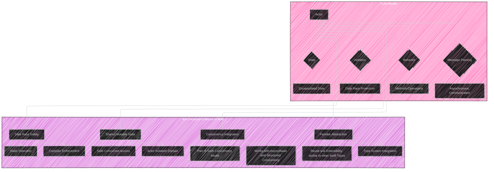
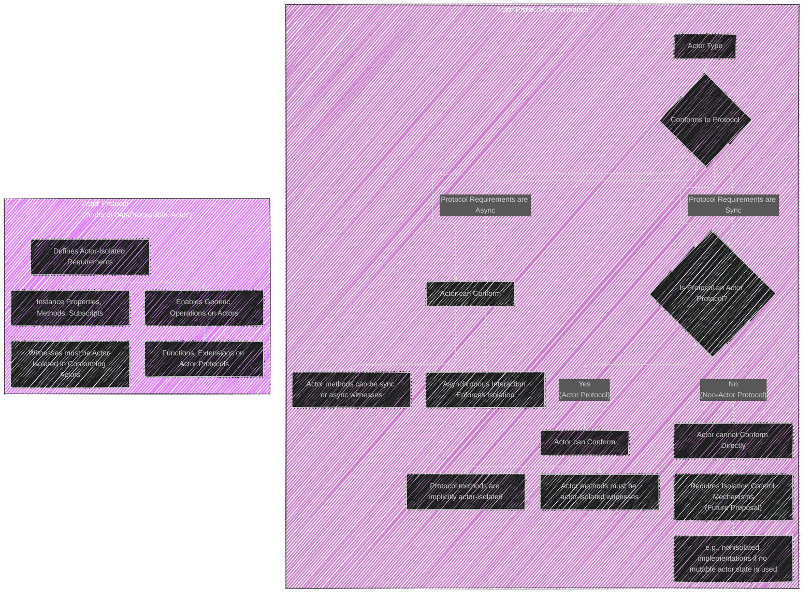
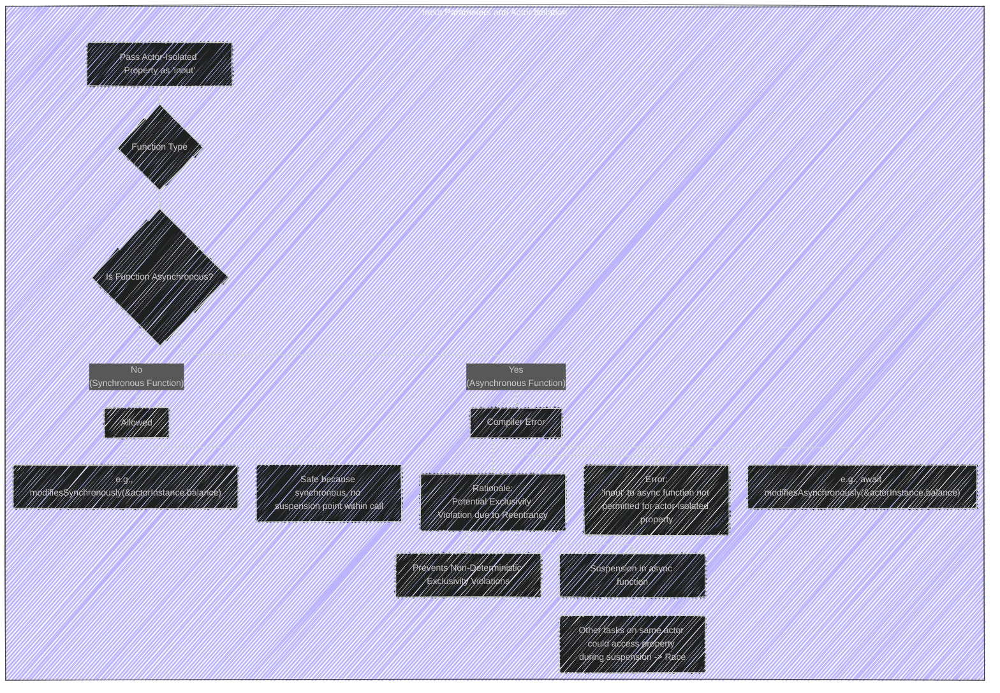

Below is a breakdown of the diagrams I will create, aligning with [the original proposal documentation's structure of Actors in Swift](https://github.com/swiftlang/swift-evolution/blob/main/proposals/0306-actors.md):

These diagrams cover the core technical concepts of the Actors proposal as requested.

I have used a mix of diagram types to effectively represent different aspects: composite diagrams for overviews and related concepts, sequence diagrams to illustrate execution flow and timing, and flowcharts to depict decision-making and conditional logic.

Here's the first set of diagrams covering the foundational concepts:

----

## Diagram 1: Core Concepts of Actors

### Diagram Type: Composite diagram with subgraphs

### Purpose:
To provide a high-level overview of the Actor Model and its key features in Swift.

### Explanation

*   **Actor Model Subgraph:**  Depicts an Actor as an entity composed of State, Behavior, Isolation, and using Message Passing for communication. It highlights the foundational principles of the actor model itself.
    *   **State (Encapsulated Data):** Actors manage their own private data.
    *   **Behavior (Methods/Operations):** Defines operations that can be performed on the actor's state.
    *   **Isolation (Data Race Protection):**  State is protected from concurrent access.
    *   **Message Passing (Asynchronous Communication):** Actors communicate asynchronously through messages.
*   **Key Features Subgraph:** Focuses on Swift-specific features and advantages introduced by actors.
    *   **Data Race Safety:** Achieved through static detection and compiler enforcement.
    *   **Shared Mutable State:** Allows for safe concurrent access to shared mutable state via actor isolation.
    *   **Familiar Abstraction:** Actors are integrated into Swift's type system, providing familiar programming paradigms.
    *   **Concurrency Integration:** Actors are a core part of Swift's broader concurrency model, working seamlessly with `async/await` and structured concurrency.

---

Next, I'll create diagrams to illustrate **Actor Isolation** and **Cross-Actor References**:

## Diagram 2: Actor Isolation and Cross-Actor References

### Diagram Type: Composite diagram with subgraphs

### Purpose:
To visually explain how Actor Isolation works and the rules governing Cross-Actor References.

### Explanation

*   **Actor Isolation Subgraph:** Details what constitutes "isolated state" within an actor and how direct access is restricted.
    *   **Isolated State:**  Includes stored and computed properties, instance methods, and subscripts of an actor instance.
    *   **Direct Access on 'self' (Allowed):** Accessing isolated state directly using `self` within the actor's own methods is permitted.
    *   **External Direct Access (Compiler Error):** Direct access to isolated state from outside the actor scope (i.e., from other actors or non-actor code) is disallowed by the compiler.
*   **Cross-Actor References Subgraph:** Describes the permitted ways to interact with actors from outside their isolation domain.
    *   **Immutable State (let):**
        *   **Same Module:** Synchronous access to `let` properties is allowed within the same module where the actor is defined.
        *   **Different Module:** Asynchronous access (using `await`) is required for `let` properties when accessed from outside the defining module.
    *   **Mutable State (var):** Asynchronous access (using `await`) is always required for mutable state (`var` properties). This uses message passing via the actor's mailbox, ensuring serialized execution within the actor.
    *   **Sendable Types:**  Cross-actor communication (arguments, return types of async calls, and immutable properties accessed cross-actor) *must* involve `Sendable` types to ensure data race safety.

---

Now, let's visualize the concept of **Actor Reentrancy**:

## Diagram 3: Actor Reentrancy - Interleaving Execution

### Diagram Type: Sequence Diagram

### Purpose
To illustrate the concept of reentrancy in actors, specifically how asynchronous actor-isolated functions can interleave at suspension points, potentially leading to unexpected state changes if invariants are broken across `await` calls.

### Explanation

1.  **Client Tasks Initiate Calls:** Two client tasks concurrently call `thinkOfGoodIdea()` and `thinkOfBadIdea()` on the `DecisionMaker` actor.
2.  **Execution Interleaving:** The sequence diagram visually demonstrates how the execution can interleave at `await` points.
    *   Task 1 (`thinkOfGoodIdea`): Sets `opinion` to `.goodIdea` (step `<1>`) and then suspends at `await friend.tell(...)` (step `<2>`).
    *   Task 2 (`thinkOfBadIdea`): Starts executing while Task 1 is suspended.  It sets `opinion` to `.badIdea` (step `<4>`) and suspends at `await friend.tell(...)` (step `<5>`).  This interleaving changes the `opinion` within the actor *before* Task 1 resumes.
3.  **Resumption and Incorrect Result:** When Task 1 resumes (step `<2>`), it proceeds to return `opinion` (step `<3>`). However, because of the interleaving, `opinion` might now be `.badIdea` (set by Task 2), leading to an incorrect result.
4.  **Note on Reentrancy:** A note at the bottom emphasizes the key characteristics of reentrant actors: interleaving at suspension points, maintaining thread safety (no concurrency), but not automatically protecting against higher-level race conditions if invariants are not carefully managed around `await` calls.

---

To contrast reentrancy, I will create a diagram explaining the potential issue with **Non-Reentrant Actors**:

## Diagram 4: Deadlock with Non-Reentrant Actors

### Diagram Type: Sequence Diagram

### Purpose:
To illustrate how non-reentrant actors can lead to deadlocks, especially in scenarios involving cyclic dependencies or callbacks between actors.

### Explanation

1.  **Client Task A Initiates `thinkOfBadIdea()`:** Client Task A calls `thinkOfBadIdea()` on `DecisionMaker Actor A` (which is assumed to be non-reentrant).
2.  **Actor A Calls `tell()` on Actor B:** Actor A sets its `opinion` to `.badIdea` and then calls `await friend.tell(...)` on `DecisionMaker Actor B`. This suspends Task A on Actor A, *but* because Actor A is non-reentrant, it cannot process any other messages during this suspension.
3.  **Actor B Calls Back to Actor A (`convinceOtherwise`)**: Within `tell()`, Actor B checks the opinion and decides to call `await friend.convinceOtherwise(opinion)` on Actor A.  **This is where the deadlock occurs.**
4.  **Deadlock Condition**: The call from Actor B back to Actor A (`convinceOtherwise`) cannot be processed by Actor A because Actor A is non-reentrant and is still blocked waiting for the `tell()` call on Actor B to return.  This creates a cyclic wait condition.
5.  **Client Task B (if exists) is also Blocked:** If another client task (Client Task B) were to attempt to interact with Actor A, it would also be blocked because Actor A is deadlocked and cannot process any new messages.
6.  **Note on Non-Reentrancy and Deadlock:** A note at the bottom summarizes the issue: Non-reentrant actors, while preventing interleaving, introduce the risk of deadlocks when actor interactions lead to cyclic dependencies.

---

Let's move to **Closures and Actor Isolation**:

## Diagram 5: Closures and Actor Isolation

### Diagram Type:s Flowchart

### Purpose:
To clarify how the `@Sendable` attribute affects the isolation context of closures created within actors, and how this impacts their execution and access to actor state.

### Explanation

1.  **Closure Creation Context:** The diagram starts when a closure is created within an actor-isolated context (e.g., inside an actor's method).
2.  **`@Sendable` Check:** The crucial decision point is whether the closure is marked as `@Sendable`.
3.  **`@Sendable` Closure Path:**
    *   **Non-Isolated Closure:** If the closure is `@Sendable`, it becomes non-isolated.
    *   **Concurrent Execution:**  Non-isolated closures can run concurrently with the actor's isolated code. (Example: closures passed to `Task.detached` are required to be `@Sendable` and hence non-isolated).
    *   **`await` Required for Actor Access:** To access actor-isolated state from a non-isolated closure, asynchronous access (`await`) is mandatory.
    *   **Example `Task.detached`:** Illustrates a common scenario where `@Sendable` closures are used, resulting in non-isolated execution.
4.  **Non-`@Sendable` Closure Path:**
    *   **Actor-Isolated Closure:** If the closure is *not* `@Sendable`, it remains actor-isolated to the `self` actor.
    *   **Serial Execution:** Actor-isolated closures run serially, within the actor's single-threaded execution context. (Example: closures passed to `forEach` are non-`@Sendable`).
    *   **Synchronous Actor Access Allowed:** Synchronous access to actor-isolated state (using `self`) is allowed within actor-isolated closures because they are guaranteed to run within the actor’s isolation.
    *   **Example `Array.forEach`:** Shows a case where non-`@Sendable` closures are used, and the closure body remains actor-isolated.

---

Finally, let's visualize the concept of **Protocol Conformance for Actors**:

## Diagram 6: Actor Protocol Conformances

### Diagram Type: Composite diagram with subgraphs.

### Purpose:
To outline the rules and constraints around actors conforming to protocols, differentiating between protocols with asynchronous and synchronous requirements, and highlighting the concept of "Actor Protocols."

### Explanation

*   **Protocol Conformance Decision Tree (Protocol Conformance Subgraph):**
    *   **Async Protocol Requirements:** If a protocol's requirements are `async`, actors *can* always conform. Actor methods can be sync or async to fulfill these requirements. The asynchronous nature of interactions with the protocol ensures actor isolation.
    *   **Sync Protocol Requirements:** If the requirements are synchronous, the next check is: *Is the protocol itself an "Actor Protocol"?*
        *   **Actor Protocol (Yes):** If it's an Actor Protocol (e.g., `protocol MyActorProtocol: Actor`), actors *can* conform. Actor methods fulfilling these requirements *must* be actor-isolated. Methods declared in Actor Protocols are implicitly actor-isolated.
        *   **Non-Actor Protocol (No):** If it's a regular (non-Actor) protocol with synchronous requirements, actors *cannot* directly conform under the base actor model proposal.  Conformance might be possible in the future with "isolation control mechanisms" (like `nonisolated` implementations) *if* the implementation can avoid accessing mutable actor state.
*   **Actor Protocol Details Subgraph:** Explains the special nature of Actor Protocols.
    *   **Actor-Isolated Requirements:** Actor Protocols define requirements (properties, methods, etc.) that are inherently actor-isolated to `self` for any conforming actor.
    *   **Actor-Isolated Witnesses:** When an actor conforms to an Actor Protocol, the methods or properties it provides as witnesses must also be actor-isolated.
    *   **Generic Operations on Actors:** Actor Protocols enable the creation of generic functions and extensions that can operate on any type conforming to that Actor Protocol, facilitating code reuse and abstraction across actors.

---

Let's continue by creating diagrams for the "Detailed Design" section. 

We'll start with **Partial Applications** within the context of actors.

## Diagram 7: Partial Application of Actor-Isolated Functions

### Diagram Type: Flowchart

### Purpose:
To illustrate the restrictions on creating partial applications of actor-isolated functions, particularly in relation to `@Sendable` contexts and parameter types.

### Explanation:

1.  **Actor Instance and Partial Function Application**: The diagram begins when attempting to create a partial application of an actor-isolated function using `self` (an actor instance).
2.  **`@Sendable` Parameter Check:** The key decision point revolves around whether the context where the partial application is used (or the parameter of the function receiving the partial application) requires a `@Sendable` closure.
3.  **Non-`@Sendable` Parameter Path**:
    *   **Direct Argument Allowed:** If the context does *not* require a `@Sendable` closure (or the relevant parameter is non-`Sendable`), then creating a partial application like `self.f` *directly as an argument* is permitted (e.g., in `array.map(self.f)`).
    *   **Example `array.map(self.f)`:**  Illustrates a valid use case because `map`'s closure is not inherently required to be `@Sendable` in this context.
4.  **`@Sendable` Parameter/Context Path**:
    *   **Partial Application Not Allowed (Error):** If the context *does* require a `@Sendable` closure (e.g., `Task.detached`, `runLater`, or a parameter explicitly typed as `@Sendable`), then creating a partial application like `self.g` directly results in a compiler error.
    *   **Examples `Task.detached(operation: self.g)` and `runLater(self.g)`:**  Show invalid scenarios.  `Task.detached` and `runLater` both expect a `@Sendable` closure.  `self.g` on its own, representing the actor-isolated function, cannot be directly converted to a `@Sendable` function type because it implicitly captures `self` which is not `@Sendable` in this context.
    *   **Solution: Closure Form Required:**  To correctly use actor-isolated functions in `@Sendable` contexts, you must wrap the call within a closure: `Task.detached { await self.g() }`. This creates a `@Sendable` closure that *asynchronously* invokes the actor-isolated function, respecting actor isolation rules.

---

Next, let's visualize the restriction on **Key Paths** and actor-isolated declarations.

## Diagram 8: Key Paths and Actor Isolation

### Diagram Type: Flowchart

### Purpose:
To explain why key paths cannot directly reference actor-isolated declarations and the rationale behind this restriction.

### Explanation

1.  **Attempt to Create Key Path:** The process begins with an attempt to create a key path.
2.  **Actor-Isolated Declaration Check:** The compiler checks if the key path attempts to reference an actor-isolated declaration (like an actor's stored property or subscript).
3.  **Actor-Isolated Reference (Compiler Error):** If the key path *does* reference an actor-isolated declaration, a compiler error is generated.
    *   **Example `let kp = \ActorType.actorIsolatedProperty`:** Shows an invalid key path creation.
    *   **Rationale: Breaks Actor Isolation:**  The core reason for this restriction is that key paths, once created, can be used from *anywhere* in the code, including outside the actor's isolation domain. Allowing key paths to actor-isolated state would therefore permit unrestricted, synchronous access to the protected state, directly violating actor isolation and potentially leading to data races.
4.  **Non-Actor-Isolated Reference (Key Path Creation Allowed):** If the key path references a *non*-actor-isolated declaration (e.g., a static property on an actor, or a property on a regular class or struct), key path creation is allowed without error.

---

Now let's visualize the rules for **`inout` parameters** and actor-isolated properties.

## Diagram 9: `inout` Parameters and Actor Isolation

### Diagram Type: Flowchart

### Purpose:
To explain why passing actor-isolated properties as `inout` parameters to asynchronous functions is disallowed, while it is permitted for synchronous functions, and the reason relates to potential exclusivity violations and actor reentrancy.

### Explanation

1.  **Passing Actor-Isolated Property as `inout`**: The diagram starts when an attempt is made to pass an actor-isolated stored property as an `inout` parameter to a function.
2.  **Function Asynchronicity Check**: The key distinction is whether the function receiving the `inout` parameter is synchronous or asynchronous.
3.  **Synchronous Function Path (Allowed)**: If the function is synchronous, passing the actor-isolated property as `inout` is *allowed*.
    *   **Example `modifiesSynchronously(&actorInstance.balance)`:**  Illustrates a valid `inout` usage.
    *   **Safe because Synchronous:** The operation is safe because synchronous functions execute atomically without suspension points within the call. There's no chance for another task on the same actor to interleave and cause a data race or exclusivity violation during the synchronous function's execution.
4.  **Asynchronous Function Path (Compiler Error)**: If the function is asynchronous, passing an actor-isolated property as `inout` results in a *compiler error*.
    *   **Example `await modifiesAsynchronously(&actorInstance.balance)`:** Shows the disallowed `inout` usage.
    *   **Rationale: Exclusivity Violation Risk:** The error exists to prevent potential exclusivity violations, which are a type of data race that can occur due to actor reentrancy.
        *   **Suspension Point:** Asynchronous functions have suspension points (the `await` in the example function itself is a suspension point, but also within `modifiesAsynchronously` there might be awaits).
        *   **Reentrancy and Concurrent Access During Suspension:**  Because actors are reentrant, when `modifiesAsynchronously` suspends, other tasks *on the same actor* *could* potentially start running. If another task tries to access the same actor-isolated `balance` property while it's passed `inout` and potentially being modified by `modifiesAsynchronously` (even though suspended), this can create an exclusivity violation (runtime error) and non-deterministic behavior.
        *   **Preventing Non-Deterministic Errors:**  The compiler prevents this by disallowing `inout` for actor-isolated properties in asynchronous function contexts, thus eliminating a class of potential runtime errors that would be hard to debug and diagnose due to their non-deterministic nature.

---

Finally for "Detailed Design", let's represent **Actor Interoperability with Objective-C**.

## Diagram 10: Actor Interoperability with Objective-C

### Diagram Type: Flowchart

### Purpose:
To illustrate how Swift actors can interoperate with Objective-C (`@objc` actors) and the restrictions on exposing actor members to Objective-C based on their isolation and synchronicity.

### Explanation

1.  **`@objc` Actor Declaration**:  When an actor type is declared with the `@objc` attribute, it automatically conforms to `NSObjectProtocol`.
2.  **Objective-C Compatibility**: This `@objc` declaration enables the actor type to be used within Objective-C code, bridging the Swift concurrency model to the older Objective-C runtime.
3.  **`@objc` Actor Member Declaration:** When actor *members* (methods, properties) are declared with `@objc`, restrictions apply based on their actor isolation and synchronicity.
4.  **`@objc` and `async` Members (Allowed):**  `async` actor members can be `@objc`.
    *   **Completion Handler Bridging:**  `async` Swift methods are bridged to Objective-C as methods that use completion handlers (callbacks), as Objective-C does not have direct support for `async/await`.
5.  **`@objc` and `nonisolated` Members (Allowed):** `nonisolated` actor members can also be `@objc`.
    *   **Outside Isolation Domain:** `nonisolated` members, by definition, are *outside* the actor's isolation domain. Therefore, they are safe to expose to Objective-C because they don't directly interact with the actor's protected state in a synchronous, isolated way.
6.  **`@objc` and Synchronous, Actor-Isolated Members (NOT Allowed - Compiler Error):**  Synchronous, actor-isolated members *cannot* be declared `@objc`.
    *   **Example `@objc func synchronousActorIsolated() { ... }`:** This produces a compiler error.
    *   **Obj-C's Lack of Actor Isolation Awareness:** Objective-C and its runtime have no knowledge of Swift's actor isolation mechanisms.
    *   **Unsafe Exposure:** Exposing synchronous, actor-isolated code directly to Objective-C would be unsafe. Objective-C code could call these methods without respecting actor isolation, potentially leading to data races.
    *   **Swift's `self` Isolation Focus:** Synchronous actor-isolated code is intended to be called *only* on `self` (within Swift actor methods) to maintain the isolation guarantees. Objective-C calls from outside would violate this.

---
