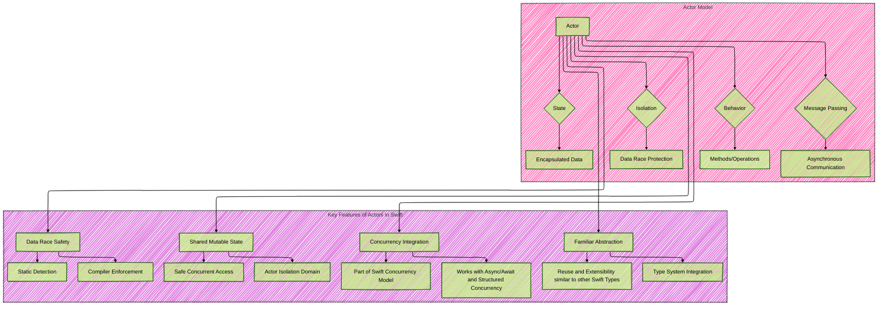
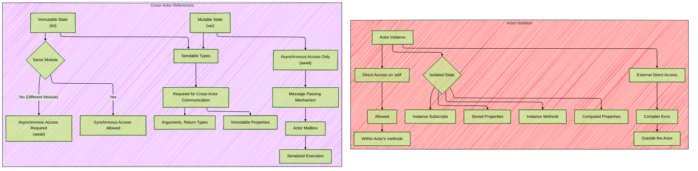
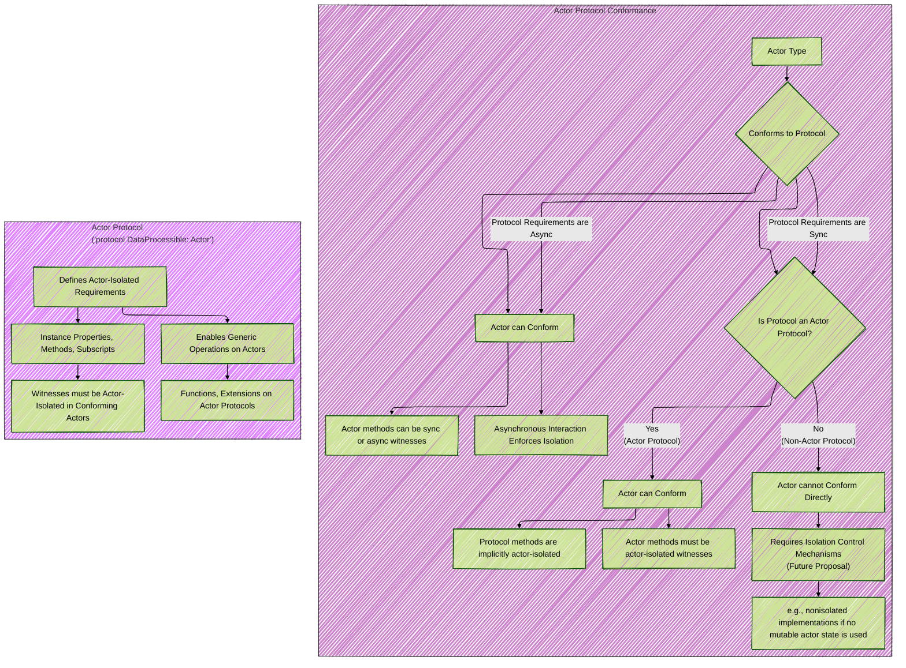

Below is a breakdown of the diagrams I will create, aligning with [the original proposal documentation's structure of Actors in Swift](https://github.com/swiftlang/swift-evolution/blob/main/proposals/0306-actors.md):

These diagrams cover the core technical concepts of the Actors proposal as requested.

I have used a mix of diagram types to effectively represent different aspects: composite diagrams for overviews and related concepts, sequence diagrams to illustrate execution flow and timing, and flowcharts to depict decision-making and conditional logic.

Here's the first set of diagrams covering the foundational concepts:

----

## Diagram 1: Core Concepts of Actors

### Diagram Type: Composite diagram with subgraphs

### Purpose:
To provide a high-level overview of the Actor Model and its key features in Swift.

### Explanation

*   **Actor Model Subgraph:**  Depicts an Actor as an entity composed of State, Behavior, Isolation, and using Message Passing for communication. It highlights the foundational principles of the actor model itself.
    *   **State (Encapsulated Data):** Actors manage their own private data.
    *   **Behavior (Methods/Operations):** Defines operations that can be performed on the actor's state.
    *   **Isolation (Data Race Protection):**  State is protected from concurrent access.
    *   **Message Passing (Asynchronous Communication):** Actors communicate asynchronously through messages.
*   **Key Features Subgraph:** Focuses on Swift-specific features and advantages introduced by actors.
    *   **Data Race Safety:** Achieved through static detection and compiler enforcement.
    *   **Shared Mutable State:** Allows for safe concurrent access to shared mutable state via actor isolation.
    *   **Familiar Abstraction:** Actors are integrated into Swift's type system, providing familiar programming paradigms.
    *   **Concurrency Integration:** Actors are a core part of Swift's broader concurrency model, working seamlessly with `async/await` and structured concurrency.

---

Next, I'll create diagrams to illustrate **Actor Isolation** and **Cross-Actor References**:

## Diagram 2: Actor Isolation and Cross-Actor References

### Diagram Type: Composite diagram with subgraphs

### Purpose:
To visually explain how Actor Isolation works and the rules governing Cross-Actor References.

### Explanation

*   **Actor Isolation Subgraph:** Details what constitutes "isolated state" within an actor and how direct access is restricted.
    *   **Isolated State:**  Includes stored and computed properties, instance methods, and subscripts of an actor instance.
    *   **Direct Access on 'self' (Allowed):** Accessing isolated state directly using `self` within the actor's own methods is permitted.
    *   **External Direct Access (Compiler Error):** Direct access to isolated state from outside the actor scope (i.e., from other actors or non-actor code) is disallowed by the compiler.
*   **Cross-Actor References Subgraph:** Describes the permitted ways to interact with actors from outside their isolation domain.
    *   **Immutable State (let):**
        *   **Same Module:** Synchronous access to `let` properties is allowed within the same module where the actor is defined.
        *   **Different Module:** Asynchronous access (using `await`) is required for `let` properties when accessed from outside the defining module.
    *   **Mutable State (var):** Asynchronous access (using `await`) is always required for mutable state (`var` properties). This uses message passing via the actor's mailbox, ensuring serialized execution within the actor.
    *   **Sendable Types:**  Cross-actor communication (arguments, return types of async calls, and immutable properties accessed cross-actor) *must* involve `Sendable` types to ensure data race safety.

---

Now, let's visualize the concept of **Actor Reentrancy**:

## Diagram 3: Actor Reentrancy - Interleaving Execution

### Diagram Type: Sequence Diagram

### Purpose
To illustrate the concept of reentrancy in actors, specifically how asynchronous actor-isolated functions can interleave at suspension points, potentially leading to unexpected state changes if invariants are broken across `await` calls.

### Explanation

1.  **Client Tasks Initiate Calls:** Two client tasks concurrently call `thinkOfGoodIdea()` and `thinkOfBadIdea()` on the `DecisionMaker` actor.
2.  **Execution Interleaving:** The sequence diagram visually demonstrates how the execution can interleave at `await` points.
    *   Task 1 (`thinkOfGoodIdea`): Sets `opinion` to `.goodIdea` (step `<1>`) and then suspends at `await friend.tell(...)` (step `<2>`).
    *   Task 2 (`thinkOfBadIdea`): Starts executing while Task 1 is suspended.  It sets `opinion` to `.badIdea` (step `<4>`) and suspends at `await friend.tell(...)` (step `<5>`).  This interleaving changes the `opinion` within the actor *before* Task 1 resumes.
3.  **Resumption and Incorrect Result:** When Task 1 resumes (step `<2>`), it proceeds to return `opinion` (step `<3>`). However, because of the interleaving, `opinion` might now be `.badIdea` (set by Task 2), leading to an incorrect result.
4.  **Note on Reentrancy:** A note at the bottom emphasizes the key characteristics of reentrant actors: interleaving at suspension points, maintaining thread safety (no concurrency), but not automatically protecting against higher-level race conditions if invariants are not carefully managed around `await` calls.

---

To contrast reentrancy, I will create a diagram explaining the potential issue with **Non-Reentrant Actors**:

## Diagram 4: Deadlock with Non-Reentrant Actors

### Diagram Type: Sequence Diagram

### Purpose:
To illustrate how non-reentrant actors can lead to deadlocks, especially in scenarios involving cyclic dependencies or callbacks between actors.

### Explanation

1.  **Client Task A Initiates `thinkOfBadIdea()`:** Client Task A calls `thinkOfBadIdea()` on `DecisionMaker Actor A` (which is assumed to be non-reentrant).
2.  **Actor A Calls `tell()` on Actor B:** Actor A sets its `opinion` to `.badIdea` and then calls `await friend.tell(...)` on `DecisionMaker Actor B`. This suspends Task A on Actor A, *but* because Actor A is non-reentrant, it cannot process any other messages during this suspension.
3.  **Actor B Calls Back to Actor A (`convinceOtherwise`)**: Within `tell()`, Actor B checks the opinion and decides to call `await friend.convinceOtherwise(opinion)` on Actor A.  **This is where the deadlock occurs.**
4.  **Deadlock Condition**: The call from Actor B back to Actor A (`convinceOtherwise`) cannot be processed by Actor A because Actor A is non-reentrant and is still blocked waiting for the `tell()` call on Actor B to return.  This creates a cyclic wait condition.
5.  **Client Task B (if exists) is also Blocked:** If another client task (Client Task B) were to attempt to interact with Actor A, it would also be blocked because Actor A is deadlocked and cannot process any new messages.
6.  **Note on Non-Reentrancy and Deadlock:** A note at the bottom summarizes the issue: Non-reentrant actors, while preventing interleaving, introduce the risk of deadlocks when actor interactions lead to cyclic dependencies.

---

Let's move to **Closures and Actor Isolation**:

## Diagram 5: Closures and Actor Isolation

### Diagram Type:s Flowchart

### Purpose:
To clarify how the `@Sendable` attribute affects the isolation context of closures created within actors, and how this impacts their execution and access to actor state.

```mermaid
---
config:
  layout: elk
  look: handDrawn
  theme: forest
---
graph TD
    A["Closure Created in Actor-Isolated Context"];
    B{"Is Closure &#64;Sendable?"};
    C["Non-Isolated Closure"];
    D["Runs Concurrently"];
    E["Requires 'await' for Actor Access"];
    F["Example:<br>Task.detached { ... }"];

    G["Actor-Isolated Closure"];
    H["Runs Serially within Actor"];
    I["Synchronous Actor Access (on 'self') Allowed"];
    J["Example:<br>Array.forEach { ... }"];


    subgraph Closure_in_Actor["Closures within Actors"]
    style Closure_in_Actor fill:#a3f3,stroke:#333,stroke-width:1px

        A --> B

        B -- Yes<br>(&#64;Sendable Closure) --> C
        C --> D
        C --> E
        C --> F

        B -- No<br>(Non-&#64;Sendable Closure) --> G
        G --> H
        G --> I
        G --> J
    end
    
```

### Explanation

1.  **Closure Creation Context:** The diagram starts when a closure is created within an actor-isolated context (e.g., inside an actor's method).
2.  **`@Sendable` Check:** The crucial decision point is whether the closure is marked as `@Sendable`.
3.  **`@Sendable` Closure Path:**
    *   **Non-Isolated Closure:** If the closure is `@Sendable`, it becomes non-isolated.
    *   **Concurrent Execution:**  Non-isolated closures can run concurrently with the actor's isolated code. (Example: closures passed to `Task.detached` are required to be `@Sendable` and hence non-isolated).
    *   **`await` Required for Actor Access:** To access actor-isolated state from a non-isolated closure, asynchronous access (`await`) is mandatory.
    *   **Example `Task.detached`:** Illustrates a common scenario where `@Sendable` closures are used, resulting in non-isolated execution.
4.  **Non-`@Sendable` Closure Path:**
    *   **Actor-Isolated Closure:** If the closure is *not* `@Sendable`, it remains actor-isolated to the `self` actor.
    *   **Serial Execution:** Actor-isolated closures run serially, within the actor's single-threaded execution context. (Example: closures passed to `forEach` are non-`@Sendable`).
    *   **Synchronous Actor Access Allowed:** Synchronous access to actor-isolated state (using `self`) is allowed within actor-isolated closures because they are guaranteed to run within the actor’s isolation.
    *   **Example `Array.forEach`:** Shows a case where non-`@Sendable` closures are used, and the closure body remains actor-isolated.

---

Finally, let's visualize the concept of **Protocol Conformance for Actors**:

## Diagram 6: Actor Protocol Conformances

### Diagram Type: Composite diagram with subgraphs.

### Purpose:
To outline the rules and constraints around actors conforming to protocols, differentiating between protocols with asynchronous and synchronous requirements, and highlighting the concept of "Actor Protocols."

### Explanation

*   **Protocol Conformance Decision Tree (Protocol Conformance Subgraph):**
    *   **Async Protocol Requirements:** If a protocol's requirements are `async`, actors *can* always conform. Actor methods can be sync or async to fulfill these requirements. The asynchronous nature of interactions with the protocol ensures actor isolation.
    *   **Sync Protocol Requirements:** If the requirements are synchronous, the next check is: *Is the protocol itself an "Actor Protocol"?*
        *   **Actor Protocol (Yes):** If it's an Actor Protocol (e.g., `protocol MyActorProtocol: Actor`), actors *can* conform. Actor methods fulfilling these requirements *must* be actor-isolated. Methods declared in Actor Protocols are implicitly actor-isolated.
        *   **Non-Actor Protocol (No):** If it's a regular (non-Actor) protocol with synchronous requirements, actors *cannot* directly conform under the base actor model proposal.  Conformance might be possible in the future with "isolation control mechanisms" (like `nonisolated` implementations) *if* the implementation can avoid accessing mutable actor state.
*   **Actor Protocol Details Subgraph:** Explains the special nature of Actor Protocols.
    *   **Actor-Isolated Requirements:** Actor Protocols define requirements (properties, methods, etc.) that are inherently actor-isolated to `self` for any conforming actor.
    *   **Actor-Isolated Witnesses:** When an actor conforms to an Actor Protocol, the methods or properties it provides as witnesses must also be actor-isolated.
    *   **Generic Operations on Actors:** Actor Protocols enable the creation of generic functions and extensions that can operate on any type conforming to that Actor Protocol, facilitating code reuse and abstraction across actors.

---
