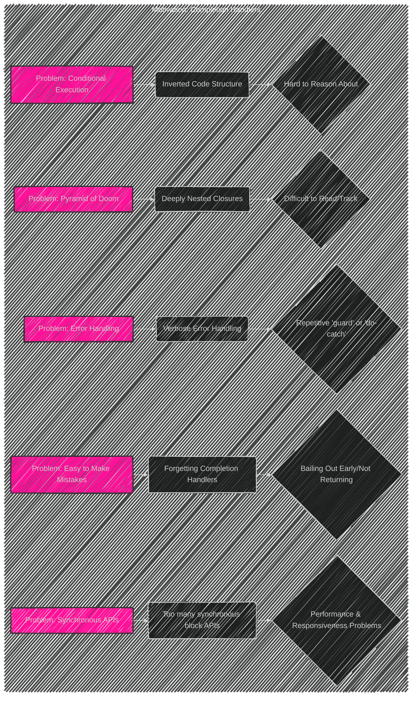
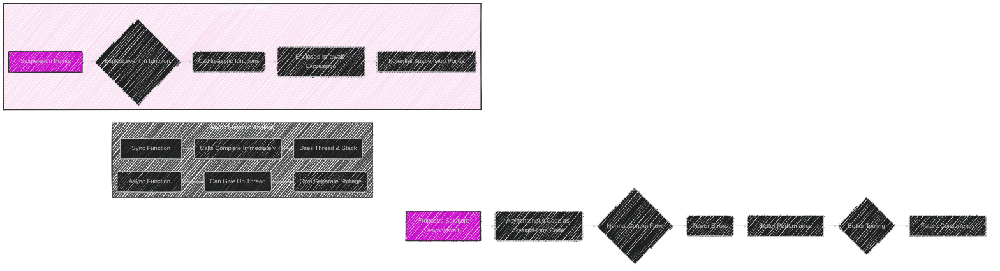
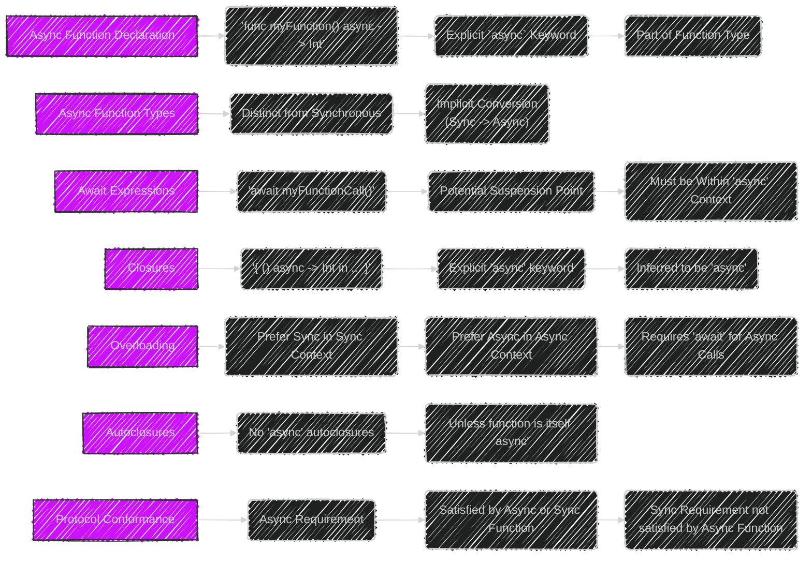
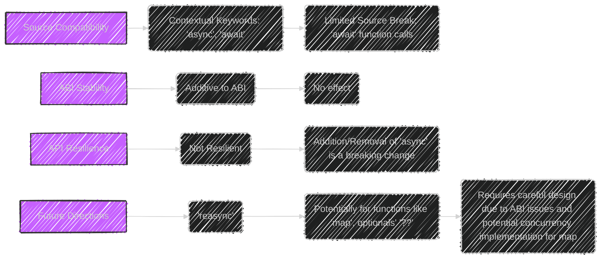
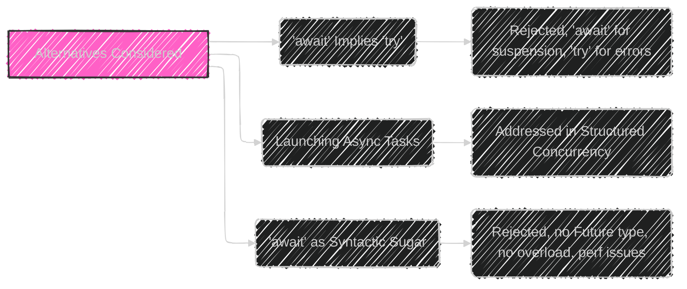

> This content is dual-licensed under your choice of the following licenses:
> 1.  **MIT License:** For the code implementations in Swift and Mermaid provided in this document.
> 2.  **Creative Commons Attribution 4.0 International License (CC BY 4.0):** For all other content, including the text, explanations, and the Mermaid diagrams and illustrations.

---

Below is a breakdown of the diagrams I will create, aligning with [the original proposal documentation's structure of Async/Await in Swift](https://github.com/swiftlang/swift-evolution/blob/main/proposals/0296-async-await.md):

It's a comprehensive explanation of the feature, its motivations, and its implications.

---

# Diagram 1: Problems with Completion Handlers

This diagram explains issues with completion handlers, setting the stage for the introduction of `async/await`.

---

# Diagram 2: Async/await Solution

This diagram explains how `async/await` solves the problems and simplifies asynchronous code.

# Diagram 3: Detailed Design

This diagram explains technical details about asynchronous functions: their declarations, types, `await` expressions, closures, overloading, autoclosures, and protocol conformance.

---

---

# Diagram 4: Compatibility & Future
This diagram explains source and ABI compatibility, API resilience, and the potential future direction of `reasync`.

---

# Diagram 5: Alternatives
This diagram explains the alternatives that were considered and the reasons for rejection.

---

# Summary

**Key Concepts Illustrated:**

*   **Problems with Completion Handlers:** The "pyramid of doom," error handling challenges, conditional execution complexity, easy mistakes, and the prevalence of synchronous APIs.
*   **Async/await as a solution:**  How it simplifies async code, enabling straight-line coding with normal control flow, better performance and tooling, and a foundation for concurrency.
*   **Core Features:** Async functions, suspension points, await expressions, async closures , overloading, `reasync`, and protocol conformance.
* **ABI & API effects:** No ABI impact and the API resilience impacts.
*   **Alternatives:** The rationale behind not making `await` imply `try`, and the rejection of a syntactic sugar approach to async/await.

---
**Licenses:**

- **MIT License:**   - Full text in [LICENSE](LICENSE) file.
- **Creative Commons Attribution 4.0 International:**  - Legal details in [LICENSE-CC-BY](LICENSE-CC-BY) and at [Creative Commons official site](http://creativecommons.org/licenses/by/4.0/).

---