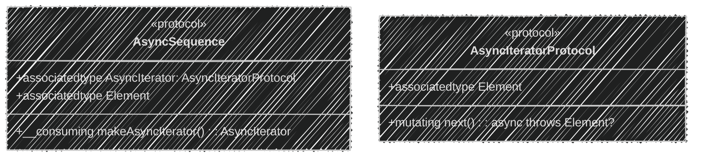
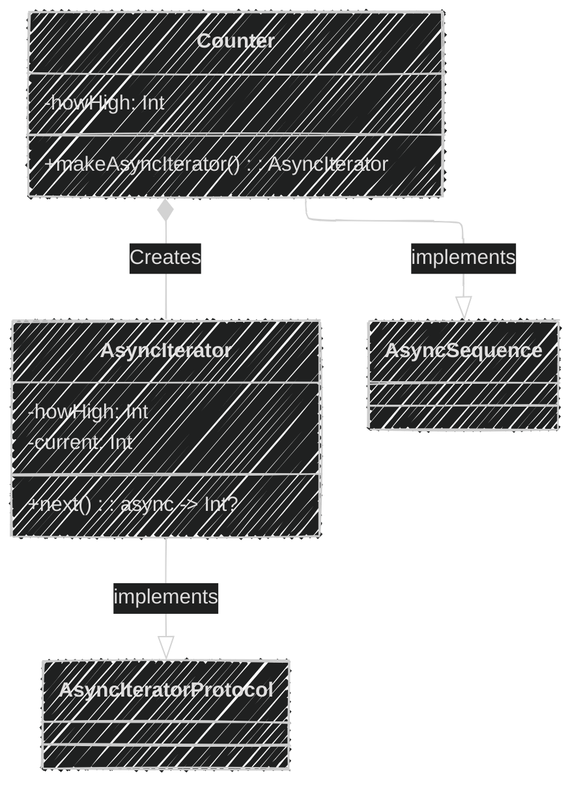
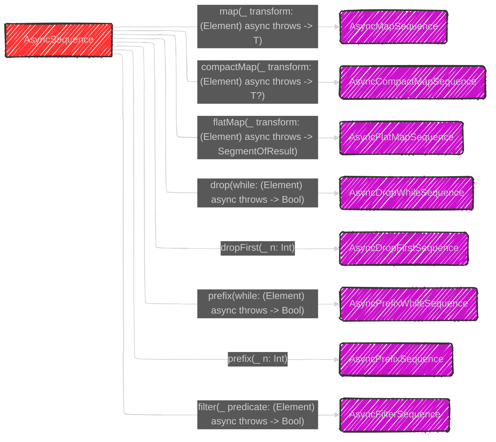

> This content is dual-licensed under your choice of the following licenses:
> 1.  **MIT License:** For the code implementations in Swift and Mermaid provided in this document.
> 2.  **Creative Commons Attribution 4.0 International License (CC BY 4.0):** For all other content, including the text, explanations, and the Mermaid diagrams and illustrations.

---


Below is a breakdown of the diagrams I will create, aligning with [the original proposal documentation's structure of Async Sequence in Swift](https://github.com/swiftlang/swift-evolution/blob/main/proposals/0298-asyncsequence.md):

---


# Diagram 1: AsyncSequence and AsyncIteratorProtocol

This diagram illustrates the relationship between the two core protocols:




**Explanation:**

*   `AsyncSequence` is the protocol representing an asynchronous sequence of values.
    *   It has an associated type `Element`, which is the type of the value being produced.
    *   It has an associated type `AsyncIterator` conforming to `AsyncIteratorProtocol`.
    *   `makeAsyncIterator()` is a method that returns a new instance of the iterator.
*   `AsyncIteratorProtocol` defines how to iterate over the sequence.
    *   It also has an associated type `Element`, which is the same as that of the corresponding `AsyncSequence`.
    *   `next()` is a mutating function that asynchronously retrieves the next optional value. Returning `nil` indicates the end of the sequence.

---


# Diagram 2: `for await in` Loop Mechanics

This diagram shows how the compiler transforms a `for await in` loop into lower-level code using protocols:

## FIXME: Fix the diagram syntax for this case

```mermaid
sequenceDiagram
  participant Code as Source Code
  participant A as AsyncSequence
  participant I as AsyncIterator
  participant Loop as Loop Body
    Code->>A: myAsyncSeq()
    activate A
    A->>I: makeAsyncIterator()
    deactivate A
    activate I
    loop
      I->>I: next()
      activate I
      I-->>Loop: Element?
      deactivate I
      Loop->>Loop: Check Element
      alt Element != nil
         Loop->>Loop: Use Element
      else Element == nil
        Loop->>Loop: break
      end
    end
    deactivate I
```

**Explanation:**

1.  The source code calls `myAsyncSeq()`, which returns the AsyncSequence instance.
2.  The compiler calls `makeAsyncIterator()` on the `AsyncSequence` to create an iterator.
3.  The loop begins, repeatedly calling `next()` on the iterator.
4.  The async function `next()` yields a value if available, and null if not, which is processed by the loop body based on the current element or ends the loop.
5.  The loop continues until `next()` returns `nil`.

---


# Diagram 3: Example `Counter` Implementation

This diagram illustrates the basic implementation of the `Counter` example, highlighting the structure of an AsyncSequence and AsyncIterator:




**Explanation:**

*   `Counter` conforms to `AsyncSequence` and holds the limit of the count (`howHigh`).
*   It has an inner struct `AsyncIterator` conforming to `AsyncIteratorProtocol` maintaining `current` and `howHigh`.
    *   The `next()` method increments `current` and returns it until `current` is greater than `howHigh`.

---

# Diagram 4. AsyncSequence Functions - To Single Value

This diagram showcases functions that reduce an AsyncSequence to a single value:


**Explanation:**
*   The diagram shows various functions that consume an `AsyncSequence` and return a single value.  Each function is represented with the syntax that it is written in Swift and its corresponding final value that is being returned.
* Each function operates asynchronously, indicated by `async rethrows` (not displayed for simplicity purpose), to perform its task.
* `contains`, `allSatisfy`, `first`, `min`, `max`, `reduce`, and other functions in the list reduce the `AsyncSequence` into a single value with specific conditions such as closure or equatable.

---


# Diagram 5: AsyncSequence Functions - To AsyncSequence

This diagram illustrates functions that transform an `AsyncSequence` into a new `AsyncSequence`:



**Explanation:**
*   Each function transforms the incoming `AsyncSequence` in some way and returns a new `AsyncSequence`. All these are performed as the elements of the sequences are being requested through iteration so they are not eagerly executed.
*   Types like `AsyncMapSequence`, `AsyncCompactMapSequence`, and `AsyncFilterSequence` are the concrete types for each function.
*  `map` transforms each element of the source sequence using an async closure, `compactMap` provides the same functionality and remove optionals at the same time .
* `filter` selectively yields elements from the source sequence based on a boolean-returning closure.
* `flatMap` flattens async sequences elements into new collection of the elements of the resulted `AsyncSequence`, `drop` returns the remaining elements after the given `n` or condition, `prefix` does the same but from the begining of the sequence.

---


# Diagram 6: Cancellation Handling

This sequence diagram details how cancellation should be handled in an `AsyncIteratorProtocol`:


**Explanation:**

1.  The `AsyncIteratorProtocol`'s `next()` method checks for cancellation using the `Task` API (part of Swift's structured concurrency).
2.  If the task is cancelled, the iterator performs any needed cleanup tasks as part of the existing async/await task management mechanism.
3.  The iterator returns `nil` to indicate the sequence has ended or throws a `CancellationError`.
4. If the task is not cancelled, iterator continues its process as usual.
5. A class-based iterator could also perform additional cleanup in its `deinit`.

**Summary**

These diagrams collectively illustrate how `AsyncSequence` and `AsyncIteratorProtocol` work together, how `for await in` works under the hood, and how the standard library extends these protocols. They help visualize the concepts of asynchronous sequences in Swift, making the complexities easier to understand. The new functions for transforming, reducing, compacting and manipulating `AsyncSequence`s makes the code concise, easy to read, and very familiar to the users with synchronous `Sequence` protocol.

---
