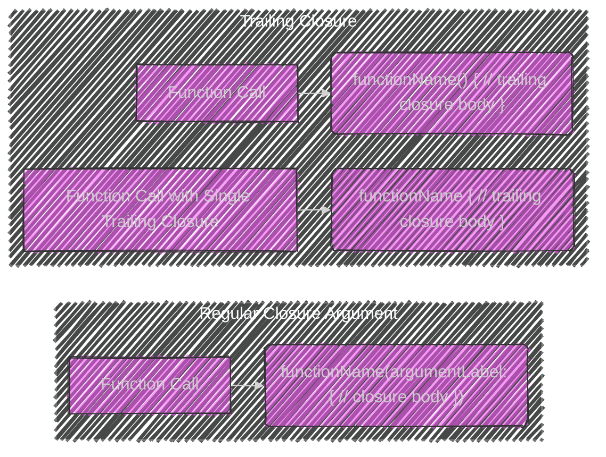
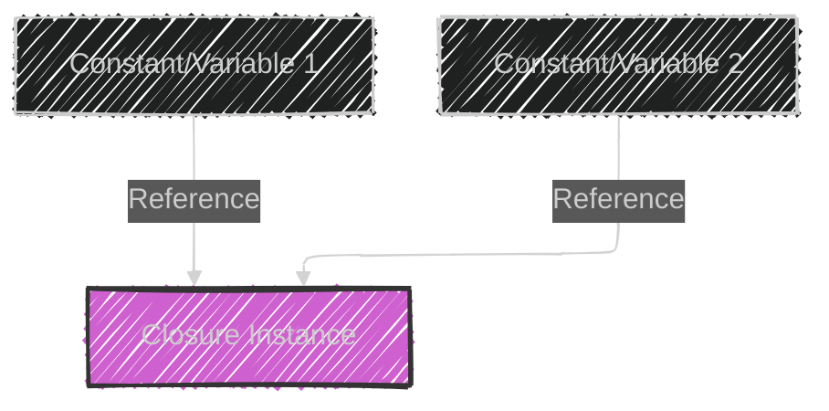
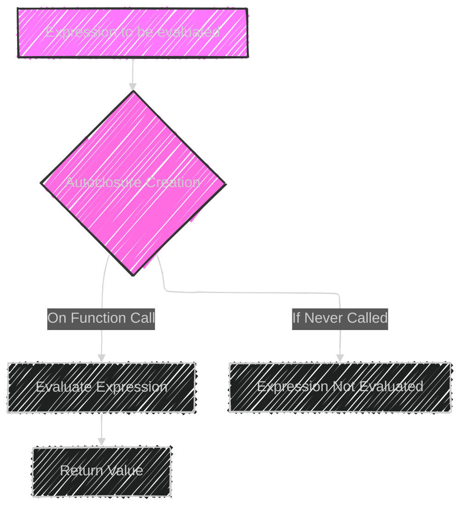

> This content is dual-licensed under your choice of the following licenses:
> 1.  **MIT License:** For the code implementations in Swift and Mermaid provided in this document.
> 2.  **Creative Commons Attribution 4.0 International License (CC BY 4.0):** For all other content, including the text, explanations, and the Mermaid diagrams and illustrations.

---

Below is a breakdown of the diagrams I will create, aligning with [the original documentation](https://github.com/swiftlang/swift-book/blob/main/TSPL.docc/LanguageGuide/Closures.md):

---

Here's a plan:

1. **Basic Closure Structure:** A simple graph or flowchart illustrating the basic syntax of a closure expression.
2. **Closure Types:** A mindmap or tree diagram showing the three forms of closures (global, nested, closure expressions).
3. **`sorted(by:)` Example:** A sequence diagram or flowchart demonstrating how the `sorted(by:)` method works with different closure syntaxes. This could involve expanding steps from verbose to shorthand syntax.
4. **Trailing Closures:** A diagram illustrating the syntax difference between a regular closure argument and a trailing closure.
5. **Capturing Values:** A diagram showing how a nested function captures values from its enclosing function's scope.
6. **Reference Types:** A depiction of how multiple variables can refer to the same closure (reference type behavior).
7. **Escaping Closures:** A diagram showcasing the concept of a closure escaping a function's scope and being called later.
8. **Autoclosures:** A flowchart explaining how an autoclosure delays evaluation of an expression.

Let's start creating the diagrams based on these points.

---

---

---

---

---

---

---

---

