> This content is dual-licensed under your choice of the following licenses:
> 1.  **MIT License:** For the code implementations in Swift and Mermaid provided in this document.
> 2.  **Creative Commons Attribution 4.0 International License (CC BY 4.0):** For all other content, including the text, explanations, and the Mermaid diagrams and illustrations.

---


Below is a breakdown of the diagrams I will create, aligning with [the original proposal documentation about concurrency interoperability with Objective-C](https://github.com/swiftlang/swift-evolution/blob/main/proposals/0297-concurrency-objc.md):

---


# Part 1: Overview & Core Concepts

First, let's visualize the high level relationship between Swift Concurrency and Objective-C Asynchronous APIs.

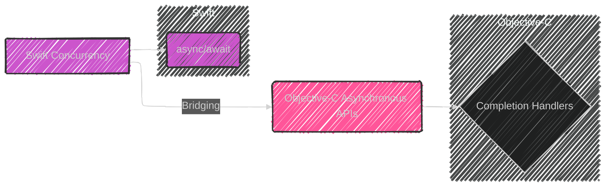

**Explanation:**

*   **Swift Concurrency:**  Represents Swift's modern approach to handling asynchronous tasks, primarily using `async/await`.
*   **Objective-C Asynchronous APIs:**  Highlights the traditional way of handling asynchronous operations in Objective-C, which relies heavily on completion handlers (blocks).
*   **Bridging:**  Indicates the core of this proposal: enabling seamless interaction between these two worlds.
*   **Completion Handlers:**  A callback function (block) that is executed when an asynchronous task completes, delivering the result or error.
*   **`async`/`await`:**  The keywords that define asynchronous functions in Swift, making asynchronous code look like synchronous code. This is how it interact with Objective-C's completion-handler model.

---


## Overall Structure

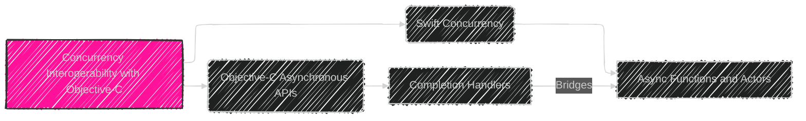

This diagram provides a high-level overview: shows that the core objective of the documentation is to act as a bridge between ObjC's async APIs using completion handlers and the Swift concurrency model which is based on async/await and actors.


# Overall Structure

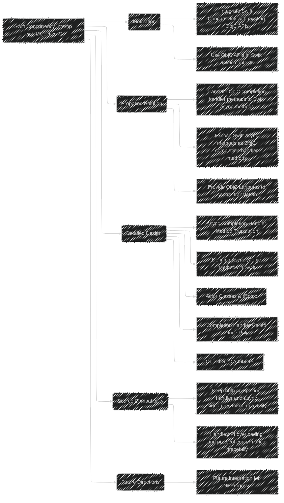


----


## Objective-C Asynchronous APIs and Completion Handlers

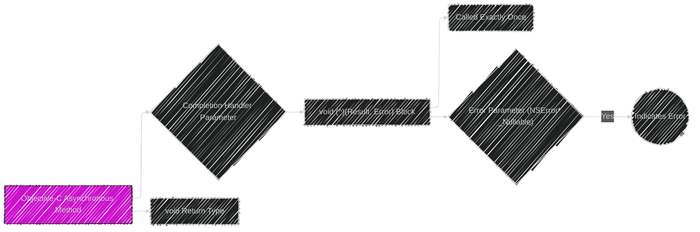

This diagram illustrates the characteristics of Objective-C methods that are considered asynchronous and use completion handler pattern.
    - The key is a 'completion handler', a block that will be executed when the async operation is done, using a `void` return type and has parameters for async results and an optional error.
    - This block/closure has to be called exactly once. 

---


# Part 2: Detailed Design - Method Translation

Now let's illustrate how the mapping of Objective-C method to `async` Swift methods will be done in code level.

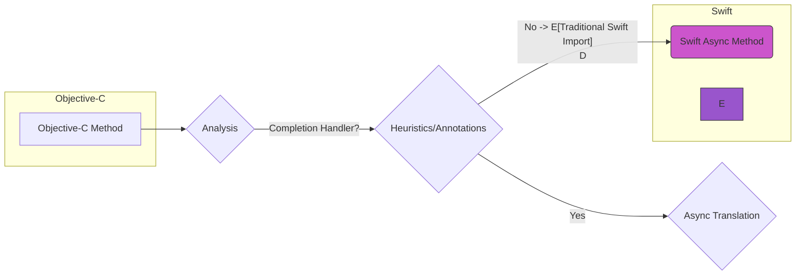

**Explanation:**

*   **Objective-C Method:** The starting point – a method in Objective-C that potentially uses a completion handler for asynchronous results.
*   **Analysis:** Checks if a method has a completion handler
*   **Heuristics/Annotations:**  Determines whether a method is indeed asynchronous by looking at matching suffixes or specified attributes
*   **Async Translation:** If a method is identified as asynchronous the translation logic will try to make it into a Swift Async Method
*  **Traditional Swift Import:** If a method is not considered `async` it will be imported into Swift the old way
*   **Swift `async` Method:** The resulting `async` method in Swift after successful translation.

Now here are the rules visualized:

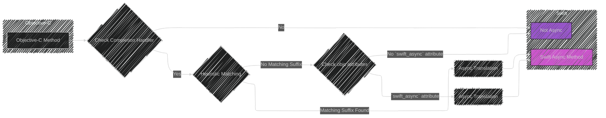


**Explanation:**

* **Completion Handler Check:** If no completion handler, then it will be a traditional method
*  **Heuristic Check:** Determine if the last parameter's name matches any of those keywords
*   **Matching Suffix Found:** If the keywords match, then it goes for async translation.
*   **Check objc attributes:** If not matching keywords are found, check if `swift_async` attribute is being used.
*   **Async Translation:** When an async method condition is met, do the translation process.
*   **Not Async:** When an async method condition is not met, it is a normal, non-async method.
*  **Swift Async Method:** The resulting `async` method in Swift after successful translation.


## Translation of Objective-C methods to Swift `async` functions


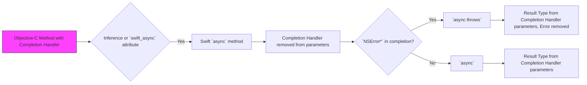

Here is an illustration that shows the transformation from an ObjC methods using completion handlers to a swift async function:

- The decision point for transformation is whether or not the ObjC method with completion handlers is either inferred using heuristics or explicitly told using `swift_async` attributes.
- When transforming, the completion handler is removed from the function parameters of the async method in swift.
- if the completion handler has an error parameter, the swift function is marked as `async throws`, otherwise just `async`.
- The return type is derived from the completion handler block's parameters excluding the error if there is one.


### Detailed Design - Async Completion-Handler Method Translation

This diagram details how Objective-C methods with completion handlers are converted into Swift `async` functions:

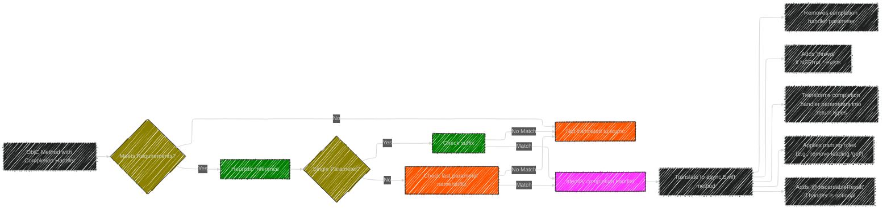

**Key points** are:
- The method must have a void result type and the completion-handler must be a block that is called only once, and it has void result type. If there is a NSError parameter in block, it will mean the function could throw an error.
- Heuristics are applied to find the completion-handler parameter
- The translation process transforms parameters of the completion block to return type of the  `async` method.
- Naming rules are applied to clean the name of the generated `async` methods.

---

# Part 3: Detailed Design - Swift `@objc async` Methods

Here's how Swift `async` methods when marked with `@objc`, are turned into Obj-C completion handler methods:

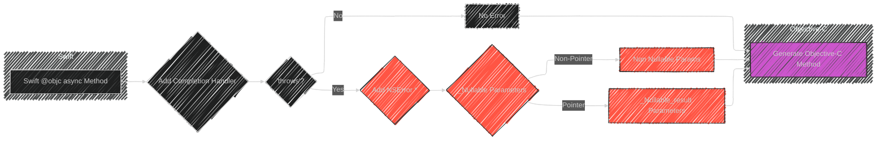

**Explanation:**

*   **Swift `@objc` `async` Method:** A Swift `async` method that can be called from Objective-C.
*   **Add Completion Handler:** The compiler automatically adds a completion handler parameter.
*   **`throws`?:** Check if the Swift method has `throws`, which could indicate potential errors.
*   **Add NSError \*:** Add a parameter for `NSError \*` in the completion handler for Objective C.
* **No Error:** if no `throws` it will be a normal return.
*   **`_Nullable` Parameters:** Make non-nullable pointer type parameters as `_Nullable` and nullable pointer type parameters as `_Nullable_result` in the Obj-C method
*   **Generate Objective-C Method:** The final Objective-C method with a completion handler.


### Detailed Design - Defining `@objc` Async Methods in Swift

This part shows how Swift `async` methods become Objective-C methods with completion handlers when marked with `@objc`:

```mermaid
---
config:
  layout: elk
  look: handDrawn
  theme: dark
---
graph LR
    A[Swift @objc async Method] --> B{Method Throws?};
    B -- Yes --> C[Add NSError* to Completion Handler];
    B -- No --> D[Completion Handler with No Error];

    C --> E[Handle Nullable/Non-Nullable Parameters];
    E --> F[Non-Null Pointers: _Nullable];
    E --> G[Null Pointers : _Nullable_result];

    F --> H[Synthesize Objective-C Method];
    G --> H;
    D --> H;
    H--> I[Create detached task ];

    I -->J{"Swift async return normally?"};
    J-- Yes--> K[Dispatch result to completion handler];
    J-- No --> L[Dispatch error information to completion handler];


    K --> M[Completion handler with result and nil error];
    L --> N[Completion handler with nil result and error];
    M -->O[Execute completion handler];
    N -->O[Execute completion handler];

classDef DecisionMaking fill:#8B8000,stroke:#333;
classDef YesRoute fill:#008000,stroke:#333;
classDef NoRoute fill:#F50,stroke:#333;

class B,J DecisionMaking;
class C,E,K,M YesRoute;
class D,L,N NoRoute;

```

**Key points** are:
- A completion-handler block parameter is added to the synthesized ObjC method.
- If Swift function can throw, a `NSError *` parameter is added to completion handler block.
- `_Nullable` and `_Nullable_result` are used for the Obj-c parameters.
- A detached task is created to call the Swift's async method.


---

## Heuristics for Inferring Completion Handler Parameters

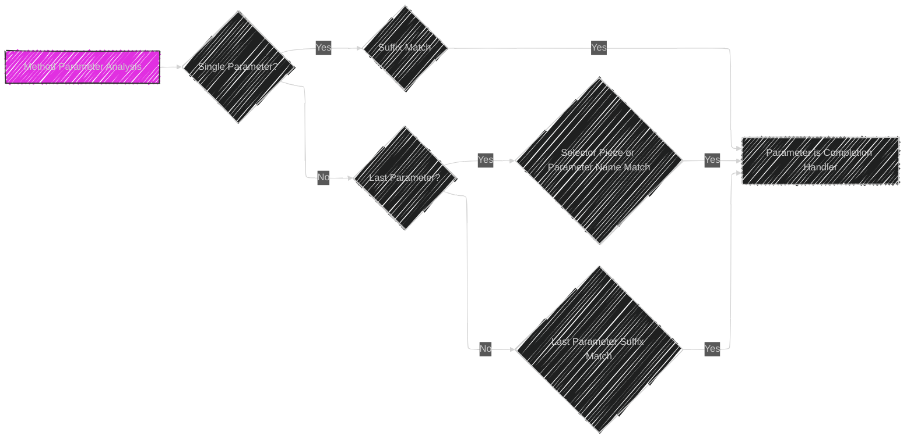

This shows the logic on how swift infers if a parameter of a given ObjC method with completion handlers is indeed the completion handler itself. This is done using heuristics by analyzing:
- if the method takes a single parameter
    - if it ends in commonly used suffixes like "WithCompletion", "WithCompletionHandler"
- If the method takes more than one parameter
    - if the last parameter has names such as `completion`, `withCompletion`, `completionHandler`, etc.
    - if the last parameter ends in a suffix such as "WithCompletion", etc.


### Detailed Heuristic Inference for Completion Handlers

This diagram expands on the "Heuristic Inference" step from the previous diagram, showing the decision-making process more granularly:

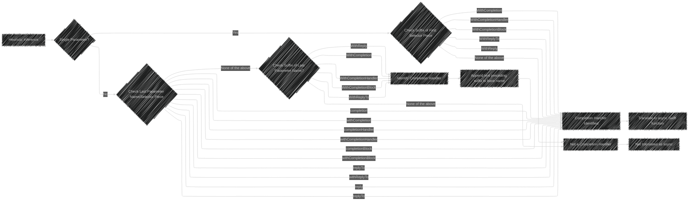

**Key points:**

*   The diagram breaks down the suffix and parameter name checks involved in identifying the completion handler.
*   Shows the specific suffixes that are considered as strong indicators for completion handlers.
*   Makes explicit the step where text before the matching suffix is added to the base name.


---

## Handling `NSError*` in Completion Handlers

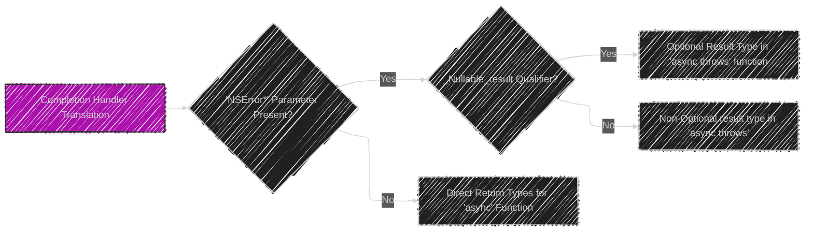
This diagram demonstrates how `NSError*` parameters affect Swift translation:

- If a completion handler has an `NSError*` parameter, the translation yields a Swift `async throws` function.
- The presence of the `_Nullable_result` qualifier affects whether or not the produced result type is `optional` or not optional in the resulting `async throws` Swift function.

### `async` to Completion Handler Transformation (More Detail)

This diagram visually represents the transformation of Swift `async` methods into Objective-C completion handler-based methods by the compiler.

```mermaid
---
config:
  layout: elk
  look: handDrawn
  theme: dark
---
graph LR
    A["Swift @objc async Method"] --> B{"Method Throws?"};
    B -- Yes --> C[Add 'NSError*' to Completion Handler];
    B -- No --> D[Completion Handler with No Error];

    C --> E["Handle Nullable/Non-Nullable Parameters"];
    E --> F["Non-Null Pointers: '_Nullable' "];
    E --> G["Null Pointers : '_Nullable_result' "];

    F --> H[Synthesize Objective-C Method];
    G --> H;
    D --> H;
    H--> I[Create detached task];

    I --> J{"Swift async return normally?"};
    J-- Yes--> K[Dispatch result to completion handler];
    J-- No --> L[Dispatch error information to completion handler];

    K --> M[Completion handler with result and nil error];
    L --> N[Completion handler with nil result and error];
    M --> O[Execute completion handler];
    N --> O[Execute completion handler];

classDef DecisionMaking fill:#8B8000,stroke:#333;
classDef YesRoute fill:#008000,stroke:#333
classDef NoRoute fill:#F50,stroke:#333;

class B,J DecisionMaking;
class C,K YesRoute;
class D,L NoRoute;

```


**Key points:**

*   The diagram visualizes how the compiler deals with `throws` methods (adding an `NSError*` parameter).
*   Highlights the use of `_Nullable` and `_Nullable_result` for parameters which are part of result in completion block.
*   Shows that a detached task is created to perform the `async` function.


---

## Swift `async` to  Objective-C Completion Handler Translation

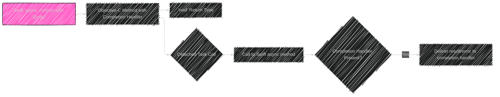

This diagram explains that `async` methods in Swift marked with `@objc` is automatically translated to an Objective-C method with the following characteristics:

- Has a completion handler with a void return type.
- The implementation of this ObjC method creates detached tasks
    - that calls its Swift `async` counterpart.
    - delivers the results or the error to the given completion handler argument of an ObjC method counterpart.


---


##  `async throws` methods in Swift

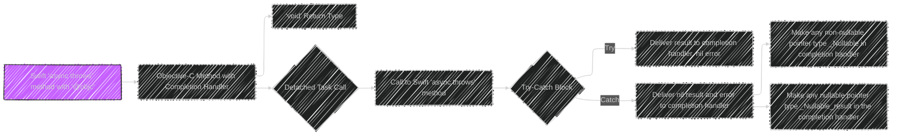

This diagram details the rules for `async throws` methods:

- The translation follows the same pattern in standard `async` methods marked with `@obj`
- However, the ObjC implementation of a `async throws` method contains a try-catch block.
- if the method returns normally by the try block, the result is delivered to the completion handler, combined with nil for the error part.
- If the methods throw, the catch block will deliver the error and a nil result to the completion handler.
- all non-nullable pointer types are made `_Nullable` and nullable ones are made `_Nullable_result` in the ObjC's completion handler method.

---

# Part 4: Actor Classes and `@objc`

Visual representation of the constraints on Actor Class members:

```mermaid
---
config:
  layout: elk
  look: handDrawn
  theme: dark
---
graph LR
    A[Actor Class] --> B{"@objc?"};
    B -->|Yes| C{Member Type};
    C -->|Async member| D[OK];
    C -->|@actorIndependent member| D;
      C -->|Synchronous member| E["Error: Cannot expose to Obj-C"];
     B -->  |No| F[OK];
     D-->G["@objc exportable"];
     F-->G;

style D fill:#c4cf,stroke:#333
style E fill:#f144,stroke:#333

```
**Explanation:**
*   **Actor Class:** A class that encapsulates data with  synchronization logic in Swift Concurrency model
*   **`@objc?`:** Checks if an Actor class wants to be able to be accessed by Objective-C
*   **Member Type:** Checks the kind of method to be exposed to Obj-C, `async`, `@actorIndependent` or synchronous members inside the isolation domain
*   **OK:** Marks the member as exportable to Objective-C
*  **Error: Cannot expose to Obj-C:** Flags the member as not exportable
*   **`@objc` exportable:** Methods that are exportable to Objective-C after successful check of their member type.

---


# Part 4: Actor Classes and `@objc`

Visual representation of the constraints on Actor Class members:

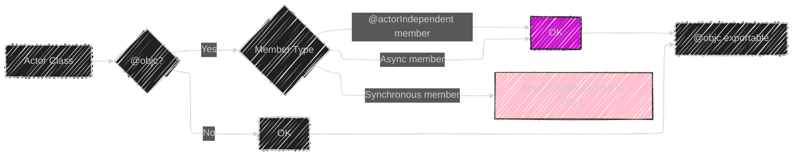

**Explanation:**
*   **Actor Class:** A class that encapsulates data with  synchronization logic in Swift Concurrency model
*   **`@objc?`:** Checks if an Actor class wants to be able to be accessed by Objective-C
*   **Member Type:** Checks the kind of method to be exposed to Obj-C, `async`, `@actorIndependent` or synchronous members inside the isolation domain
*   **OK:** Marks the member as exportable to Objective-C
*  **Error: Cannot expose to Obj-C:** Flags the member as not exportable
*   **`@objc` exportable:** Methods that are exportable to Objective-C after successful check of their member type.


## Actor Classes and `@objc`

```mermaid
---
config:
  layout: elk
  look: handDrawn
  theme: dark
---
graph LR
    A[Actor Class with `@objc`] --> B{Superclass is also an Actor or `NSObject`};
    B -- Yes --> C[Okay];
    B -- No --> D[Error];
    C --> E{`@objc` Member Access};
    E -- `async` or `@actorIndependent` --> F[Okay];
    E -- Synchronous --> G["Error (isolation domain)"];
    
    style A fill:#a1ef,stroke:#333
    
```

This clarifies the rules around `actor` classes when using `@objc`:

- Actor classes' superclass must also be an actor or have a superclass `NSObject`.
- Only members that are `@async` or `@actorIndependent` can be exposed to Objective-C.
- Synchronous methods inside the `actor` isolation domain cannot be directly exposed to Objective-C.


### Detailed Design - Actor Classes

Illustrates how actor isolation works with `@objc` and Swift.

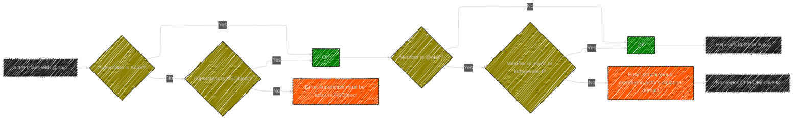

**Key points**
- Actor classes with `@objc` must have an actor class or `NSObject` as superclass.
- `@objc` members must be either `async` or actor-independent in actor classes.


---

##  `Completion Handler Called Exactly Once`

```mermaid
graph LR
    A[Synthesized Completion Handler Block] --> B[State Bit Introduced];
    B -- First Call --> C[Set State Bit];
    B -- Subsequent Call --> D[Runtime Error];
    C --> E{"Block Destroyed?"};
    E -- Yes & state bit is not set --> F["Runtime Error (Block not called)"];
    E -- Yes and state bit is set --> G["OKAY (Block called exactly once)"];

    style A fill:#c1af,stroke:#333
    
```

This is to explain enforcement for a completion handler being called exactly once:

- The Swift compiler creates an internal block that wraps the given completion handler implementation.
- Whenever the synthesized block is called, the compiler is checking to see whether or not it has already been called by examining a state bit.
- If the state indicates the block is called more than once, the compiler will show errors.
- If the block is destroyed and the state bit indicates, the block is never called, the compiler throws an error.

### Detailed Design - Completion Handler Called Once Rule

This diagram showcases how the compiler ensures that completion handlers are called exactly once:

```mermaid
---
config:
  layout: elk
  look: handDrawn
  theme: dark
---
graph TD
    A[Compiler Synthesizes Completion Handler Block] --> B["Add State Bit <br> (calledOnce)"];
    B --> C[Completion Handler Called];
    C --> D{"Is calledOnce set?"};
    D -- Yes --> E["Error: <br> Called multiple times"];
    D -- No --> F[Set calledOnce to true];
    F --> G[Execute completion handler code];
    G --> H[Block is destroyed];
    H --> I{"Is calledOnce set?"};
    I -- Yes --> J["OK: <br> Handler called"];
    I -- No --> K["Error: <br> Handler not called"];

classDef DecisionMaking fill:#8B8000,stroke:#333;
classDef YesRoute fill:#008000,stroke:#333
classDef NoRoute fill:#F50,stroke:#333;

class D,I DecisionMaking;
class E,J YesRoute;
class F,K NoRoute;

```

**Key points:**
- A bit is added to the completion handler block by compiler to track if it has been called or not.
- If the bit is already set, it means the handler has been called multiple times, which raises an error.
- If the bit is not set when the block is destroyed, it means the handler was not called, which raises another error.


### Completion Handler Calling Once Enforcement (State Machine):
This diagram converts the concept into a state machine.

```mermaid
---
config:
  layout: elk
  look: handDrawn
  theme: dark
---
stateDiagram-v2
    [*] --> NotCalled: Initial State
    NotCalled --> Called: Completion Handler Called
    Called --> ErrorMultipleCalls: Completion Handler Called Again
    NotCalled --> ErrorNotCalled: Deallocated without Being Called
    Called --> [*]: Deallocated Safely
    ErrorMultipleCalls --> [*]
    ErrorNotCalled --> [*]
    
    %% TODO: Review the syntax below
    %% state NotCalled {
    %%   Initial state
    %% }
    %% state Called {
    %%     Successfully called completion handler
    %% }
    %% state ErrorMultipleCalls {
    %%    Error: Completion handler was called multiple times
    %% }
    %% state ErrorNotCalled {
    %%    Error: Completion handler wasn't called before deallocation
    %% }

```


**Key points:**

*   Illustrates state transitions as the completion handler is called or not.
*   Shows error states clearly.


---

# Part 5: Additional Objective-C Attributes

Here's how the custom attributes work:

```mermaid
graph LR
    A[Objective-C Method] --> B{"Attributes?"};
    B -->|"__attribute__((swift_async(none)))"| C[No Async Translation];
    B -->|"__attribute__((swift_async(...)))"| D{Specific Async Index};
    D -- Valid index --> E[Async Translation];
    D -- invalid index--> F[Normal Import];
    
    B -->|"__attribute__((swift_attr(...)))"| G[Add Swift Attribute];
    B -->|"__attribute__((swift_async_name(...))) "| H[Custom Name];
    B -->|"__attribute__((swift_async_error(...)))"| I{Async error handling};
    B -->|No Attributes| J[Heuristics Applied];
    
    I --> |zero_argument|K{Throw Error on Zero Value};
    I --> |nonzero_argument| L{Throw Error on Non Zero Value};
    I -->|none| M["Do not Import as 'throws' "];
        
    E --> N[Swift Async Method];
    
    H-->N
    K-->N
    L-->N
    M-->N
    G-->N

    J-->N
        
style C fill:#f544,stroke:#333;
style E fill:#c5cf,stroke:#333;
style K fill:#c5cf,stroke:#333;
style L fill:#c5cf,stroke:#333;

```

**Explanation:**

*   **Objective-C Method:** The starting point
*   **`Attributes?`:** Check for the custom attributes
*   **`__attribute__((swift_async(none)))`:** If used, the method is not translated to an `async` one.
*  **`__attribute__((swift_async(...)))`:** Specifies a particular  parameter index for the completion handler.
* **`Specific Async Index`:** The `__attribute__((swift_async(...)))` provides a specific completion handler parameter.
*  **Valid index:** Perform the translation when the index is valid 
*   **`__attribute__((swift_attr(...)))`:** Allows any Swift attribute such as `@MainActor` to be applied.
*  **`__attribute__((swift_async_name(...)))`:** Custom name for the translated Swift async function.
*  **`__attribute__((swift_async_error(...)))`:** Defines how an error is indicated by the block passed in.
* **`Async error handling`:** The block that performs error handling based on parameters in  `swift_async_error()` attribute.
*  **Throw Error on Zero Value:** Specifies zero param value should indicates error.
*  **Throw Error on Non Zero Value:** Specifies a non-zero value should indicates error.
* **Normal Import:** Import the function as a non async method
*   **No Attributes:** Check for heuristics.
 * **Do not Import as `throws`:** Disables the translation to `throws`.
*     **Heuristics Applied:** If no special attributes are found, the method goes to Heuristic rules.
*   **Swift Async Method:**  Translated method.


## Additional Objective-C Attributes

```mermaid
graph LR
    A[Objective-C Attributes] --> B[_Nullable_result];
    A --> C[" 'swift_async' "];
    C --> CA[none];
    C --> CB[not_swift_private];
    C --> CC[swift_private];
    A --> D[" 'swift_attr' "];
    A --> E[" 'swift_async_name' "];
    A --> F[" 'swift_async_error' "];
    F --> FA[none];
    F --> FB[zero_argument];
    F --> FC[nonzero_argument];


style A fill:#e1ca,stroke:#333
   
```

A summary of additional Objective-C attributes:

- `_Nullable_result`: Indicates optional parameters in completion handlers.
- `swift_async`:
    - `none`: disables `async` translation
    - `not_swift_private`: translates to `async` methods.
    - `swift_private`: translates to Swift private `async` methods.
- `swift_attr`: used to add swift attributes, such as `@MainActor`.
- `swift_async_name`: to specify the name for the `async` translation.
- `swift_async_error`:
    - `none`: no error handling should be considered.
    - `zero_argument`: Treat a zero-valued parameter as an error being thrown.
	- `nonzero_argument`: treat a non-zero valued argument as an error being thrown.


### Detailed Design - Objective-C Attributes

```mermaid
---
config:
  layout: elk
  look: handDrawn
  theme: dark
---
graph LR
    A[Objective-C Attributes] --> B{_Nullable_result};
    B --> BA["_Nullable_result: <br> Makes parameter optional when translating to return value in 'async' "];

    A --> C{swift_async};
    C --> CA["swift_async(none): <br> Disables translation to async"];
    C --> CB["swift_async(not_swift_private, C): <br> Explicitly specifies the completion handler at index C"];
    C --> CC["swift_async(swift_private, C): <br> For internal usage only"];

    A --> D{"swift_attr('swift attribute')"};
    D --> DA["Provides a direct way to add Swift attributes <br> (ex: @MainActor)"];

    A --> E{"swift_async_name('method(param1:param2:)')"};
    E --> EA[Rename the async method];

    A --> F{"swift_async_error(...)"};
    F --> FA["swift_async_error(none): <br> Don't import as throws"];
    F --> FB["swift_async_error(zero_argument, N): <br> Method throws if parameter at index N is zero"];
    F --> FC["swift_async_error(nonzero_argument, N): <br> Method throws if parameter at index N is nonzero"];

```

**Key points:**
- Details of the additional Objective-C attributes to control how the translation from completion handlers to the async functions occur.
-  `swift_async_error` is introduced to handle the throwing behavior of the translated function by an error type in the completion block.

### `swift_async_error` Attribute Usage

This diagram illustrates the different parameters of the `swift_async_error` attribute and how they affects the translation.

```mermaid
---
config:
  layout: elk
  look: handDrawn
  theme: dark
---
graph LR
    A[swift_async_error Attribute] --> B{"Parameter is 'none' "};
    B -- Yes --> C["Don't import as 'throws'"];
    C --> D["'NSError *' parameter is treated as result type"];
    B -- No --> E{"Parameter is 'zero_argument', N"};
    E -- Yes --> F["Import as 'throws'"];
    F --> G[Error is thrown when parameter N is zero];
    G --> H["'NSError*' parameter removed from return type"];
    E -- No --> I{"Parameter is 'nonzero_argument', N"};
    I -- Yes --> J["Import as 'throws' "];
    J --> K["Error is thrown when parameter N is non-zero"];
    K --> H;
    H--> L["Completion handler signature is translated to 'async throws' "];

    D --> L;


classDef DecisionMaking fill:#8B8000,stroke:#333;
classDef YesRoute fill:#008000,stroke:#333;
classDef NoRoute fill:#F50,stroke:#333;

class B,E,I, DecisionMaking;
class C,F,J YesRoute;

```


**Key points:**
* Shows different input parameters of  `swift_async_error` attribute.
* Explains the different scenarios of how translated async function should throw or not by different parameters.


----


## Source Compatibility

```mermaid
---
config:
  layout: elk
  look: handDrawn
  theme: dark
---
graph LR
    A[Objective-C Async API Translation] --> B[Both Completion Handler and Async APIs Provided];
    B --> C[Gradual Adoption];
    B -- Overload --> D[Synchronous Preference in Sync Contexts];
    D --> E[Asynchronous Preference in Async Contexts];
    B -- Protocol Conformances --> F[One Implementation of Protocol Expected];
    B -- Override --> G(Dynamic overrides to avoid issues unless the subclass is already marked with dynamic);

style A fill:#e1fc,stroke:#333
    
```

This is the explanation of how source compatibility is maintained with this feature:
- Both ObjC's original completion handlers based signatures are provided in Swift as well as the new async function signature.
- This approach allows gradual adoption of concurrency model rather than making breaking changes to the source compatibility of the library.
- Both synchronous and asynchronous forms of a method can potentially be defined, such as the case where an ObjC library potentially has both synchronous and asynchronous forms of the same API. In this case the selection of which function to call will depend on the context (i.e. synchronous calls will use the synchronous form, asynchronous calls will use the asynchronous form of the API).
-  Protocol conformances allow the user to implement one version of the methods (i.e. either a completion handler, or the `async` signature, but not both).
- Regarding overriding methods, it is expected that the compiler can make necessary inferences to avoid issues related to this feature by marking overriden methods with the `dynamic` attribute.

### Source Compatibility and Overloading

```mermaid
---
config:
  layout: elk
  look: handDrawn
  theme: dark
---
graph LR
    A[Source Compatibility] --> B["Keep completion-handler and async versions"];
    B --> C[Allows gradual adoption of async];
    A --> D[API Overloading];
    D --> DA[Synchronous and asynchronous overloads];
    DA --> DB["Async/await favors synchronous methods in synchronous contexts and async methods in async contexts"];
    A --> E[Protocol Conformance];
    E --> EA[Handle multiple protocol requirements with same ObjC selector];
    A --> F[Overriding Methods];
    F --> FA[Swift subclass implements either completion handler or async but not both];
    FA --> FB["Use '@objc dynamic' if subclass's method needs to override both"];

```

**Key points:**
- Both the original completion-handler signature and the new async version will be maintained.
- Overloading of sync and async functions are solved.
- Protocol conformance handles multiple method requirements sharing the same selector, and implementation of one of them satisfies the other.
-  For method overriding, compiler infers `@objc dynamic` to avoid problems with the new generated async methods.

### Future Directions (`NSProgress`)

```mermaid
---
config:
  layout: elk
  look: handDrawn
  theme: dark
---
graph LR
    A[Future Directions] --> B[NSProgress integration];
    B --> BA[Current proposal does not include NSProgress];
    B --> BB[Requires integration with Swift's tasks];
    BB --> BC[NSProgress could be recorded in task-local storage];
    BB --> BD[When overridding extract NSProgress from task to return];

```

**Key points:**
- Shows that current proposal doesn't integrate with `NSProgress`
- If it ever integrates, that will need special integration between `NSProgress` and the async task.


### Protocol Conformance Handling

This diagram illustrates how Swift handles protocol conformance when both completion handler and `async` methods exist for the same selector from Objective-C:

```mermaid
---
config:
  layout: elk
  look: handDrawn
  theme: dark
---
graph LR
    A[Objective-C Protocol] --> B{"Has Completion Handler Method?"};
    B -- Yes --> C[Translated to both completion handler and async methods in Swift];

    C --> D[Swift Type Conforms to Protocol];
    D --> E{"Implements Completion Handler?"};
    E -- Yes --> F[Satisifies Protocol];
    E -- No --> G{"Implements Async Method?"};
    G -- Yes --> F;
    G -- No --> H[Error];


    H[Does not satisfy Protocol];
    F[Satisfies Protocol];

classDef DecisionMaking fill:#8B8000,stroke:#333;
classDef YesRoute fill:#008000,stroke:#333;
classDef NoRoute fill:#F50,stroke:#333;

class B,E,G DecisionMaking;
class C,F YesRoute;
class H NoRoute;

```


**Key points:**

*   Illustrates how a Swift type can satisfy protocol conformance by implementing either the completion handler or the `async` version of a method.

### Overriding Methods with Async and Completion-Handler counterparts

```mermaid
---
config:
  layout: elk
  look: handDrawn
  theme: dark
---
graph LR
    A[Swift Class] --> B{Has ObjC Method Superclass};

    B -- Yes --> C{"Super method has both completion handler and async signatures"};
    C --Yes--> D[Swift override only one version];
    D -- Yes --> E{"Overriding Method  is @objc dynamic?"};
    E -- Yes --> F[OK];
    E -- No --> G["Warning <br> (can create problems)"];
    G--> F;

    F[All Good];

classDef DecisionMaking fill:#8B8000,stroke:#333;
classDef YesRoute fill:#008000,stroke:#333;
classDef NoRoute fill:#F50,stroke:#333;

class B,C,E DecisionMaking;
class D,F YesRoute;
class G NoRoute;

```

**Key points:**
* If an ObjC method of Superclass has both async and completion handler signatures, subclasses are only allowed to override one of them.
* For method overridding, compiler infers `@objc dynamic` to avoid problems with the new generated async methods. Warning is raised to user if that happens.

---

