Below is a breakdown of the diagrams I will create, aligning with [the original proposal documentation's structure of Structured Concurrency in Swift](https://github.com/swiftlang/swift-book/blob/main/TSPL.docc/LanguageGuide/StringsAndCharacters.md):

---


Let's break this down section by section and plan the diagrams.

**Plan:**

1. **Introduction:** A mindmap showing the core concepts of Strings and Characters in Swift.
2. **String Literals:**  A sequence diagram illustrating the creation of string literals. Perhaps a distinction between single and multiline literals.
3. **Multiline String Literals:** A diagram showing how indentation and backslashes affect multiline strings. The provided image "multilineStringWhitespace" is a good hint.
4. **Special Characters:** A table or a simple graph showcasing escape sequences.
5. **Extended String Delimiters:** An example illustrating how `#` affects the interpretation of special characters.
6. **Initializing an Empty String:** A simple illustration showing two ways to create empty strings.
7. **String Mutability:** A branching diagram showing `let` vs. `var` for string mutability.
8. **Strings Are Value Types:** A diagram demonstrating the concept of copying when strings are passed or assigned.
9. **Working with Characters:** A loop diagram iterating through a string's characters.
10. **Concatenating Strings and Characters:** Diagrams illustrating the `+` and `+=` operators, and the `append()` method.
11. **String Interpolation:** A diagram showing how variables and expressions are inserted into strings.
12. **Unicode:** A mindmap or tree structure of Unicode concepts, including scalar values and grapheme clusters.
13. **Unicode Scalar Values:** Illustrative examples of Unicode scalar values.
14. **Extended Grapheme Clusters:** Diagrams showing how multiple scalars can form a single character. Use the examples provided (é, 한, é⃝, 🇺🇸).
15. **Counting Characters:** An example highlighting that combining characters doesn't always increase the `count`.
16. **String Indices:** A diagram visualizing string indices and how to access characters using them.
17. **Inserting and Removing:** Diagrams illustrating `insert()` and `remove()` methods.
18. **Substrings:** A diagram based on the provided "stringSubstring" image, clarifying the memory sharing between strings and substrings.
19. **Comparing Strings:**  Examples illustrating string and character equality, emphasizing canonical equivalence.
20. **Prefix and Suffix Equality:** An illustration of the `hasPrefix()` and `hasSuffix()` methods.
21. **Unicode Representations of Strings:** A central diagram linking to UTF-8, UTF-16, and Unicode Scalar representations. Use the provided images 'UTF8', 'UTF16', 'UnicodeScalar' as inspiration.
22. **UTF-8 Representation:** An example visualizing the UTF-8 encoding of a string.
23. **UTF-16 Representation:** An example visualizing the UTF-16 encoding of a string.
24. **Unicode Scalar Representation:** An example visualizing the Unicode scalar representation of a string.

**Overall Structure:**  I'll organize the diagrams to follow the structure of the documentation. I'll use a variety of Mermaid diagram types to make it visually engaging and clear.

```mermaid
  root((Strings and Characters in Swift))
    Central Concepts
      String Type
        Collection of Characters
        Unicode-compliant
        Fast and efficient
      Character Type
        Represents a single extended grapheme cluster
    Creation and Manipulation
      String Literals
        Single-line
        Multiline
      String Mutability
        `var` for mutable strings
        `let` for immutable strings
      String Interpolation
        Embedding values in strings
      Concatenation
        Using the `+` operator
        Using `append()`
    Unicode
      Unicode Scalars
        Unique 21-bit values
      Extended Grapheme Clusters
        Sequences forming a single character
    Accessing and Modifying
      String Indices
        `startIndex`, `endIndex`
        `index(before:)`, `index(after:)`, `index(_:offsetBy:)`
        Subscripting
      Inserting and Removing
        `insert(_:at:)`
        `insert(contentsOf:at:)`
        `remove(at:)`
        `removeSubrange(_:)`
      Substrings
        `Substring` type
        Memory sharing for optimization
    Comparison
      Equality (`==`, `!=`)
        Canonical equivalence
      Prefix and Suffix
        `hasPrefix(_:)`
        `hasSuffix(_:)`
    Unicode Representations
      UTF-8
        8-bit code units
      UTF-16
        16-bit code units
      Unicode Scalars
        21-bit scalar values
```

---


---


```mermaid
graph LR
    subgraph Multiline String Literal
        A[Opening """] --> B{Content};
        B --Optional Backslash--> C(No Newline in String);
        B --> D[Closing """];
        D --> E{Whitespace before Closing Delimiter};
        E --> F(Whitespace to Ignore);
        B --> G(Line Break);
    end
```

---


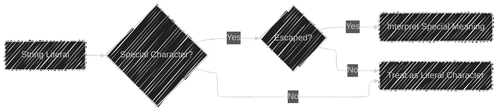


---


---


---


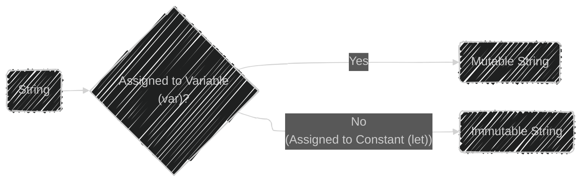


---


---


---


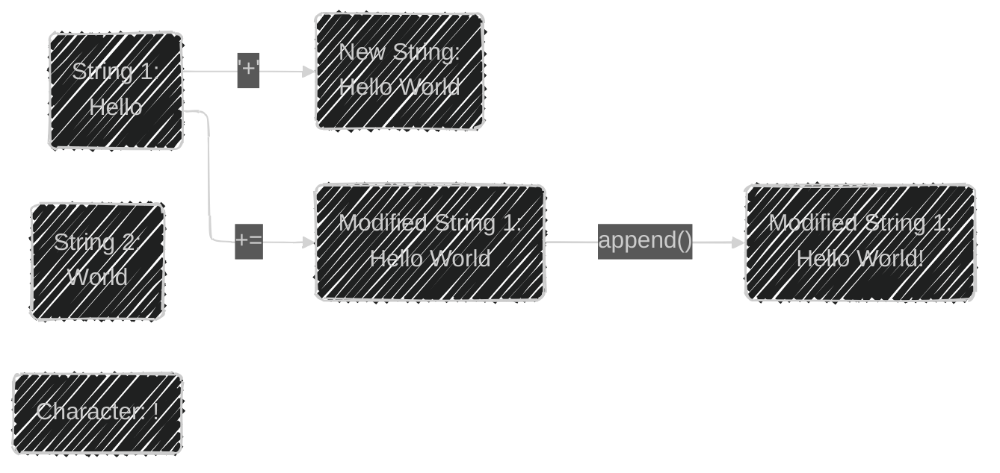


---


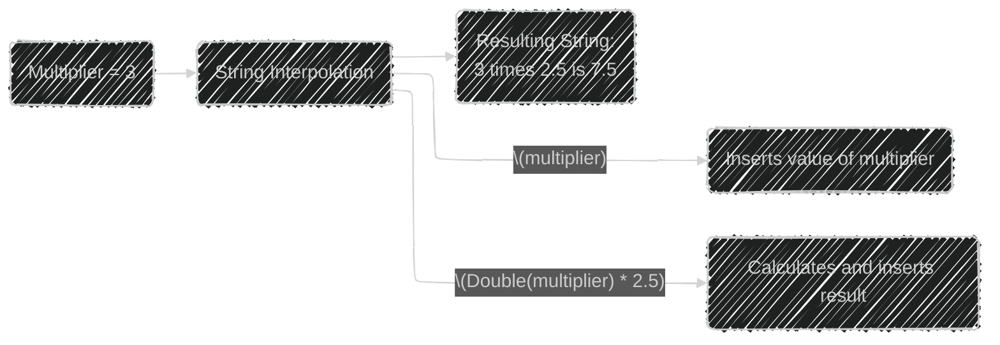


---

```mermaid
---
config:
  layout: elk
  look: handDrawn
  theme: dark
---
mindmap
    root((Unicode))
        (Core Concepts)
            (Unicode Scalar Values)
                (Unique 21-bit numbers for characters)
            (Extended Grapheme Clusters)
                (One or more scalars forming a readable character)
        Examples
            (Scalar Examples)
                (U+0061: 'a')
                (U+1F425: '🐥')
            (Grapheme Cluster Examples)
                ('é' as U+00E9)
                ('é' as U+0065 + U+0301)

```

---


```mermaid
---
config:
  layout: elk
  look: handDrawn
  theme: dark
---
graph LR
    A[Unicode Scalar Value] --> B(Unique 21-bit Number);
    B --> C{Represents a Character or Modifier};
    D(Example: U+0061) --> E("Character: a");
    F(Example: U+1F425) --> G("Character: 🐥");
    
```


---


```mermaid
---
config:
  layout: elk
  look: handDrawn
  theme: dark
---
graph LR
    subgraph Extended_Grapheme_Cluster_1["Extended Grapheme Cluster 'é' "]
        A(Unicode Scalar: U+00E9)
    end
    subgraph Extended_Grapheme_Cluster_2["Extended Grapheme Cluster 'é' "]
        B(Unicode Scalar: U+0065) -- Combined with --> C(Unicode Scalar: U+0301)
    end
    subgraph Extended_Grapheme_Cluster_3["Extended Grapheme Cluster '한' "]
        D(Unicode Scalar: U+D55C)
    end
    subgraph Extended_Grapheme_Cluster_4["Extended Grapheme Cluster '한' "]
        E(Unicode Scalar: U+1112) -- Combined with --> F(Unicode Scalar: U+1161) -- Combined with --> G(Unicode Scalar: U+11AB)
    end
    subgraph Extended_Grapheme_Cluster_5["Extended Grapheme Cluster 'é⃝' "]
        H(Unicode Scalar: U+00E9) -- Combined with --> I(Unicode Scalar: U+20DD)
    end
    subgraph Extended_Grapheme_Cluster_6["Extended Grapheme Cluster '🇺🇸' "]
        J(Unicode Scalar: U+1F1FA) -- Combined with --> K(Unicode Scalar: U+1F1F8)
    end
    
```


---


```mermaid
---
config:
  layout: elk
  look: handDrawn
  theme: dark
---
graph LR
    A("Word: cafe") --> B("Count: 4");
    C("Append: U+0301 (´)") --> D("Word: café");
    D --> E("Count: 4 (still)");
    
```


---


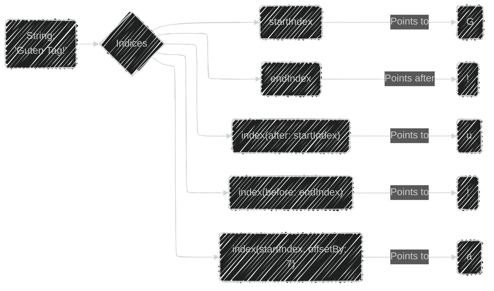
---


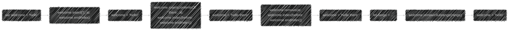


---


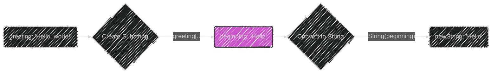


---


```mermaid
---
config:
  layout: elk
  look: handDrawn
  theme: dark
---
graph LR
    subgraph String Equality
        A("String 1: 'café'") -- Canonically Equivalent --> B("String 2: 'café'");
        A -- "==" --> C(True);
    end
    subgraph Character Equality
        D("Character 1: 'é'") -- Canonically Equivalent --> E("Character 2: 'é'");
        D -- "==" --> F(True);
    end
    subgraph Non-Equivalent Example
        G("Character 'A' (Latin)") -- "!=" --> H("Character 'А' (Cyrillic)");
        G -- "!=" --> I(True);
    end
    
```


---


```mermaid
graph LR
    A("String: 'Act 1 Scene 1...'") --> B{hasPrefix("Act 1 ")};
    B -- Yes --> C(Is an Act 1 Scene);
    D("String: '...Capulet's mansion'") --> E{hasSuffix("Capulet's mansion")};
    E -- Yes --> F(Ends with Capulet's mansion);
```


---


```mermaid
---
config:
  layout: elk
  look: handDrawn
  theme: dark
---
mindmap
  root((Unicode Representations of String))
    Accessing Representations
      Iterating over String (Characters/Grapheme Clusters)
      `utf8` Property (UTF-8 Code Units)
      `utf16` Property (UTF-16 Code Units)
      `unicodeScalars` Property (Unicode Scalar Values)
    Example String: <br> 'Dog‼🐶'
      UTF-8 Representation
        68, 111, 103, 226, 128, 188, 240, 159, 144, 182
      UTF-16 Representation
        68, 111, 103, 8252, 55357, 56374
      Unicode Scalar Representation
        ("U+0044 ('D') <br> U+006F ('o') <br> U+0067 ('g') <br> U+203C ('‼') <br> U+1F436 ('🐶')")
        
```


---


```mermaid
flowchart LR
    A("String: 'Dog‼🐶'") --> B{Iterate over utf8};
    B --> C(Code Units: 68, 111, 103, 226, 128, 188, 240, 159, 144, 182);
    style C fill:#c5df,stroke:#333,stroke-width:2px
```

---

```mermaid
flowchart LR
    A("String: 'Dog‼🐶'") --> B{Iterate over utf16};
    B --> C(Code Units: 68, 111, 103, 8252, 55357, 56374);
    style C fill:#c5df,stroke:#333,stroke-width:2px
```

---


```mermaid
flowchart LR
    A("String: 'Dog‼🐶'") --> B{Iterate over unicodeScalars};
    B --> C(Unicode Scalars: U+0044, U+006F, U+0067, U+203C, U+1F436);
    style C fill:#c5df,stroke:#333,stroke-width:2px
```

---


