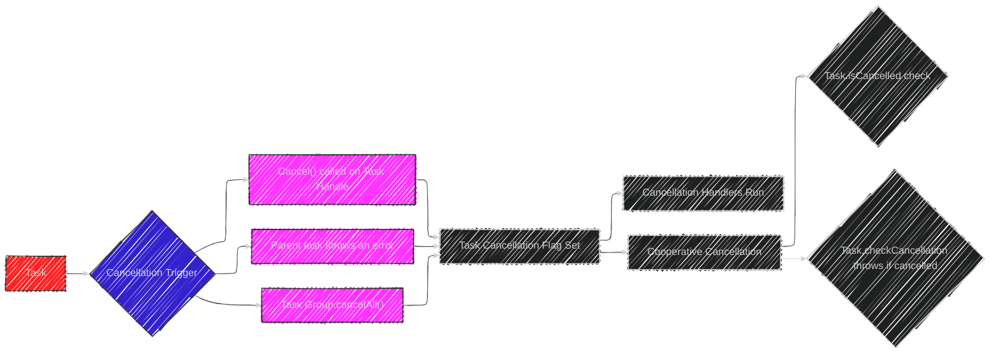
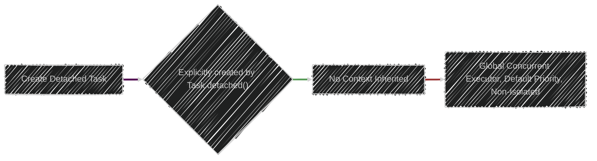

Below is a breakdown of the diagrams I will create, aligning with [the original proposal documentation's structure of Structured Concurrency in Swift](https://github.com/swiftlang/swift-evolution/blob/main/proposals/0304-structured-concurrency.md):

---

# Overview Diagram

First, here's a high-level overview illustrating the core components of Swift's structured concurrency model and their relationships:

```mermaid
---
config:
  layout: elk
  look: handDrawn
  theme: dark
---
graph LR
    subgraph "Structured Concurrency"
    A[Task] --> B(Child Task);
    A --> C(Task Group);
    C --> D[Child Task];
    C --> E[Child Task];
    A --> F[Unstructured Task];
    A --> G[Detached Task];
        subgraph Task_States
            style Task_States fill:#321,stroke:#333,stroke-width:1px
            H[State] -- suspended --> I[Schedulable]
            H -- suspended --> J[Waiting]
            H  -- running --> K[Thread]
            H --> L[Completed]
        end
      style H fill:#22f,stroke:#7fa,stroke-width:2px
    end
    style A fill:#c2cf,stroke:#333,stroke-width:2px
    
    subgraph "Executors"
      M[Executor] --> N[Job]
      N --> O[Thread]
    end
    style M fill:#e68c,stroke:#333,stroke-width:2px
     
linkStyle 0,1,2,3,4,5,6 stroke:#555,stroke-width:1px;
linkStyle 7,8,9 stroke:#999,stroke-width:1px;

```

**Explanation:**
   * **Task:** The fundamental unit of concurrent work.
   * **Child Task:** A task created within a parent task's scope.
   * **Task Group:** A mechanism to manage the lifetime and results of multiple child tasks.
     * **Unstructured Task:** A top-level task that does not inherit from a parent task but does inherit priority, task-local values and the actor context.
     * **Detached Task:** A top-level task that does not inherit anything from a parent task
   * **Executor:** The component responsible for scheduling tasks to run on threads.
   * **Job:**  A unit of schedulable work that is submitted to an executor.
   * **Thread:**  The system thread on which the asynchronous functions are executed.

---

# Task Lifecycle Diagram

This diagram details the life cycle of a task, including its states and transitions.

_Note: We can render this diagram using the latest Mermaid syntax_

**Explanation:**

*   Tasks begin in a **Suspended** state, which can be further subdivided in **Waiting**, **Schedulable**, or unknown.
*   Suspended tasks transition to **Running** when an executor schedules them on the proper thread.
*   **Running** tasks can go back to **Suspended** during an `await` call.
*   Tasks reach the **Completed** state either normally or if an exception was caught.
*   Tasks in the **Running** state may decide to call `suspend()` to give other tasks a chance to run.
*  Tasks in the **Suspended** state may also enter the **Completed** state if they've been marked as **Canceled**.

---

# Task Relationships Diagram

This diagram illustrates the relationships between parent tasks, child tasks, and task groups:

**Explanation:**

*   A **Parent Task** can create a **Task Group.**
*  **Task Groups** manage multiple **Child Tasks**, ensuring they complete before the group's scope exits.
*  A **Parent Task** can also create **Unstructured Tasks.**
*  A **Parent Task** can also create **Detached Tasks**.

---

# Task Group API Diagram

This diagram focuses on the API surface of `TaskGroup` and `ThrowingTaskGroup`:

**Explanation:**

*   `addTask`: Adds a new child task to the group.
* `addTaskUnlessCancelled`: Adds a new task only if the groups is not marked as cancelled
*   `next`: Retrieves the next completed task's result or throws if the group is throwing. (returns `nil` when empty)
*  `nextResult`: Retrieves the next completed task's result or throws wrapped in a `Result` (returns `nil` when empty)
*   `waitForAll`: Suspends until all child tasks have completed.
*   `isEmpty`: Checks if the task group has any tasks remaining.
* `cancelAll`: Causes all the tasks in the group to be cancelled immediately
* `isCancelled`: Check whether a TaskGroup or its parent task was cancelled  

---

# Task Cancellation

Diagram illustrating various ways a task can be canceled.

**Explanation:**

*   A Task may be explicitly cancelled via the `cancel()` operation on a task's handle.
 *   If a parent Task throws an error, all un-waited child tasks will be canceled.
*   Task Groups may also explicitly terminate all currently running or pending tasks by invoking `cancelAll()`
*   When a task is cancelled, a flag is set on it
* Any registered `Cancellation Handlers` on the task will run immeditately.
* The task has to cooperatively (i.e. by explicit checks) either by reading `isCancelled` or invoking `checkCancellation()` which throws ` CancellationError` if the task was cancelled.

---

# Unstructured Tasks

Diagram illustrating various ways an unstructured task is created:
s

**Explanation:**
*   Unstructured tasks are created using the `Task { } ` initializer.
*   If created within a Task's synchronous context. It will inherit: Priority, Task Locals and Actor Isolation. 
*   If not created within a Task context, then will consult runtime for a best guess priority, use the global concurrent executor and be non-isolated.
*  Tasks created within an actor-context will inherit it, and be able to access its mutable internal state, as well as invoke functions implicitly on it.

---

# Detached Tasks

Diagram illustrating tasks created as `detatched`.

**Explanation:**
* Detached tasks are created by explictly calling `Task.detached()`.
* Detached tasks inherit no context from where they are invoked from, i.e. are always non isolated and scheduled on the global concurrent executor by default.

## Additional Notes
*   **Cancellation:**  Cancellation is cooperative. Tasks must check their cancellation status to stop execution.
*   **Priorities:** These can be set on tasks to influence the scheduler.
*   **Executors:** The mechanism that actually runs the tasks (thread pools etc)

---
