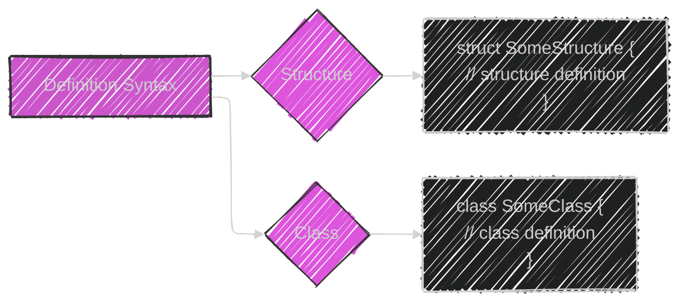
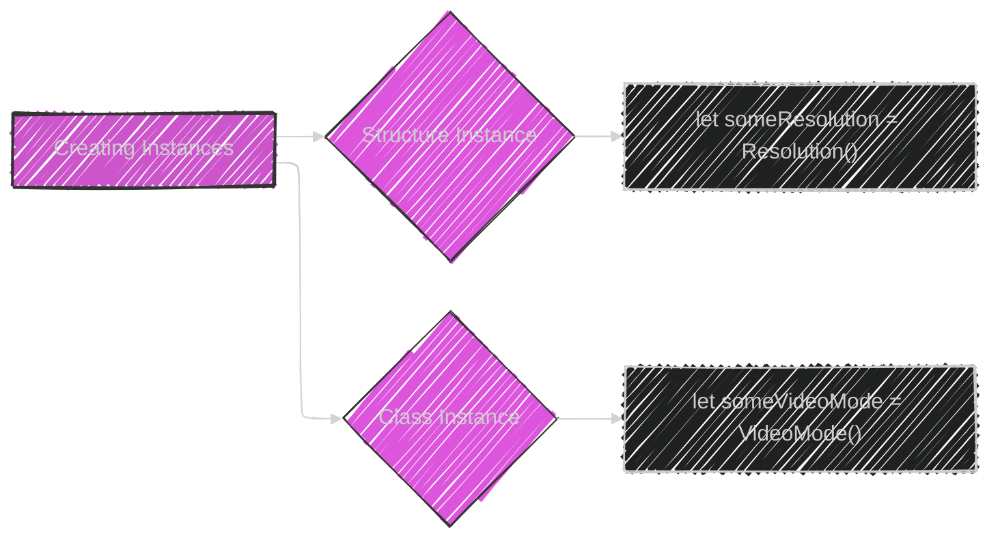
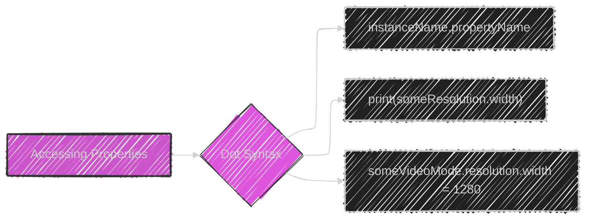
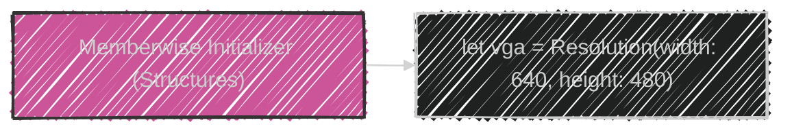
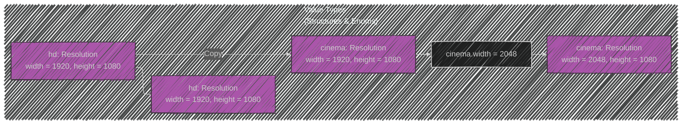
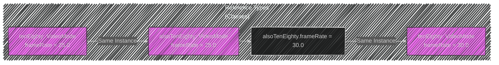
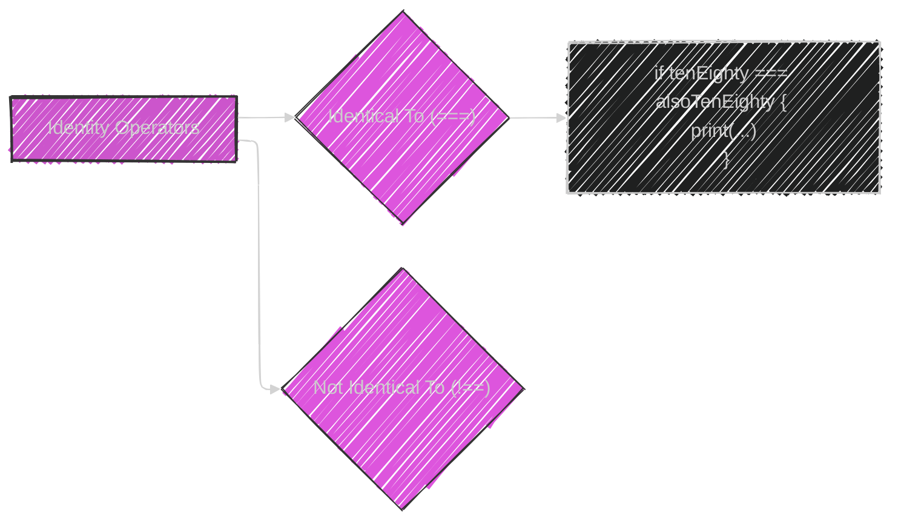

> This content is dual-licensed under your choice of the following licenses:
> 1.  **MIT License:** For the code implementations in Swift and Mermaid provided in this document.
> 2.  **Creative Commons Attribution 4.0 International License (CC BY 4.0):** For all other content, including the text, explanations, and the Mermaid diagrams and illustrations.

---


Below is a breakdown of the diagrams I will create, aligning with [the original documentation](https://github.com/swiftlang/swift-book/blob/main/TSPL.docc/LanguageGuide/ClassesAndStructures.md):

---


Here's a plan:
1. **Diagram comparing Structures and Classes:** Highlight the common features and the exclusive features of classes.
2. **Diagram illustrating Definition Syntax:** Show the basic syntax for defining structures and classes.
3. **Diagram illustrating Structure and Class Instances:** Depict the creation of instances.
4. **Diagram illustrating Accessing Properties (Dot Syntax):** Show how to access properties using dot notation.
5. **Diagram illustrating Memberwise Initializers:** Demonstrate the automatic initializer for structures.
6. **Diagram illustrating Value Types (Copying):** Visually represent how structures and enumerations are copied on assignment.
7. **Diagram illustrating Reference Types (Sharing):** Visually represent how classes share the same instance on assignment.
8. **Diagram illustrating Identity Operators:** Show how `===` checks for the same instance in memory.


----


---




---





---





---





---




---




---




---


**Illustration for Comparing Structures and Classes:**

```markdown
          Common Ground                       |             Class Extras
----------------------------------------------|--------------------------------------------
| Properties, Methods, Subscripts, Initializers | Inheritance, Type Casting, Deinitializers |
| Extensions, Protocol Conformance            | Reference Counting                         |
----------------------------------------------|--------------------------------------------
              Structures                        |               Classes
```

**Illustration for Value Types vs. Reference Types:**

```markdown
  Value Type (Copy)                      Reference Type (Reference)

+--------+     Copy     +--------+      +--------+
|  Var A |----------->|  Var B |------->| Instance |
+--------+             +--------+      +--------+

(Changes to Var B do     (Both Var A and Var B
 NOT affect Var A)      point to the SAME instance)
```


---
**Licenses:**

- **MIT License:**  [](LICENSE) - Full text in [LICENSE](LICENSE) file.
- **Creative Commons Attribution 4.0 International:** [](LICENSE-CC-BY) - Legal details in [LICENSE-CC-BY](LICENSE-CC-BY) and at [Creative Commons official site](http://creativecommons.org/licenses/by/4.0/).

---