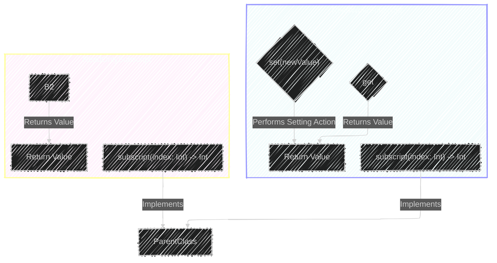
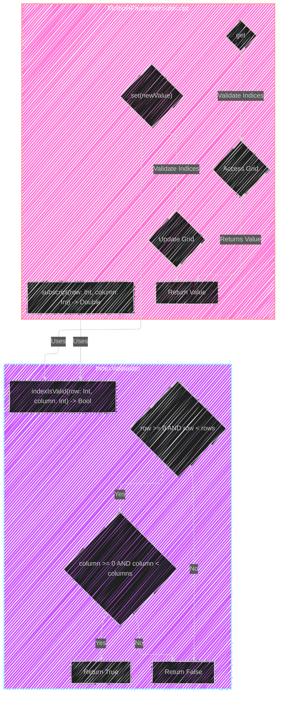

> This content is dual-licensed under your choice of the following licenses:
> 1.  **MIT License:** For the code implementations in Swift and Mermaid provided in this document.
> 2.  **Creative Commons Attribution 4.0 International License (CC BY 4.0):** For all other content, including the text, explanations, and the Mermaid diagrams and illustrations.

---

Below is a breakdown of the diagrams I will create, aligning with [the original documentation](https://github.com/swiftlang/swift-book/blob/main/TSPL.docc/LanguageGuide/Subscripts.md).

Overall, the key concepts are:

*   **Definition of Subscripts:** A shortcut to access elements in collections, lists, or sequences.
*   **Subscript Syntax:** `subscript(parameters) -> ReturnType { get/set }`
*   **Read-Only Subscripts:**  Omitting the `set` block.
*   **Subscript Usage:**  Accessing elements using square brackets (e.g., `array[index]`, `dictionary[key]`).
*   **Subscript Options:**
    *   Multiple parameters.
    *   Varying number of parameters (variadic).
    *   Default parameter values.
    *   Subscript overloading.
*   **Type Subscripts:** Subscripts called on the type itself, denoted by `static` or `class`.

---

**Diagram Creation Strategy:**

I will use different types of Mermaid diagrams to illustrate the concepts:

*   **Mindmap:** To provide a high-level overview of the different aspects of subscripts.
*   **Class Diagram:** To demonstrate the structure of a type with a subscript.
*   **Sequence Diagram:** Potentially to show the flow of accessing a subscript.
*   **Flowchart:**  To explain the logic of choosing the correct subscript overload.

Let's start with the mindmap to structure the information.

## Mindmap - TBD 

---

# Class Diagram

---
# Sequence Diagram 

---

# Flowchart 

---

---

---

