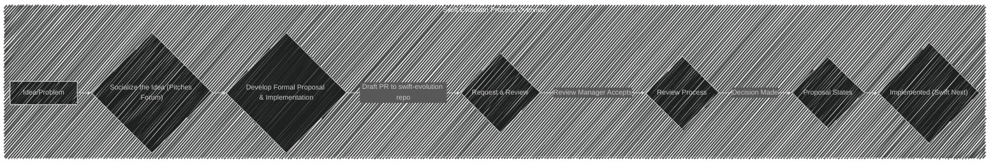
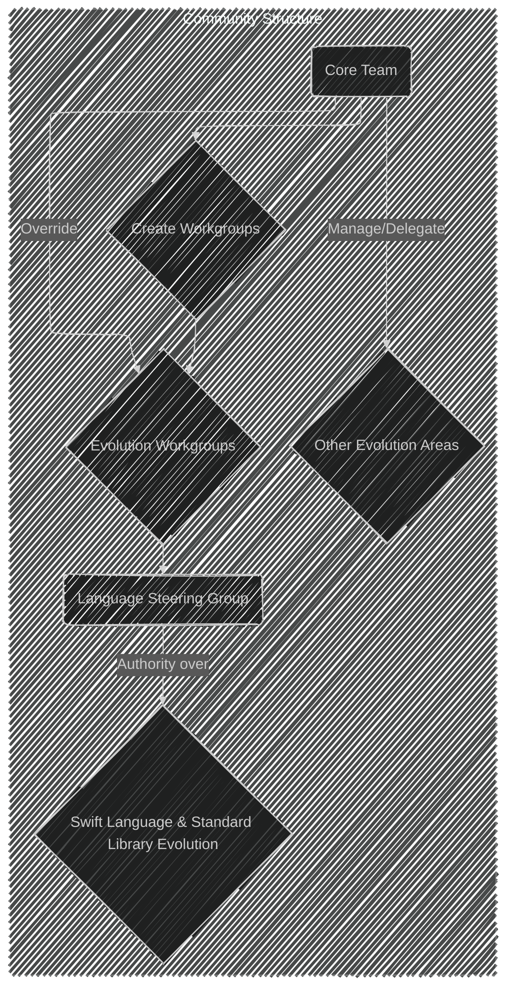
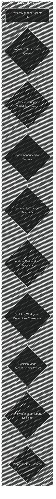
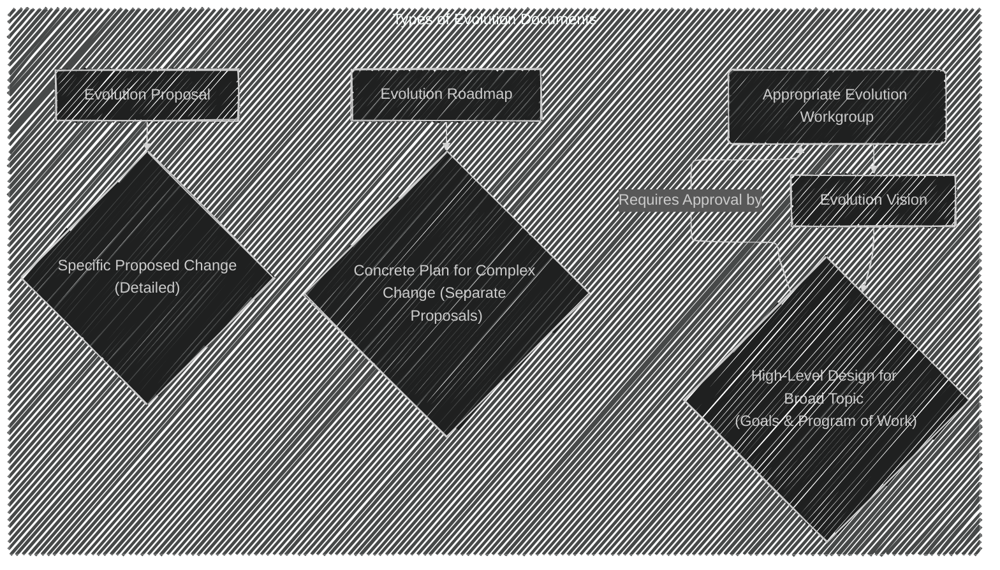
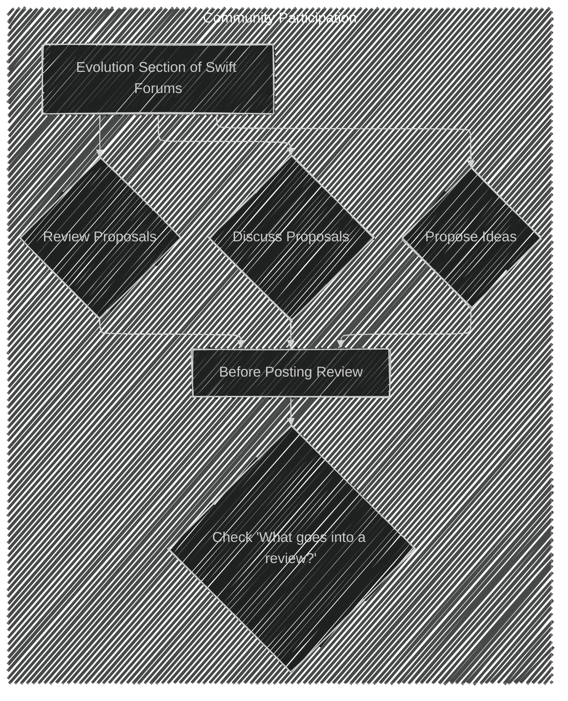

Below is a breakdown of the diagrams I will create, aligning with [the original documentation](https://github.com/swiftlang/swift-evolution/blob/main/process.md):

1. **Overview Diagram:** Create a high-level flowchart of the entire process from idea to implementation.

---
2. **Proposal Lifecycle Diagram:** Focus on the different stages a proposal goes through.

---

3. **Community Structure Diagram:** Illustrate the roles of the Core Team and Language Steering Group.

---

4. **Participation Diagram:** Show how the community can engage in the process.

---

5. **Review Process Diagram:** Detail the steps involved in reviewing a proposal.

6. **Proposal States Diagram:**  (The documentation already provides a basic Mermaid diagram for this, I can enhance it if needed).

7. **How to Propose a Change Diagram:**  Show the steps involved in creating and submitting a proposal.

8. **What Goes into a Review Diagram:** Highlight the key questions to consider during a review.

---

---

---

---

---

