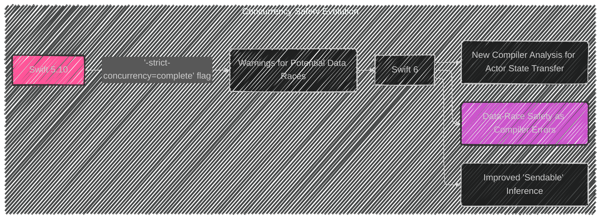
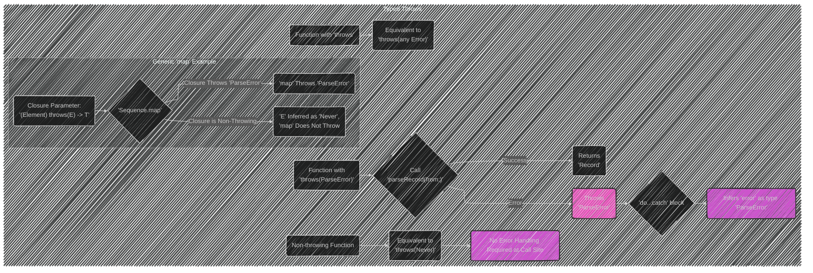
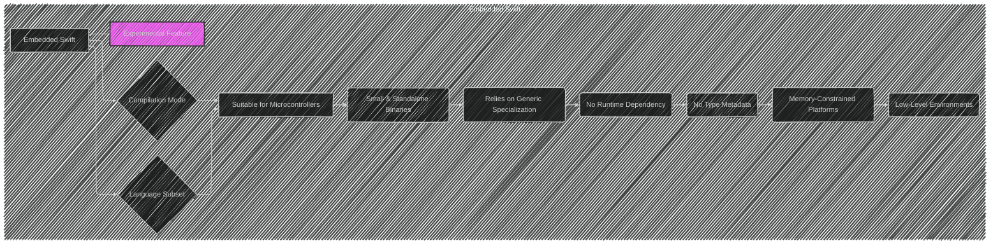
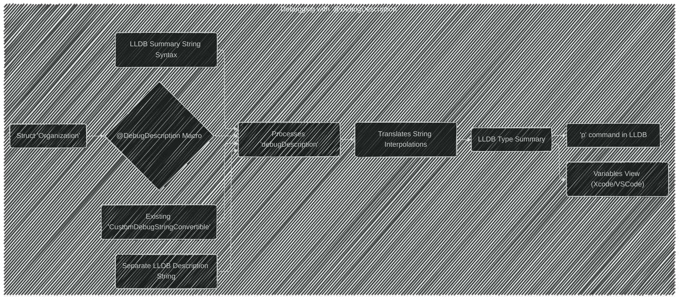
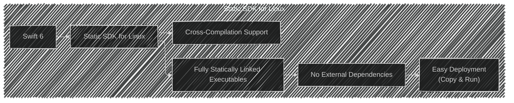
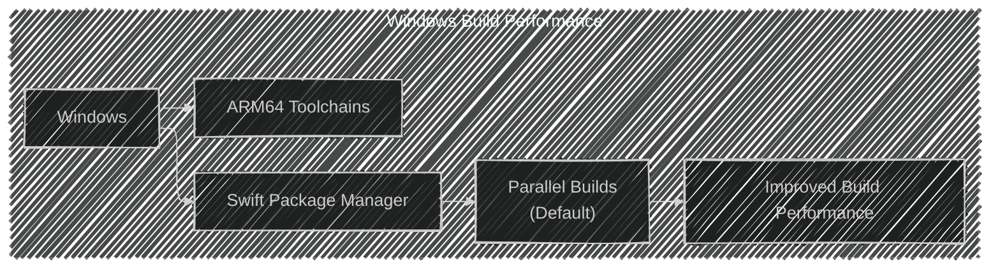

```mermaid
mindmap
  root(("Swift 6 - <br> Major New Release"))
    centralThemes(Central Themes)
      expandedReach(Expanded Reach)
        platforms(More Platforms)
          linux("Linux <br> (Static SDK, Debian, Fedora, Ubuntu 24.04)")
          windows("Windows <br> (ARM64, Parallel Builds)")
          embeddedSwift("Embedded Systems (Experimental)")
        domains(More Domains)
          lowLevelProgramming("Low-Level Programming")
          internetScaleServices("Internet-Scale Services")
          libraries("Libraries")
      enhancedSafety(Enhanced Safety)
        concurrency("Concurrency Safety <br> (Data-Race Prevention as Compiler Errors)")
        memorySafety("Continued Focus on Memory Safety")
      improvedProductivity(Improved Productivity)
        languageEnhancements("Language Enhancements")
        debugging("Debugging Improvements")
        libraries("New and Improved Libraries")
      crossPlatformConsistency("Cross-Platform Consistency")
        foundation("Unified Foundation Implementation")
        swiftTesting("New Swift Testing Library")

    languageAndStandardLibrary("Language and Standard Library")
      concurrencyImprovements("Concurrency Improvements")
        strictConcurrency("Strict Concurrency <br> (Data-Race Safety as Compiler Errors)")
        sendableInference("Improved Sendable Inference")
        actorStateTransfer("New Compiler Analysis for Actor State Transfer")
        synchronizationLibrary("New Synchronization Library <br> (Atomic Operations, Mutex API)")
      typedThrows(Typed Throws)
        specifyErrorTypes("Specify Throwable Error Types in Function Signatures")
        genericCodeUsage("Useful in Generic Code")
        resourceConstrained("Useful in Resource-Constrained Environments")
        throwsAny("'throws' is equivalent to <br> 'throws(any Error)' ")
        throwsNever("Non-throwing is equivalent to <br> 'throws(Never)' ")
        genericFunctions("Propagate Error Types from Generic Parameters")
        sequenceMapExample("Example: <br> 'Sequence.map' propagates closure error type")
      ownership(Ownership)
        nonCopyableTypes("Support for <br> Non-Copyable Types ('~Copyable') <br> in Generics")
        performanceBenefits("Eliminate Copying Overhead")
        protocolConformance("Protocols Can Accommodate Both Copyable and Non-Copyable")
        switchStatements("Copying Avoidance in Enum Pattern Matching")
        stdlibUsage("Used in Standard Libraries <br> (e.g., 'Atomic', 'Optional', 'Result')")
        cppInterop("Used in C++ Interoperability")
      cppInteroperability(C++ Interoperability)
        moveOnlyTypes("Support for C++ Move-Only Types")
        virtualMethods("Support for C++ Virtual Methods")
        defaultArguments("Respect for C++ Default Arguments")
        standardLibraryTypes("Support for <br> 'std::map', 'std::optional' ")
        swiftNoncopyableAnnotation("'SWIFT_NONCOPYABLE' <br> Annotation for Performance")
        sharedImmortalReferences("Support for Virtual Methods on <br> 'SWIFT_SHARED_REFERENCE'/'SWIFT_IMMORTAL_REFERENCE'")
      embeddedSwift("Embedded Swift <br> (Preview)")
        languageSubset("Language Subset for Embedded Software")
        compilationMode("Special Compilation Mode")
        armRiscv("Supports ARM and RISC-V Bare-Metal Targets")
        smallBinaries("Produces Small and Standalone Binaries")
        genericSpecialization("Relies on Generic Specialization")
        noRuntimeMetadata("No Reliance on Runtime or Type Metadata")
        memoryConstrained("Suitable for Memory-Constrained Platforms")
        lowLevelEnvironments("Suitable for Low-Level Environments")
        experimentalFeature("Experimental Feature")
      integers128Bit(128-bit Integers)
        signedAndUnsigned("Signed and Unsigned 128-bit Integer Types")
        availableOnAll("Available on All Swift Platforms")
        sameAPI("Same API as Other Fixed-Width Integers")
      productivityEnhancements(Productivity Enhancements)
        countWhere(" 'count(where:)' <br> for Counting Elements with Predicate")
        packIteration("Pack Iteration for 'for'-loops Over Parameter Packs")
        accessControlImports("Access Control for Imports")
        attachedBodyMacros(" '@attached(body)' Macros for Synthesizing Function Implementations")
        expressionMacrosDefaults("Expression Macros as Default Arguments")
        swiftEvolutionDashboard("Complete List on Swift Evolution Dashboard")

    debugging(Debugging)
      debugDescriptionMacro("@DebugDescription Macro")
        customizeLLDB("Customize Object Display in LLDB <br> ('p' command)")
        xcodeVSCode("Customize Variable View in Xcode and VSCode")
        noArbitraryCode("Formatting Scheme Does Not Run Arbitrary Code")
        usesDebugDescription("Processes 'debugDescription' Property")
        stringInterpolations("Translates String Interpolations to LLDB Summaries")
        existingConformance("Uses Existing 'CustomDebugStringConvertible' ")
        separateInterpolation("Option for Separate LLDB Description String")
        lldbSummaryStringSyntax("Supports LLDB Summary String Syntax Directly")
      improvedStartupPerformance("Improved Startup Performance with Explicit Modules")
        explicitModuleBuilds("Leverages Explicit Module Builds")
        avoidsRecompilation("Avoids Recompiling Implicit Clang Modules")
        fasterDebugging("Faster 'p' and 'po' Commands")
        clangHeaderIssues("Mitigates Clang Header Import Problems")

    libraries(Libraries)
      foundationImprovements(Foundation Improvements)
        unifiedImplementation("Unified Implementation Across All Platforms")
        portableSwift("Modern, Portable Swift Implementation")
        crossPlatformConsistency("Provides Cross-Platform Consistency")
        robustAndOpenSource("More Robust and Open Source")
        coreTypesReimplemented("Core Types Reimplemented in Swift (e.g., `JSONDecoder`, `URL`)")
        macOS15iOS18Sharing("Shares Implementation with macOS 15 and iOS 18")
        newAPIsAvailable("Recent APIs Now Available on All Platforms (e.g., `FormatStyle`, `Predicate`)")
        communityInvolvement("New APIs Built with Community Involvement")
        foundationEssentials(" 'FoundationEssentials' for Targeted Subset (No Internationalization)")
      swiftTesting(Swift Testing)
        newTestingLibrary("New Testing Library Designed for Swift")
        expressiveAPIs("Expressive APIs for Writing and Organizing Tests")
        detailedOutput("#expect Macro for Detailed Failure Output")
        scalability("Scales to Large Codebases (Parameterization)")
        testAndSuiteMacros(" '@Test' and '@Suite' Attached Macros")
        traits("Customizable Behaviors with Traits")
        requireMacro("#require Macro for Validation")
        richFailureMessages("Captures Rich Representations for Failure Messages")
        integratedInToolchain("Included Directly in Swift 6 Toolchains (`import Testing`)")
        noPackageDependency("No Need to Declare a Package Dependency")
        automaticExecution("Automatically Built and Run by Package Manager")
        supportsAllPlatforms("Supports All Officially Supported Swift Platforms")
        openSourceProject("Open Source Project")

    platformSupport(Platform Support)
      linuxImprovements(Linux Improvements)
        fullyStaticSDK("Fully Static SDK for Linux")
          noExternalDependencies("No External Dependencies")
          easyDeployment("Ideal for Direct Copying or Containers")
          crossCompilation("Supports Cross-Compilation")
        newDistributions("New Supported Distributions")
          debian("Debian")
          fedora("Fedora")
          ubuntu2404("Ubuntu 24.04")
      windowsImprovements(Windows Improvements)
        arm64Toolchains("Prebuilt Toolchains for ARM64")
        parallelBuilds("Parallel Builds Enabled by Default in SPM")
        buildPerformance("Significant Build Performance Improvements")

    nextSteps(Next Steps)
      downloadSwift6("Download Swift 6 Toolchains (Swift.org/install)")
      getStarted("Get Started with Swift (Swift.org/getting-started)")
      explorePackages("Explore the Package Ecosystem (Swift.org/packages)")
      getInvolved("Get Involved (Swift.org/contributing)")
      decadeOfSwift("Marks a Decade of Swift")

```

Below is a breakdown of the diagrams I will create, aligning with [the original documentation](https://www.swift.org/blog/announcing-swift-6):

---





---





---





---





---




---


```mermaid
---
config:
  layout: elk
  look: handDrawn
  theme: dark
---
graph LR
    subgraph Swift Testing
        A[@Test Macro] --> B(Declares Test Functions);
        C[@Suite Macro] --> D(Declares Test Suite Types);
        E[#expect Macro] --> F(Validates Expected Behaviors);
        F --> G(Captures Rich Representations for Failure Messages);
        H[#require Macro] --> I(Validation);
        J("Swift 6 Toolchain") --> K(" 'import Testing' ");
        K --> L(No Package Dependency Declaration);
        M("Package Manager") --> N(Builds & Runs Swift Testing Tests);
        N --> O(Shows Results with XCTest);
        P("Swift Platforms") --> Q(Supports All);
    end
    
```

---




---





These diagrams provide a visual and structured understanding of the key features and improvements introduced in Swift 6. They highlight the relationships between different components and explain the technical aspects in more detail.


----
