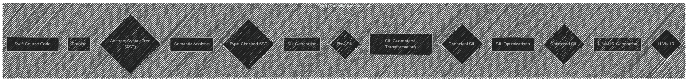
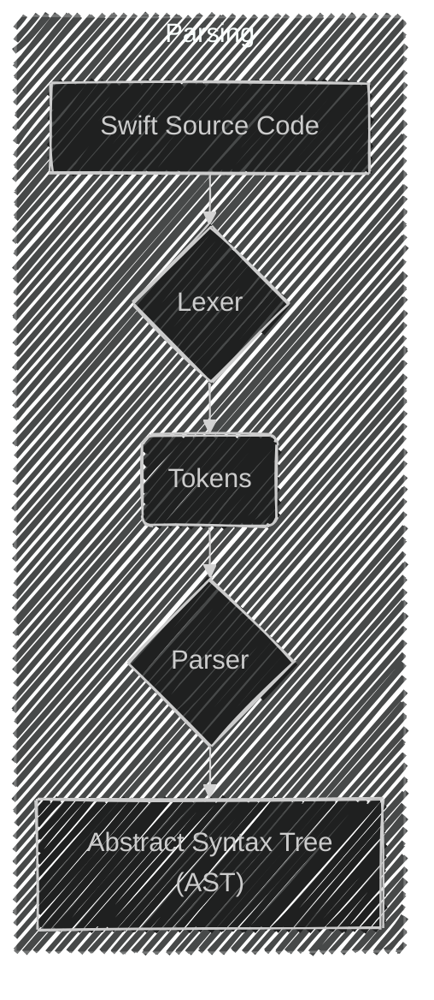
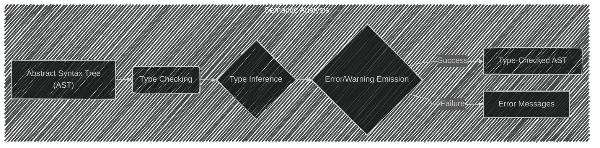
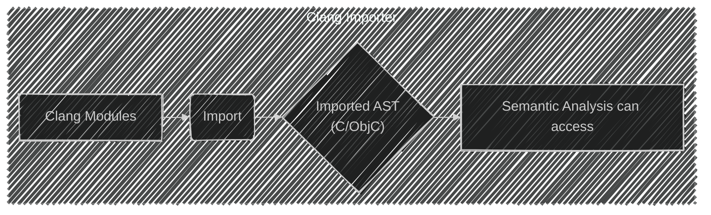
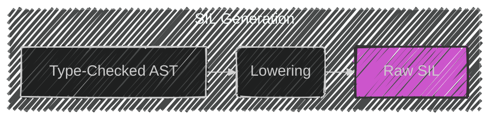
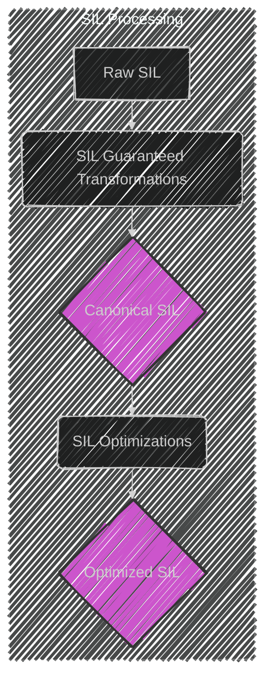
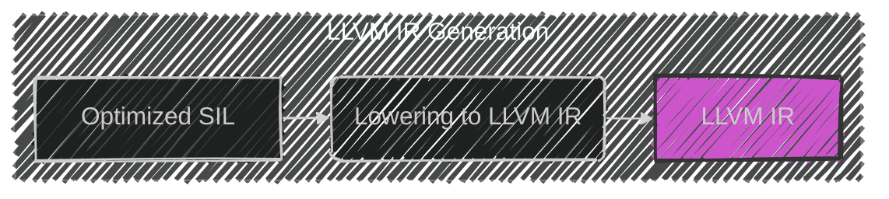
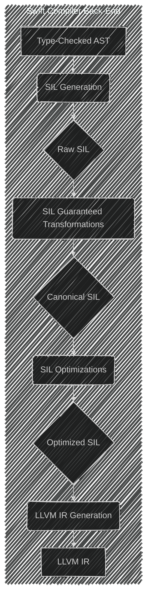

Below is a breakdown of the diagrams I will create, aligning with [the original documentation](https://www.swift.org/documentation/swift-compiler/):

---

**Plan:**

1. Create a flowchart-style diagram to illustrate the overall compilation process.
2. Create individual component diagrams for key stages like parsing, semantic analysis, SIL generation, and LLVM IR generation, highlighting their inputs and outputs.
3. Consider using subgraphs to group related components.

---

---

---

----

---

---

---

---

---

---

