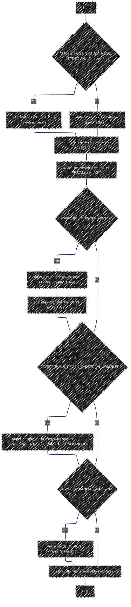

> This content is dual-licensed under your choice of the following licenses:
> 1.  **MIT License:** For the code implementations in Swift and Mermaid provided in this document.
> 2.  **Creative Commons Attribution 4.0 International License (CC BY 4.0):** For all other content, including the text, explanations, and the Mermaid diagrams and illustrations.

---

Below is a breakdown of the diagrams I will create, aligning with [the original documentation](https://github.com/swiftlang/swift/blob/main/lib/Parse/CMakeLists.txt):

---

Here's a breakdown of the structure and the diagrams I can create:

1. **Overall Structure:** The CMake code defines a Swift host library (`swiftParse`) and its dependencies.
2. **Conditional Logic:** There are `if` statements that control certain configurations based on the operating system (`CMAKE_HOST_SYSTEM_NAME`) and build flags (`SWIFT_BUILD_SWIFT_SYNTAX`, `SWIFT_BUILD_REGEX_PARSER_IN_COMPILER`, `SWIFT_COMPILER_VERSION`).
3. **Components:**
    - Target: `swiftParse` (a static library)
    - Source files: List of `.cpp` files
    - Private Link Libraries: `swiftAST`
    - Conditional Private Link Libraries: `swiftASTGen` (based on `SWIFT_BUILD_SWIFT_SYNTAX`)
    - Conditional Compile Definitions: `SWIFT_BUILD_REGEX_PARSER_IN_COMPILER`
    - Conditional Compile Flags: `SWIFT_COMPILER_VERSION`
    - Function Call: `add_swift_host_library`
    - Function Call: `target_link_libraries`
    - Function Call: `add_dependencies`
    - Function Call: `target_compile_definitions`
    - Function Call: `set_property`
    - Function Call: `set_swift_llvm_is_available`

Based on this, I can create several diagrams:

- **Diagram 1: Overall Module Structure:**  Shows `swiftParse` and its direct dependencies (both always and conditionally).
- **Diagram 2: Conditional Compilation:** Focuses on the `if` statements and their impact on the build process.
- **Diagram 3: Source File Composition:** Lists the C++ source files that make up `swiftParse`.
- **Diagram 4:  CMake Command Flow:** Illustrates the sequence of CMake commands.

I will use `graph TD` for most of these to show dependencies and flow.

**Explanation:**

* **Operating System Specific Flags:** This subgraph highlights the conditional setting of `SWIFT_GYB_FLAGS` based on whether the host system is Windows.
* **swiftParse Library Definition:** This shows the core definition of the `swiftParse` library, including the source files it comprises and its basic dependency on `swiftAST`.
* **Conditional Swift Syntax Linking:** This illustrates the conditional inclusion of `swiftASTGen` as a dependency based on the `SWIFT_BUILD_SWIFT_SYNTAX` flag.
* **Conditional Regex Parser Definition:** This shows the conditional compilation definition based on the `SWIFT_BUILD_REGEX_PARSER_IN_COMPILER` flag.
* **Conditional Compiler Version Flag:** This depicts how a compile flag is conditionally set based on the existence of `SWIFT_COMPILER_VERSION`.
* **Overall Flow:** The main diagram connects these subgraphs to show the overall flow of the CMake configuration.

---

**Explanation:**

* **swiftParse Library:** This subgraph visually represents the `swiftParse` library and lists all the `.cpp` files that are part of it.
* **Dependencies:** This section illustrates the dependencies of `swiftParse`. It shows the direct private dependency on `swiftAST` and the conditional private dependency on `swiftASTGen`.
* **Compile Definitions:** This shows the conditional compilation definition based on the `SWIFT_BUILD_REGEX_PARSER_IN_COMPILER` flag.
* **Compile Flags:** This depicts how a compile flag (`DSWIFT_COMPILER_VERSION`) is conditionally added to `ParseVersion.cpp` if `SWIFT_COMPILER_VERSION` is defined.

---

**Explanation:**

This diagram uses a flowchart style to illustrate the sequential flow of the CMake commands and the conditional logic involved:

1. **Start:** The process begins.
2. **Operating System Check:** Checks if the OS is Windows.
3. **Set GYB Flags (Windows):** Sets the `SWIFT_GYB_FLAGS` for Windows.
4. **Set GYB Flags (Other):** Sets the `SWIFT_GYB_FLAGS` for other operating systems.
5. **Add swiftParse Library:** Defines the `swiftParse` library.
6. **Link swiftAST:** Links the `swiftParse` library with `swiftAST`.
7. **Check SWIFT_BUILD_SWIFT_SYNTAX:** Checks the value of the `SWIFT_BUILD_SWIFT_SYNTAX` flag.
8. **Link swiftASTGen:** If true, links `swiftParse` with `swiftASTGen`.
9. **Add Dependencies:** Adds a dependency on `swiftASTGen` if the flag is true.
10. **Check SWIFT_BUILD_REGEX_PARSER_IN_COMPILER:** Checks the value of this flag.
11. **Define Regex Parser Flag:** If true, defines the compile flag.
12. **Check SWIFT_COMPILER_VERSION:** Checks if `SWIFT_COMPILER_VERSION` is defined.
13. **Set Compiler Version Flag:** If defined, sets the compile flag for `ParseVersion.cpp`.
14. **Set LLVM Availability:** Calls the function to set LLVM availability.
15. **End:** The CMake configuration process ends.

These diagrams provide different visual perspectives on the provided Swift documentation, making it easier to understand the structure, dependencies, and conditional configurations within the CMake build system.

----

