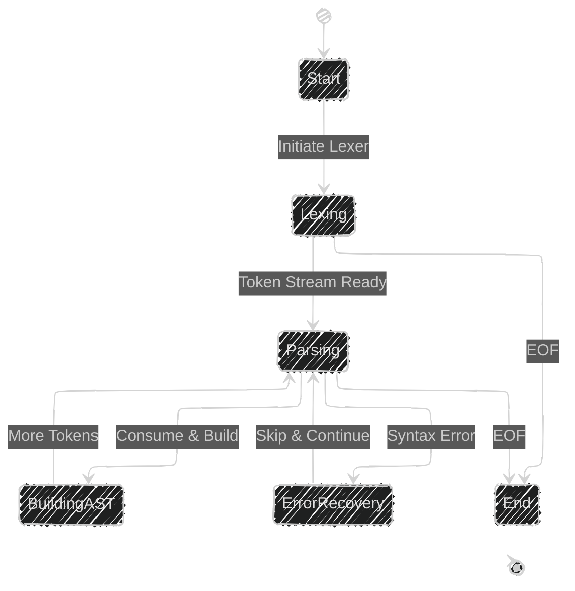
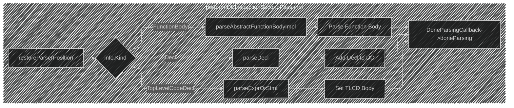
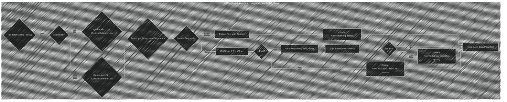

Below is a breakdown of the diagrams I will create, aligning with [the original documentation](https://github.com/swiftlang/swift/blob/main/lib/Parse/Parser.cpp):

---

Here's a breakdown of the steps:

1. **Identify Core Classes and Structures:** Look for key classes like `Parser`, `Lexer`, `SourceFile`, `Token`, etc., and their relationships.
2. **Visualize Parsing Process:**  Represent the flow of parsing, including tokenization and AST construction.
3. **Illustrate Key Methods and Functions:**  Pick out important functions and their roles in the parsing process.
4. **Represent Data Flow:** Depict how data, like tokens and AST nodes, moves between different parts of the parser.
5. **Choose Appropriate Mermaid Diagram Types:** Select diagram types that best represent the information (e.g., class diagrams, flowcharts, state diagrams).
6. **Create Mermaid Code:** Translate the identified components and relationships into Mermaid syntax.

---

---

---

---

---

---

---

----

