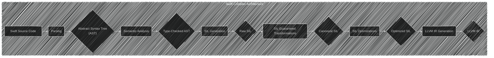
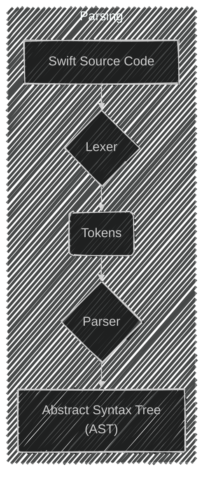
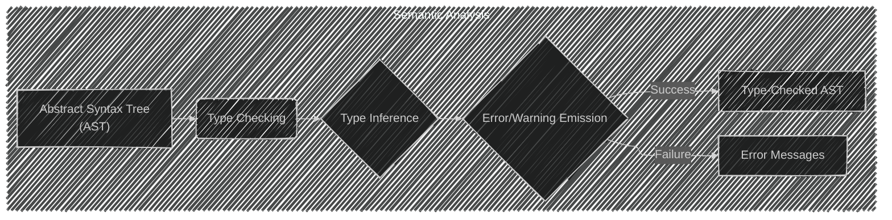
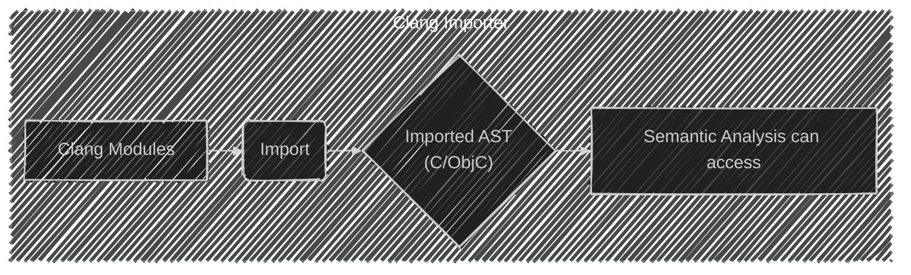
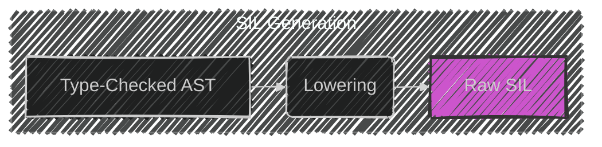
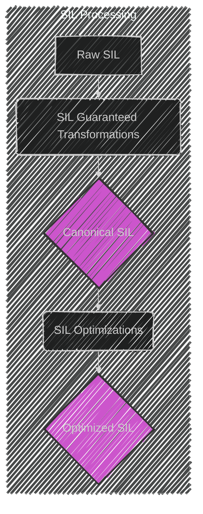
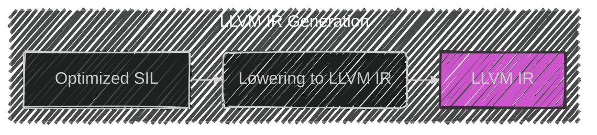
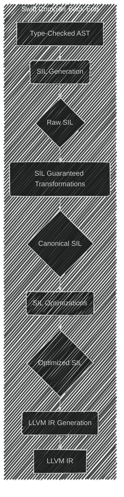

> This content is dual-licensed under your choice of the following licenses:
> 1.  **MIT License:** For the code implementations in Swift and Mermaid provided in this document.
> 2.  **Creative Commons Attribution 4.0 International License (CC BY 4.0):** For all other content, including the text, explanations, and the Mermaid diagrams and illustrations.

---

Below is a breakdown of the diagrams I will create, aligning with [the original documentation](https://www.swift.org/documentation/swift-compiler/):

---

**Plan:**

1. Create a flowchart-style diagram to illustrate the overall compilation process.
2. Create individual component diagrams for key stages like parsing, semantic analysis, SIL generation, and LLVM IR generation, highlighting their inputs and outputs.
3. Consider using subgraphs to group related components.

---

---

---

----

---

---

---

---

---

Below are the major components of the Swift compiler:

- **Parsing**: The parser is a simple, recursive-descent parser (implemented in [lib/Parse](https://github.com/swiftlang/swift/tree/main/lib/Parse)) with an integrated, hand-coded lexer. The parser is responsible for generating an Abstract Syntax Tree (AST) without any semantic or type information, and emits warnings or errors for grammatical problems with the input source.
    
- **Semantic analysis**: Semantic analysis (implemented in [lib/Sema](https://github.com/swiftlang/swift/tree/main/lib/Sema)) is responsible for taking the parsed AST and transforming it into a well-formed, fully-type-checked form of the AST, emitting warnings or errors for semantic problems in the source code. Semantic analysis includes type inference and, on success, indicates that it is safe to generate code from the resulting, type-checked AST.
    
- **Clang importer**: The Clang importer (implemented in [lib/ClangImporter](https://github.com/swiftlang/swift/tree/main/lib/ClangImporter)) imports [Clang modules](http://clang.llvm.org/docs/Modules.html) and maps the C or Objective-C APIs they export into their corresponding Swift APIs. The resulting imported ASTs can be referred to by semantic analysis.
    
- **SIL generation**: The Swift Intermediate Language (SIL) is a high-level, Swift-specific intermediate language suitable for further analysis and optimization of Swift code. The SIL generation phase (implemented in [lib/SILGen](https://github.com/swiftlang/swift/tree/main/lib/SILGen)) lowers the type-checked AST into so-called “raw” SIL. The design of SIL is described in [docs/SIL.rst](https://github.com/swiftlang/swift/blob/main/docs/SIL.rst).
    
- **SIL guaranteed transformations**: The SIL guaranteed transformations (implemented in [lib/SILOptimizer/Mandatory](https://github.com/swiftlang/swift/tree/main/lib/SILOptimizer/Mandatory)) perform additional dataflow diagnostics that affect the correctness of a program (such as a use of uninitialized variables). The end result of these transformations is “canonical” SIL.
    
- **SIL optimizations**: The SIL optimizations (implemented in [lib/SILOptimizer/Analysis](https://github.com/swiftlang/swift/tree/main/lib/SILOptimizer/Analysis), [lib/SILOptimizer/ARC](https://github.com/swiftlang/swift/tree/main/lib/SILOptimizer/ARC), [lib/SILOptimizer/LoopTransforms](https://github.com/swiftlang/swift/tree/main/lib/SILOptimizer/LoopTransforms), and [lib/SILOptimizer/Transforms](https://github.com/swiftlang/swift/tree/main/lib/SILOptimizer/Transforms)) perform additional high-level, Swift-specific optimizations to the program, including (for example) Automatic Reference Counting optimizations, devirtualization, and generic specialization.
    
- **LLVM IR generation**: IR generation (implemented in [lib/IRGen](https://github.com/swiftlang/swift/tree/main/lib/IRGen)) lowers SIL to [LLVM IR](http://llvm.org/docs/LangRef.html), at which point [LLVM](http://llvm.org/) can continue to optimize it and generate machine code.

---

