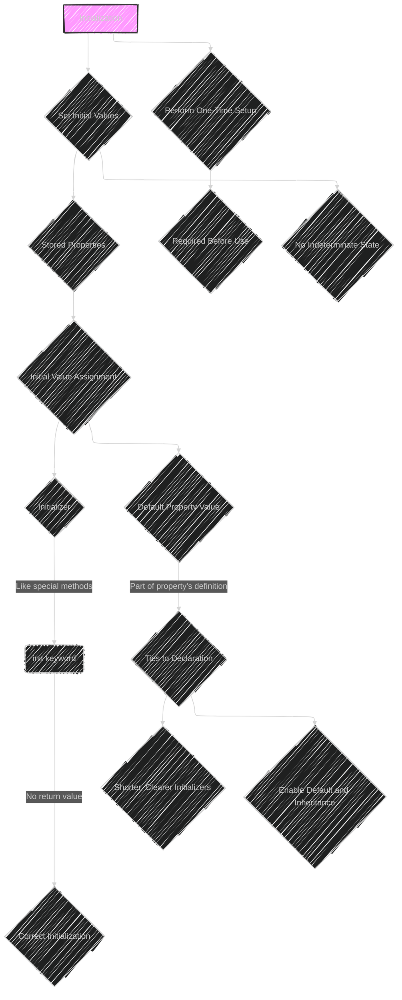

The mermaid diagram below is my attempt to translate and to explain the initialization process from the official original documentation on [Swift Initialization](https://docs.swift.org/swift-book/documentation/the-swift-programming-language/initialization). This is still a work in progress.

In essence, below is a comprehensive Mermaid diagram cover all the concepts involved in Swift Initialization.

Here's a breakdown components will be covered in the Mermaid diagram:

1. **Basic Initialization:** Diagram showing the `init()` syntax and a simple example.
2. **Default Property Values:**  Illustrate how default values simplify initialization.
3. **Initialization Parameters:** Show initializers with parameters and argument labels.
4. **Initializer Parameters Without Argument Labels:**  Demonstrate the use of `_`.
5. **Optional Property Types:** Visualize how optional properties are initialized to `nil`.
6. **Assigning Constant Properties:** Show the timing of constant property assignment during initialization.
7. **Default Initializers:** Depict the automatic creation of default initializers for structures and classes.
8. **Memberwise Initializers:** Illustrate memberwise initializers for structures.
9. **Initializer Delegation for Value Types:** Diagram the `self.init` call for delegation in structs.
10. **Class Inheritance and Initialization:** Show the concepts of designated and convenience initializers.
11. **Initializer Delegation for Class Types:** Illustrate the rules of delegation (up for designated, across for convenience).
12. **Two-Phase Initialization:** Create diagrams for Phase 1 and Phase 2 of class initialization.
13. **Initializer Inheritance and Overriding:** Show how subclasses can override superclass initializers.
14. **Automatic Initializer Inheritance:** Illustrate the rules for automatic inheritance.
15. **Designated and Convenience Initializers in Action:** Visualize the initializer chains for the `Food`, `RecipeIngredient`, and `ShoppingListItem` example.
16. **Failable Initializers:** Show the `init?` syntax and how they return optionals.
17. **Failable Initializers for Enumerations:** Diagram the use of failable initializers for enums.
18. **Failable Initializers for Enumerations with Raw Values:** Show the automatic `init?(rawValue:)`.
19. **Propagation of Initialization Failure:** Illustrate how failure propagates through initializer delegation.
20. **Overriding a Failable Initializer:**  Show overriding with both failable and non-failable initializers.
21. **The init! Failable Initializer:** Diagram the `init!` syntax.
22. **Required Initializers:** Visualize the use of the `required` keyword.
23. **Setting a Default Property Value with a Closure or Function:** Illustrate the use of closures for default values.

---

---

---
