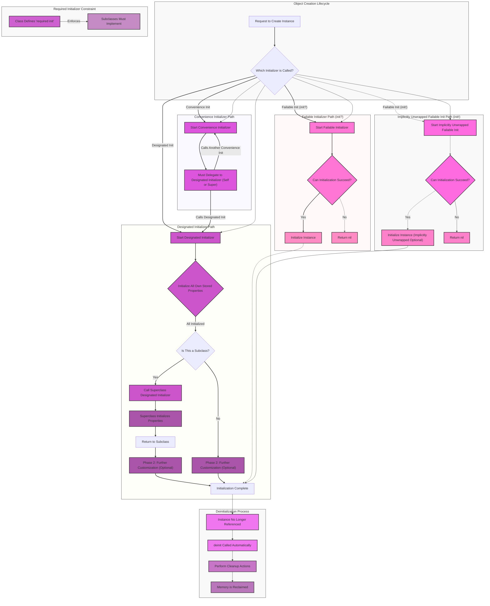

The mermaid diagram below is my attempt to translate and to explain the initialization process from the official original documentation on [Swift Initialization](https://docs.swift.org/swift-book/documentation/the-swift-programming-language/initialization). This is still a work in progress.

In essence, below is a comprehensive Mermaid diagram provides a visual walkthrough of the different paths and processes involved in creating and destroying objects in Swift, with a focus on the various types of initializers and their specific roles.

---

Here's a breakdown of each component in the comprehensive Mermaid diagram:

## Subgraphs (Representing higher-level concepts)

*   **Object Creation Lifecycle:**  This is the starting point, representing the initial request to create an instance of a class.
*   **Designated Initializer Path:**  This outlines the primary and most fundamental way a class is initialized. It ensures all essential properties are set and calls upon superclasses for their initialization.
*   **Convenience Initializer Path:** This describes how convenience initializers act as secondary initializers, simplifying common initialization scenarios by ultimately delegating to a designated initializer.
*   **Failable Initializer Path (init?)**: This illustrates the flow for initializers that can potentially fail during the initialization process and return `nil`.
*   **Implicitly Unwrapped Failable Init Path (init!)**: Similar to the regular failable initializer, but the successfully initialized instance is an implicitly unwrapped optional, carrying a risk of runtime errors if accessed when `nil`.
*   **Required Initializer Constraint:** This highlights the rule that if a class defines a `required` initializer, all its subclasses must also implement it, ensuring consistent initialization across the inheritance hierarchy.
*   **Deinitialization Process:** This depicts what happens when an instance is no longer needed, showing the automatic call to `deinit` for cleanup and the eventual memory reclamation.

## Nodes (Representing specific steps or states)

*   **A (Request to Create Instance):** The very beginning of the process, someone or something asks for a new object.
*   **B (Which Initializer is Called?):**  A decision point determining the type of initializer being invoked.
*   **C (Start Designated Initializer):** The execution of a designated initializer begins.
*   **D (Initialize All Own Stored Properties):**  The core responsibility of a designated initializer – setting the initial values of all non-optional properties declared in the class.
*   **E (Is This a Subclass?):** A check to see if the current class inherits from another class.
*   **F (Call Superclass Designated Initializer):** If it's a subclass, the designated initializer calls the designated initializer of its superclass to ensure the superclass's properties are also initialized.
*   **G (Superclass Initializes Properties):** The superclass performs its property initialization.
*   **H (Return to Subclass):** Control returns to the subclass's initializer after the superclass has finished.
*   **I (Phase 2: Further Customization (Optional)):**  The second phase of initialization where further setup or customization can be performed.
*   **J (Initialization Complete):** The object has been successfully initialized and is ready for use.
*   **K (Phase 2: Further Customization (Optional)):** Similar to 'I', but for base classes that don't have a superclass to initialize.
*   **L (Start Convenience Initializer):** The execution of a convenience initializer begins.
*   **M (Must Delegate to Designated Initializer (Self or Super)):** The key characteristic of a convenience initializer – it must call another initializer (usually designated) to handle the primary initialization.
*   **N (Start Failable Initializer):** The execution of a failable initializer (`init?`) begins.
*   **O (Can Initialization Succeed?):** A conditional check within a failable initializer to determine if the initialization criteria are met.
*   **P (Initialize Instance):** If the conditions are met, the instance is initialized.
*   **Q (Return nil):** If the conditions are not met, the failable initializer returns `nil`, indicating failure.
*   **R (Start Implicitly Unwrapped Failable Init):** The execution of an implicitly unwrapped failable initializer (`init!`) begins.
*   **S (Can Initialization Succeed?):** Similar to 'O', a check for success within an `init!`.
*   **T (Initialize Instance (Implicitly Unwrapped Optional)):** The instance is initialized, but it's an implicitly unwrapped optional.
*   **U (Return nil):** If initialization fails, `nil` is returned. Accessing this `nil` value without checking will cause a runtime error.
*   **V (Class Defines 'required init'):** A base class declares a `required` initializer.
*   **W (Subclasses Must Implement):**  The consequence of a `required` initializer – all subclasses are obligated to provide an implementation.
*   **X (Instance No Longer Referenced):** The point at which an instance is no longer held by any strong references.
*   **Y (deinit Called Automatically):** The system automatically calls the `deinit` method of the instance.
*   **Z (Perform Cleanup Actions):**  The code within the `deinit` method is executed, allowing for resource release or other cleanup tasks.
*   **AA (Memory is Reclaimed):**  The memory occupied by the instance is freed by the system.

---

