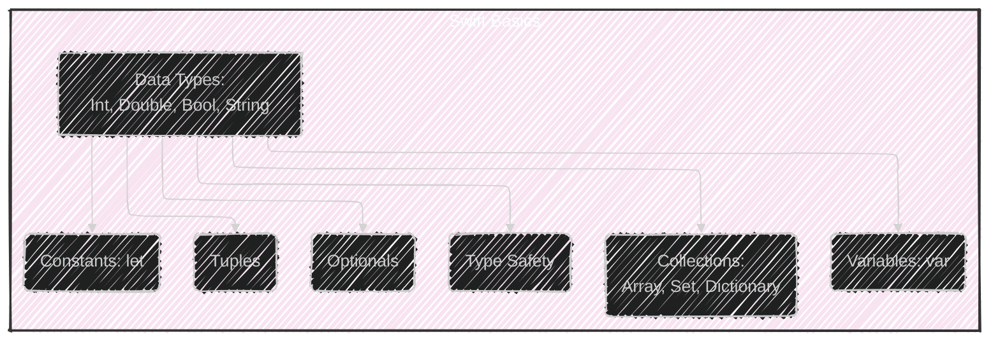
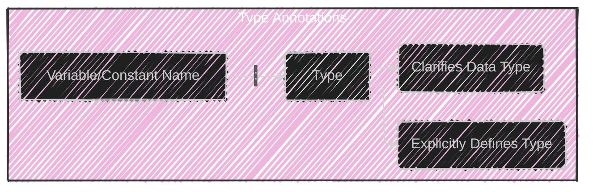
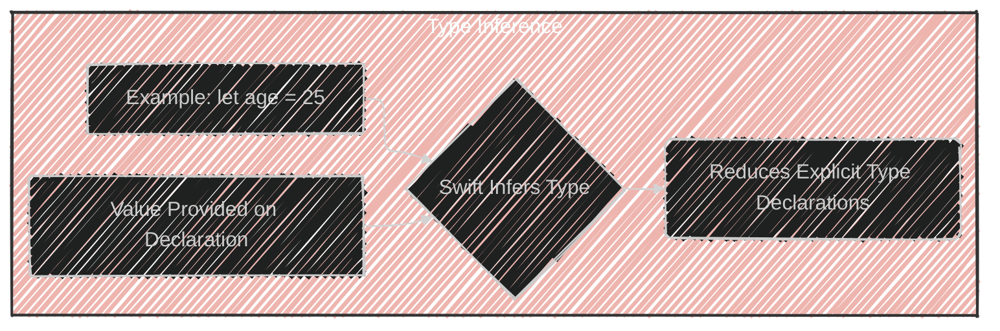
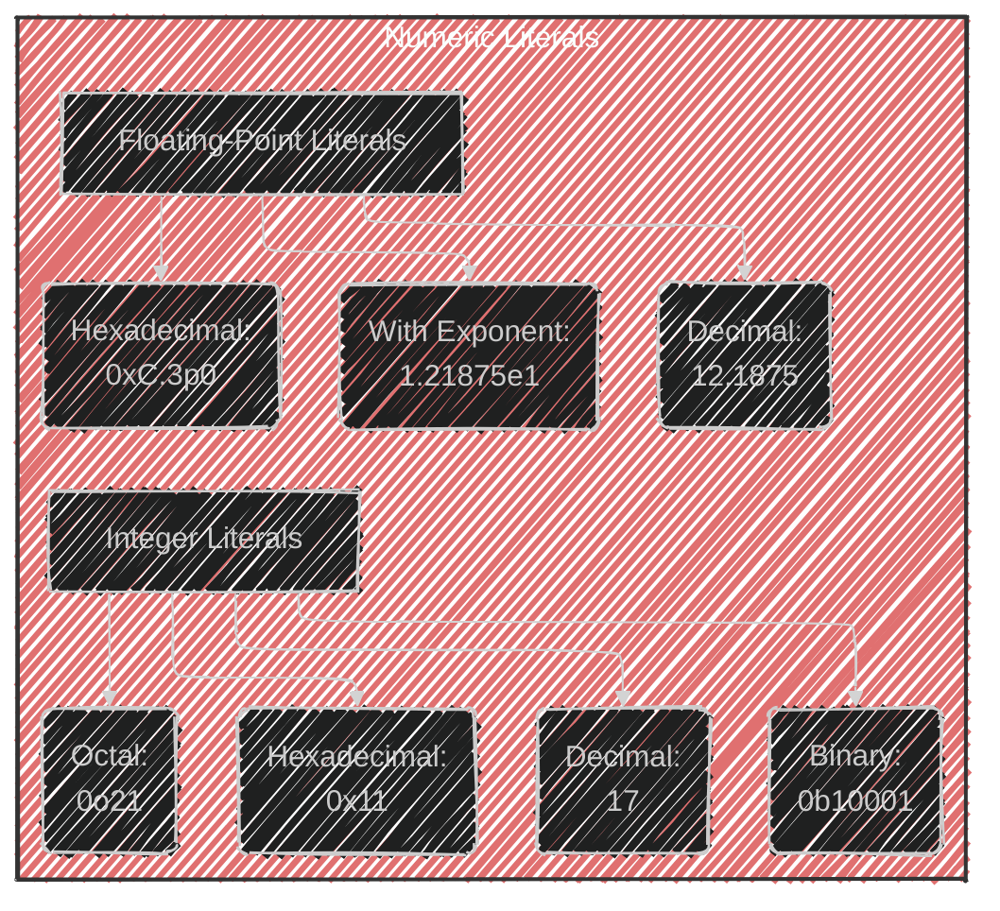
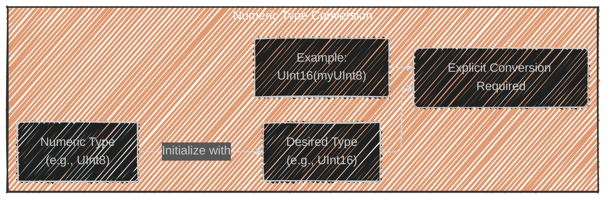
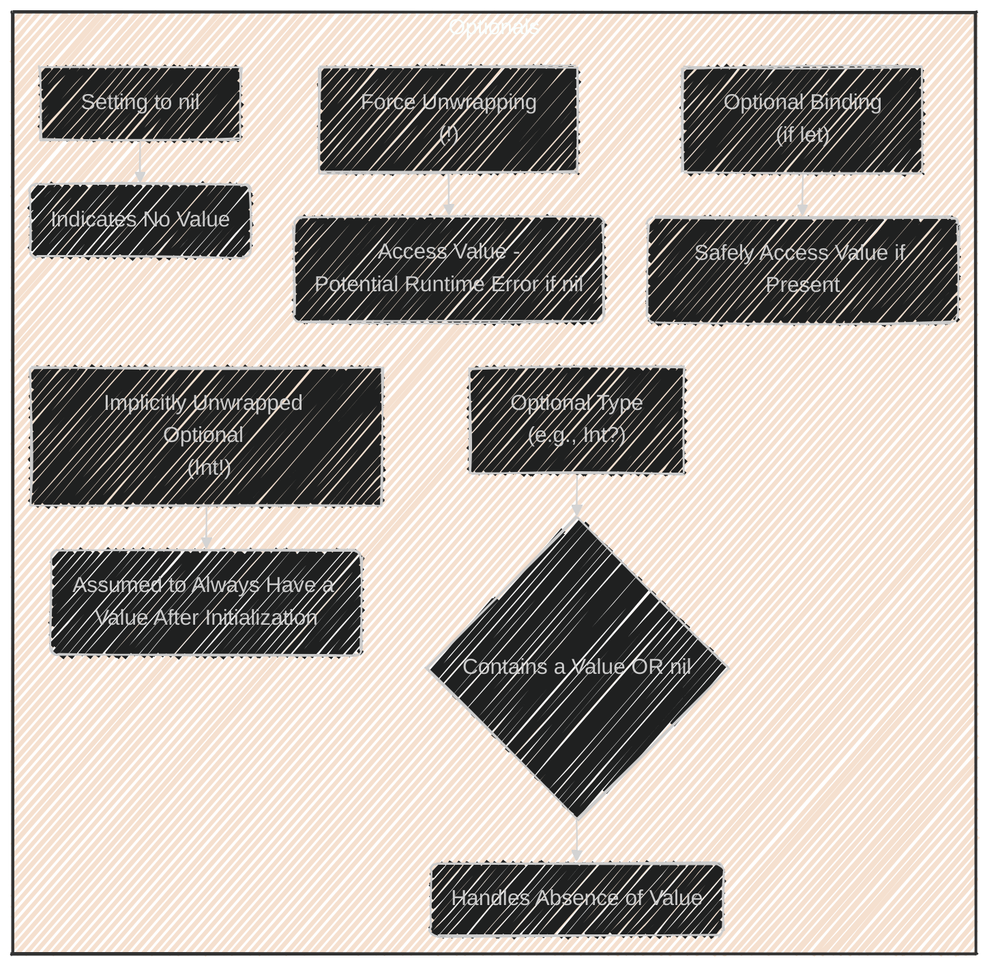
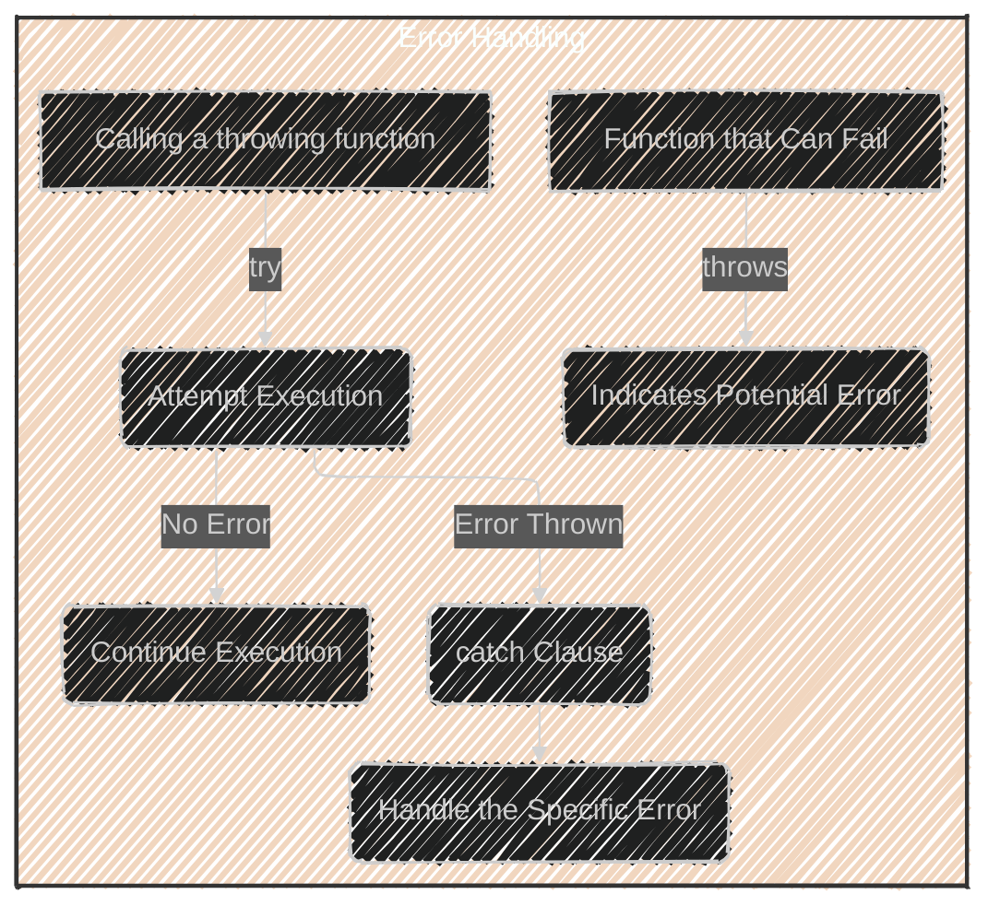
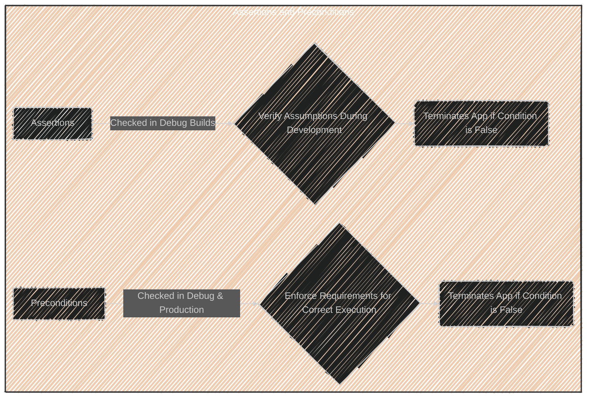

> This content is dual-licensed under your choice of the following licenses:
> 1.  **MIT License:** For the code implementations in Swift and Mermaid provided in this document.
> 2.  **Creative Commons Attribution 4.0 International License (CC BY 4.0):** For all other content, including the text, explanations, and the Mermaid diagrams and illustrations.

---

Below is a breakdown of the diagrams I will create, aligning with [the original documentation](https://github.com/swiftlang/swift-book/blob/main/TSPL.docc/LanguageGuide/TheBasics.md):

---

Here's a plan for creating the diagrams:

1. **High-Level Structure:** Start with a diagram showing the main topics covered in the "The Basics" section.
2. **Constants and Variables:**  Illustrate the difference between `let` and `var`.
3. **Type Annotations:** Show how type annotations clarify data types.
4. **Type Inference:** Depict how Swift automatically infers types.
5. **Numeric Literals:** Visualize different ways of representing integer literals (decimal, binary, etc.).
6. **Type Conversion:** Illustrate explicit type conversion between different numeric types.
7. **Tuples:**  Show how tuples group multiple values.
8. **Optionals:** Explain the concept of optionals and how they handle the absence of a value (using `nil`). Depict optional binding and force unwrapping.
9. **Error Handling:**  Illustrate the `try`, `catch`, and `throw` mechanism.
10. **Assertions and Preconditions:** Show the difference between assertions (debug only) and preconditions (debug and production).Here are some Mermaid diagrams and illustrations to accompany the Swift documentation you provided:

---

---

---

---

---

---

---

---

---

These diagrams aim to provide visual summaries of the concepts explained in the Swift documentation. You can use them to enhance understanding and make the documentation more engaging. Remember that the level of detail in each diagram can be adjusted based on the specific focus and audience.

---
**Licenses:**

- **MIT License:**   - Full text in [LICENSE](LICENSE) file.
- **Creative Commons Attribution 4.0 International:**  - Legal details in [LICENSE-CC-BY](LICENSE-CC-BY) and at [Creative Commons official site](http://creativecommons.org/licenses/by/4.0/).

---