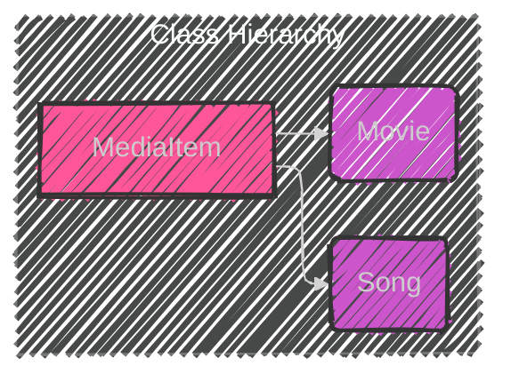
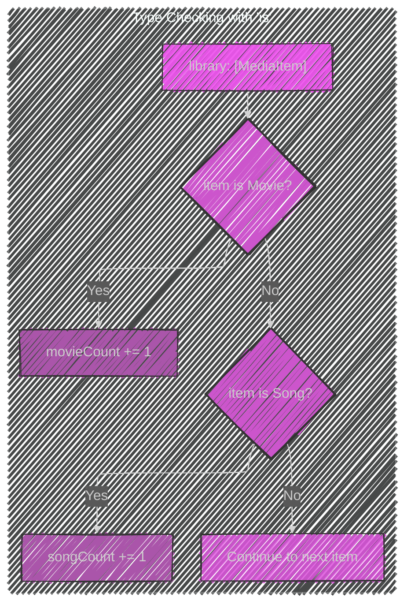
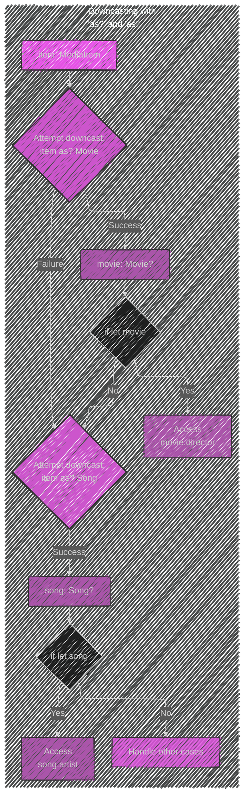
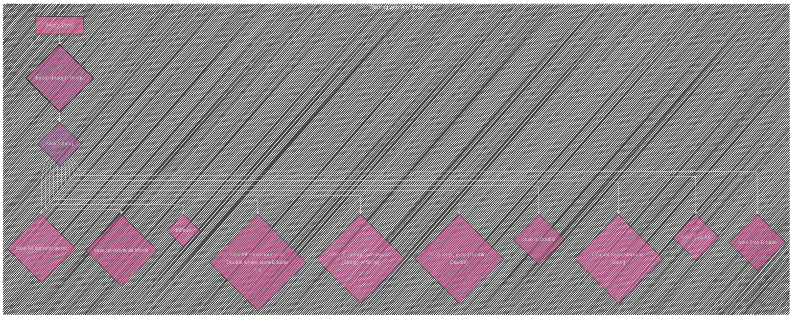

Below is a breakdown of the diagrams I will create, aligning with [the original documentation](https://github.com/swiftlang/swift-book/blob/main/TSPL.docc/LanguageGuide/TypeCasting.md):

---

Here's a plan:

1. **Class Hierarchy Diagram:** Show the inheritance relationship between `MediaItem`, `Movie`, and `Song`.
2. **Type Checking Diagram:** Illustrate how the `is` operator is used to check the type of objects in the `library` array.
3. **Downcasting Diagram:** Demonstrate the use of `as?` and `as!` to cast `MediaItem` objects to `Movie` or `Song`.
4. **Any Type Diagram:**  Show how different types can be stored in an array of type `[Any]` and how a `switch` statement can be used to identify the specific type.

---

---

---

---

