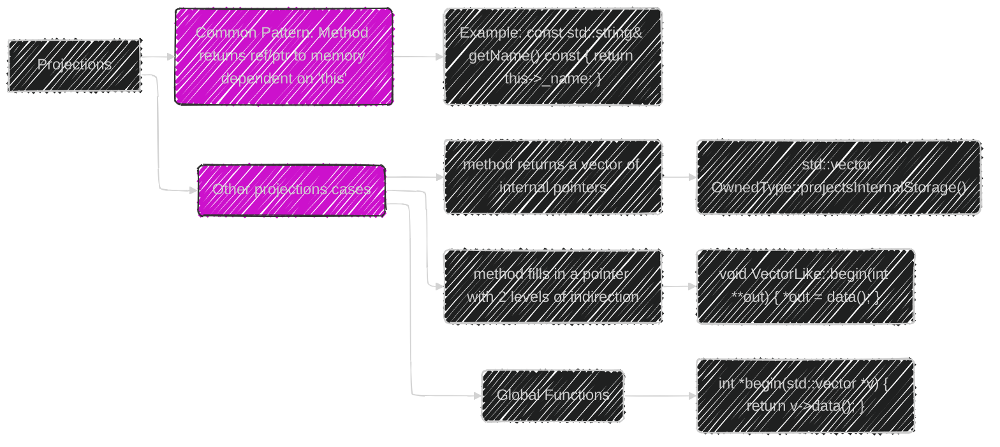
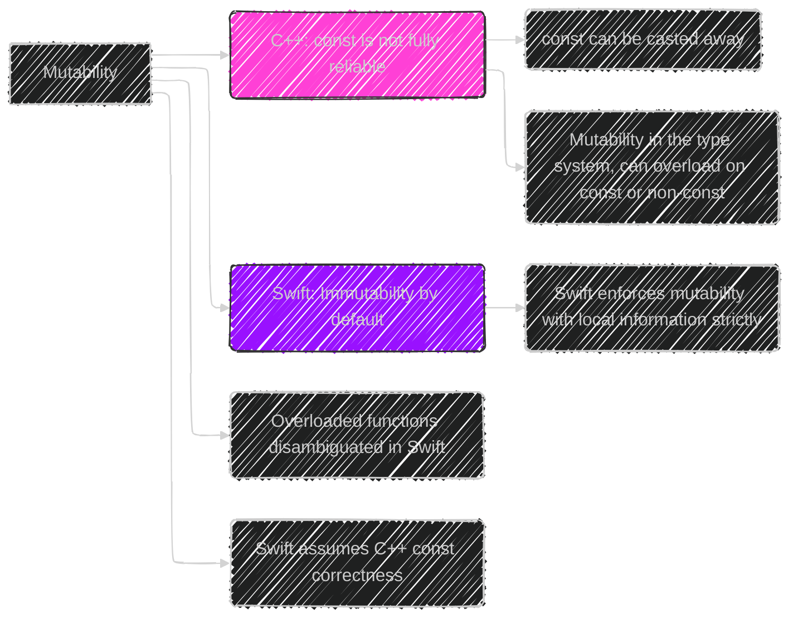
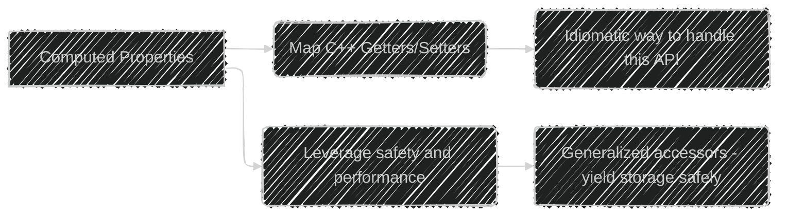
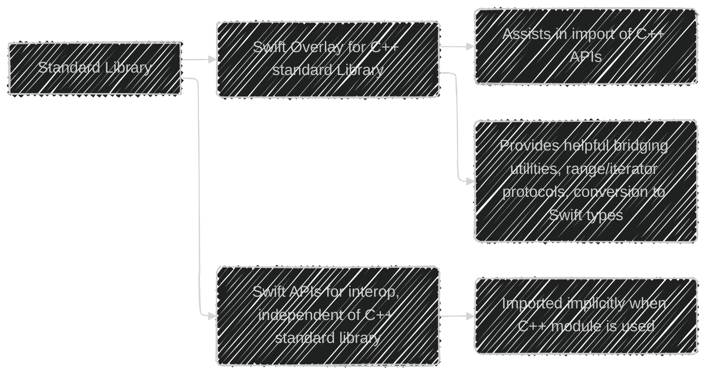
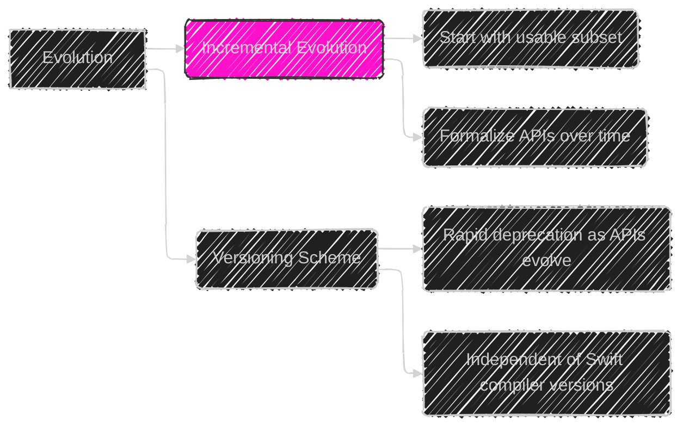
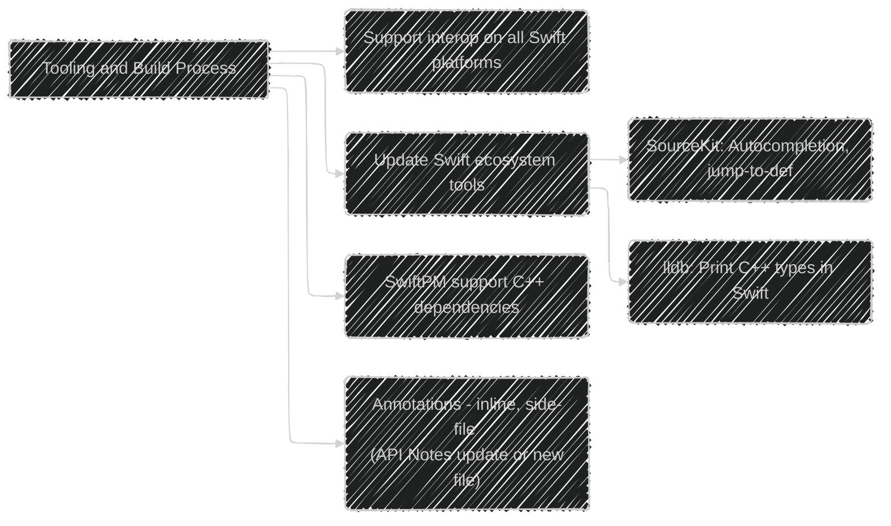
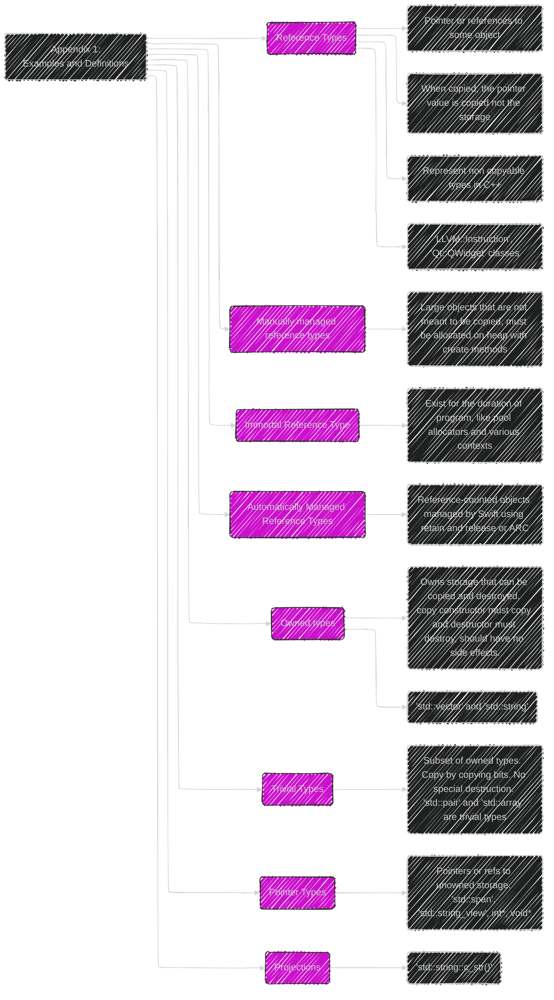

> This content is dual-licensed under your choice of the following licenses:
> 1.  **MIT License:** For the code implementations in Swift and Mermaid provided in this document.
> 2.  **Creative Commons Attribution 4.0 International License (CC BY 4.0):** For all other content, including the text, explanations, and the Mermaid diagrams and illustrations.

---

Below is a breakdown of the diagrams I will create, aligning with [the original proposal documentation Using C++ from Swift](https://github.com/swiftlang/swift-evolution/blob/main/visions/using-c%2B%2B-from-swift.md):

---

# Overall Structure

First, let's outline the overall structure of the document and how we will approach its visual representation:

This diagram gives a roadmap for the following detailed sections.

---

# 1. Goals

The core goals of C++ and Swift interop as described in the document, highlighting the overarching aim of safety and idiomatic use:

This shows how the interop tries to strike a balance between safety, usability and practicality.

---

# 2. The Approach: API Patterns

This section explains the core strategy of finding the right API pattern to map C++ apis:

This illustrates the fundamental approach of the interop.

---

# 3. Importing Types

Here's how the document describes importing types, with a focus on reference and value types:

This shows the distinctions in types and their memory management implications.

---

# 4. Reference Type Criteria

The following diagram breaks down the criteria for a C++ type to be imported as a Swift `class` (reference type):

This will help developers understand how the choice between value and reference type is made by the compiler.

---

# 5. Projections

Here we illustrate projections, which are ways of extracting views of data in C++:

This shows that there are other use cases for projections, not just simple methods returning internal data.

---

# 6. Iterators

How iterators are handled in C++ interop is important, here's the diagram for that:

This shows that C++ iterators will be adapted and integrated with Swift APIs.

---

# 7. Mutability

Mutability handling is a notable challenge with very different models in each language:

This highlights the differences and how interop may enforce stricter rules on C++ const.

---

# 8. Computed Properties

This highlights how those can be used for a more performant and idiomatic code.

---

# 9. Templates and Generic APIs

The next diagram describes dealing with C++ templates:

This section clearly presents the limitations of interop with generic C++ templates

---

# 10. The Standard Library

This covers how the Swift standard library will play a role in interop

This shows that Swift will try to assist in the process of bridging C++ std libraries.

---

# 11. Evolution

This section outlines an incremental approach to interop.

This emphasizes that the feature will be developed iteratively.

---

# 12. Tooling and Build Process

The following illustrates the tooling and build concerns:

This highlights how existing tools need enhancements for interop.

---

# 13. Appendix 1: Examples and Definitions

The first appendix expands on the definition and provides examples.

---

# 14. Appendix 2: Lifetime and Safety

This appendix goes more in-depth on a specific problem related to safety.

---

