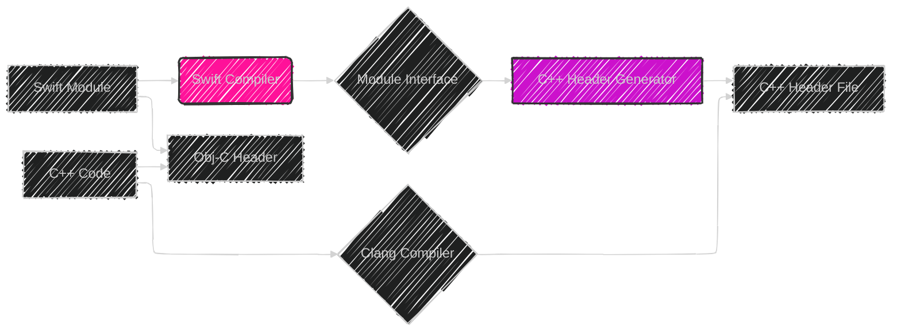
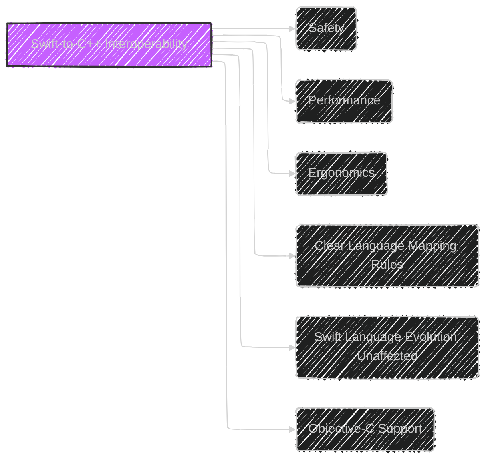
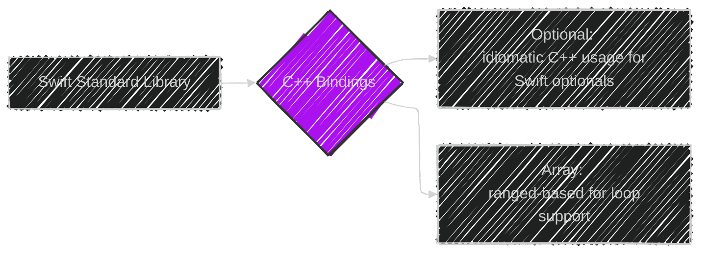
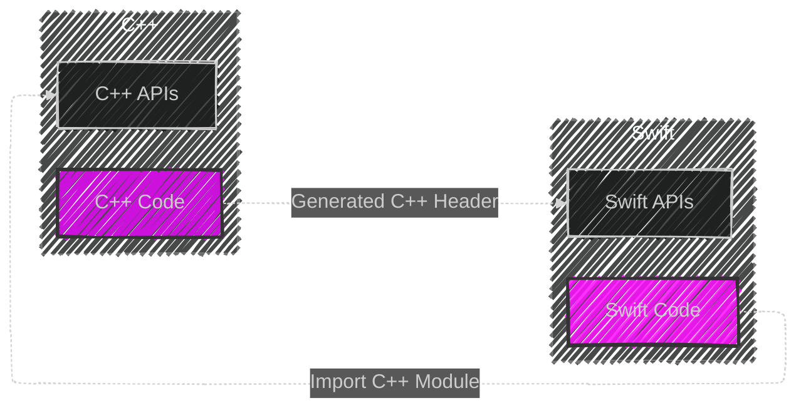
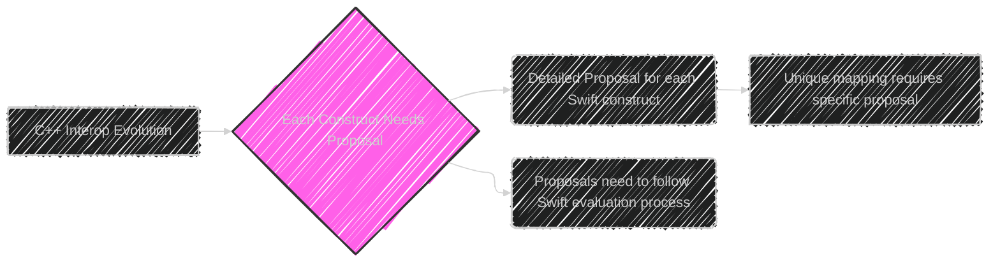

> This content is dual-licensed under your choice of the following licenses:
> 1.  **MIT License:** For the code implementations in Swift and Mermaid provided in this document.
> 2.  **Creative Commons Attribution 4.0 International License (CC BY 4.0):** For all other content, including the text, explanations, and the Mermaid diagrams and illustrations.

---

Below is a breakdown of the diagrams I will create, aligning with [the original proposal documentation Using Swift from C++](https://github.com/swiftlang/swift-evolution/blob/main/visions/using-swift-from-c%2B%2B.md):

---

# Overall Architecture

First, let's illustrate the overall architecture of Swift and C++ interoperability:

**Explanation:**

*   **Swift Module:** The source Swift code.
*   **Swift Compiler:** Compiles the Swift code and generates a module interface.
*  **Module Interface**: Output of Swift Compiler containing details of what Swift exposes to other languages.
*   **C++ Header Generator:** The component that reads the Swift module interface and generates a C++ header file.
*   **C++ Header File:** Contains C++ declarations that wrap Swift APIs.
*   **C++ Code:** The C++ code using the generated header to access Swift.
*   **Clang Compiler:** Compiles the C++ code and links with the Swift module, using C++ header, which is generated with c++ declarations that wrap Swift APIs.
*   **Obj-C Header:** Contains Objective-C declarations for Obj-C interoperability, which includes Swift APIs.

---

# Key Principles

Now, let's break down the key principles of Swift-to-C++ interoperability:

**Explanation:**

*   **Safety:**
    *   Enforces Swift's type rules and memory model from C++.
    *   Automatic memory management (retain/release for Swift classes).
    *   Type safety checks to prevent incorrect types from being passed.
     *  Run-time checks for exclusive access (can be disabled for perf).
*   **Performance:**
    *   Minimizes overhead of calling Swift from C++.
    *   Avoids automatic type conversions for complex types (e.g., `String`).
    *   Automatic conversion for primitive types (e.g., `Float` to `float`).
     * Reduces dynamic overhead for resilient types.
*   **Ergonomics:**
    *   Maps Swift APIs to idiomatic C++ constructs.
    *   Provides reasonable approximations for cases without direct correspondence.
     * Enhances types (e.g., Range Based loop with `Array`).
*   **Clear Language Mapping Rules:**
    *   Provides a well-defined mapping of Swift to C++ constructs.
    *   Documents un-bridged language features.
    *   Provides clear diagnostics for unexposed types/functions.
 *   **Swift Language Evolution Unaffected:**
    *   Interoperability should not restrict Swift language evolution.
    *  Swift API design should not be influenced by C++ interface needs.
*   **Objective-C Support:**
    *  Preserves Objective-C bridge layer for hybrid projects.
    * Utilizes Objective-C++ types where beneficial for hybrid scenarios.
    
---

# Swift Types Bridging

Here's how Swift types are mapped to C++:

**Explanation:**

*   **Structs:** Represented as C++ classes with value semantics (copy on assignment).
*   **Enums:** Represented as C++ class types that allow methods and nested types.
*   **Classes:** Represented as shared pointers that own a reference to a Swift object (automatic retain/release).
*   **Protocols:** Represented by C++ classes with methods (access to protocol interface).
*  **Protocol Composition:** Represents a combination of the protocol types into a single class.

---

# Generics Bridging

Here's how Swift generics are bridged:

**Explanation:**

*   **Function Templates:** Swift generic functions map to C++ function templates.
*   **Class Templates:** Swift generic types map to C++ class templates.
*   **Type Checking:** Uses `requires` clause (C++20) or `enable_if`/`static_assert` (C++17-) to enforce type requirements.
*   **Storage:** Specialization to optimize non-resilient types and avoid dynamic allocation when possible.

---

# Standard Library Support

Let's show standard library support:

**Explanation:**

*   **Standard Library:** Many Swift types and functions are bridged to C++.
*   **Optional:** Provides idiomatic C++ usage for Swift optionals.
*   **Array:** Enables range-based for loops and other C++-friendly APIs.

---

# Mixed-Language Usage

Diagram for how C++ and Swift use each others APIs:

**Explanation:**
  *   Swift module APIs are exposed in a C++ compatible header allowing for seamless integration of Swift features in C++.
  *    Swift is able to import C++ headers, allowing Swift to interoperate with C++ APIs.
  *    Both Swift and C++ can leverage the others APIs effectively through generated headers and direct imports, maintaining consistent type representation.

---

# Evolution Process

Finally, let's outline the evolution process:

**Explanation:**

*   **Detailed Proposals:** Each Swift construct requires a detailed evolution proposal for how it will be bridged to C++.
*    **Clear Mapping for API Patterns:** API patterns that map into specific types must also have a detailed proposal.
*   **Swift Evolution:** Proposals are ratified through the standard Swift evolution process.

---
**Licenses:**

- **MIT License:**   - Full text in [LICENSE](LICENSE) file.
- **Creative Commons Attribution 4.0 International:**  - Legal details in [LICENSE-CC-BY](LICENSE-CC-BY) and at [Creative Commons official site](http://creativecommons.org/licenses/by/4.0/).

---