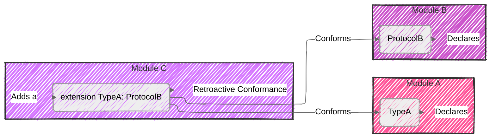
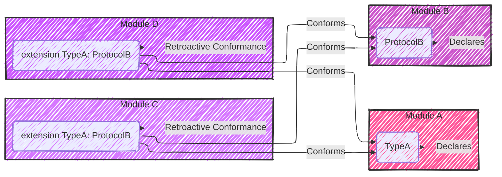
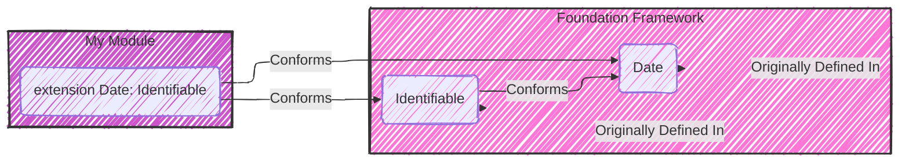
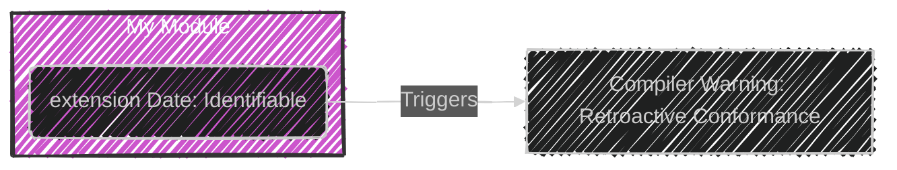
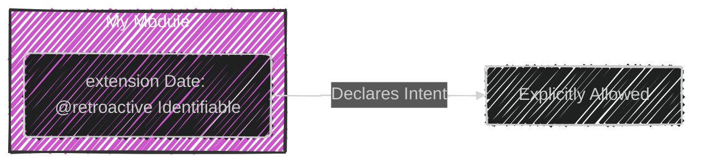
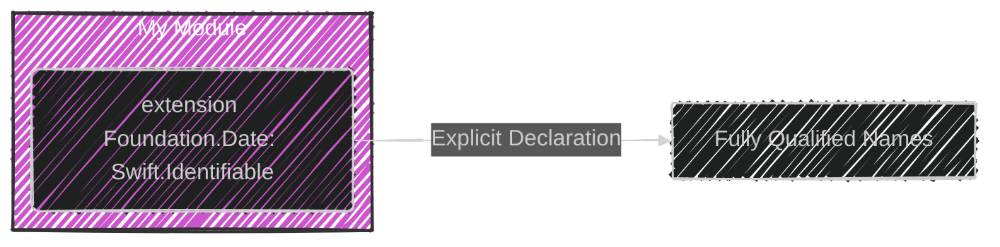
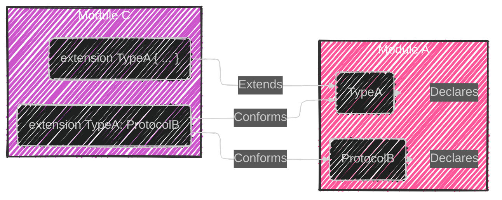

> This content is dual-licensed under your choice of the following licenses:
> 1.  **MIT License:** For the code implementations in Swift and Mermaid provided in this document.
> 2.  **Creative Commons Attribution 4.0 International License (CC BY 4.0):** For all other content, including the text, explanations, and the Mermaid diagrams and illustrations.

---


Below is a breakdown of the diagrams I will create, aligning with [the original documentation](https://github.com/swiftlang/swift-evolution/blob/main/proposals/0364-retroactive-conformance-warning.md):

---


Let's break down the complexities of retroactive conformances in Swift and visualize them using Mermaid diagrams.

# Analysis of Retroactive Conformances

The core issue revolves around extending types from one module to conform to protocols from another module. This is problematic because:

1.  **Global Uniqueness:**  Protocol conformances are globally unique in Swift runtime. If multiple modules declare the same conformance, it can cause conflicts at runtime.

2.  **Library Evolution:** If a library introduces a conformance you've already declared, your app's behavior could be unpredictable (or even break the build), especially when using resilient libraries where binary compatibility is critical. The library might use a different semantic behavior under the hood to implement the protocol.

Here's a breakdown of the concepts and their visualization:

## 1. The Problem: Retroactive Conformances



**Explanation:**

*   `ModuleA` declares `TypeA`.
*   `ModuleB` declares `ProtocolB`.
*   `ModuleC` declares an extension that retroactively makes `TypeA` conform to `ProtocolB`.

---

## 2. The Conflict: Multiple Conformances



**Explanation:**

*   Now, both `ModuleC` and `ModuleD` try to make `TypeA` conform to `ProtocolB`.
*   This creates an ambiguous situation at runtime because Swift conformances are globally unique and it is undefined which one will be picked

---

## 3. Undefined Behavior: Example



**Scenario:**

*   `Foundation` (standard library) has `Date` and `Identifiable`.
*   `MyModule` retroactively makes `Date` conform to `Identifiable`, giving its ID a calculation such as the `timeIntervalSince1970` property.
*   Later `Foundation` also conforms `Date` to `Identifiable` using `timeIntervalSinceReferenceDate`.
*   Now the app behavior is indeterminate, and depends on the order the conformances are resolved in the runtime.
*   If the ids for date were stored the database , after upgrading the library, they will be different.

---

## 4. The Warning



**Explanation:**

*   The Swift compiler now detects retroactive conformances and issues a warning.

---

## 5. The Solution: `@retroactive` Attribute



**Explanation:**

*   The `@retroactive` attribute acknowledges your intent to add a retroactive conformance, while accepting responsibility for potential conflicts.
* The `@retroactive` attribute needs to be applied to the protocol on the type. For example, if type 'A' conforms to protocol 'B' and protocol 'B' inherits from protocol 'C', then the `@retroactive` attribute needs to be applied in the extension on both the protocols B and C.

---

## 6. Exceptions to the Warning

```mermaid
---
config:
  layout: elk
  look: handDrawn
  theme: dark
---
graph LR
    subgraph Case1["Clang Module Overlay"]
        A["Clang Module Type"]
        B["Swift Overlay"]
        C["Conforms"]
        
        A -- "Declared In" --> Case1
        B -- "Extension Declared In" --> Case1
        C -- "Conforms" --> A
        C -- "Conforms" --> B
    end

    subgraph Case2["Bridging Header"]
        D["Type from Bridging Header"]
        E["Extension"]
        F["Conforms"]
        
        D -- "Declared In" --> Case2
        E -- "Extension Declared In" --> Case2
        F -- "Conforms" --> D
        F -- "Conforms" --> E
    end
    
    subgraph Case3["@_originallyDefined"]
        G["Type with @_originallyDefined"]
        H["Extension"]
        I["Conforms"]
        
        G -- "Declared In" --> Case3
        H -- "Extension Declared In" --> Case3
        I -- "Conforms" --> G
        I -- "Conforms" --> H
    end
    
    subgraph Case4["Same Package"]
        J["Type in Same Package"]
        K["Extension"]
        L["Conforms"]
        
        J -- "Declared In" --> Case4
        K -- "Extension Declared In" --> Case4
        L -- "Conforms" --> J
        L -- "Conforms" --> K
    end
    
    subgraph NoWarning[No Warning]
        A -- "No Warning" --> NoWarning
        D -- "No Warning" --> NoWarning
        G -- "No Warning" --> NoWarning
        J -- "No Warning" --> NoWarning
    end

linkStyle 0,1,2,3,4,5,6,7 stroke:#333,stroke-width:2px

style Case1 fill:#f59f,stroke:#333,stroke-width:2px
style Case2 fill:#c5cf,stroke:#333,stroke-width:2px
style Case3 fill:#c5fc,stroke:#333,stroke-width:2px
style Case4 fill:#c5ff,stroke:#333,stroke-width:2px

%%classDef detail fill:#f59f,stroke:#333,stroke-width:1px
%%class Case1,Case2,Case3,Case4 detail;

```

**Explanation:**

*   The Swift compiler avoids issuing a warning in these specific cases:
    *   **Case 1:**  If you are providing a Swift overlay for a Clang module (typically C/C++ code).
    *   **Case 2:**  Types defined in bridging headers (used for importing Objective-C code) are treated as part of the same module implicitly, and no warnings are raised.
	*   **Case 3:** When a type is marked with `@_originallyDefined(in:)` to signal its migration between modules
	*   **Case 4:** When the type and the extension are declared in the same Swift Package, there will be other mechanisms to detect the duplicated conformance

---

## 7. Alternative (Source Compatible)



**Explanation:**

*   Instead of `@retroactive`, you can use fully qualified names for the type and the protocol (e.g., `Foundation.Date` and `Swift.Identifiable`). This works as a source-compatible alternative for older Swift versions.

---

## 8. Valid Conformances



**Explanation:**
- Conformances of external types to protocols *defined within the same module* are valid.
- Extensions of external types that *do not introduce a conformance* are also valid. For example, adding convenience methods, are valid.

---

# Summary Visualization

```mermaid
---
config:
  layout: elk
  look: handDrawn
  theme: dark
---
graph LR
    A[Retroactive Conformance] --> B{"Problem"};
    B --> C[Multiple Declarations];
    C --> D[Undefined Behavior];
    B --> E[Library Evolution Issue]
    E --> F[Breaks Binary Compatibility];
    A --> G{Solution};
    G --> H[@retroactive Attribute];
    G --> I[Fully Qualified Names];
    A --> J{Exceptions};
    J --> K[Bridging Headers];
    J --> L[Clang Module Overlays];
    J --> M["@_originallyDefined Attribute"];
    J --> N[Same Package];
    
    A --> O{"Valid Conformances"};
    O --> P[Same-Module Conformances];
    O --> Q[Extensions without Conformances];

linkStyle 0,1,2,3,4,5,6,7,8,9,10,11,12,13,14 stroke:#33,stroke-width:2px;

```

## Conclusion

The retroactive conformance warning is a safeguard against subtle and hard-to-debug issues. By using the `@retroactive` attribute or fully qualified names (as a fallback), you can manage these scenarios consciously, while allowing the Swift compiler to prevent you from running into unexpected behaviors. This also provides guidance for library authors about where they introduce conformances, and what risks they incur.


---
**Licenses:**

- **MIT License:**  [](LICENSE) - Full text in [LICENSE](LICENSE) file.
- **Creative Commons Attribution 4.0 International:** [](LICENSE-CC-BY) - Legal details in [LICENSE-CC-BY](LICENSE-CC-BY) and at [Creative Commons official site](http://creativecommons.org/licenses/by/4.0/).

---