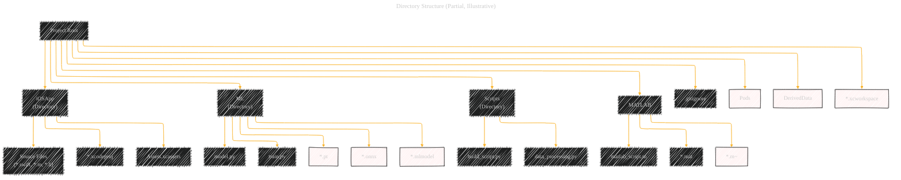

# Workflows of iOS developers building an AI mobile app
> **Disclaimer:**
>
> This document contains my personal notes on the topic,
> compiled from publicly available documentation and various cited sources.
> The materials are intended for educational purposes, personal study, and reference.
> The content is dual-licensed:
> 1. **MIT License:** Applies to all code implementations (Swift, Mermaid, and other programming languages).
> 2. **Creative Commons Attribution 4.0 International License (CC BY 4.0):** Applies to all non-code content, including text, explanations, diagrams, and illustrations.
---

## A Diagrammatic Guide 

Here's a high-level project structure:

*   **iOS/macOS App (Main Component):**  Developed in Xcode using Swift/Objective-C.  Uses CocoaPods for dependency management.
*   **Machine Learning Model(s):**  Likely trained using Python (with TensorFlow, PyTorch, or converted to Core ML).  Model weights/files are *not* tracked in Git.
*   **Supporting Scripts/Tools:**  Python scripts for various tasks (data preprocessing, model training, build automation).  Potentially uses virtual environments (`env/`, `.venv/`).
*   **MATLAB Component (Optional):**  MATLAB scripts/data for specific tasks.
*   **Development Environment:**  Developers might use Xcode (for the iOS/macOS app) and a JetBrains IDE (for Python/MATLAB).
*   **Version Control:** Git is used, with a carefully crafted `.gitignore` to avoid tracking unnecessary or sensitive files.

## Mermaid Diagrams

Let's create some Mermaid diagrams to illustrate these aspects.

----

## 1. High-Level Project Structure

```mermaid
---
title: "High-Level Project Structure"
author: "Cong Le"
version: "1.0"
license(s): "MIT, CC BY 4.0"
copyright: "Copyright (c) 2025 Cong Le. All Rights Reserved."
config:
  layout: elk
  look: handDrawn
  theme: dark
---
%%%%%%%% Mermaid version v11.4.1-b.14
%%%%%%%% Toggle theme value to `base` to activate the initilization below for the customized theme version.
%%%%%%%% Available curve styles include the following keywords:
%% basis, bumpX, bumpY, cardinal, catmullRom, linear, monotoneX, monotoneY, natural, step, stepAfter, stepBefore.
%%{
  init: {
    'graph': { 'htmlLabels': false, 'curve': 'linear' },
    'fontFamily': 'Fantasy',
    'themeVariables': {
      'primaryColor': '#ffff',
      'primaryTextColor': '#55ff',
      'primaryBorderColor': '#7c2',
      'lineColor': '#F8B229',
      'secondaryColor': '#006100',
      'tertiaryColor': '#fff'
    }
  }
}%%
graph LR
    subgraph iOS_App["iOS/macOS Application"]
        style iOS_App fill:#ccf3,stroke:#333,stroke-width:2px
        Xcode[(Xcode Project)] --> Swift[Swift/Objective-C Code]
        Swift --> Pods[CocoaPods Dependencies]
        Xcode --> DerivedData[(Derived Data)]:::excluded
        Xcode --> UserSettings[(User Settings)]:::excluded
    end

    subgraph ML_Component["Machine Learning Component"]
        style ML_Component fill:#cfc3,stroke:#333,stroke-width:2px
        Python[Python Scripts] --> TrainingData[(Training Data)]
        Python --> ModelFiles["Model Files<br>(*.pt, *.onnx, *.mlmodel)"]:::excluded
        Python --> TensorFlow[(TensorFlow)]
        Python --> PyTorch[(PyTorch)]
        Python --> CoreML[(Core ML)]
    end
    
    subgraph MATLAB_Component["MATLAB Component"]
        style MATLAB_Component fill:#fcC3,stroke:#333,stroke-width:2px
        MATLAB[(MATLAB Scripts & Data)]
    end

    subgraph Supporting_Scripts["Supporting Scripts<br>(Python)"]
        style Supporting_Scripts fill:#ffc3,stroke:#333,stroke-width:2px
        PythonScripts[Python Scripts] --> VirtualEnv[(Virtual Environment)]:::excluded
        PythonScripts --> BuildArtifacts[(Build Artifacts)]:::excluded
    end
     subgraph JetBrains_IDE["JetBrains IDE"]
        style JetBrains_IDE fill:#FCC3,stroke:#333,stroke-width:2px
        IDE[(IDE Settings)] --> IDE_Excluded[(IDE Settings)]:::excluded
        IDE --> Bokeh[(Bokeh Plots)]
    end
    
    iOS_App -- Uses --> ML_Component
    Supporting_Scripts -- Supports --> iOS_App
    Supporting_Scripts -- Supports --> ML_Component
    MATLAB_Component -- Data/Analysis --> ML_Component
    JetBrains_IDE -- Develop --> PythonScripts
    JetBrains_IDE -- Develop --> MATLAB_Component

    classDef excluded fill:#fcc3,stroke:#333,stroke-width:1px
    
```

**Explanation:**

*   **Subgraphs:**  We use subgraphs to visually group related components (iOS App, ML Component, Supporting Scripts, MATLAB component, and JetBrains IDE).
*   **Nodes:**  Each node represents a key part of the project (Xcode project, Swift/Objective-C code, Python scripts, model files, etc.).
*   **Edges:**  Arrows show relationships between components (e.g., the iOS app "Uses" the ML component).
*   **Excluded Items:** Nodes marked with `:::excluded` and a different style represent files/directories that are *not* tracked in Git (as indicated by the `.gitignore`).
*   **IDE Integration:**  The diagram shows that JetBrains IDEs are likely used for Python and MATLAB development.

----

## 2. iOS App Development Workflow

**Explanation:**

*   **Participants:**  The key players in the workflow (Developer, Xcode, CocoaPods, Git, Device/Simulator).
*   **Messages:**  Arrows represent actions or interactions (e.g., opening the project, resolving dependencies, building, running).
*   **Activation:**  The vertical bars indicate when a participant is active (e.g., Xcode is active during the build process).
*   **Notes:**  We use a note to highlight the role of `.gitignore` in preventing certain files from being tracked.
*  **Dependency:** The diagram shows the process of dependency resolution by CocoaPods.

----

## 3. Machine Learning Workflow (Simplified)

**Explanation:**

*   **Simplified Flow:** This diagram shows a simplified ML workflow, from data collection to integration with the iOS app.
*   **Model Export:**  The "Model Export" step is highlighted in red because the resulting model files are excluded from Git.
*  **Framework:** The diagram represents the frameworks used in the model training process.

---

## 4. Directory Structure (Partial, Illustrative)

**Explanation:**

*   **Tree Structure:** This uses a tree diagram to represent the project's directory structure.
*   **Partial Representation:**  It's a *partial* representation, showing only key directories and files to illustrate the overall organization.
*   **Excluded Items:**  Files and directories excluded by `.gitignore` are again marked with `:::excluded` and a different style.

-----

## 5. Combined Workflow

**Explanation:**
* **Participants:** All the participants involved in the development process.
* **Messages:** The steps for each participant during the development process.
* **Activation:** The participants are activated when they are used.
* **Notes:** The notes emphasize the usage of .gitignore.
* **IDE Integration:** The diagram represents JetBrains IDE usage for python and MATLAB.
* **ML Integration:** The diagram shows the process of integrating the trained model into the Xcode project.

---
**Licenses:**

- **MIT License:**   - Full text in [LICENSE](LICENSE) file.
- **Creative Commons Attribution 4.0 International:**  - Legal details in [LICENSE-CC-BY](LICENSE-CC-BY) and at [Creative Commons official site](http://creativecommons.org/licenses/by/4.0/).

---
