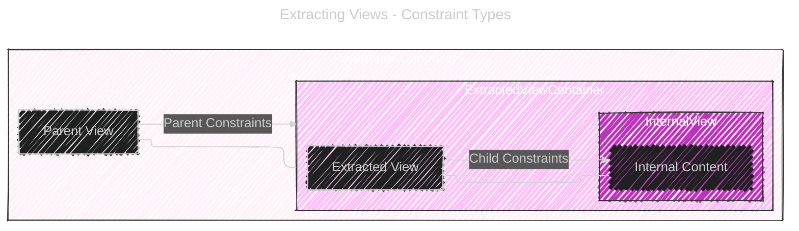
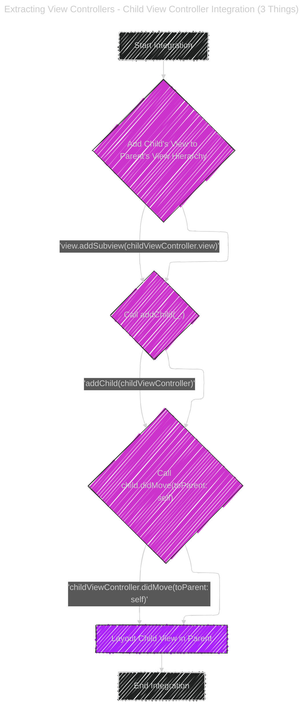

# Extracting Views & View Controllers

> This content is dual-licensed under your choice of the following licenses:
> 1.  **MIT License:** For the code implementations in Swift and Mermaid provided in this document.
> 2.  **Creative Commons Attribution 4.0 International License (CC BY 4.0):** For all other content, including the text, explanations, and the Mermaid diagrams and illustrations.

----

Below is a collection of diagrams and illustrations on explaining how to extract views and view controllers in UIKit.

----

## 1. Architecture Overview

This diagram represents the high-level architecture showing the relationship between `GameView` and `GameTableViewController` within a `ViewController`.

**Explanation:**

*   `ViewController` is the parent view controller, containing two main components.
*   `GameView Container` and `GameTableViewController Container` represent the areas within the `ViewController`'s view where the extracted views and view controller's views are placed.
*   `GameView` is an extracted `UIView` subclass, composed of `profileImage`, `titleLabel`, and `bodyLabel`.
*   `GameTableViewController View` is the view managed by the `GameTableViewController`, primarily containing a `UITableView`.

---

## 2. Extracting Views - Constraint Types

This diagram illustrates the two types of constraints involved when extracting a `UIView`: Parent Constraints and Child Constraints.

**Explanation:**

*   `ParentViewController` represents the view controller from which a view is extracted.
*   `Parent View` is the main view of the parent view controller.
*   `ExtractedViewContainer` represents the area in the parent view where the extracted `Extracted View` is placed.
*   `Extracted View` is the UIView being extracted.
*   `InternalView` and `Internal Content` represent the elements within the extracted view.
*   **Parent Constraints** (orange) are constraints set on the `ExtractedViewContainer` relative to the `Parent View`.
*   **Child Constraints** (blue) are constraints set on the `InternalView` (or internal elements) relative to the `Extracted View`.

---

## 3. Extracting View Controllers - Child View Controller Integration (3 Things)

This flowchart illustrates the three essential steps to properly integrate a child view controller into a parent view controller's lifecycle.

**Explanation:**

*   The flowchart outlines the sequence of actions needed to correctly embed a child view controller.
*   **Step 1: Add Child's View to Parent's View Hierarchy:** `view.addSubview(childViewController.view)` - Adds the child view controller's view as a subview of the parent's view.
*   **Step 2: Call `addChild(_:)`:** `addChild(childViewController)` - Establishes the parent-child view controller relationship, which is crucial for lifecycle management.
*   **Step 3: Call `child.didMove(toParent: self)`:** `childViewController.didMove(toParent: self)` - Notifies the child view controller that it has been added to a parent, completing the integration into the view controller hierarchy.
*   **Step 4: Layout Child View:** After these steps, you can layout the child view using frames or Auto Layout constraints.

---

## 4. `loadView()` vs. Auto Layout for Child View Controllers

This diagram contrasts the two methods for laying out a child view controller's view: using Auto Layout constraints or overriding `loadView()`.

**Explanation:**

*   **Auto Layout Method:**
    *   Involves setting explicit Auto Layout constraints for the top, bottom, leading, and trailing edges of the child view to pin it to the parent view.
    *   More verbose, requiring more lines of code to set up the constraints.
    *   Offers flexible layout control, allowing for layouts that are not just full-screen.
*   **`loadView()` Method:**
    *   Involves overriding the `loadView()` method in the child view controller.
    *   Sets the `view` property of the view controller directly to the desired view (e.g., `tableView`).
    *   Less code and more concise for achieving a full-screen layout.
    *   The child view automatically fills the entire view of the view controller.
*   Both methods achieve the goal of making the child view fill the entire area of the child view controller's view. `loadView()` is presented as a more elegant and less code-intensive solution for this specific full-screen scenario.

---

## 5. Handling View Interactions via Closures

This sequence diagram demonstrates how to use closures to handle interactions between a `UIView` and its `UIViewController`.

**Explanation:**

*   **ViewController** sets a closure (`searchTextFieldHandler`) on the **View**. This closure (`fetchWeatherClosure` in this example) will be executed when a specific event occurs in the **View**.
*   **User interacts with TextField** within the **View** (for example, finishes editing).
*   **TextField** triggers the `textFieldDidEndEditing(_:)` event within the **View**.
*   **View** checks if `searchTextFieldHandler` closure has been set.
*   **If handler is set:**
    *   **View** calls the `searchTextFieldHandler` closure, passing the **TextField** as a parameter.
    *   **ViewController** executes the `fetchWeatherClosure`, which processes the text from the **TextField**.
    *   **ViewController** may then clear the **TextField** text.
*   **If handler is not set:** No action is taken.

This illustrates a callback mechanism using closures, allowing the `View` to communicate UI events back to the `ViewController` in a decoupled manner.

---
**Licenses:**

- **MIT License:**   - Full text in [LICENSE](LICENSE) file.
- **Creative Commons Attribution 4.0 International:**  - Legal details in [LICENSE-CC-BY](LICENSE-CC-BY) and at [Creative Commons official site](http://creativecommons.org/licenses/by/4.0/).

---