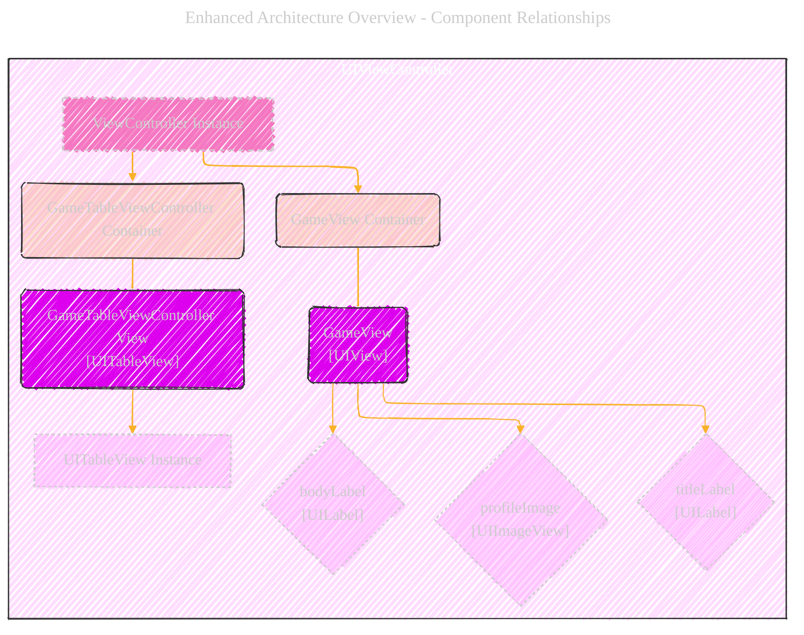
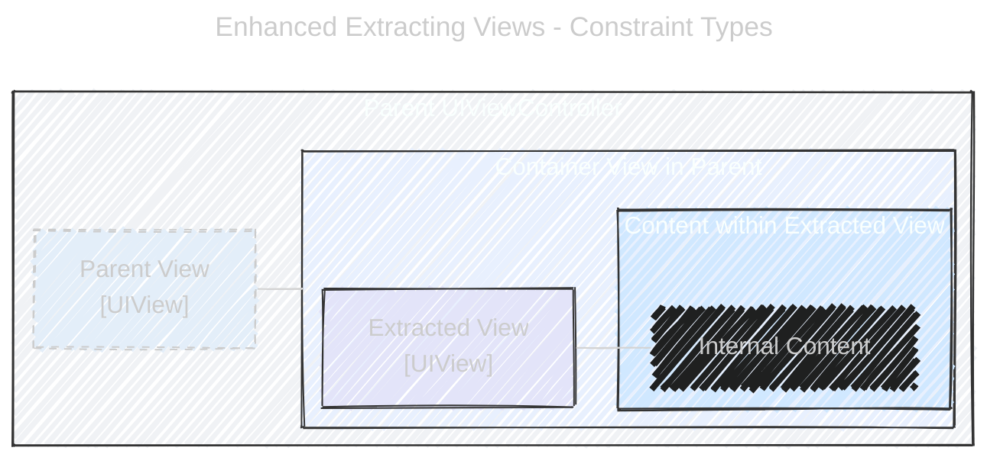
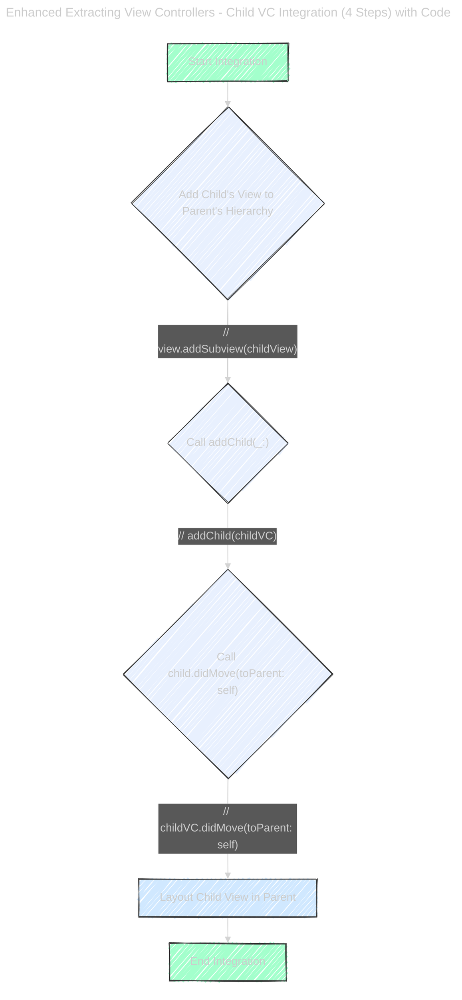
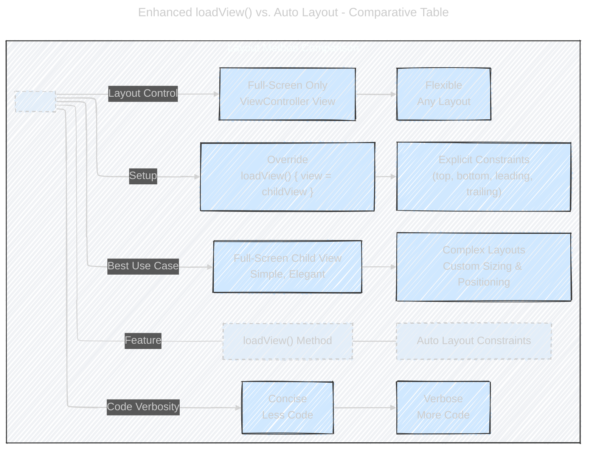

# Extracting Views & View Controllers - NEED RENDERED ON A MACBOOK TO SEE THE BEAUTY OF THE DIAGRAMS

> This content is dual-licensed under your choice of the following licenses:
> 1.  **MIT License:** For the code implementations in Swift and Mermaid provided in this document.
> 2.  **Creative Commons Attribution 4.0 International License (CC BY 4.0):** For all other content, including the text, explanations, and the Mermaid diagrams and illustrations.

----

Below is is the 2nd version from [this documentation](Extracting_Views_and_View_Controllers_V1.md)

---

## 1. Enhanced Architecture Overview: Component Relationships

This diagram is refined to explicitly show the component hierarchy and relationships within the `ViewController`, making the architecture clearer.

**Explanation of Enhancements:**

*   **Clearer Labels:**  Nodes are labeled with their class names (`UIViewController`, `UIView`, `UITableView`, `UILabel`, `UIImageView`) and roles (e.g., `ViewController Instance`, `GameView Container`).
*   **Explicit Hierarchy:** The `subgraph` structure within `ViewController` clearly delineates the containment relationships ("Container" nodes visually group the views they hold). Arrows indicate a direct hierarchical association.
*   **Styling for Roles:** CSS classes (`internal`, `component`, `container`, `internalComponent`) are used with distinct fill colors and border styles to differentiate the roles of each element (e.g., Containers lighter, Components in blue tones, internals in grey dashes).
*   **Component Breakdown:** Inside `GameView` and `GameTableViewController View`, internal components (`profileImage`, `titleLabel`, `bodyLabel`, `UITableView`) are shown as direct children, illustrating their composition.
*   **Improved Connectors:** Solid arrows with increased `stroke-width` enhance visual flow representing the parent-child relationship more definitively.

---

## 2. Enhanced Extracting Views - Constraint Types: Visual Emphasis

This diagram visually distinguishes between Parent and Child constraints using color and annotations directly within the diagram, making the concept more intuitive.

**Explanation of Enhancements:**

*   **Visual Constraint Differentiation:**  `parentConstraintLink` is styled with orange and `childConstraintLink` with blue, directly corresponding to the original text's color coding for immediate visual distinction. Increased `stroke-width` to emphasize the constraints.
*   **In Diagram Notes:** Key details about Parent and Child Constraints are added directly as `note right of` elements within the diagram itself, making the explanations immediately accessible and linked to the visual components.
*   **Descriptive Labels Enhanced:** Node labels now include class names (`[UIView]`, `[UIViewController]`) to improve technical context. Container and content roles are also clarified in labels (e.g., `Container View in Parent`, `Content within Extracted View`).
*   **Consistent Styling Theme:** Maintained a hand-drawn look with default theme but refined color palettes for better contrast and readability.
*   **Structure Maintained:**  Kept the nested subgraph structure to represent containment clearly, but enhanced visual cues direct attention to the constraint types.

---

## 3. Enhanced Extracting View Controllers - Child View Controller Integration (3+1 Steps) with Code Snippets

This flowchart is significantly enhanced by integrating code snippets directly into each step and clarifying the layout step as a subsequent action, making it a 4-step process for clearer instruction.

**Explanation of Enhancements:**

*   **4-Step Clarity:** Reframed as a 4-step process (including explicit "Layout") to improve instructional sequence.
*   **Integrated Code Snippets:** Key Swift code for each step (`view.addSubview`, `addChild`, `didMove(toParent:)`) is now embedded adjacent to the flowchart steps, directly linking actions to code. Code snippets are in `code` blocks within notes.
*   **Enhanced Step Descriptions:** Notes for each step are made more concise and action-oriented, directly explaining the *purpose* of each code call.
*   **Visual Flow Emphasis:** Used distinct fill styles for step nodes leading to a visually prominent "End Integration" node, reinforcing the successful completion of the process.
*   **Clearer Step Node Labels:** Node labels are action-based (e.g., "Add Child's View", "Call addChild(_:)") making the process steps immediately understandable.

---

## 4. Enhanced `loadView()` vs. Auto Layout: Comparative Table

This diagram is transformed into a comparative table format within Mermaid to directly contrast `loadView()` and Auto Layout options, highlighting pros and cons side-by-side.

**Explanation of Enhancements:**

*   **Comparative Table Format:**  Structure changed from side-by-side boxes to a table-like layout with "Feature" column and method columns (`loadView()`, `Auto Layout`) for direct comparison across features. This provides a structured and easily digestible format.
*   **Feature-Based Rows:** Rows are defined by key comparison features like "Code Verbosity", "Layout Control", "Setup", and "Best Use Case," making it focused on decision-making factors.
*   **Concise Feature Descriptors:**  Table cells contain short, impactful descriptions highlighting the key differences (e.g., "Concise\nLess Code" vs. "Verbose\nMore Code").
*   **Visual Table Structure:**  `graph LR` with strategically placed invisible nodes (`TB`, `TC`, `TD`) combined with link styling is used to simulate a table structure within Mermaid, without native table support.
*   **Styling for Table Elements:** CSS classes (`header`, `methodOption`, `featureRow`) are applied to style the table header, method option columns, and feature rows distinctly, enhancing table readability.

---

## 5. Enhanced Handling View Interactions via Closures: Detailed Sequence Flow

This sequence diagram is refined for a more detailed and visually clearer representation of event flow, handler execution and conditional logic.

**Explanation of Enhancements:**

*   **Detailed Flow Breakdown:** Sequence diagram is made more granular, showing activation and deactivation of participants (`ViewController`, `View`, `TextField`) to better visualize lifecycle.
*   **Conditional Logic Emphasis:** `alt/else` block is used to visually separate and emphasize the two paths of execution based on whether `searchTextFieldHandler` is set, making the conditional behavior prominent.
*   **Inline Notes for Actions:** Notes are integrated at key points (e.g., "VC sets closure handler", "User Interaction: TextField Ends Editing", "Handler is Set (Closure Defined)") directly within the sequence flow to narrate the process step-by-step.
*   **Parameter Passing Clarity:** Diagram explicitly notes that `TextField` is passed as a parameter in the `searchTextFieldHandler` call, enhancing understanding of data flow.
*   **Action Descriptions in Messages:** Messages between participants are more descriptive (e.g., "Execute searchTextFieldHandler(TextField)\nClosure is called, TextField sent as param"), explaining *what* is happening in each interaction.
*   **Visual Cues for Events:**  Use of "Event Callback" to explicitly label `textFieldDidEndEditing(_:)` as an event originating from `TextField` to `View`.

---
**Licenses:**

- **MIT License:**   - Full text in [LICENSE](LICENSE) file.
- **Creative Commons Attribution 4.0 International:**  - Legal details in [LICENSE-CC-BY](LICENSE-CC-BY) and at [Creative Commons official site](http://creativecommons.org/licenses/by/4.0/).

---