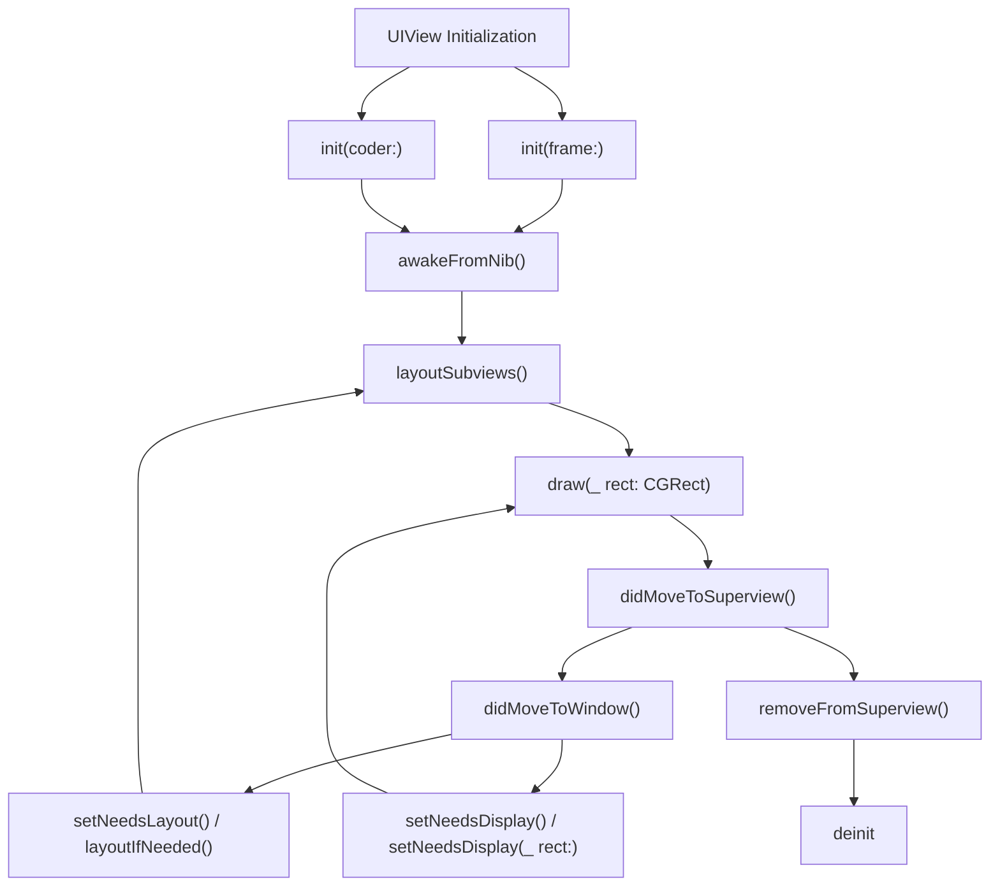

# The UIView lifecycle - The standalone view

```mermaid
graph TD
    A[UIView Initialization] --> B["init(frame:)"]
    A --> C["init(coder:)"]
    B --> D["awakeFromNib()"]
    C --> D
    D --> E["layoutSubviews()"]
    E --> F["draw(_ rect: CGRect)"]
    F --> G["didMoveToSuperview()"]
    G --> H["didMoveToWindow()"]
    H --> I["setNeedsLayout() / layoutIfNeeded()"]
    I --> E
    H --> J["setNeedsDisplay() / setNeedsDisplay(_ rect:)"]
    J --> F
    G --> K["removeFromSuperview()"]
    K --> L[deinit]

```

---
