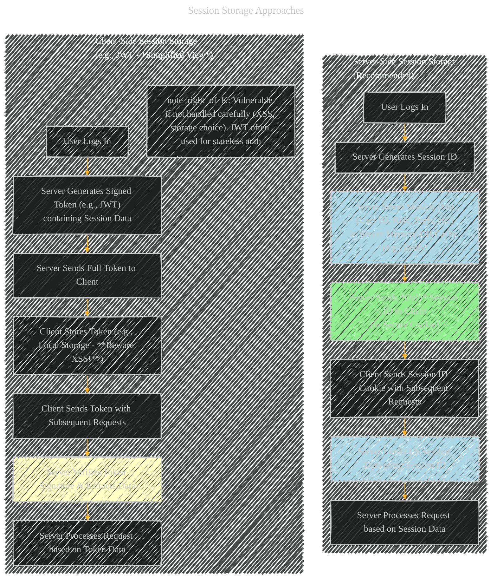
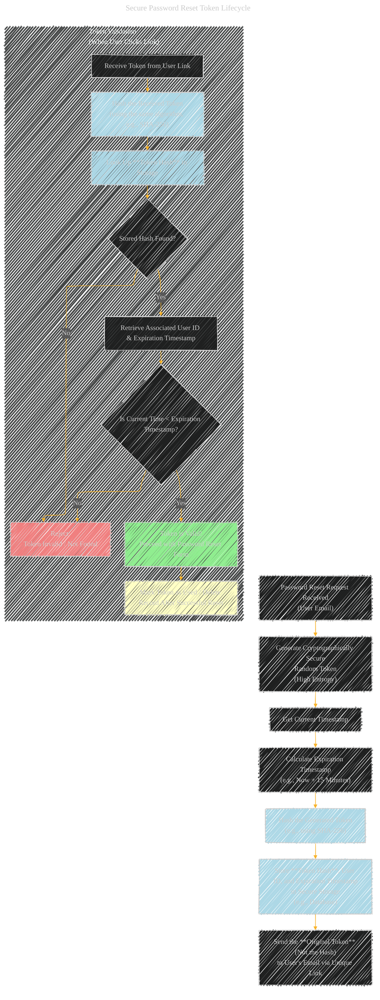
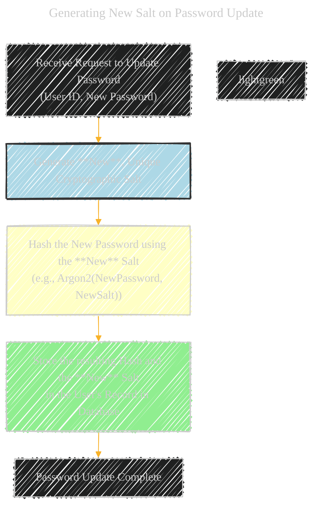
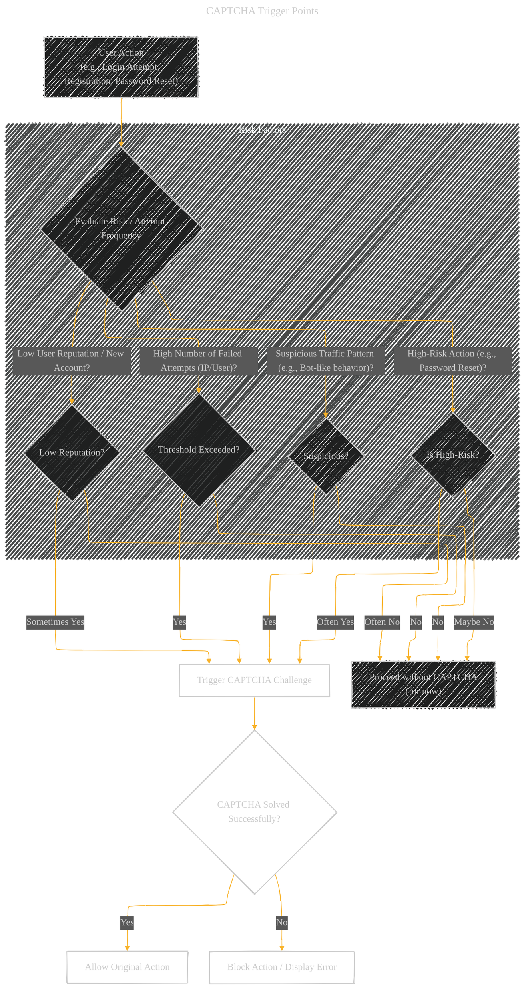

---

# Technical Security Concepts and Concerns for Web Browser

---

  <blockquote>
  As a visual learner student, I created these personal study notes from the cited source(s) to aid my understanding. 
  While my firm intention is to provide full credit, the blended format of notes and diagrams may sometimes obscure the original source, for which I apologize. 
  I am committed to making corrections and welcome any feedback. 
  This is a non-commercial project for my humble educational purposes only since the start. 
  My goal is to share my perspective and contribute to the great work already being done.
   
   
  I want to extend my genuine apologies to the creators of the original material. 
  Their work was the direct inspiration for this project, and I adapted it without first reaching out. 
  My intent comes from a place of deep respect, and I hope this is received in the spirit of homage. 
  🙏🏼🙏🏼🙏🏼🙏🏼
  </blockquote>

----

## A Diagrammatic Guide 

### 1. Input Validation and Sanitization

This flowchart shows the basic process of handling user input securely before processing it on the server.

**Explanation:** Validates input against expected format, type, length, and content rules. If valid, it's sanitized (cleaned) to prevent injection attacks (like XSS or SQL Injection) before being processed. Invalid input is rejected with an appropriate error.

---

### 2. HTTPS (Secure Communication)

This sequence diagram illustrates that communication between the client (Browser) and server occurs over an encrypted channel.

**Explanation:** The key point is that all requests and responses, especially those containing sensitive data like passwords, travel over an encrypted HTTPS connection, protecting them from eavesdropping (Man-in-the-Middle attacks).

---

### 3. Secure Comparison (Constant-Time)

This flowchart contrasts a naive (potentially vulnerable) string comparison with a secure, constant-time comparison for password hashes.

**Explanation:** A naive comparison might return faster if a mismatch occurs early. Attackers can exploit this timing difference to guess the hash character by character. A constant-time comparison takes the same amount of time regardless of where the mismatch occurs, preventing timing attacks.

---

### 4. Session Cookie Attributes

This mind map outlines the important security attributes of a session cookie.

**Explanation:** These attributes instruct the browser on how to handle the cookie, significantly enhancing security by restricting access (`HTTPOnly`), ensuring encrypted transmission (`Secure`), controlling cross-site behavior (`SameSite`), limiting scope (`Path`), and managing lifetime (`Expires`/`Max-Age`).

---

### 5. Session Storage (Server-Side)

This diagram contrasts storing session data on the server versus embedding it entirely in the client (less secure).

**Explanation:** Storing session data server-side means only a meaningless Session ID is sent to the client (typically in a cookie). This limits the data exposed if the client is compromised. Storing all session data client-side (like in a JWT stored in Local Storage) can be vulnerable to XSS if not implemented with extreme care (e.g., using secure cookies for JWT storage is better). Server-side is generally preferred for traditional stateful sessions.

---

### 6. MFA/2FA (Multi-Factor Authentication) Integration

This sequence diagram shows where 2FA typically fits into the login flow.

**Explanation:** After the primary authentication (username/password) is successful, the system checks if MFA/2FA is enabled for the user. If yes, it initiates a second factor challenge (like requesting a code from an authenticator app). Access is only granted after *both* factors are successfully verified.

---

### 7. Reset Token Security (Generation, Storage, Validation)

This flowchart illustrates the secure lifecycle of a password reset token.

**Explanation:** Securely generate a random token. Store its *hash* (not the original token) along with an expiration time. Send the original token to the user. When the user clicks the link, hash the received token and compare it against the stored hash. Also, check the expiration time. Invalidate the token immediately after successful use.

---

### 8. CSRF Protection (Synchronizer Token Pattern)

This sequence diagram shows how a CSRF token protects against Cross-Site Request Forgery, particularly relevant for state-changing actions like password reset submissions.

**Explanation:** The server embeds a unique, hidden token in forms. When the form is legitimately submitted, the browser sends this token back. The server validates that the received token matches the one expected for the user's session. Malicious sites cannot guess this token, so forged requests initiated by them will fail the validation.

---

### 9. New Salt on Password Change/Reset

This flowchart highlights the generation of a *new* salt during the password update process.

**Explanation:** It's crucial to generate a *new* salt every time a password is set or changed. This ensures that even if a user reuses an old password, the resulting hash will be different, preventing attackers from easily identifying reused passwords using precomputed rainbow tables based on potentially leaked older hashes/salts.

---

### 10. Session Invalidation on Password Reset

This sequence diagram shows the server actively invalidating existing sessions after a successful password reset.

**Explanation:** After a password reset, any active sessions the user might have on other devices become potentially compromised (as the credentials used to create them are now old). Invalidating all sessions forces the user (and any potential attacker who might have hijacked an old session) to re-authenticate with the new password, enhancing security.

---

### 11. CAPTCHA Integration Points

This flowchart shows common scenarios where a CAPTCHA challenge might be triggered.

**Explanation:** CAPTCHA (Completely Automated Public Turing test to tell Computers and Humans Apart) is used to differentiate humans from bots. It's often triggered during login, registration, or password reset flows, especially if the system detects suspicious activity (like too many failed attempts from one IP) or based on a risk assessment.

---

### 12. Rate Limiter Inputs

This mind map shows the various data points that can be used as input for rate-limiting decisions.

**Explanation:** Rate limiting prevents abuse by restricting the number of requests a user or system can make in a given time window. The effectiveness of rate limiting depends on accurately identifying the source of requests, often using a combination of inputs like IP address, username, session identifiers, or more advanced techniques like device fingerprinting. Different limits can be applied based on the action being performed.

---
**Licenses:**

- **MIT License:**   - Full text in [LICENSE](LICENSE) file.
- **Creative Commons Attribution 4.0 International:**  - Legal details in [LICENSE-CC-BY](LICENSE-CC-BY) and at [Creative Commons official site](http://creativecommons.org/licenses/by/4.0/).

---