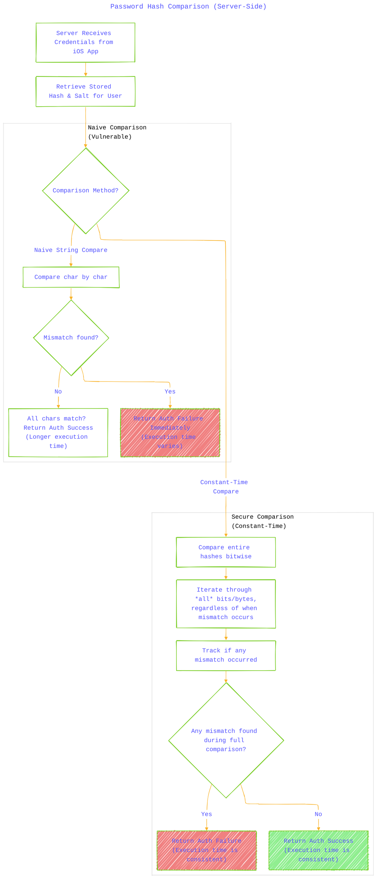
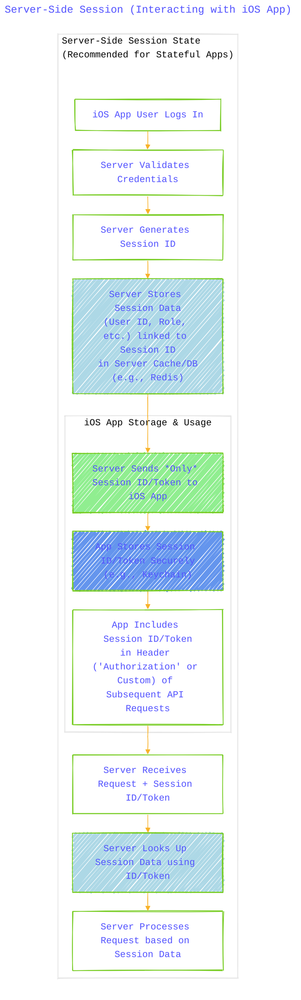
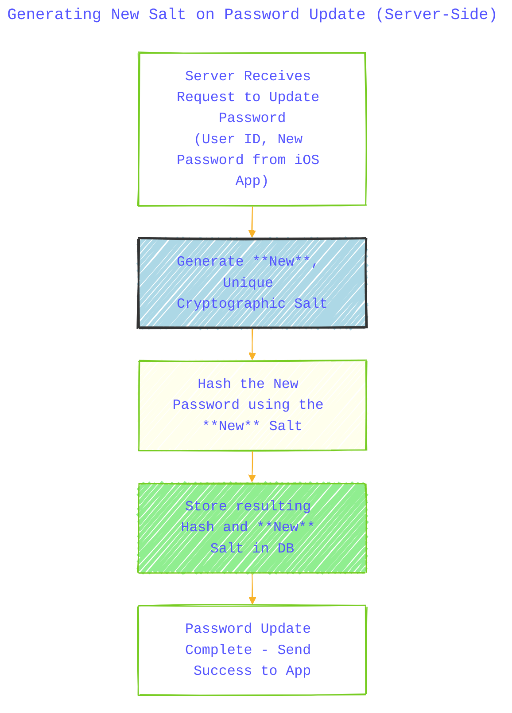

----

# Technical Security Concepts and Concerns for iOS Client App

---

  <blockquote>
  As a visual learner student, I created these personal study notes from the cited source(s) to aid my understanding. 
  While my firm intention is to provide full credit, the blended format of notes and diagrams may sometimes obscure the original source, for which I apologize. 
  I am committed to making corrections and welcome any feedback. 
  This is a non-commercial project for my humble educational purposes only since the start. 
  My goal is to share my perspective and contribute to the great work already being done.
   
   
  I want to extend my genuine apologies to the creators of the original material. 
  Their work was the direct inspiration for this project, and I adapted it without first reaching out. 
  My intent comes from a place of deep respect, and I hope this is received in the spirit of homage. 
  🙏🏼🙏🏼🙏🏼🙏🏼
  </blockquote>

----

## A Diagrammatic Guide 

### 1. Input Validation and Sanitization (iOS)

Validation occurs both client-side in the app (for immediate feedback) and crucially server-side.

```mermaid
---
title: Input Validation & Sanitization Flow (iOS)
author: "Cong Le"
version: "1.0"
license(s): "MIT, CC BY 4.0"
copyright: "Copyright (c) 2025 Cong Le. All Rights Reserved."
config:
  layout: elk
  look: handDrawn
  theme: base
---
%%%%%%%% Mermaid version v11.4.1-b.14
%%%%%%%% Toggle theme value to `base` to activate the initilization below for the customized theme version.
%%%%%%%% Available curve styles include the following keywords:
%% basis, bumpX, bumpY, cardinal, catmullRom, linear, monotoneX, monotoneY, natural, step, stepAfter, stepBefore.
%%{
  init: {
    'graph': { 'htmlLabels': false, 'curve': 'linear' },
    'fontFamily': 'Monospace',
    'themeVariables': {
      'primaryColor': '#ffff',
      'primaryTextColor': '#55ff',
      'primaryBorderColor': '#7c2',
      'lineColor': '#F8B229',
      'tertiaryColor': '#fff'
    }
  }
}%%
graph TD
    A["User Enters Data in iOS App<br>(e.g., UITextField)"] --> B{"Client-Side Validation<br>(in App)"}

    subgraph iOS_App["iOS App<br>(Client-Side Checks)"]
        B -- "Format Check<br>(e.g., Email regex, Number format)" --> C{"Valid Format?"}
        C -- "Length Check<br>(e.g., Password min/max length)" --> D{"Within Limits?"}
        D -- "Basic Content Check<br>(e.g., No obvious invalid chars)" --> E{"Passed Basic Checks?"}
    end

    E -- Yes --> F["Send Data to Server API<br>(via URLSession/Alamofire over HTTPS)"]
    F --> G{"Server-Side Validation & Sanitization"}
        subgraph Server_API["Server API<br>(Backend)"]
           G -- "Rigorous Format/Type/Length Checks" --> H{"Valid Data?"}
           H -- Security Checks (Disallowed patterns, injections) --> I{"Safe Content?"}
           I -- Yes --> J["Sanitize Input<br>(e.g., Escape for DB, Encode output)"]
           J --> K["Process Sanitized Input Securely"]
        end

    E -- "No<br>(Client Validation Failed)" --> L["Display Inline Error in App UI"]
    H -- "No<br>(Server Validation Failed)" --> M["API Returns Error Response<br>(e.g., 400 Bad Request)"]
    I -- "No<br>(Server Validation Failed)" --> M
    M --> N["App Displays Error Message to User"]

    %% lightblue
    style A fill:#ADD8E6,stroke:#333,stroke-width:1px
    
    %% cornflowerblue
    style B fill:#6495ED,stroke:#333,stroke-width:1px

    %% lightgreen
    style F fill:#90EE90,stroke:#333,stroke-width:1px

    %% orange
    style G fill:#FFA500,stroke:#333,stroke-width:2px
    
    %% mediumseagreen
    style K fill:#3cb371,stroke:#333,stroke-width:2px

    %% lightpink
    style L fill:#FFB6C1,stroke:#333,stroke-width:1px
    
    %% lightcoral
    style N fill:#F08080,stroke:#333,stroke-width:1px
    
```

**Explanation (iOS Context):** The iOS app performs initial checks for quick user feedback (e.g., is the email format okay?). However, the critical validation and sanitization *must* happen on the server after receiving the data, as the client can be bypassed. The app sends data over HTTPS and handles error responses from the server API.

---

### 2. HTTPS (Secure Communication - iOS)

Illustrates secure API calls from the iOS app.

**Explanation (iOS Context):** The iOS app uses networking frameworks like `URLSession` (or libraries like Alamofire) to communicate with the backend API. App Transport Security (ATS) is an iOS feature that enforces secure HTTPS connections by default, preventing accidental insecure communication.

---

### 3. Secure Comparison (Constant-Time) - Server Side

This concept is identical to the web version because it happens on the server. The diagram remains the same, emphasizing it's a backend process.

**Explanation (iOS Context):** The iOS app sends the user's password attempt over HTTPS. The *server* performs the secure, constant-time comparison against the stored hash. This is not an operation performed within the iOS app itself.

---

### 4. Secure Token Handling (iOS)

Focuses on storing and using authentication tokens (like JWT Bearer tokens) securely on the device.

**Explanation (iOS Context):** Instead of relying heavily on cookies, iOS apps typically use bearer tokens received from the server. The **Keychain** is the standard secure storage location for these tokens on iOS. The app includes the token in the Authorization header of API requests and must handle token expiration, often using refresh tokens for a smoother user experience.

---

### 5. Session Storage (Server-Side) - iOS Interaction

Same server-side principle, different client interaction using tokens.

**Explanation (iOS Context):** The server maintains the session state. The iOS app receives a session identifier (could be a simple session ID or a structured token like a JWT used *as* a session ID) after login, stores it securely (Keychain), and sends it back to the server with each API request, usually in an `Authorization` header.

---

### 6. MFA/2FA Integration (iOS)

Shows MFA/2FA flow involving native iOS capabilities.

**Explanation (iOS Context):** After primary login, the app requests an MFA challenge. This could involve prompting for a TOTP code, triggering a Face ID/Touch ID scan (if configured as a factor), or handling an interactive push notification sent via APNS, providing a native and often smoother user experience compared to web forms.

---

### 7. Reset Token Security (Generation, Storage, Validation) - Server Side

This lifecycle is identical to the web version as it's server-side logic. The difference is how the user interacts with the link/token (potentially via deep links).

**Explanation (iOS Context):** The server handles token generation, storage (hash!), and validation. The user might click a link in their email that uses an iOS Universal Link or custom scheme to open the app directly to the password reset screen, passing the token. The app then sends this token to the server for validation.

---

### 8. CSRF Protection (iOS Context)

CSRF is less of a concern for typical native API calls using token authentication but relevant for `WKWebView`.

**Explanation (iOS Context):** Standard iOS app API calls using `Authorization: Bearer` tokens are generally not vulnerable to traditional web-based CSRF because the token isn't sent automatically like cookies. However, if the iOS app embeds web content using `WKWebView` that relies on cookie-based sessions for state-changing actions, that *web content* must implement CSRF protection (like the synchronizer token pattern) just like a regular website.

---

### 9. New Salt on Password Change/Reset - Server Side

Identical to the web version, as it's a server-side operation.

**Explanation (iOS Context):** The app sends the new password; the server is responsible for generating a new salt and hashing before storing.

---

### 10. Session Invalidation on Password Reset (iOS Impact)

Shows how the app experiences server-side session invalidation.

**Explanation (iOS Context):** After the server invalidates sessions/tokens post-password reset, the next time the iOS app tries to use its stored (now old) token to access a protected API endpoint, the server rejects it (e.g., with a 401 Unauthorized status). The app must handle this error gracefully, clear the invalid token from storage (Keychain), and typically force the user to log in again with their new credentials.

---

### 11. CAPTCHA Integration (iOS)

Shows how CAPTCHA might be presented within an iOS app.

**Explanation (iOS Context):** When the server determines a CAPTCHA is needed, the iOS app can either load the CAPTCHA challenge in a `WKWebView` or use a provider's native iOS SDK (if available). After the user solves the challenge, the app gets a verification token and sends it back to the *backend server* along with the original request. The backend server *must* verify this token with the CAPTCHA provider before proceeding.

---

### 12. Rate Limiter Inputs (iOS Context)

Mind map including iOS-specific identifiers.

**Explanation (iOS Context):** The server-side rate limiter uses inputs like the user's account ID (most reliable when known), the request's source IP, and potentially device identifiers like `IdentifierForVendor` (IDFV) passed up from the app. While the app can implement *UX-based* rate limiting (like temporarily disabling a button), true security rate limiting must be enforced on the server.

----
