# Comprehensive iOS App Security Pipeline & Considerations
> **Disclaimer:**
>
> This document contains my personal notes on the topic,
> compiled from publicly available documentation and various cited sources.
> The materials are intended for educational purposes, personal study, and reference.
> The content is dual-licensed:
> 1. **MIT License:** Applies to all code implementations (Swift, Mermaid, and other programming languages).
> 2. **Creative Commons Attribution 4.0 International License (CC BY 4.0):** Applies to all non-code content, including text, explanations, diagrams, and illustrations.
---

## A Diagrammatic Guide 

This diagram aims to provide a holistic view, showing where different security mechanisms fit into the overall flow, from user interaction to backend processing and data storage.

This diagram provides a comprehensive map of the security considerations and processes involved throughout the lifecycle of a request originating from an iOS app to the backend and back, highlighting both client-side and server-side responsibilities.

```mermaid
---
title: Comprehensive iOS App Security Pipeline & Considerations
author: "Cong Le"
version: "1.0"
license(s): "MIT, CC BY 4.0"
copyright: "Copyright (c) 2025 Cong Le. All Rights Reserved."
config:
  look: handDrawn
  theme: dark
---
%%%%%%%% Mermaid version v11.4.1-b.14
%%%%%%%% Toggle theme value to `base` to activate the initilization below for the customized theme version.
%%%%%%%% Available curve styles include the following keywords:
%% basis, bumpX, bumpY, cardinal, catmullRom, linear, monotoneX, monotoneY, natural, step, stepAfter, stepBefore.
%%{
  init: {
    'graph': { 'htmlLabels': false, 'curve': 'linear' },
    'fontFamily': 'Monospace',
    'themeVariables': {
      'primaryColor': '#ffff',
      'primaryTextColor': '#55ff',
      'primaryBorderColor': '#7c2',
      'lineColor': '#F8B229',
      'secondaryColor': '#006100',
      'tertiaryColor': '#fff'
    }
  }
}%%
graph TD
    subgraph Diagram_Legend["Diagram Legend"]
        direction TB
        L1(User Interaction)
        L2{Decision/Check Point}
        L3[Process/Component]
        L4[(Data Store)]
        L5[Data Flow]
        L6{{"External Service"}}

        L7["iOS Specific Component/Consideration"]:::ios 
        
        L8["Server-Side Component/Consideration"]:::server 
   
        style L7 fill:#def2,stroke:#0066cc
        style L8 fill:#f2d2,stroke:#ff8800
    end

    User([User]) --> AppInput[User Inputs Data into App];

    subgraph Client_Side["Client-Side<br>(iOS App)"]
        style Client-Side fill:#def2,stroke:#4682b4,stroke-width:2px
        AppInput --> C_Validation{Client-Side Validation?};
        C_Validation -- Basic Checks Passed --> NetworkPrep[Prepare API Request];
        C_Validation -- Invalid Input --> UIError[Display Inline UI Error];

        NetworkPrep --> KeychainRead>Read Auth Token?];
        KeychainRead -- Token Exists --> IncludeAuthHeader["Include Auth Header (Bearer Token)"]
        IncludeAuthHeader --> Networking[Initiate Network Call];
        KeychainRead -- No Token/Login --> Networking;

        Networking --> HTTPS[HTTPS/TLS Encryption enforced by ATS]:::ios;
        HTTPS --> NetworkLayer["iOS Networking Layer<br>(URLSession/Alamofire)"]:::ios;

        %% Secure Storage (Tokens etc.) is shown later when receiving data
    end

    NetworkLayer --> ServerEntry["Backend Entry Point<br>(Gateway/Load Balancer)"]

    subgraph Server_Side["Server-Side<br>(Backend Infrastructure)"]
        style Server-Side fill:#f2d2,stroke:#d2691e,stroke-width:2px

        ServerEntry --> RateLimit{Rate Limiting Check?}:::server;
        RateLimit -- Request Allowed --> SanitizeInput[Sanitize Received Input]:::server;
        RateLimit -- Suspicious Activity / Limit Exceeded --> CaptchaCheck{Require CAPTCHA?}:::server;
        RateLimit -- Blocked --> BlockReq["Block Request<br>(HTTP 429)"]

        CaptchaCheck -- Yes --> CaptchaVerification[Verify CAPTCHA Token with Provider]:::server;
        CaptchaVerification --> CAPTCHA_Service{{CAPTCHA Service}};
        CaptchaVerification -- Token Valid --> SanitizeInput;
        CaptchaCheck -- No --> SanitizeInput
        %% Or if CAPTCHA not required initially
        CaptchaVerification -- Token Invalid/Failed --> BlockReq

        SanitizeInput --> ServerValidation{Server-Side Input Validation?}:::server;
        ServerValidation -- Valid Data --> ActionRouter{"Route Request Action?"}
        ServerValidation -- Invalid Data --> ServerError400["Return Error (HTTP 400 Bad Request)"]

        %% Separate Flows: Authentication vs Authorized Request vs Password Reset
        ActionRouter -- Login Request --> AuthFlow;
        ActionRouter -- Authenticated API Request --> AuthCheck;
        ActionRouter -- Forgot Password Request --> ResetFlowInitiate;
        ActionRouter -- Password Reset Submission --> ResetFlowSubmit;

        subgraph Authentication_Flow["Authentication Flow<br>(Login)"]
            direction TB
            AuthFlow[Auth Service: Handle Login]:::server --> RetrieveUser[Retrieve User Hash+Salt]:::server;
            RetrieveUser --> PwdStore[(Password Storage<br>Hashed + Salted)]:::server;
            RetrieveUser --> HashCompare[Hash Input Pwd + Salt<br>& Constant-Time Compare]:::server;
            HashCompare -- Match? --> MFACheck{MFA/2FA Enabled?};
            HashCompare -- No Match --> AuthFail[Authentication Failed];

            MFACheck -- Yes --> RequestMFA[Request MFA Challenge]:::server;
            RequestMFA --> MFA_Service{{"MFA Service<br>(TOTP/Push/etc)"}}
            RequestMFA --> VerifyMFA{Verify MFA Response?}:::server;
            VerifyMFA -- Valid MFA --> GenerateToken[Generate Session/Auth Token]:::server;
            VerifyMFA -- Invalid MFA --> AuthFail;
            MFACheck -- No --> GenerateToken;

            GenerateToken --> SessionStore[(Session Store<br>Server-Side)]:::server;
            GenerateToken --> AuthSuccess[Authentication Success];
        end

        subgraph Authorized API Request Flow
            direction TB
            AuthCheck[Auth Check: Validate Token]:::server --> SessionStore;
            AuthCheck -- Token Valid & Not Expired --> AuthzCheck{"Authorization Check<br>(Permissions/Roles)?"}:::server
            AuthCheck -- Token Invalid/Expired --> ServerError401["Return Error (HTTP 401 Unauthorized)"]

            AuthzCheck -- Authorized --> CoreLogic[Execute Core Backend Logic]:::server;
            AuthzCheck -- Forbidden --> ServerError403["Return Error (HTTP 403 Forbidden)"]

            CoreLogic --> Database[(Application Database)]:::server;
        end


        subgraph Password Reset Flow
            direction TB
            ResetFlowInitiate[Handle Forgot Password Request]:::server --> GenResetToken["Generate Secure Reset Token (HASH IT!)"]:::server
            GenResetToken --> StoreResetToken[Store Token Hash + Expiry + UserID]:::server --> ResetTokenStore[(Reset Token Storage)]:::server;
            StoreResetToken --> SendResetEmail[Send Reset Email via Service]:::server;
            SendResetEmail --> Email_Service{{Email Service}};

            ResetFlowSubmit[Handle Reset Submission]:::server --> ValidateResetToken{"Validate Received Reset Token<br>(from Deep Link/App)"}:::server
            ValidateResetToken --> ResetTokenStore;
            ValidateResetToken -- Valid Token --> CheckPassPolicy{"Check New Password Policy?"}:::server
            ValidateResetToken -- Invalid/Expired --> ServerError400["Return Error (Invalid Token)"]

            CheckPassPolicy -- Policy Met --> UpdatePassword[Update Password: NEW SALT!]:::server;
            CheckPassPolicy -- Policy Failed --> ServerError400["Return Error (Policy Violation)"]

            UpdatePassword --> PwdStore;
            UpdatePassword --> InvalidateSessions[Invalidate ALL User Sessions]:::server;
            InvalidateSessions --> SessionStore;
            InvalidateSessions --> ResetSuccess[Password Reset Successful];
        end

        %% Common Endpoints for Server Responses
        AuthSuccess --> ServerResponse["Prepare Success Response + Token"]
        AuthFail --> ServerError401
        ResetSuccess --> ServerResponseOK["Prepare Success Response<br>(No Token)"]
        CoreLogic -- Data Read/Processed --> ServerResponseData["Prepare Success Response + Data"]

        ServerError400 --> Server;
        ServerError401 --> Server;
        ServerError403 --> Server;
        BlockReq --> Server;
        ServerResponse --> Server;
        ServerResponseOK --> Server;
        ServerResponseData --> Server;

        Server[Send Response to Client];
    end

    Server --> HTTPS_Resp[HTTPS/TLS Encryption]:::ios;
    HTTPS_Resp --> NetworkLayer_Resp[iOS Networking Layer Receives Response]:::ios;

    subgraph Client_Side_Response_Handling["Client-Side Response Handling (iOS App)"]
        style Client-Side Response Handling fill:#f0f8ff,stroke:#4682b4,stroke-width:2px
        NetworkLayer_Resp --> HandleResponse{Handle API Response?};
        HandleResponse -- Success + Auth Token --> StoreToken[Store Token Securely]:::ios;
        StoreToken --> Keychain[(iOS Keychain)]:::ios;
        StoreToken --> AppProcessing[Process Response Data / Update UI];

        HandleResponse -- Success + Data --> AppProcessing;
        HandleResponse -- Other Success (e.g. Reset OK) --> NavigateToLogin[Navigate to Login UI];

        HandleResponse -- Unauthorized (401) --> ClearToken[Clear Invalid Token from Keychain]:::ios;
        ClearToken --> NavigateToLogin;
        HandleResponse -- Forbidden (403) --> DisplayPermError[Display Permission Error UI];
        HandleResponse -- Bad Request (400) --> DisplayInputError[Display Input/Error Message UI];
        HandleResponse -- Blocked (429) --> DisplayRateLimitMsg[Display Rate Limit Message UI];
        HandleResponse -- Other Error --> DisplayGenericError[Display Generic Error UI];

        %% Post-Processing UI Updates
        AppProcessing --> UpdateUI[Update App UI];
        UpdateUI --> UserDisplay([User Sees Updated Info]);
        NavigateToLogin --> UserDisplayLogin([User Sees Login Screen]);
        DisplayPermError --> UserDisplay;
        DisplayInputError --> UserDisplay;
        DisplayRateLimitMsg --> UserDisplay;
        DisplayGenericError --> UserDisplay;
    end

    classDef ios fill:#def2,stroke:#0066cc
    classDef server fill:#f2d2,stroke:#ff8800
    
```

**Explanation of the Diagram:**

1.  **Legend:** Defines the shapes and styles used for different components (iOS-specific, Server-side, Decisions, Processes, Data Stores, etc.).
2.  **Client-Side (iOS App - Blueish):**
    *   Starts with user input and optional client-side validation (for UX).
    *   Shows preparation of the API request, including reading tokens from the **Keychain** (`:::ios`).
    *   Highlights the iOS Networking Layer and the enforcement of **HTTPS/ATS** (`:::ios`).
    *   Secure storage (**Keychain**) is shown again when receiving and storing tokens.
    *   Specific handling for different HTTP error codes (401, 403, 400, 429) influences UI/token management.
3.  **Server-Side (Backend - Orangish):**
    *   Begins at the entry point (e.g., Load Balancer).
    *   Shows sequential security checks: **Rate Limiting**, potential **CAPTCHA** verification, Input **Sanitization**, and **Server-Side Validation** (`:::server`).
    *   Routes the request based on its type (Login, API Call, Password Reset) using `ActionRouter`.
    *   **Authentication Flow:** Details the login process, including password hashing (**Constant-Time Compare**), salt retrieval, potential **MFA** checks (interacting with external MFA service), and finally **token/session generation** involving the Session Store (`:::server`).
    *   **Authorized API Request Flow:** Shows token validation, **Authorization** (permission checks), interaction with core logic and the database (`:::server`).
    *   **Password Reset Flow:** Covers both initiating the reset (generating/storing a hashed token, emailing the link) and submitting the reset (validating the token, checking password policy, updating the password with a **NEW SALT**, and crucially, **invalidating existing sessions**) (`:::server`).
    *   Groups common server responses before sending back to the client.
4.  **Data Flow:** Arrows indicate the general direction of data and control flow.
5.  **External Services:** CAPTCHA, MFA, and Email services are shown as external dependencies (`{{}}`).
6.  **Data Stores:** Keychain, Password Storage, Session Store, Reset Token Storage, and the main Application Database are represented (`[()]`).
7.  **Security Emphasis:** Key security actions (Hashing, Salting, Constant-Time Compare, HTTPS, Keychain Usage, Token Validation, Rate Limiting, CAPTCHA, Input Validation/Sanitization, Session Invalidation, New Salt on Reset) are explicitly mentioned in the node labels where they occur.

---
**Licenses:**

- **MIT License:**   - Full text in [LICENSE](LICENSE) file.
- **Creative Commons Attribution 4.0 International:**  - Legal details in [LICENSE-CC-BY](LICENSE-CC-BY) and at [Creative Commons official site](http://creativecommons.org/licenses/by/4.0/).

---