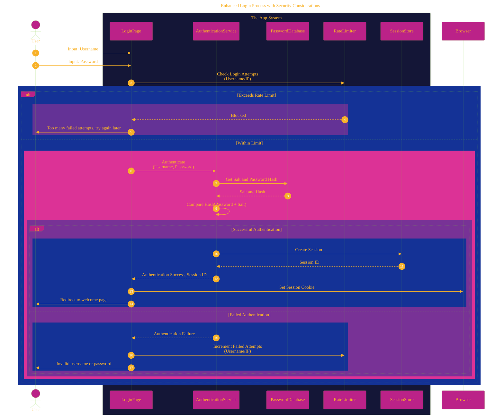
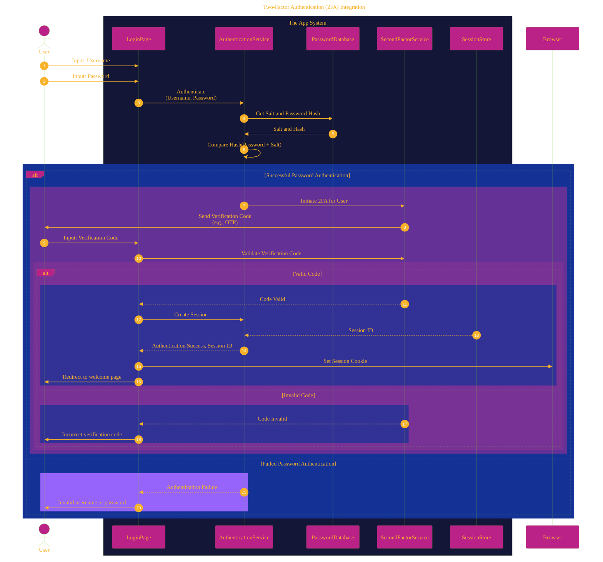
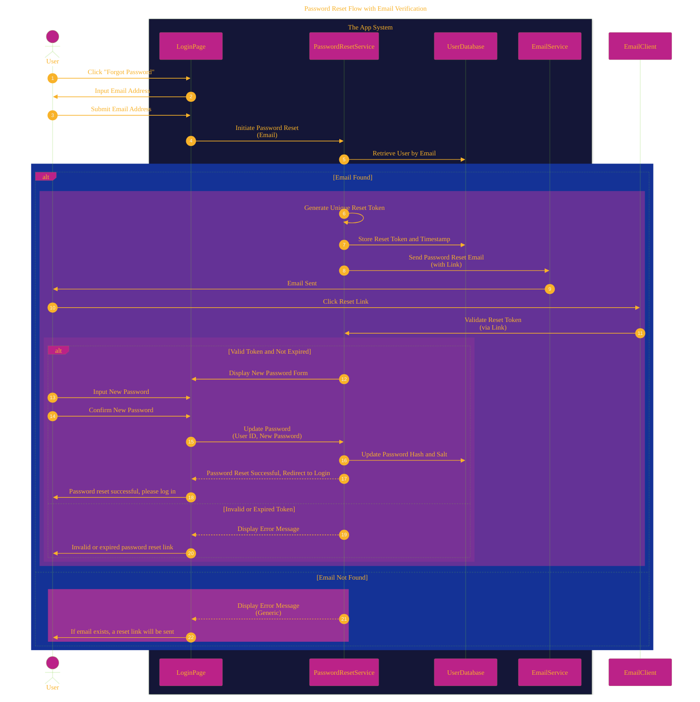

# User Authentication Process
> **Disclaimer:**
>
> This document contains my personal notes on the topic,
> compiled from publicly available documentation and various cited sources.
> The materials are intended for educational purposes, personal study, and reference.
> The content is dual-licensed:
> 1. **MIT License:** Applies to all code implementations (Swift, Mermaid, and other programming languages).
> 2. **Creative Commons Attribution 4.0 International License (CC BY 4.0):** Applies to all non-code content, including text, explanations, diagrams, and illustrations.
---

## A Diagrammatic Guide 

This document now includes a more detailed look at user authentication and security.

### 1. Enhanced Login Process with Security Considerations

The following sequence diagram expands on the initial login flow by incorporating some of the security measures discussed earlier.

**Explanation:** This updated login process now explicitly includes a `RateLimiter` to prevent brute-force attacks. It also clarifies that the `AuthenticationService` retrieves the salt and hashed password from the `PasswordDatabase` to perform a secure comparison. Upon successful authentication, a session is created and a session ID is managed via a `SessionStore`.

---

### 2. Two-Factor Authentication (2FA) Integration

This sequence diagram shows how 2FA can be integrated into the login process for enhanced security.

**Explanation:** After the initial password authentication is successful, the user is prompted for a second factor of authentication, managed by the `SecondFactorService`. Only after the successful validation of this second factor is a session created.

---

### 3. Password Reset Flow with Email Verification

The password reset flow now includes a clearer step for email verification.

**Explanation:** This refined password reset flow ensures that a unique, time-sensitive token is generated and sent to the user's email address for verification before they can set a new password.

---
**Licenses:**

- **MIT License:**   - Full text in [LICENSE](LICENSE) file.
- **Creative Commons Attribution 4.0 International:**  - Legal details in [LICENSE-CC-BY](LICENSE-CC-BY) and at [Creative Commons official site](http://creativecommons.org/licenses/by/4.0/).

---