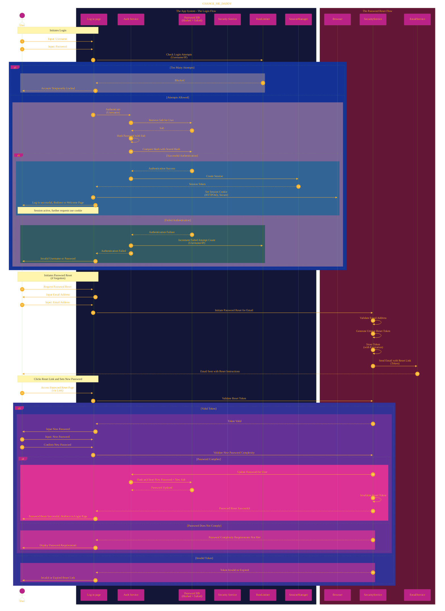

# User Authentication Process
> **Disclaimer:**
>
> This document contains my personal notes on the topic,
> compiled from publicly available documentation and various cited sources.
> The materials are intended for educational purposes, personal study, and reference.
> The content is dual-licensed:
> 1. **MIT License:** Applies to all code implementations (Swift, Mermaid, and other programming languages).
> 2. **Creative Commons Attribution 4.0 International License (CC BY 4.0):** Applies to all non-code content, including text, explanations, diagrams, and illustrations.
---

## A Diagrammatic Guide 

The following documentation updates and optimizes the original Mermaid sequence diagram to incorporate crucial concepts and complexities related to user authentication and security, as identified in the previous review.

We will maintain the core login and password reset flows within the central sequence diagram but augment it with annotations and incorporate references to additional diagrams that detail specific security measures and processes.

**Explanation of Updates and Added Concepts:**

1.  **Dedicated Authentication Service (`Auth Service`)**: Introduces a separate component responsible for core authentication logic, promoting separation of concerns.
2.  **Secure Password Storage (`Password DB (Hashed + Salted)`)**: Explicitly states that passwords are not stored in plain text but are hashed and salted. This directly addresses a critical security omission.
3.  **Security Service (`Security Service`)**: Centralizes security-related functions like password reset token generation, validation, and password complexity checks.
4.  **Rate Limiter**: Integrates a `RateLimiter` to prevent brute-force login attacks by tracking and potentially blocking excessive login attempts from a user or IP address.
5.  **Session Manager**: Introduces a `SessionManager` to handle the creation and management of user sessions after successful login, including the generation and handling of session tokens.
6.  **Session Cookies**: Mentions the use of HTTPOnly and Secure session cookies for enhanced security against cross-site scripting (XSS) and man-in-the-middle attacks.
7.  **Password Complexity Validation**: Includes a step to validate the new password against defined complexity requirements during the password reset process.
8.  **Reset Token Expiration**: Implicitly suggests that password reset tokens have a limited lifespan to reduce the risk of misuse.
9.  **Email Service**: Mentions an `EmailService` responsible for sending the password reset link.
10. **More Specific Error Handling (Implicit)**: While not explicitly branching on different failure reasons in the main diagram for brevity, the updated flow suggests that more specific error messages could be provided (e.g., "Account Temporarily Locked").

**References to Additional Visual Representations (from previous response):**

To fully understand the intricacies, refer to the following diagrams and explanations provided in the previous response:

*   **Secure Password Storage (Graph LR)**: Provides a detailed view of the hashing and salting process.
*   **Login Rate Limiting (Graph TD)**: Illustrates the logic behind preventing excessive login attempts.
*   **Two-Factor Authentication (2FA) Flow (Sequence Diagram)**: Although not directly integrated into the main diagram for simplicity, the possibility of enabling 2FA after successful password authentication exists in modern systems. This would add another layer of security managed by the `Auth Service` and potentially a dedicated `SecondFactorService`.
*   **Account Creation Process (Graph TD)**: Details the steps involved in creating a new user account, a prerequisite for the login process.
*   **Session Management (Sequence Diagram)**: Explains how user sessions are maintained after successful login using session cookies and a session store.

**Further Considerations (Not Visually Represented Here):**

*   **Input Validation and Sanitization**: The `LoginPage` should rigorously validate and sanitize user inputs to prevent injection attacks.
*   **Logging and Auditing**: All authentication-related events (successful logins, failed attempts, password resets) should be logged and audited for security monitoring.
*   **Protection Against Common Attacks**: The system should implement measures to protect against common web application vulnerabilities.
*   **Scalability and Reliability**: The design should consider how these processes will scale and remain reliable under high user load.
*   **Alternative Login Methods**: The diagram focuses on traditional username/password. Modern systems often support alternative methods like social logins.

By updating the main sequence diagram and referencing more detailed visual representations for specific security mechanisms, this documentation provides a more comprehensive and semantically rich understanding of the user authentication and password reset processes.

---
**Licenses:**

- **MIT License:**   - Full text in [LICENSE](LICENSE) file.
- **Creative Commons Attribution 4.0 International:**  - Legal details in [LICENSE-CC-BY](LICENSE-CC-BY) and at [Creative Commons official site](http://creativecommons.org/licenses/by/4.0/).

---