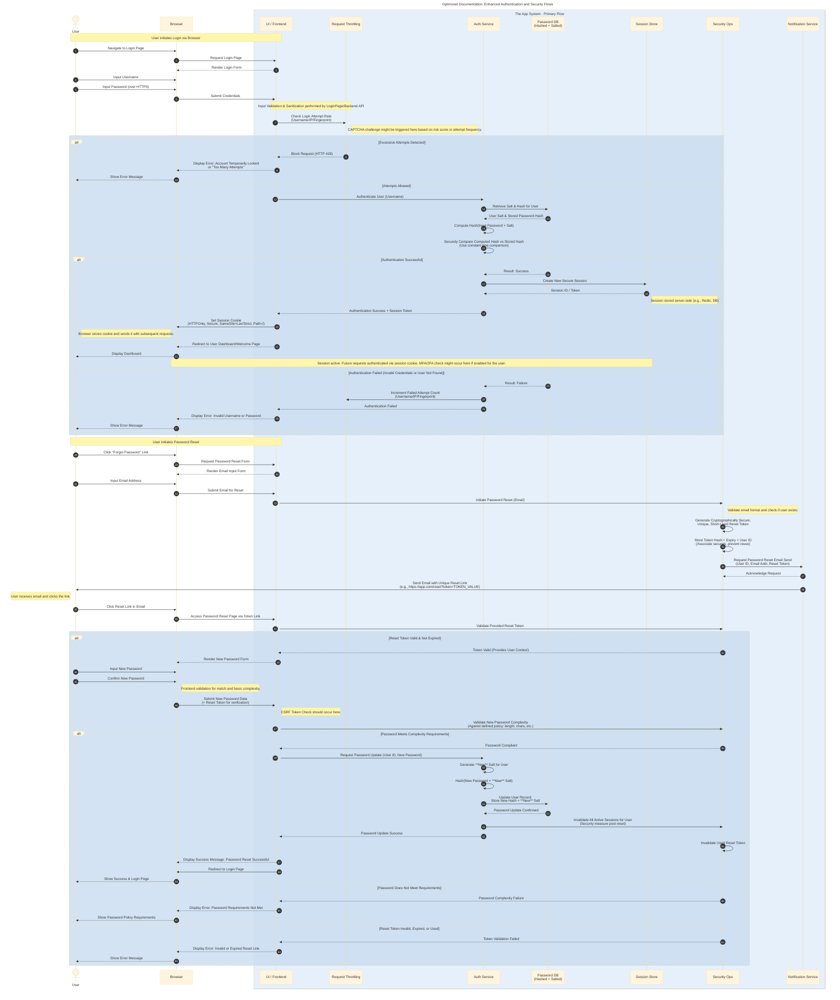

# User Authentication Process
> **Disclaimer:**
>
> This document contains my personal notes on the topic,
> compiled from publicly available documentation and various cited sources.
> The materials are intended for educational purposes, personal study, and reference.
> The content is dual-licensed:
> 1. **MIT License:** Applies to all code implementations (Swift, Mermaid, and other programming languages).
> 2. **Creative Commons Attribution 4.0 International License (CC BY 4.0):** Applies to all non-code content, including text, explanations, diagrams, and illustrations.
---

Here's an optimized version incorporating further details, clarifications, and current best practices, while aiming to maintain the clarity of the original diagram:

***

## Optimized Documentation of Authentication and Security Concepts

This documentation refines and expands upon the previous version to provide a more comprehensive view of user authentication and security, reflecting current industry standards and addressing potential nuances.

The core login and password reset flows remain central, visualized through the sequence diagram. Enhancements include more precise terminology, added security checks, and expanded explanations referencing both the main diagram and associated security principles.

**Summary of Key Optimizations and Enhancements:**

1.  **Clearer Participants & Roles**:
    *   `LoginPage` explicitly labeled as `UI / Frontend`.
    *   `RateLimiter` labeled as `Request Throttling` for clarity.
    *   `SecurityDepartment` (unused) removed. `SecurityService` clearly labeled `Security Ops`.
    *   `EmailService` labeled `Notification Service`.
    *   `Browser` is now explicitly shown interacting with the user and the `LoginPage`.

2.  **Enhanced Security Details in Diagram:**
    *   **Input Validation**: Added a note emphasizing validation/sanitization (though detailed steps aren't shown to keep the diagram concise).
    *   **HTTPS**: Explicitly mentioned password submission occurs over HTTPS.
    *   **Secure Comparison**: Noted the use of constant-time comparison for password hashes to prevent timing attacks.
    *   **Session Cookie Attributes**: Detailed the recommended attributes (`HTTPOnly`, `Secure`, `SameSite`, `Path`).
    *   **Session Storage**: Added a note indicating sessions are stored server-side.
    *   **MFA/2FA**: Added a note indicating where Multi-Factor Authentication would typically fit in (post-successful primary authentication).
    *   **Reset Token Security**: Emphasized generating cryptographically secure, unique, short-lived tokens and storing their *hash*, not the raw token.
    *   **CSRF Protection**: Added a note indicating the need for CSRF token validation during password reset submission.
    *   **New Salt on Reset**: Explicitly highlighted that a **new** salt is generated when the password is changed/reset.
    *   **Session Invalidation on Reset**: Added a crucial step to invalidate all existing user sessions after a password reset for security.
    *   **CAPTCHA**: Added a note indicating potential CAPTCHA integration points.
    *   **Rate Limiter Inputs**: Specified that rate limiting can use Username, IP, and potentially device fingerprinting.

3.  **Improved Flow and Clarity:**
    *   More explicit interaction steps involving the `Browser`.
    *   Clearer distinction between authentication failure reasons (handled generically in the message for security, but the process accounts for different internal causes).
    *   More descriptive messages on activation/deactivation arrows.
    *   Refined `alt` block structure and coloring for readability.
    *   Used standard fonts and adjusted colors for better visual appeal based on Mermaid theme variables.

4.  **Refined Explanations (To accompany the diagram):**
    *   **Input Validation/Sanitization**: Emphasize this as a first line of defense (handled by Frontend/Backend API before hitting core services).
    *   **Rate Limiting Strategies**: Mention different techniques (token bucket, leaky bucket) and inputs (IP, username, device fingerprint). Discuss CAPTCHA as a common companion.
    *   **Password Hashing**: Explain the importance of strong, adaptive hashing algorithms (e.g., Argon2, bcrypt, scrypt) and unique salts per user. Reiterate constant-time comparison.
    *   **Session Management**: Discuss session timeouts (idle and absolute), session rotation, secure cookie flags, and server-side session storage benefits.
    *   **CSRF Protection**: Explain the use of synchronizer tokens (CSRF tokens) for state-changing requests like password reset.
    *   **Password Reset Token Best Practices**: Cover secure generation (CSPRNG), short expiry times, single-use enforcement, storing hashes, and delivering via a secure channel (email link over HTTPS).
    *   **Password Policies**: Detail common complexity rules (length, character types, disallowing common passwords/user info).
    *   **MFA/2FA**: Reiterate its importance as an additional layer, often prompted after successful primary login or for sensitive actions.
    *   **Logging & Monitoring**: Stress the importance of logging all significant authentication and security events for auditing and incident response.
    *   **Secure Communication (HTTPS)**: Reiterate that all communication must happen over TLS/HTTPS.

---
**Licenses:**

- **MIT License:**   - Full text in [LICENSE](LICENSE) file.
- **Creative Commons Attribution 4.0 International:**  - Legal details in [LICENSE-CC-BY](LICENSE-CC-BY) and at [Creative Commons official site](http://creativecommons.org/licenses/by/4.0/).

---