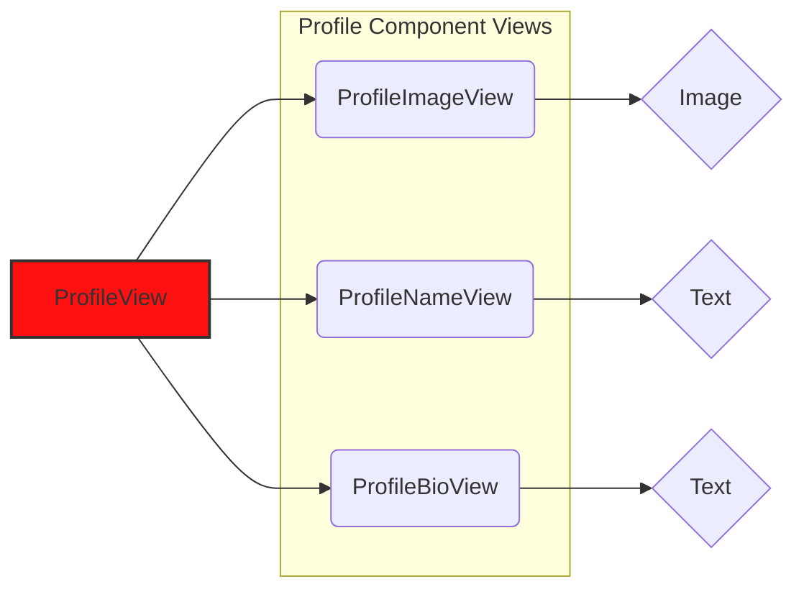
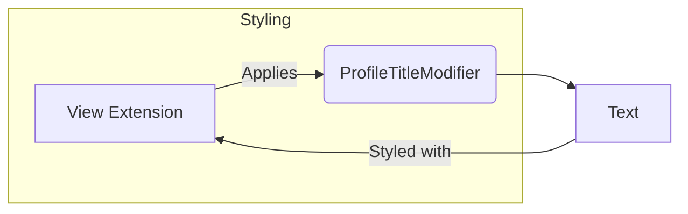
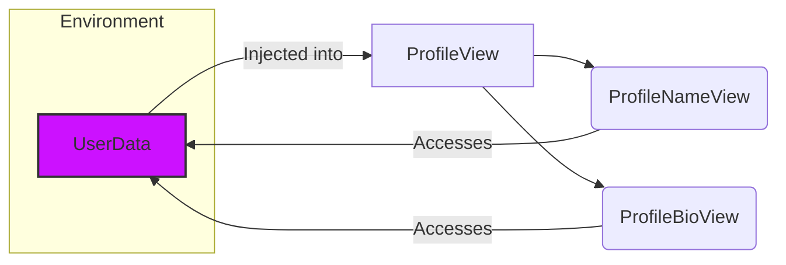
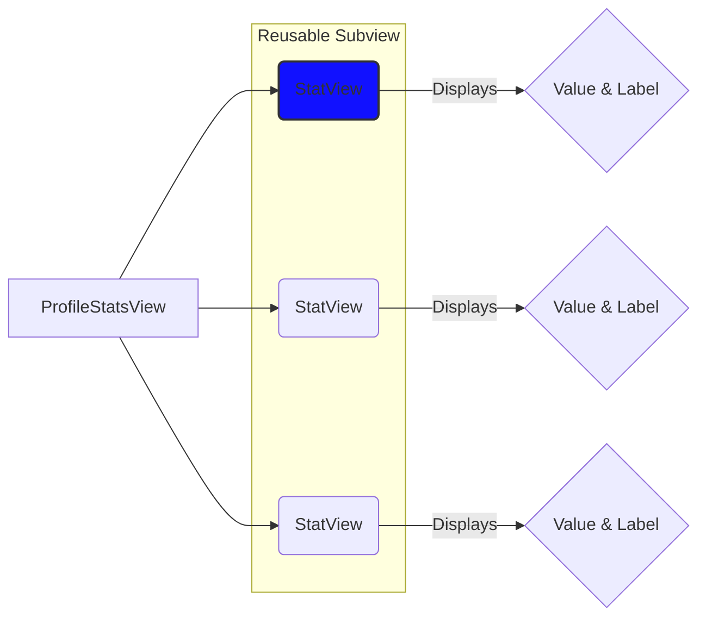
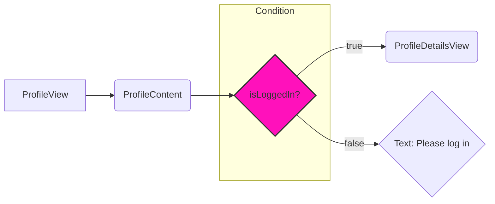

# View Composition in SwiftUI

Below are some Mermaid diagrams to visually represent the concepts of View Composition in SwiftUI.

## Diagram 1: Basic View Composition Structure

This diagram illustrates the hierarchical structure of a composed view, breaking down the `ProfileView` into its subcomponents.

## Diagram 2: View Extension for Styling

This diagram demonstrates how a View extension is used to apply a reusable style to a view component.

## Diagram 3: Environment Object for Shared Data

This diagram shows how an `EnvironmentObject` is used to share data between different views in the composition.

## Diagram 4: Reusable Subview for Repeated Patterns

This diagram illustrates the use of a reusable subview, `StatView`, within a larger view, `ProfileStatsView`.

## Diagram 5: Conditional Content with @ViewBuilder

This diagram depicts how `@ViewBuilder` is utilized to conditionally display different views based on a state variable.

---
