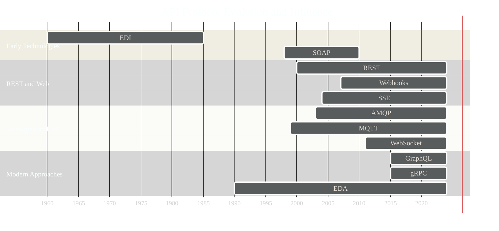

# API Protocol Evolution Timeline 
> **Disclaimer:**
>
> This document contains my personal notes on the topic,
> compiled from publicly available documentation and various cited sources.
> The materials are intended for educational purposes, personal study, and reference.
> The content is dual-licensed:
> 1. **MIT License:** Applies to all code implementations (Swift, Mermaid, and other programming languages).
> 2. **Creative Commons Attribution 4.0 International License (CC BY 4.0):** Applies to all non-code content, including text, explanations, diagrams, and illustrations.
---

This Gantt chart visualizes the evolution of API protocols, highlighting how each technology builds upon and improves upon its predecessors. It shows the approximate timeline of significant developments and adoption periods, rather than precise dates. The chart emphasizes the *influence* and *inspiration* one technology had on another, rather than strict chronological precedence.

**Explanation of the Chart and Key Evolutionary Relationships:**

*   **`gantt`**:  Specifies a Gantt chart.
*   **`dateFormat YYYY`**:  Sets the date format to year only (for simplicity).
*   **`axisFormat %Y`**:  Formats the axis to display years.
*   **`section`**:  Groups related technologies together.
*   **`EDI :edi, 1960, 1985`**:  Defines a task named "EDI" with an ID of "edi", starting in 1960 and ending in 1985. The date range represents the *significant development and initial adoption* period. While EDI is still used, the core concepts were established earlier.
*   **`mark SOAP, REST, GraphQL, gRPC`**: Highlight the milestones.

**Key Evolutionary Relationships and Improvements:**

1.  **EDI (Foundation):** While not a direct API in the modern sense, EDI established the concept of structured data exchange between systems, laying the groundwork for later protocols.

2.  **SOAP (Early Web Services):** SOAP built upon XML and provided a standardized way to expose web services. However, its complexity and verbosity led to the search for simpler alternatives.

3.  **REST (Architectural Style):** Roy Fielding's REST dissertation in 2000 revolutionized web API design. REST's principles of statelessness, resource-based URLs, and use of standard HTTP methods provided a more flexible and scalable approach than SOAP.

4.  **Webhooks (Event-Driven):** Webhooks emerged as a way to implement event-driven communication, allowing servers to push updates to clients instead of relying solely on client polling. This was a natural evolution of the web's increasingly interactive nature.

5.  **SSE (Simple Server Push):** SSE provided a standardized way to implement server-to-client streaming within the constraints of HTTP. It offered a simpler alternative to WebSockets for unidirectional communication.

6.  **AMQP and MQTT (Messaging Protocols):** These protocols focused on message-oriented communication, particularly for asynchronous and distributed systems. AMQP targeted enterprise messaging, while MQTT focused on lightweight communication for constrained devices (IoT).

7.  **WebSockets (Full-Duplex):** WebSockets provided a standardized way to establish persistent, bidirectional communication channels between clients and servers, enabling truly real-time applications.

8.  **GraphQL (Query Language):** GraphQL addressed the limitations of REST, particularly the problems of over-fetching and under-fetching data. It allowed clients to request precisely the data they needed, improving efficiency and performance. GraphQL's schema and type system also provided better developer experience and tooling.

9.  **gRPC (High-Performance RPC):** gRPC built upon HTTP/2 and Protocol Buffers to create a high-performance, cross-platform RPC framework. Its focus on efficiency and support for streaming made it well-suited for microservices architectures.

10. **EDA (Event-Driven Architecture):** It is a software architecture pattern promoting the production, detection, consumption of, and reaction to events. An event can be defined as "a significant change in state.

**Important Considerations:**

*   **Influence, Not Strict Chronology:** The chart emphasizes the *influence* and *conceptual evolution* of these technologies, not necessarily their exact chronological order. For example, the *ideas* behind Webhooks were influenced by REST, even though some early implementations might predate the widespread adoption of REST.
*   **Overlapping Timelines:** Many of these technologies continue to evolve and be used concurrently. The timelines represent periods of significant development and adoption, not exclusive usage.
*   **Simplified Representation:** The Gantt chart is a simplified representation of a complex history. Many other factors and technologies have contributed to the evolution of APIs.

This Gantt chart provides a visual and conceptual overview of how API protocols have evolved, highlighting the key improvements and influences that have shaped the landscape of API design and development. It demonstrates how each technology has built upon the strengths and addressed the weaknesses of its predecessors, leading to the diverse and powerful set of API options available today.

---
**Licenses:**

- **MIT License:**   - Full text in [LICENSE](LICENSE) file.
- **Creative Commons Attribution 4.0 International:**  - Legal details in [LICENSE-CC-BY](LICENSE-CC-BY) and at [Creative Commons official site](http://creativecommons.org/licenses/by/4.0/).

---