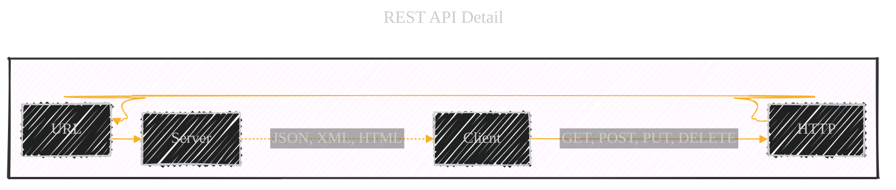
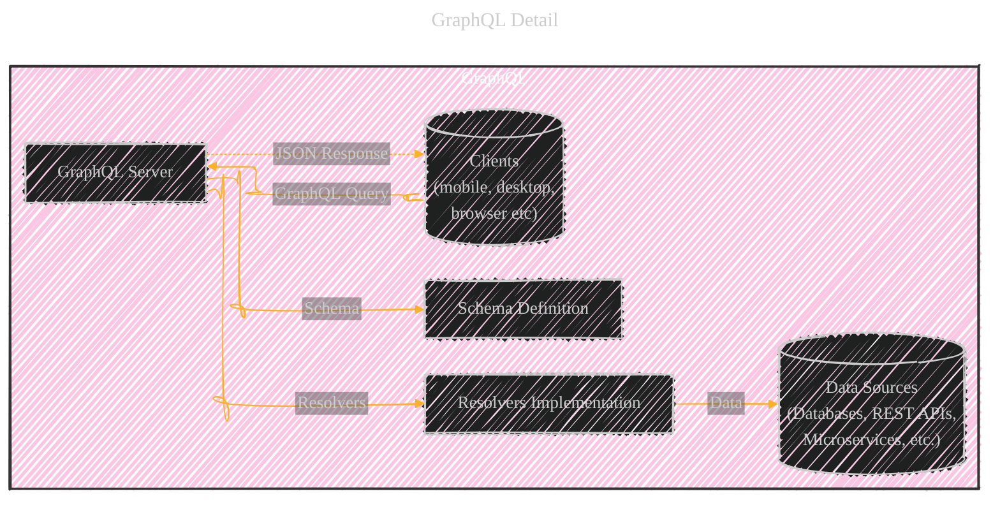
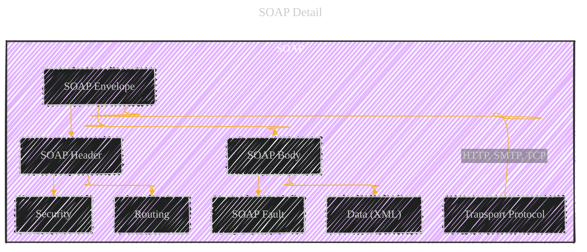
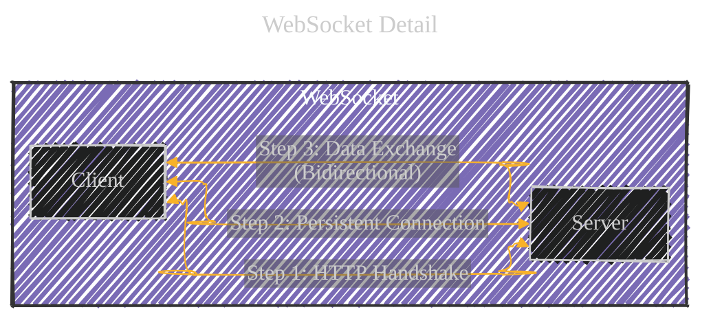
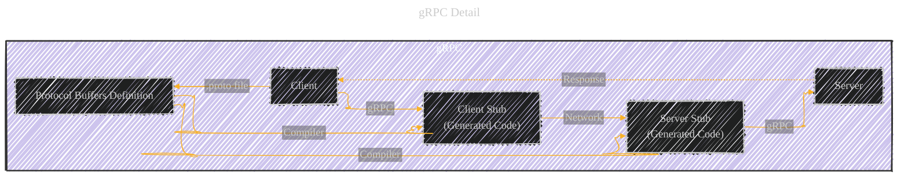
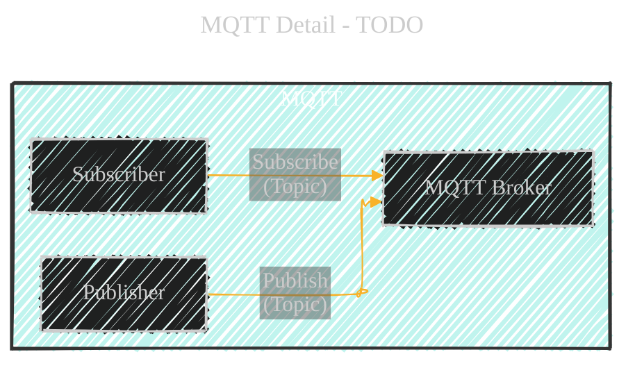
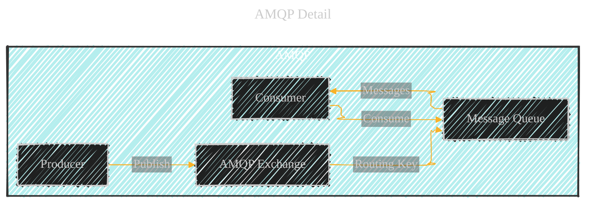
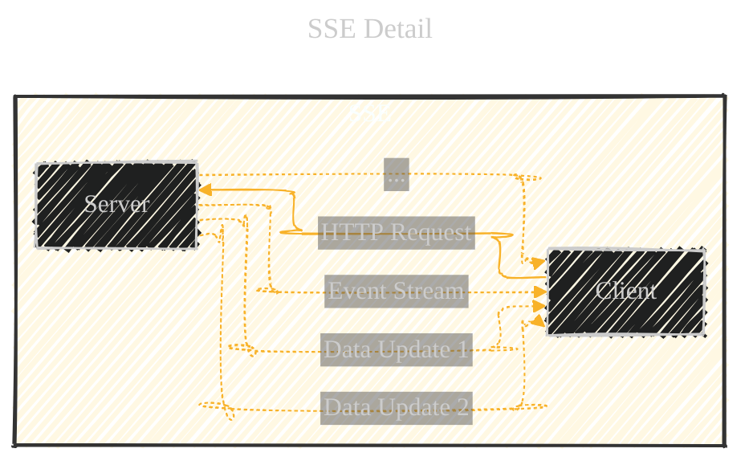
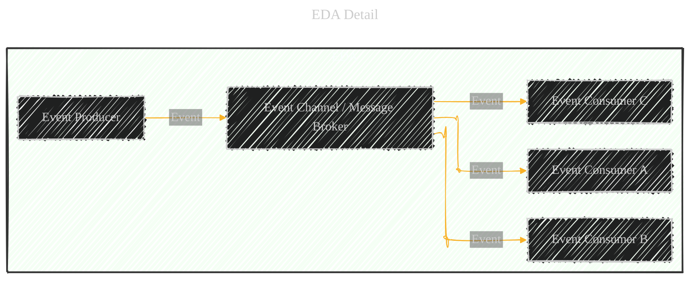

# API Technologies: A Comprehensive Overview
> **Disclaimer:**
>
> This document contains my personal notes on the topic,
> compiled from publicly available documentation and various cited sources.
> The materials are intended for educational purposes, personal study, and reference.
> The content is dual-licensed:
> 1. **MIT License:** Applies to all code implementations (Swift, Mermaid, and other programming languages).
> 2. **Creative Commons Attribution 4.0 International License (CC BY 4.0):** Applies to all non-code content, including text, explanations, diagrams, and illustrations.
---

This document provides a detailed breakdown of various API technologies, visualizing their relationships and internal workings using Mermaid diagrams. We'll cover REST, Webhooks, GraphQL, SOAP, WebSockets, gRPC, MQTT, AMQP, SSE, EDI, and EDA, offering both high-level and in-depth perspectives.

## 1. Overall API Technologies Wheel

This pie chart represents the central wheel, showing the relative proportions of each API technology. This provides a quick visual overview of the prevalence and usage of each technology in the current landscape.  While the original image provides a snapshot, it's important to remember that the popularity and usage of these technologies can fluctuate based on industry trends and specific project requirements.

**Explanation:**

*   **`pie showData`**:  Specifies a pie chart and displays the data values.
*   **`title API Technologies`**:  Sets the title of the chart.
*   **`"REST" : 20`**, etc.:  Defines each section of the pie chart and its relative size.  I've estimated the proportions, and crucially, I've changed `EDA` from `0` to `0.1`.  While EDA might have a smaller *direct* API footprint compared to the others, it's a crucial architectural *pattern* that underpins many modern systems.  Setting it to zero completely misrepresents its importance.

**Explanation and Best Practices:**

*   **REST (Representational State Transfer):**  Still the dominant paradigm for web APIs, especially for CRUD (Create, Read, Update, Delete) operations.  Its statelessness and use of standard HTTP methods make it highly scalable and interoperable.  Best practices include using proper HTTP status codes, versioning your API, and following HATEOAS (Hypermedia as the Engine of Application State) principles where appropriate.
*   **Webhooks:**  Essential for event-driven architectures.  They allow applications to receive real-time notifications when specific events occur, reducing the need for constant polling.  Security is paramount: always validate webhook signatures and use HTTPS.
*   **GraphQL:**  Gaining significant traction, particularly for complex data requirements and mobile applications.  Its ability to fetch precisely the data needed in a single request reduces over-fetching and improves performance.  Schema design and query optimization are key considerations.
*   **SOAP (Simple Object Access Protocol):**  While less common in newer projects, SOAP remains prevalent in enterprise environments.  Its strict contracts and built-in error handling can be advantageous in certain contexts.  However, its complexity and verbosity often make it less desirable than REST or GraphQL.
*   **WebSockets:**  Ideal for real-time, bidirectional communication, such as chat applications, online gaming, and live data streaming.  Managing WebSocket connections and handling scalability can be more complex than traditional request-response APIs.
*   **gRPC (Google Remote Procedure Call):**  A high-performance, cross-platform RPC framework.  It uses Protocol Buffers for efficient data serialization and supports various programming languages.  gRPC is well-suited for microservices architectures and internal communication.
*   **MQTT (Message Queuing Telemetry Transport):**  A lightweight messaging protocol designed for constrained devices and low-bandwidth networks, commonly used in IoT (Internet of Things) applications.  Security and reliability are critical considerations.
*   **AMQP (Advanced Message Queuing Protocol):**  Another messaging protocol, often used in enterprise messaging systems.  It offers robust features for message routing, queuing, and delivery guarantees.
*   **SSE (Server-Sent Events):**  A unidirectional protocol where the server pushes updates to the client.  Simpler than WebSockets for scenarios where only server-to-client communication is needed.
*   **EDI (Electronic Data Interchange):**  A long-established standard for exchanging business documents electronically.  While often associated with older systems, EDI remains crucial in many industries, such as supply chain management.
*   **EDA (Event-Driven Architecture):**  Not a specific API technology *per se*, but a fundamental architectural *pattern*.  EDA focuses on asynchronous communication between services using events.  Technologies like Webhooks, MQTT, AMQP, and even REST can be used within an EDA.  This is why it's crucial to represent it in the overview, even if it doesn't have a direct "API" in the same way as the others.

----

## 2. REST Detail

This diagram illustrates the components and flow of a RESTful interaction.  REST is characterized by its statelessness, use of standard HTTP methods (GET, POST, PUT, DELETE, etc.), and resource-based URLs.

**Explanation:**

*   **`flowchart LR`**:  Creates a left-to-right flowchart.
*   **`subgraph REST`**:  Groups the REST components together.
*   **`Client -->|GET, POST, PUT, DELETE| HTTP`**:  Shows the client initiating a request using standard HTTP methods. This is a critical addition, highlighting the core of REST.
*   **`HTTP --> URL`**:  Indicates that the request is directed to a specific resource identified by a URL.
*   **`URL --> Server`**:  The request reaches the server.
*   **`Server -.->|JSON, XML, HTML| Client`**:  The server responds with data, typically in JSON, XML, or HTML format.  The dotted line represents the response. I've added XML and HTML as possible response formats, broadening the scope beyond just JSON.

**Best Practices:**

*   **Statelessness:**  Each request from the client to the server must contain all the information needed to understand and process the request. The server does not store any client context between requests. This improves scalability and reliability.
*   **Resource-Based URLs:**  URLs should represent resources (nouns), not actions (verbs). For example, `/users/123` represents the user with ID 123.
*   **HTTP Methods:**  Use the appropriate HTTP method for each operation:
    *   `GET`: Retrieve a resource.
    *   `POST`: Create a new resource.
    *   `PUT`: Update an existing resource (completely).
    *   `PATCH`: Update an existing resource (partially).
    *   `DELETE`: Delete a resource.
*   **HTTP Status Codes:**  Use standard status codes to indicate the outcome of a request (e.g., 200 OK, 201 Created, 400 Bad Request, 404 Not Found, 500 Internal Server Error).
*   **HATEOAS (Hypermedia as the Engine of Application State):**  Include links in the response that guide the client to related resources and actions. This makes the API more discoverable and reduces coupling between the client and server.
* **Versioning:** Use version in URL or in header for backward compatibility.

---

## 3. Webhooks Detail

This diagram illustrates the Webhook notification process.  Webhooks are a powerful mechanism for enabling real-time, event-driven communication between applications.  They are often described as "reverse APIs" because the server initiates the communication, pushing data to the client when an event occurs.

**Explanation:**

*   **`flowchart TD`**:  Top-down flowchart, suitable for showing a sequence of steps.
*   **`subgraph Webhooks`**:  Groups the components.
*   **Numbered Steps:** I've added numbered steps to clearly outline the flow:
    1.  **Register Webhook URL:** Your application registers a URL with the webhook provider. This URL will be called when an event occurs.
    2.  **Store URL:** The provider stores the registered URL.
    3.  **Event Notification:** A trigger event occurs on the provider's side.
    4.  **HTTP POST to URL:** The provider sends an HTTP POST request to the registered URL, containing data about the event.
    5.  **Process Event:** Your application receives the POST request and processes the event data.

**Best Practices:**

*   **Security:**  Webhook security is *critical*.  Always:
    *   **Use HTTPS:**  Ensure the webhook URL uses HTTPS to protect the data in transit.
    *   **Validate Signatures:**  Webhook providers often include a signature in the request headers.  Verify this signature to ensure the request originated from the legitimate provider and hasn't been tampered with.
    *   **Whitelist IP Addresses:** If possible, restrict incoming webhook requests to known IP addresses of the provider.
*   **Retry Mechanism:**  Implement a retry mechanism with exponential backoff to handle temporary network issues or downtime on your application's side.
*   **Idempotency:**  Design your webhook handler to be idempotent. This means that processing the same event multiple times should have the same effect as processing it once. This is important because webhooks can sometimes be delivered more than once.
*   **Asynchronous Processing:**  Process webhook events asynchronously to avoid blocking the main thread of your application. Use a queue or background worker to handle the event processing.
*   **Monitoring:** Monitor and log all the webhooks activities.

---

## 4. GraphQL Detail

This shows the client-server interaction in GraphQL.  GraphQL is a query language for APIs and a runtime for fulfilling those queries with your existing data.  It provides a more efficient, powerful, and flexible alternative to REST.

**Explanation:**

*   **`Clients[(...)]`**:  Uses parentheses to create a cylinder shape, representing multiple clients.
*   **`GraphQL Query`**:  Clients send a GraphQL query to the server, specifying exactly the data they need.
*   **`GraphQL Server`**:  The core of the GraphQL implementation.
*   **`Schema Definition`**:  Defines the types and relationships of the data that can be queried.  This is a *crucial* addition, as the schema is fundamental to GraphQL.
*   **`Resolvers Implementation`**:  Functions that fetch the data for each field in the schema.  This is also a key addition, showing how GraphQL actually retrieves the data.
*   **`Data Sources`**:  The various sources from which the resolvers can fetch data (databases, REST APIs, microservices, etc.).
*   **`JSON Response`**:  The server returns a JSON response containing only the data requested by the client.

**Best Practices:**

*   **Single Endpoint:**  Unlike REST, which typically has multiple endpoints, GraphQL usually exposes a single endpoint.
*   **Strong Typing:**  GraphQL's schema provides strong typing, which helps prevent errors and improves developer experience.
*   **Introspection:**  The GraphQL schema can be queried, allowing clients to discover the available data and types.
*   **Over-fetching and Under-fetching:**  GraphQL solves the problems of over-fetching (getting more data than needed) and under-fetching (not getting enough data in a single request) that are common in REST APIs.
*   **Query Optimization:**  Carefully design your schema and resolvers to avoid performance bottlenecks.  Use techniques like data loaders to batch and cache data fetching.
*   **Error Handling:**  GraphQL provides a standardized way to handle errors, allowing clients to gracefully handle partial failures.
*   **Security:** Implement authorization and authentication to control access to your GraphQL API.

---

## 5. SOAP Detail

This diagram illustrates the structure of a SOAP message. SOAP (Simple Object Access Protocol) is a messaging protocol specification for exchanging structured information in the implementation of web services.

**Explanation:**

*   Uses a top-down flow to represent the nested structure of the SOAP message.  This is a much more detailed breakdown than the original image.
*   **`SOAP Envelope`**:  The root element of the SOAP message.
*   **`SOAP Header`**:  Contains optional header information, such as security and routing details. I've added `Security` and `Routing` as examples of common header elements.
*   **`SOAP Body`**:  Contains the actual message data (in XML format).
*   **`SOAP Fault`**:  Provides information about errors that occurred during processing.  This is a *critical* addition, highlighting SOAP's built-in error handling.
*   **`Data (XML)`**:  The message payload, formatted as XML.
*   **`Transport Protocol`**:  SOAP can be used with various transport protocols, including HTTP, SMTP, and TCP. I've explicitly included this.

**Best Practices:**

*   **XML-Based:**  SOAP messages are always XML-based.
*   **Strict Contracts:**  SOAP relies on WSDL (Web Services Description Language) to define strict contracts between the client and server.
*   **Built-in Error Handling:**  SOAP provides a standardized way to handle errors using SOAP Faults.
*   **Stateful or Stateless:**  SOAP can be used for both stateful and stateless communication.
*   **Complexity:**  SOAP is generally considered more complex than REST.
*   **WS-\* Standards:**  SOAP supports a wide range of WS-\* standards for security, reliability, and transactions.
* **Enterprise Use:** It is widely used in enterprise environment.

----
## 6. WebSocket Detail

This diagram shows the bidirectional communication of WebSockets. WebSockets provide full-duplex communication channels over a single TCP connection.  This allows for real-time, interactive applications.

**Explanation:**

*   **`<-->`**:  The double-headed arrow is *essential* to represent the bidirectional communication, a key feature of WebSockets.
*   **Numbered Steps:**  I've added numbered steps to clarify the process:
    1.  **HTTP Handshake:**  The connection starts with an HTTP handshake to establish the WebSocket connection.
    2.  **Persistent Connection:**  Once established, the connection remains open, allowing for real-time communication.
    3.  **Data Exchange (Bidirectional):**  Both the client and server can send data at any time.

**Best Practices:**

*   **Real-Time Communication:**  WebSockets are ideal for applications that require real-time updates, such as chat applications, online games, and financial trading platforms.
*   **Low Latency:**  Because the connection remains open, WebSockets offer lower latency than traditional HTTP request-response communication.
*   **Connection Management:**  Handling WebSocket connections requires careful consideration of resource management and scalability.
*   **Security:** Use `wss://` (WebSocket Secure) for encrypted communication.
*   **Framing:**  WebSocket data is transmitted in frames.
*   **Error Handling:**  Implement robust error handling to deal with connection drops and other potential issues.

----

## 7. gRPC Detail

This illustrates the gRPC client-server interaction, including stubs. gRPC is a high-performance, open-source, universal RPC framework.

**Explanation:**

*   **`.proto file`**:  The service definition is written in a `.proto` file using Protocol Buffers.  This is a *fundamental* aspect of gRPC and must be included.
*   **`Protocol Buffers Definition`**:  The `.proto` file defines the service methods, request messages, and response messages.
*   **`Compiler`**:  The Protocol Buffers compiler generates client and server stubs from the `.proto` file.
*   **`Client Stub (Generated Code)`**:  Provides a local interface for the client to call the service methods.
*   **`Server Stub (Generated Code)`**:  Provides an interface for the server to implement the service methods.
*   **`Network`**:  The underlying network transport (typically HTTP/2).  gRPC benefits significantly from HTTP/2's multiplexing and header compression.
*   **`Response`**:  The server sends a response back to the client.

**Best Practices:**

*   **Protocol Buffers:**  gRPC uses Protocol Buffers (protobuf) for data serialization.  Protobuf is a highly efficient, language-agnostic binary format.
*   **HTTP/2:**  gRPC is built on top of HTTP/2, which provides several performance benefits, including multiplexing, header compression, and server push.
*   **Streaming:**  gRPC supports various types of streaming:
    *   **Unary RPC:**  A single request and a single response (like a traditional function call).
    *   **Server Streaming RPC:**  A single request and a stream of responses from the server.
    *   **Client Streaming RPC:**  A stream of requests from the client and a single response from the server.
    *   **Bidirectional Streaming RPC:**  A stream of requests and a stream of responses, both happening concurrently.
*   **Cross-Platform:**  gRPC supports a wide range of programming languages, making it suitable for building distributed systems with heterogeneous components.
*   **Interceptors:**  gRPC provides interceptors, which allow you to add custom logic to the request/response pipeline (e.g., for authentication, logging, or monitoring).
* **Error Handling**: Use status code and error messages.

----

## 8. MQTT Detail - TODO

This diagram shows the publish-subscribe pattern of MQTT. MQTT (Message Queuing Telemetry Transport) is a lightweight messaging protocol designed for constrained devices and low-bandwidth, high-latency, or unreliable networks. It's commonly used in IoT applications.

**Explanation:**

*   **`Publisher`**:  Devices or applications that publish messages to a specific topic.
*   **`MQTT Broker`**:  The central hub that manages subscriptions and distributes messages.
*   **`Subscribe (Topic)`**:  Subscribers register their interest in specific topics with the broker.
*   **`Topic`**:  A hierarchical string that identifies the subject of a message (e.g., `/sensors/temperature/living_room`).  This is *crucially* important to MQTT's functionality.
*   **`Topic Channel`**: The channel with messages related to the topic.
*   **`Deliver`**: The broker delivers messages to all subscribers that are subscribed to the topic.

**Best Practices:**

*   **Lightweight:**  MQTT is designed to be very lightweight, minimizing bandwidth usage and processing overhead.
*   **Publish-Subscribe:**  MQTT uses a publish-subscribe pattern, which decouples publishers and subscribers.  This makes the system more flexible and scalable.
*   **QoS (Quality of Service):**  MQTT supports different QoS levels:
    *   **QoS 0 (At most once):**  The message is delivered at most once, with no guarantees.
    *   **QoS 1 (At least once):**  The message is delivered at least once, but may be delivered multiple times.
    *   **QoS 2 (Exactly once):**  The message is delivered exactly once.
*   **Last Will and Testament (LWT):**  MQTT allows clients to specify a "last will and testament" message that will be published by the broker if the client disconnects unexpectedly.
*   **Retained Messages:**  The broker can retain the last message published on a topic, so that new subscribers receive the latest value immediately upon subscribing.
*   **Security:** Use TLS/SSL to encrypt MQTT communication.  Also, implement authentication and authorization to control access to the broker.

----

## 9. AMQP Detail

This diagram represents AMQP (Advanced Message Queuing Protocol). Similar to MQTT, AMQP is a messaging protocol that enables conforming client applications to communicate with conforming messaging middleware brokers.

**Explanation:**

*   **`Producer`**:  Sends messages to an exchange.
*   **`AMQP Exchange`**:  Receives messages from producers and routes them to message queues based on routing keys and bindings.  This is a key difference from MQTT, which uses topics directly.
*   **`Routing Key`**:  An attribute of the message that the exchange uses to determine how to route the message.
*   **`Message Queue`**:  Stores messages until they are consumed by a consumer.
*   **`Consumer`**:  Retrieves messages from a queue.

**Best Practices:**

*   **Message Queuing:**  AMQP is primarily designed for reliable message queuing.
*   **Exchange Types:**  AMQP defines different exchange types:
    *   **Direct Exchange:**  Routes messages to queues based on an exact match of the routing key.
    *   **Fanout Exchange:**  Routes messages to all bound queues, ignoring the routing key.
    *   **Topic Exchange:**  Routes messages to queues based on pattern matching of the routing key.
    *   **Headers Exchange:**  Routes messages based on message headers.
*   **Reliability:**  AMQP provides features for reliable message delivery, including acknowledgments, persistence, and transactions.
*   **Enterprise Messaging:**  AMQP is often used in enterprise messaging systems, where reliability and robustness are critical.

----

## 10. SSE Detail

This diagram illustrates the server-sent events flow. Server-Sent Events (SSE) is a server push technology enabling a client to receive automatic updates from a server via an HTTP connection.

**Explanation:**

*   **`Client -->|HTTP Request| Server`**: The client initiates a standard HTTP request to the server.
*   **`Server -.->|Event Stream| Client`**:  The server responds with a special `text/event-stream` content type, establishing a persistent connection.
*   **`Server -.->|Data Update 1| Client`**, **`Server -.->|Data Update 2| Client`**, **`Server -.->|...| Client`**: The server sends data updates to the client as events. The dotted lines emphasize the server *pushing* data.  The ellipsis (...) indicates that the server can continue sending updates indefinitely.

**Best Practices:**

*   **Unidirectional:**  SSE is *unidirectional*.  The server sends data to the client, but the client cannot send data to the server over the same connection.
*   **Text-Based:**  SSE is typically used to send text-based data.
*   **Simple:**  SSE is simpler to implement than WebSockets, especially on the server-side.
*   **HTTP-Based:**  SSE works over standard HTTP, making it compatible with existing infrastructure.
*   **Automatic Reconnection:**  Most SSE client libraries automatically handle reconnection if the connection is lost.
*   **Use Cases:**  SSE is suitable for applications like live news feeds, stock tickers, and social media updates.

-----

## 11. EDI Detail

This diagram represents the flow of business documents in EDI (Electronic Data Interchange). EDI is a standardized method for exchanging business documents electronically between organizations.

```mermaid
---
title: "EDI Detail"
author: "Cong Le"
version: "1.0"
license(s): "MIT, CC BY 4.0"
copyright: "Copyright (c) 2025 Cong Le. All Rights Reserved."
config:
  layout: elk
  look: handDrawn
  theme: dark
---
%%%%%%%% Mermaid version v11.4.1-b.14
%%%%%%%% Toggle theme value to `base` to activate the initilization below for the customized theme version.
%%%%%%%% Available curve styles include the following keywords:
%% basis, bumpX, bumpY, cardinal, catmullRom, linear, monotoneX, monotoneY, natural, step, stepAfter, stepBefore.
%%{
  init: {
    "flowchart": { "htmlLabels": false, 'curve': 'natural'},
    'fontFamily': 'Fantasy',
    'themeVariables': {
      'primaryColor': '#BB28',
      'primaryTextColor': '#299',
      'primaryBorderColor': '#7c2',
      'lineColor': '#F8B229'
    }
  }
}%%
flowchart LR
    subgraph EDI["EDI"]
    style EDI fill:#9e92,stroke:#333,stroke-width:2px
        Sender[Sender System] -->|"EDI Document<br>(e.g., Purchase Order)"| Translator[EDI Translator]
        Translator -->|Standardized Format| Network[EDI Network]
        Network -->|Standardized Format| Translator2[EDI Translator]
        Translator2 -->|"EDI Document<br>(e.g., Invoice)"| Receiver[Receiver System]
    end
    
```

**Explanation:**

*   **`Sender System`**:  The system initiating the EDI exchange.
*   **`EDI Document (e.g., Purchase Order)`**:  The business document being sent (e.g., a purchase order, invoice, shipping notice).
*   **`EDI Translator`**:  Software that converts the document into a standardized EDI format (e.g., ANSI X12, EDIFACT).  This is *crucial* for interoperability.
*   **`Standardized Format`**:  The EDI document in a standard format.
*   **`EDI Network`**:  The network over which the EDI document is transmitted (often a Value-Added Network or VAN).
*   **`Translator2`**:  Another EDI translator on the receiver's side, converting the document from the standard format into a format the receiver's system can understand.
*   **`Receiver System`**:  The system receiving the EDI document.

**Best Practices:**

*   **Standardized Formats:**  EDI uses standardized formats (e.g., ANSI X12, EDIFACT, TRADACOMS) to ensure that different organizations can exchange documents electronically, regardless of their internal systems.
*   **Value-Added Networks (VANs):**  VANs are often used to provide secure and reliable transmission of EDI documents.
*   **Trading Partners:**  Organizations that exchange EDI documents are called trading partners.
*   **Cost Savings:**  EDI can significantly reduce costs by automating manual processes and reducing errors.
*   **Improved Efficiency:**  EDI speeds up business processes and improves data accuracy.
*   **Supply Chain Management:**  EDI is widely used in supply chain management, logistics, and healthcare.

----

## 12. EDA Detail

This diagram represents the producer-to-consumer relationship in an Event-Driven Architecture (EDA). EDA is an architectural pattern built around the production, detection, consumption of, and reaction to events.

**Explanation:**

*   **`Event Producer`**:  A component that generates events.
*   **`Event`**:  A significant change in state.  Events are typically immutable and represent something that has happened in the past.
*   **`Event Channel / Message Broker`**:  A central component that receives events from producers and routes them to consumers.  This could be a message queue (like RabbitMQ or Kafka), an event bus, or even a database.  This is a *critical* addition, making the diagram much more accurate.
*   **`Event Consumer A`**, **`Event Consumer B`**, **`Event Consumer C`**:  Components that subscribe to and process events.  Multiple consumers can process the same event, enabling different actions to be triggered by the same event.

**Best Practices:**

*   **Asynchronous Communication:**  EDA promotes asynchronous communication between services, improving decoupling and scalability.
*   **Loose Coupling:**  Components in an EDA are loosely coupled, meaning they don't need to know about each other directly.  They interact only through events.
*   **Scalability and Resilience:**  EDA can improve the scalability and resilience of systems by allowing components to be scaled independently and by handling failures gracefully.
*   **Real-Time Processing:**  EDA is well-suited for real-time processing and event-driven applications.
*   **Event Sourcing:**  A related pattern where events are stored as the primary source of truth, allowing the system's state to be reconstructed at any point in time.
*   **CQRS (Command Query Responsibility Segregation):**  Another related pattern that separates the handling of commands (actions that change the system's state) from the handling of queries (requests for data).

This comprehensive overview, with expanded explanations and Mermaid diagrams, provides a much more complete and accurate understanding of the various API technologies and architectural patterns. The use of Mermaid allows for clear and concise visualizations, making the information more accessible and easier to understand. The additions and best practice callouts bring the content up-to-date with current industry standards.

---
**Licenses:**

- **MIT License:**   - Full text in [LICENSE](LICENSE) file.
- **Creative Commons Attribution 4.0 International:**  - Legal details in [LICENSE-CC-BY](LICENSE-CC-BY) and at [Creative Commons official site](http://creativecommons.org/licenses/by/4.0/).

---