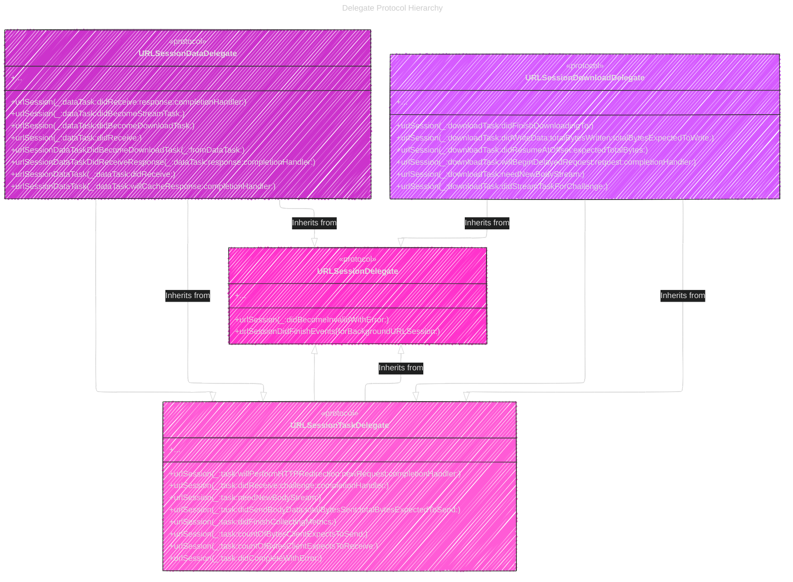

# Fetching website data into memory
> This content is dual-licensed under your choice of the following licenses:
> 1.  **MIT License:** For the code implementations in Swift and Mermaid provided in this document.
> 2.  **Creative Commons Attribution 4.0 International License (CC BY 4.0):** For all other content, including the text, explanations, and the Mermaid diagrams and illustrations.

----

# 1. Diagram: Task Type Choice

*   **Purpose:** To clearly differentiate between `URLSessionDataTask` and `URLSessionDownloadTask` based on their use cases, as introduced in the overview.
*   **Type:** Flowchart

---

# 2. Diagram: Session Configuration Options

*   **Purpose:** To illustrate the choice between using the `shared` session and creating a custom session with a delegate.
*   **Type:** Flowchart

---

# 3. Diagram: Completion Handler Flow (Recreation of Figure 1)

*   **Purpose:** To visualize the process of using a completion handler with `URLSessionDataTask`.
*   **Type:** Sequence Diagram

----

# 4. Diagram: Delegate Flow (Recreation of Figure 2)

*   **Purpose:** To illustrate the process of using a delegate to receive transfer details and results with `URLSessionDataTask`.
*   **Type:** Sequence Diagram

---

# 5. Diagram: Delegate Protocol Hierarchy

*   **Purpose:** To showcase the hierarchy and relationships of the important delegate protocols mentioned in the document.
*   **Type:** Class Diagram

----

# 6. Table: Comparison of Completion Handler vs Delegate

*   **Purpose:** To summarize the key differences and trade-offs between using completion handlers and delegates for `URLSessionDataTask`.
*   **Type:** Markdown Table (as Mermaid tables are less versatile for complex comparison)

| Feature               | Completion Handler                                  | Delegate                                             |
|-----------------------|----------------------------------------------------|------------------------------------------------------|
| **Complexity**        | Simpler, easier for basic tasks                    | More complex, requires delegate implementation        |
| **Control**           | Limited control over transfer process             | Fine-grained control, event-driven handling            |
| **Event Handling**    | Receives results only at the end (or error)        | Receives updates throughout the transfer (progress, data chunks, etc.) |
| **Use Cases**         | Simple data fetching, one-off requests            | Background tasks, progress updates, authentication, redirects, advanced handling |
| **Memory Management** | Easier to manage in simple cases                   | Requires careful management when accumulating data chunks |
| **Code Structure**    | Closure-based, can lead to "callback hell" in complex scenarios | Delegate methods, promotes better code organization for complex tasks |

----

---
**Licenses:**

- **MIT License:**   - Full text in [LICENSE](LICENSE) file.
- **Creative Commons Attribution 4.0 International:**  - Legal details in [LICENSE-CC-BY](LICENSE-CC-BY) and at [Creative Commons official site](http://creativecommons.org/licenses/by/4.0/).

---