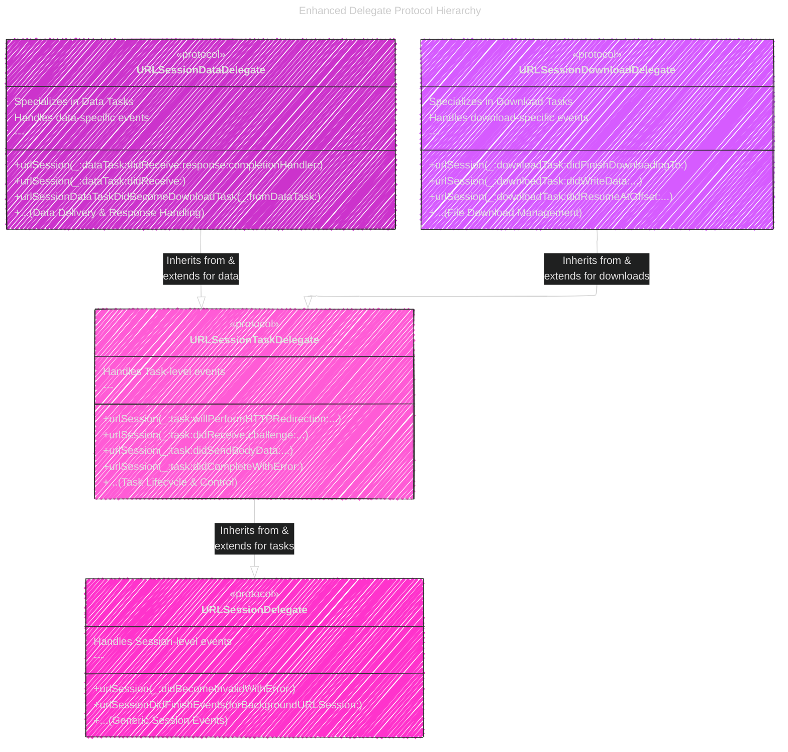

# Fetching website data into memory
> This content is dual-licensed under your choice of the following licenses:
> 1.  **MIT License:** For the code implementations in Swift and Mermaid provided in this document.
> 2.  **Creative Commons Attribution 4.0 International License (CC BY 4.0):** For all other content, including the text, explanations, and the Mermaid diagrams and illustrations.

----

The diagrams and illustrations below are enhanced versions of those in the previous documentation: [this documentation](/WEB_TECH/Fetching_website_data_into_memory_V1.md).

## 1. Diagram: Task Type Choice - Enhanced

*   **Purpose:** To clearly differentiate between `URLSessionDataTask` and `URLSessionDownloadTask` by highlighting their primary use cases and data handling methods.
*   **Type:** Flowchart (Enhanced with more descriptive labels)

---

## 2. Diagram: Session Configuration Options - Enhanced

*   **Purpose:** To clearly illustrate the decision points when choosing between a `shared` session for simplicity or a custom session for delegate-based control.
*   **Type:** Flowchart (Enhanced to emphasize benefits of each path)

---

## 3. Diagram: Completion Handler Flow - Enhanced (Recreation of Figure 1)

*   **Purpose:** To visualize the detailed process of using a completion handler with `URLSessionDataTask`, including error and response handling as per Listing 1.
*   **Type:** Sequence Diagram (Enhanced with error and response checks)

---

## 4. Diagram: Delegate Flow - Enhanced (Recreation of Figure 2)

*   **Purpose:** To detail the delegate-based data task process, highlighting key delegate methods and the event-driven nature of the interaction.
*   **Type:** Sequence Diagram (Enhanced with specific delegate methods and event loop)

---

## 5. Diagram: Delegate Protocol Hierarchy - Enhanced

*   **Purpose:** To clearly depict the inheritance hierarchy of `URLSessionDelegate` protocols and specify the core responsibilities of each protocol.
*   **Type:** Class Diagram (Enhanced with protocol responsibilities and clearer relationships)

---

## 6. Table: Comparison of Completion Handler vs Delegate - Enhanced

*   **Purpose:**  To provide a more nuanced comparison emphasizing the scenarios best suited for each approach and highlighting the trade-offs in control, complexity, and features.
*   **Type:** Markdown Table (Enhanced with more specific feature descriptions)

| Feature                   | Completion Handler                                                 | Delegate                                                                 |
|---------------------------|--------------------------------------------------------------------|--------------------------------------------------------------------------|
| **Complexity**            | Simpler to implement, concise for basic operations                  | More complex setup, requires implementing delegate protocol methods      |
| **Control Level**         | Basic: Results at completion, limited interim control               | Fine-grained: Event-driven, continuous updates & control throughout transfer |
| **Event Handling**        | Primarily handles end-of-transfer results (data, response, error)   | Handles numerous events: progress, data chunks, redirects, authentication, errors |
| **Ideal Use Cases**       | One-off, simple data requests; quick API calls where progress is not critical | Background tasks, file downloads, UIs needing progress indicators, advanced network handling |
| **Data Handling**         | Receives all data at once at the end                              | Receives data in chunks as it arrives, better for large data streams      |
| **Error Management**      | Basic error reporting at completion                                  | Comprehensive error and event reporting throughout the task lifecycle     |
| **Code Structure**        | Closure-based, can get nested/complex for error handling          | Delegate methods promote better organization for complex, event-driven logic|
| **Memory Considerations** | Simpler management for single-shot data retrieval                  | Requires more careful buffer management if accumulating received data chunks |
| **Best for:**              | **Simple, fire-and-forget requests**                               | **Complex interactions, requiring detailed transfer insights & control**   |

---

---
**Licenses:**

- **MIT License:**   - Full text in [LICENSE](LICENSE) file.
- **Creative Commons Attribution 4.0 International:**  - Legal details in [LICENSE-CC-BY](LICENSE-CC-BY) and at [Creative Commons official site](http://creativecommons.org/licenses/by/4.0/).

---