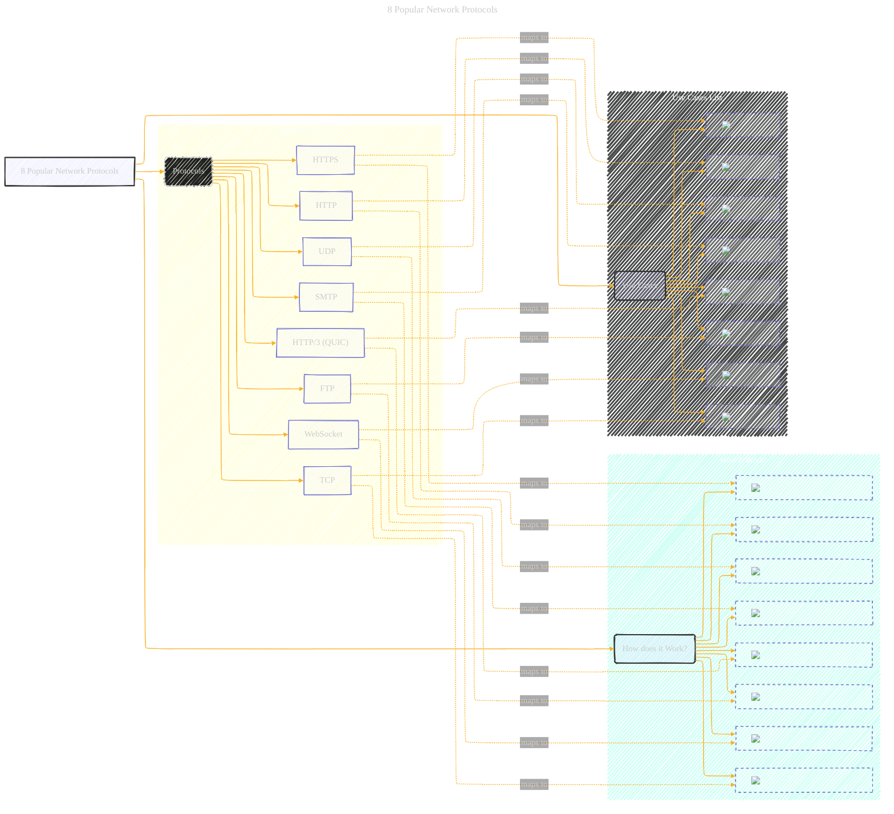

# Network Protocols
> **Disclaimer:**
>
> This document contains my personal notes on the topic,
> compiled from publicly available documentation and various cited sources.
> The materials are intended for educational purposes, personal study, and reference.
> The content is dual-licensed:
> 1. **MIT License:** Applies to all code implementations (Swift, Mermaid, and other programming languages).
> 2. **Creative Commons Attribution 4.0 International License (CC BY 4.0):** Applies to all non-code content, including text, explanations, diagrams, and illustrations.
---

 Here's a Mermaid representation that captures the structure, content, and visual cues of the "8 Popular Network Protocols".

---

## Key improvements and explanations:

*   **Overall Structure:**  The `graph LR` (left-to-right) provides a high-level view of the infographic's sections:  "8 Popular Network Protocols," "Protocols," "How does it Work?", and "Use Cases."
*   **Subgraphs for Clarity:**  The `subgraph` keyword is used *extensively* to group related elements.  This is *crucial* for visual organization in Mermaid, especially when dealing with many items.  We have subgraphs for:
    *   `Protocols_List`:  Lists each protocol (HTTP, HTTPS, etc.).  This keeps the main graph from becoming too cluttered.
    *   `How_It_Works`: Contains the cropped images that represent each protocol.
    *   `Use_Cases_List`: Contains the cropped images that represent each use case.
*   **Direct image use via imgur link:** Because you are using a image as an input, and the best output I can provide you here is Mermaid, the cropped images are stored on Imgur, and used for the best visualization I can provide you in this case.
*   **Mapping with Dotted Lines:** The `-.->` creates a dotted line, visually representing the mapping between a protocol and its corresponding "How It Works" and "Use Cases" sections.  The `|maps to|` text adds clarity.
* **Styling**: The use of different fill colors and border make the distinction between the different nodes and categories easier.

How to use this:

1.  **Copy the Code:** Copy the entire Mermaid code provided above.
2.  **Mermaid Live Editor:** Paste the code into the Mermaid Live Editor ([https://mermaid.live/](https://mermaid.live/)).  You should see the diagram rendered.
3.  **Export (if needed):** The Mermaid Live Editor allows you to export the diagram as an SVG, PNG, or PDF.

---
**Licenses:**

- **MIT License:**   - Full text in [LICENSE](LICENSE) file.
- **Creative Commons Attribution 4.0 International:**  - Legal details in [LICENSE-CC-BY](LICENSE-CC-BY) and at [Creative Commons official site](http://creativecommons.org/licenses/by/4.0/).

---