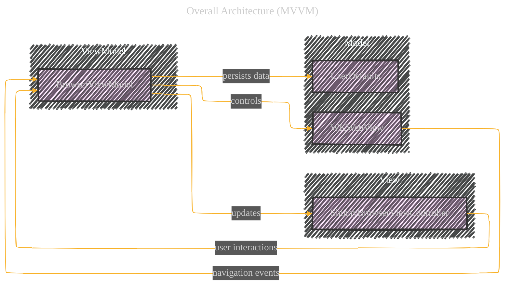
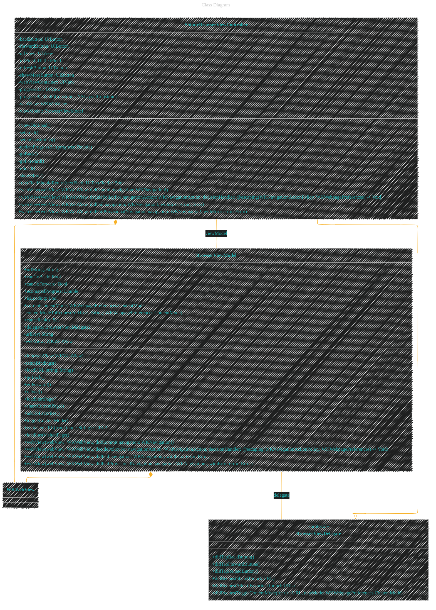
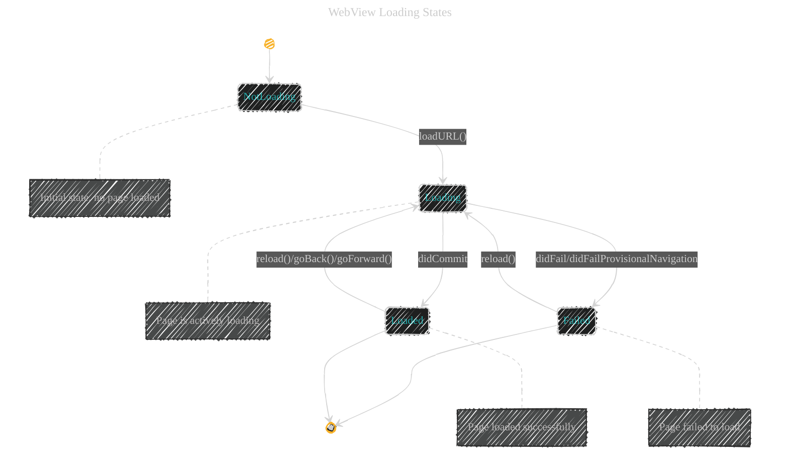
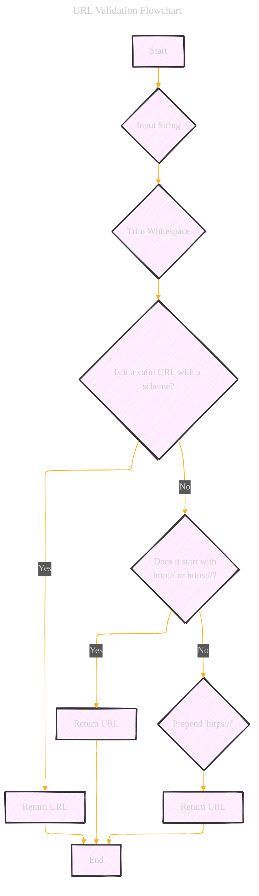
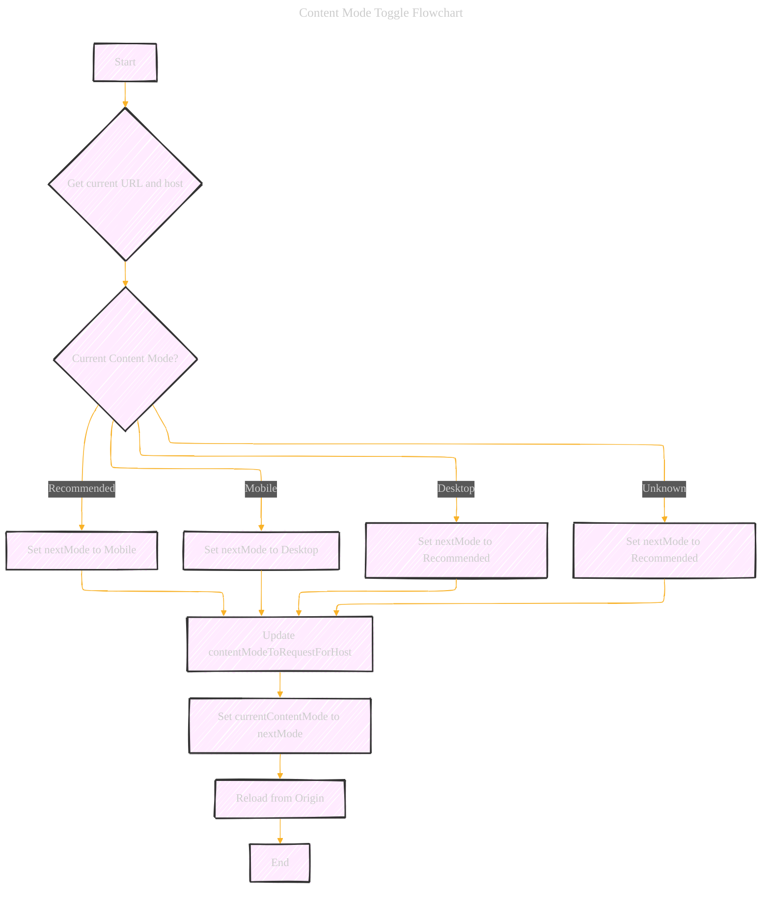
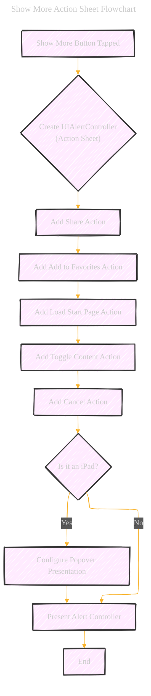

# Shinny Browser App
> **Disclaimer:**
>
> This document contains my personal notes on the topic,
> compiled from publicly available documentation and various cited sources.
> The materials are intended for educational purposes, personal study, and reference.
> The content is dual-licensed:
> 1. **MIT License:** Applies to all code implementations (Swift, Mermaid, and other programming languages).
> 2. **Creative Commons Attribution 4.0 International License (CC BY 4.0):** Applies to all non-code content, including text, explanations, diagrams, and illustrations.
---

## The Overview and Explanation for the Shinny Browser App
This [code implementation](https://github.com/CongLeSolutionX/MyApp/tree/WEB_TECH_ShinnyBrowserApp_V1) details "ShinnyBrowser," a `WKWebView`-based web browser in Swift, building upon the foundational concepts presented in Apple's sample code ([link](https://developer.apple.com/documentation/webkit/viewing-desktop-or-mobile-web-content-using-a-web-view)).  This project leverages the Model-View-ViewModel (MVVM) pattern to decouple the View (UI), ViewModel (business logic), and Model (data persistence and web content, handled by `WKWebView` and `UserDefaults`). This decoupling promotes a more modular, testable, and maintainable codebase.  A comprehensive explanation of the Swift implementation, including Mermaid diagrams and supporting illustrations, is provided below.

### Key Components

1.  **`ShinnyBrowserViewController` (View):**
    *   This is the main UIViewController that manages the user interface.
    *   It contains UI elements like the back/forward buttons, URL field, refresh button, a "more" options button, a progress bar, and the `WKWebView` itself.
    *   It sets up the UI, handles user interactions (button taps, text input), and updates the UI based on the state of the `ViewModel`.
    *   It uses Auto Layout (constraints) to define the layout of the UI elements.
    *   It implements the `UITextFieldDelegate` to handle text input in the URL field.
    *   It implements the `WKNavigationDelegate` to receive callbacks from the `WKWebView` about navigation events (page load started, finished, failed, etc.).
    *   It implements the `BrowserViewDelegate` protocol to handle actions requested by the ViewModel.

2.  **`BrowserViewModel` (ViewModel):**
    *   This class encapsulates the logic for interacting with the `WKWebView` and managing the browser's state.
    *   It exposes `@Published` properties that the `View` observes using Combine. These properties represent the current state of the browser (URL, loading status, can go back/forward, etc.).
    *   It handles user actions forwarded from the `View` (e.g., go back, go forward, reload, load URL).
    *   It validates URLs entered by the user.
    *   It manages the `WKWebView`'s configuration, including setting the user agent, allowing inline media playback, and configuring content preferences.
    *   It saves and loads the last visited URL using `UserDefaults`.
    *   It implements part of the `WKNavigationDelegate` protocol methods to handle navigation events and update its internal state.
    *    It uses a dictionary `contentModeToRequestForHost` to track the user's preferred content mode (desktop, mobile, recommended) on a per-host basis.
    *   It has a `delegate` (of type `BrowserViewDelegate`) to communicate back to the view for actions that require UI presentation (like showing a share sheet).

3.  **`BrowserViewDelegate` (Protocol):**
    *   This protocol defines a set of methods that the `ViewModel` uses to communicate with the `View`.
    *   This decoupling allows for easier testing of the `ViewModel` in isolation.
    *   The `ViewController` conforms to this protocol to handle these events.

4. **`UserAgent.html`**
    *  It serves as a simple start page for the browser, demonstrating how to load local HTML content.
    *   It displays the browser's user agent string, which is useful for debugging and website compatibility testing.
    *    Uses basic HTML, CSS and Javascript for a simple webpage.

### Strengths of the Code

*   **MVVM Architecture:** The clear separation of concerns makes the code more organized, testable, and maintainable.
*   **Combine Framework:** Using Combine for observing changes in the `ViewModel` and updating the UI is a modern and efficient approach.
*   **`WKWebView`:** Using `WKWebView` provides a modern, performant, and secure web browsing experience.
*   **URL Validation:** The `validatedURL` function attempts to handle various user inputs and create valid URLs, improving the user experience.
*   **User Agent Customization:** Setting a custom user agent string can be useful for website compatibility.
*   **Content Mode Toggling:**  The ability to switch between desktop, mobile, and recommended content modes is a nice feature.
*   **Progress Bar:** The progress bar provides visual feedback to the user during page loading.
*   **Last Visited Page:**  Saving and loading the last visited page is a good usability feature.
*   **Error Handling**: The `didFail` and `didFailProvisionalNavigation` methods provide a basic level of error handling, though it could be improved (more on that below).
*   **iPad Support:** The code includes specific handling for iPad presentation (using popovers for action sheets and the share sheet).
*    **Delegate Pattern**: Using a delegate (`BrowserViewDelegate`) improves the separation of concerns and testability.

### Potential Improvements and Considerations (Possibly implemented in the next version of the app)

1.  **Error Handling:** The current error handling is minimal. The `ViewModel` should expose an `@Published` property for errors, and the `ViewController` should display user-friendly error messages (e.g., using `UIAlertController`).  The error handling should differentiate between network errors, invalid URLs, and other potential issues.

2.  **URL Field Binding:** The two-way binding between `urlField.text` and `viewModel.urlString` could be improved. The current implementation does not always reflect the actual URL of the web view (especially during redirects, or if the user manually interacts with the web page's address bar).  Consider *only* updating the `urlField` when the `webView` successfully commits a navigation. The `textFieldDidEndEditing` should only trigger a *new* load if the URL is different than `webView.url`.

3.  **Content Mode Persistence:** The `contentModeToRequestForHost` dictionary is stored in memory.  It would be better to persist this data (using `UserDefaults`, Core Data, or another persistent storage mechanism) so that the user's preferred content mode is remembered across app launches.

4.  **Favorites Implementation:** The "Add to Favorites" functionality is currently just a placeholder. This should be implemented using a persistent storage mechanism (like Core Data, Realm, or even a simple file).  A separate UI (perhaps a table view) would be needed to manage the list of favorites.

5. **Loading the local HTML File**: The code loads the local `UserAgent.html` file, which is a good approach for a default start page. It correctly uses `loadFileURL`, and importantly, it sets `allowingReadAccessTo` to the directory containing the file. This is *crucial* for security; without it, the web view wouldn't be allowed to access any related resources (like CSS or JavaScript files) in the same directory.

6.  **Combine Cancellables:** The `cancellables` set is used correctly to manage Combine subscriptions, preventing memory leaks.

7.  **`@available` Checks:** The code uses `@available` checks for iOS 14.0 APIs, which is good practice for supporting older iOS versions. However, consider setting a minimum deployment target that's reasonably modern to reduce the need for these checks.

8. **`@unknown default`:** The `switch` statement in `toggleContentMode` correctly handles the `@unknown default` case, which is important for forward compatibility with future `WKWebpagePreferences.ContentMode` values.

9.  **Missing Features:** A real browser would have many more features, such as:
    *   History management (beyond just back/forward).
    *   Tabbed browsing.
    *   Bookmarks/Favorites (as mentioned above).
    *   Search integration (using a search engine).
    *   Download management.
    *   Privacy features (e.g., private browsing mode, content blocking).
    *   Settings (e.g., changing the default search engine, clearing browsing data).
    *   Handling of different URL schemes (e.g., `mailto:`, `tel:`, custom schemes).

10. **Code Comments:** The code includes helpful comments, but they could be expanded in some areas to explain the *why* behind certain decisions.

11. **Testing:** The MVVM structure makes the code *more* testable, but there are no unit tests provided.  Unit tests should be written for the `BrowserViewModel` to verify its logic (URL validation, state updates, etc.). UI tests could also be added to test the interactions between the `View` and `ViewModel`.

12. **Code Style:** The code generally follows good Swift style conventions, but there are a few minor inconsistencies (e.g., spacing around operators). A consistent code style (enforced with a linter like SwiftLint) is beneficial for readability.

13. **UI/UX:**  The UI is functional but basic.  Consider these improvements:
    *   The progress bar could be integrated more smoothly into the URL bar.
    *   The "More" button could use a more descriptive icon (e.g., a gear icon for settings).
    *   A loading indicator (e.g., an activity indicator) could be shown *within* the web view while the page is loading.
    *   The URL field could show a "stop loading" button (an "X") while the page is loading, and a "refresh" button when the page is loaded.

14. **Asynchronous Operations:** The code uses Combine, which is good for handling asynchronous operations. However, consider using the newer `async/await` syntax for asynchronous tasks, as it can often lead to more readable code.

---

## Mermaid Diagrams

Here's a collection of Mermaid diagrams to visualize different aspects of the code:

### 1. Overall Architecture (MVVM)

*   **Explanation:** This diagram shows the high-level MVVM architecture. The `View` (ViewController) interacts with the `ViewModel`, which in turn controls the `WKWebView` (part of the Model) and uses `UserDefaults` for persistence.  The arrows indicate the flow of data and control.

---

### 2. Class Diagram

*   **Explanation:** This class diagram shows the properties and methods of the `ShinnyBrowserViewController`, `BrowserViewModel`, and `BrowserViewDelegate` protocol.  It also indicates relationships (composition, inheritance, and delegation).

----

### 3. Sequence Diagram: Loading a URL

*   **Explanation:** This sequence diagram illustrates the flow of events when the user enters a URL and the page loads (or fails to load).  It shows the interactions between the `ViewController`, `ViewModel`, `WKWebView`, and `UserDefaults`.  It also highlights how the progress bar and back/forward buttons are updated.

---

### 4. State Diagram: WebView Loading States

*   **Explanation:** This state diagram represents the different loading states of the `WKWebView`.  It shows how the state transitions based on events like `loadURL`, `didCommit`, `didFail`, etc.

---

### 5. URL Validation Flowchart

*   **Explanation:** This flowchart illustrates the logic of the `validatedURL(from:)` function in the `BrowserViewModel`. It shows the steps taken to ensure that the input string is a valid URL, including trimming whitespace, checking for an existing scheme, and prepending "https://" if necessary.

---

### 6. Content Mode Toggle Flowchart

*   **Explanation:** This flowchart shows the logic of the `toggleContentMode()` function. It demonstrates how the content mode cycles through the available options (Recommended, Mobile, Desktop) and how the `contentModeToRequestForHost` dictionary is updated.

---

### 7. Show More Action Sheet Flowchart

Explanation: This flowchart represents the sequence of actions and decisions involved when the user taps the "Show More" button. It covers the creation of the action sheet, adding the various actions, configuring the presentation for iPad, and finally, presenting the alert controller.

---
**Licenses:**

- **MIT License:**   - Full text in [LICENSE](LICENSE) file.
- **Creative Commons Attribution 4.0 International:**  - Legal details in [LICENSE-CC-BY](LICENSE-CC-BY) and at [Creative Commons official site](http://creativecommons.org/licenses/by/4.0/).

---