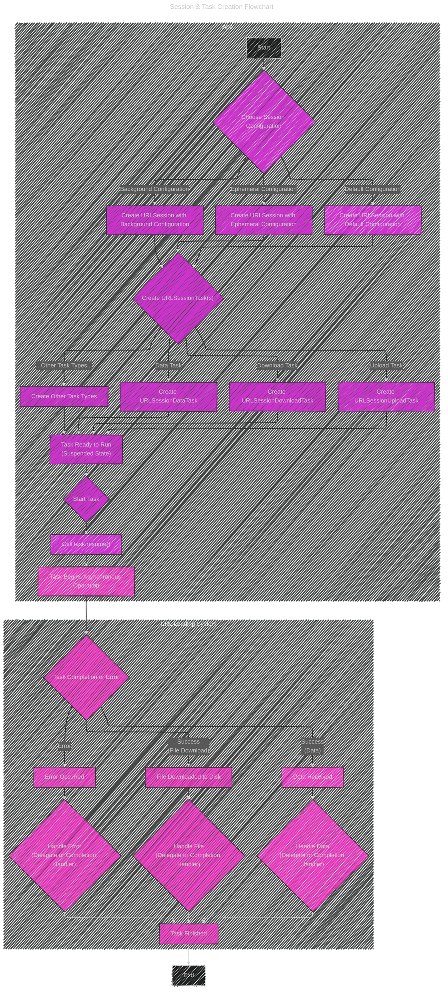

# URL Loading System
> This content is dual-licensed under your choice of the following licenses:
> 1.  **MIT License:** For the code implementations in Swift and Mermaid provided in this document.
> 2.  **Creative Commons Attribution 4.0 International License (CC BY 4.0):** For all other content, including the text, explanations, and the Mermaid diagrams and illustrations.

----

Below is a collection of diagrams and illustrations on explaining how the URL Loading System works accordingly to the original Apple documentation article at [here](https://developer.apple.com/documentation/foundation/url_loading_system).

## Diagram 1: Core Components Class Diagram

This diagram will illustrate the main classes and their relationships within the URL Loading System. It’s crucial to visualize how `URLSession`, `URLSessionConfiguration`, and `URLSessionTask` interact.

----

## Diagram 2:  Session & Task Creation Flowchart

This flowchart will depict the process of creating a `URLSession` and then generating different types of `URLSessionTask` instances from it, as highlighted in Figure 1 of the documentation.

---

## Diagram 3: Delegate vs. Completion Handler Sequence Diagram

This sequence diagram will illustrate the two ways to handle the result of a `URLSessionTask`: using a delegate or using a completion handler.

---

## Diagram 4: Background Session Mind Map

This mind map will focus specifically on background sessions, highlighting their purpose, configuration, and key considerations.

---
**Licenses:**

- **MIT License:**   - Full text in [LICENSE](LICENSE) file.
- **Creative Commons Attribution 4.0 International:**  - Legal details in [LICENSE-CC-BY](LICENSE-CC-BY) and at [Creative Commons official site](http://creativecommons.org/licenses/by/4.0/).

---