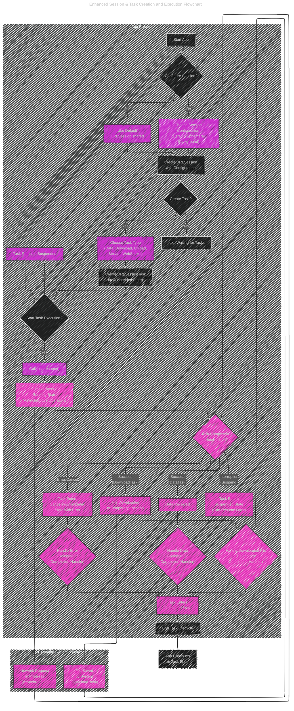

# URL Loading System
> This content is dual-licensed under your choice of the following licenses:
> 1.  **MIT License:** For the code implementations in Swift and Mermaid provided in this document.
> 2.  **Creative Commons Attribution 4.0 International License (CC BY 4.0):** For all other content, including the text, explanations, and the Mermaid diagrams and illustrations.

----

The diagrams and illustrations below are enhanced versions of those in the previous documentation: [this documentation](/WEB_TECH/URL_Loading_System/URL_Loading_System_V1.md).

---

## Diagram 1: Enhanced Core Components Class Diagram

This class diagram is enhanced to provide even more clarity on the attributes, methods, and relationships between the core classes of the URL Loading System.  We'll add detail to methods and clarify inheritance.

----

## Diagram 2: Enhanced Session & Task Creation and Execution Flowchart

This flowchart is made more detailed to incorporate the task states and the asynchronous nature more explicitly. It now better reflects the lifecycle of a `URLSessionTask`.

---

## Diagram 3: Refined Delegate vs. Completion Handler Sequence Diagram

This sequence diagram is refined to more clearly distinguish the flow and timing of delegate calls versus completion handler execution, enhancing clarity on asynchronous handling.

---

## Diagram 4: Expanded Background URLSession Mind Map

The mind map is expanded with more detail and reorganized for better logical flow, offering a deeper dive into background sessions.

---
**Licenses:**

- **MIT License:**   - Full text in [LICENSE](LICENSE) file.
- **Creative Commons Attribution 4.0 International:**  - Legal details in [LICENSE-CC-BY](LICENSE-CC-BY) and at [Creative Commons official site](http://creativecommons.org/licenses/by/4.0/).

---