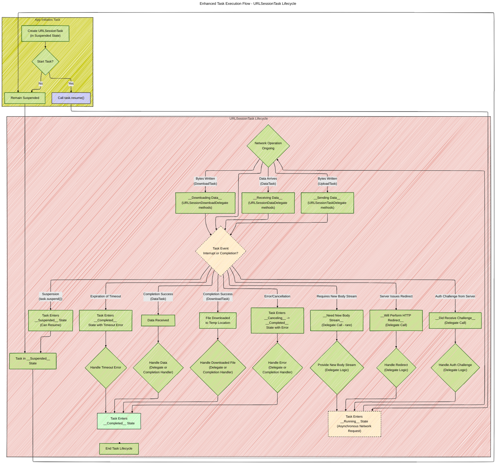

# A Diagrammatic Guide to URL Loading System and Data Fetching in iOS
> This content is dual-licensed under your choice of the following licenses:
> 1.  **MIT License:** For the code implementations in Swift and Mermaid provided in this document.
> 2.  **Creative Commons Attribution 4.0 International License (CC BY 4.0):** For all other content, including the text, explanations, and the Mermaid diagrams and illustrations.

----
## Note: These diagrams needed to be rendered on a macOS machine to properly reflect the color system and Mermaid syntax code as intended to convey.
----
This document provides a collection of diagrams and illustrations, created using Mermaid syntax, to comprehensively explain the technical concepts of Apple's URL Loading System and fetching website data into memory. It is based on the official Apple documentations provided and enhances the existing diagrams to offer a more detailed and integrated understanding.

You can check out the sub-version of this comprehensive diagrammatic guide at these documentation: 
- [Fetching Website data into memory](/WEB_TECH/Fetching_website_data_into_memory/Fetching_website_data_into_memory_V1.md)
- [URL Loading System](/WEB_TECH/URL_Loading_System/URL_Loading_System_V1.md)

---

## 1. Integrated Class Diagram: URL Loading System Core Components

This enhanced class diagram integrates and expands upon the previous diagrams to depict the core components of the URL Loading System, their attributes, methods, and relationships in greater detail.

---

## 2. Enhanced Task Execution Flow Diagram

This flowchart details the lifecycle of a `URLSessionTask` from creation to completion, emphasizing the asynchronous nature of network operations and the different task states.

---

---
**Licenses:**

- **MIT License:**   - Full text in [LICENSE](LICENSE) file.
- **Creative Commons Attribution 4.0 International:**  - Legal details in [LICENSE-CC-BY](LICENSE-CC-BY) and at [Creative Commons official site](http://creativecommons.org/licenses/by/4.0/).

---